# 30张大赦国际海报

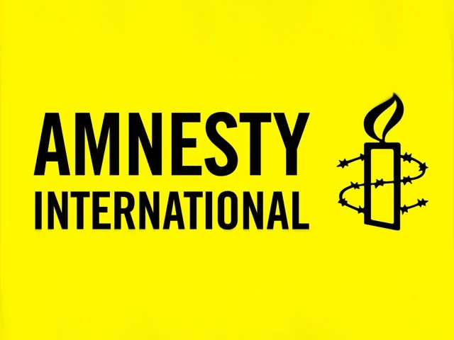  

​大赦国际（(Amnesty International 又称国际特赦组织)）是1961年在伦敦成立的世界性民间人权组织。其宗旨是动员公众舆论，促使国际机构保障人权宣言中提出的言论与宗教信仰自由；致力于为释放由于信仰而被监禁的人以及给他们的家庭发放救济等方面的工作；制止侵犯联合国宪章中所列举的世界公民的基本权利。目前该组织已在世界上55个国家和地区设立了分部或联络小组。该组织在纪念《世界人权宣言》30周年时获联合国人权奖，1977年获诺贝尔和平奖。

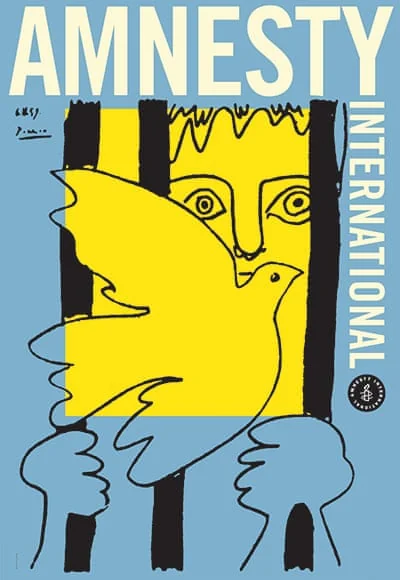  
毕加索为大赦国际设计

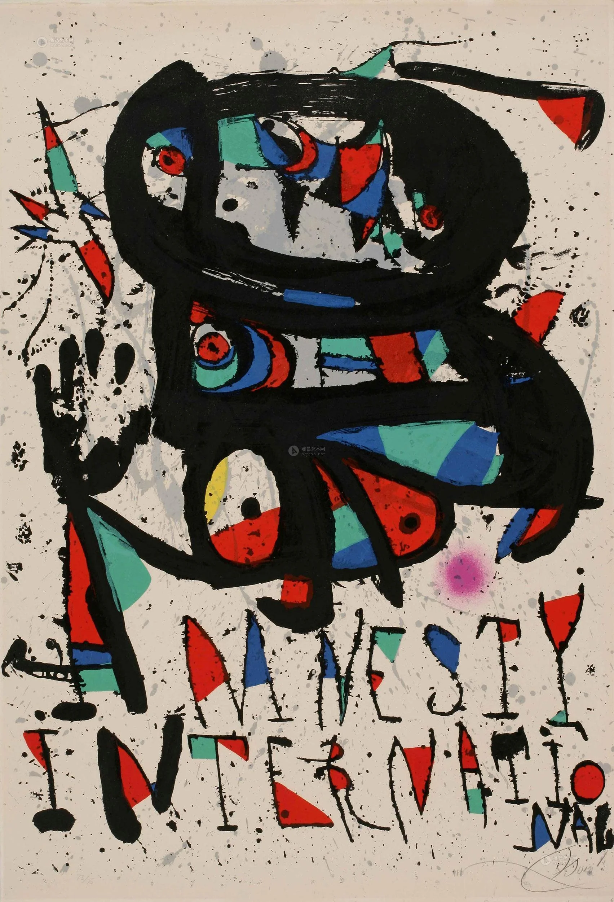  
"Prisoner of Conscience" 良心犯 by 米罗 1977年

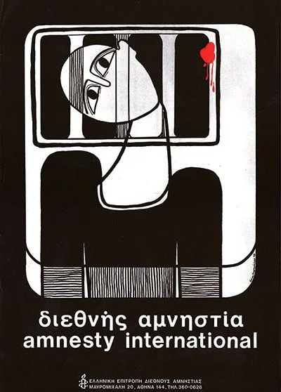  
Nriva Kapaxalov campaigning against political killings in Greece

  
良心犯, 1969 荷兰   Designed by Joop Lieverst

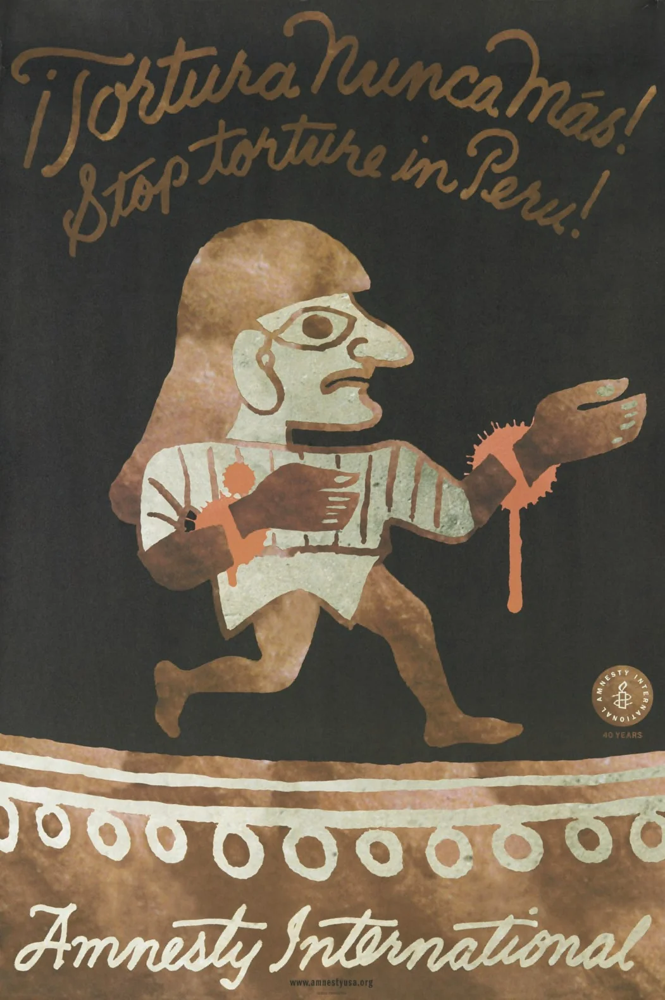  
停止虐待囚犯  秘鲁

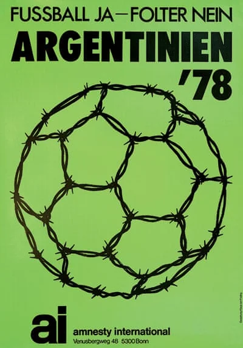  
Football Yes, Torture No（要踢球，不要虐待。）1978年 德国设计

  

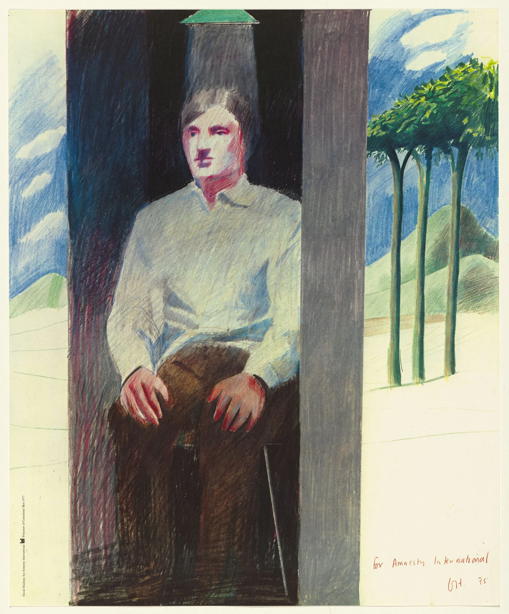  
大卫·霍克尼为大赦国际设计的海报

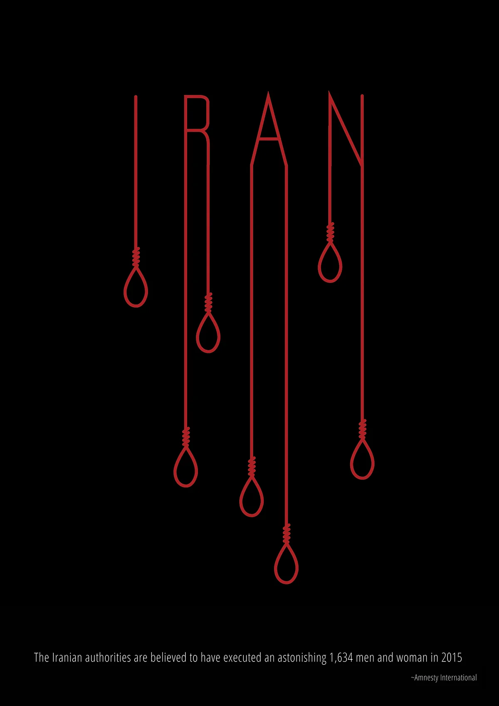  
伊朗 2015年

  
1998年大赦国际颁发给拳王阿里“终身成就奖”以感谢他在人权方面上做出卓越的贡献

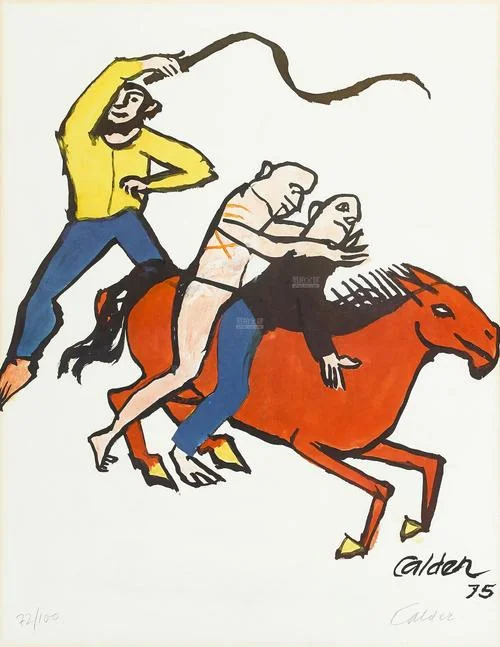  
Flight From Tyranny, 1975 (US) 亚历山大·考尔德（ALEXANDER CALDER）

  
为女权发声

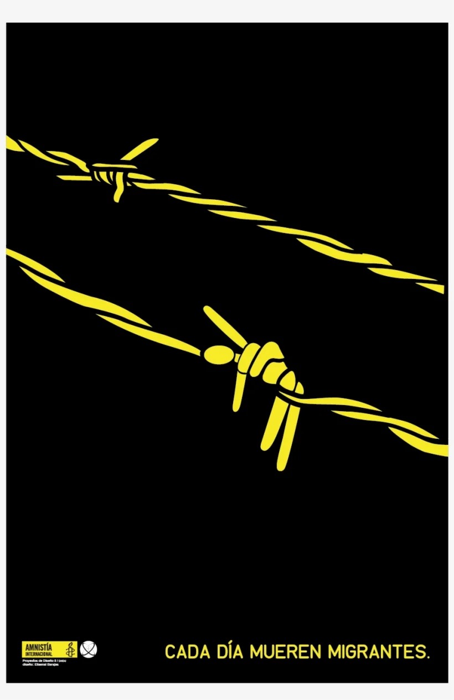

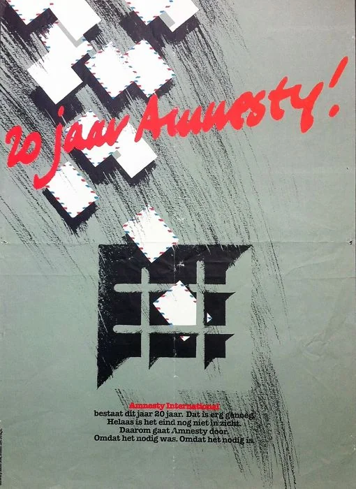

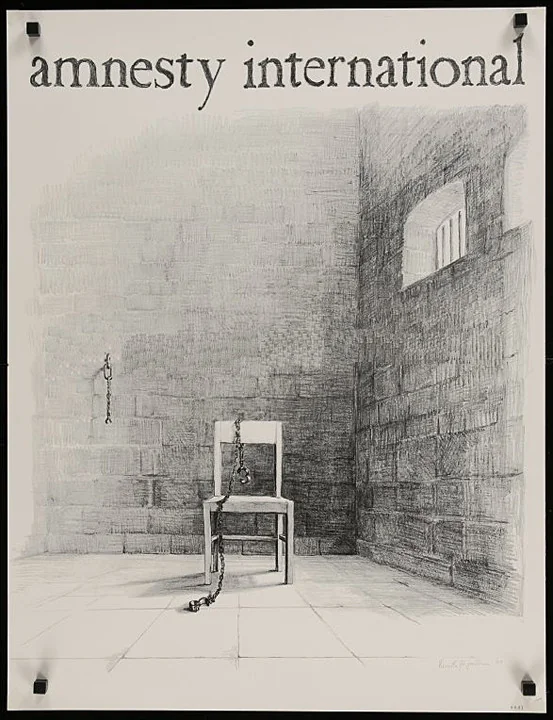

  
Freedom in the 80s, 1980 (Japan)  by Yosuke Kawamura

  
1995 (Israel )by Lemel Yossi

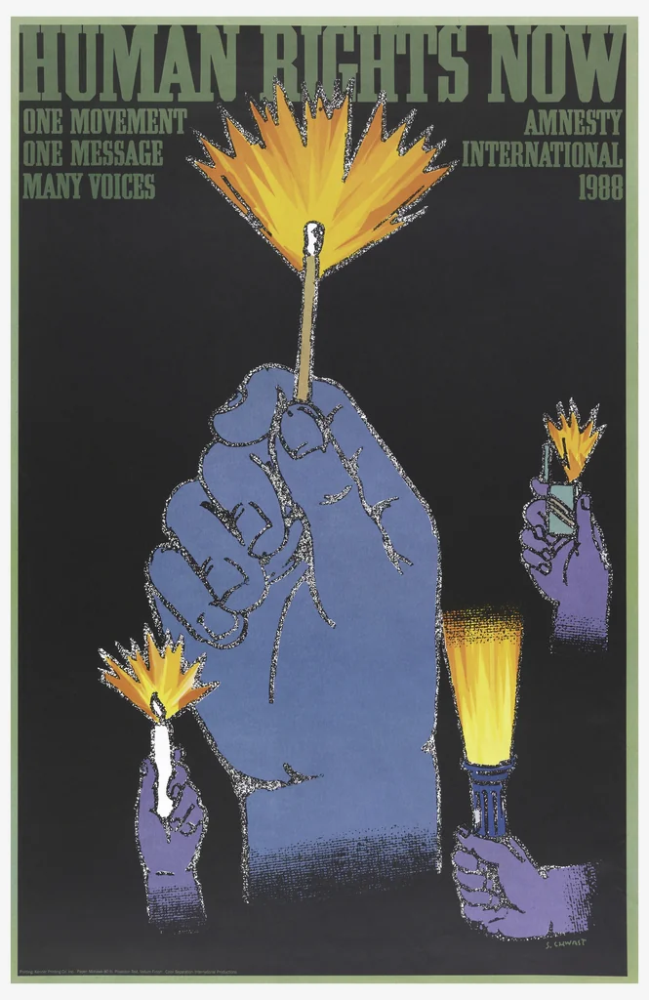

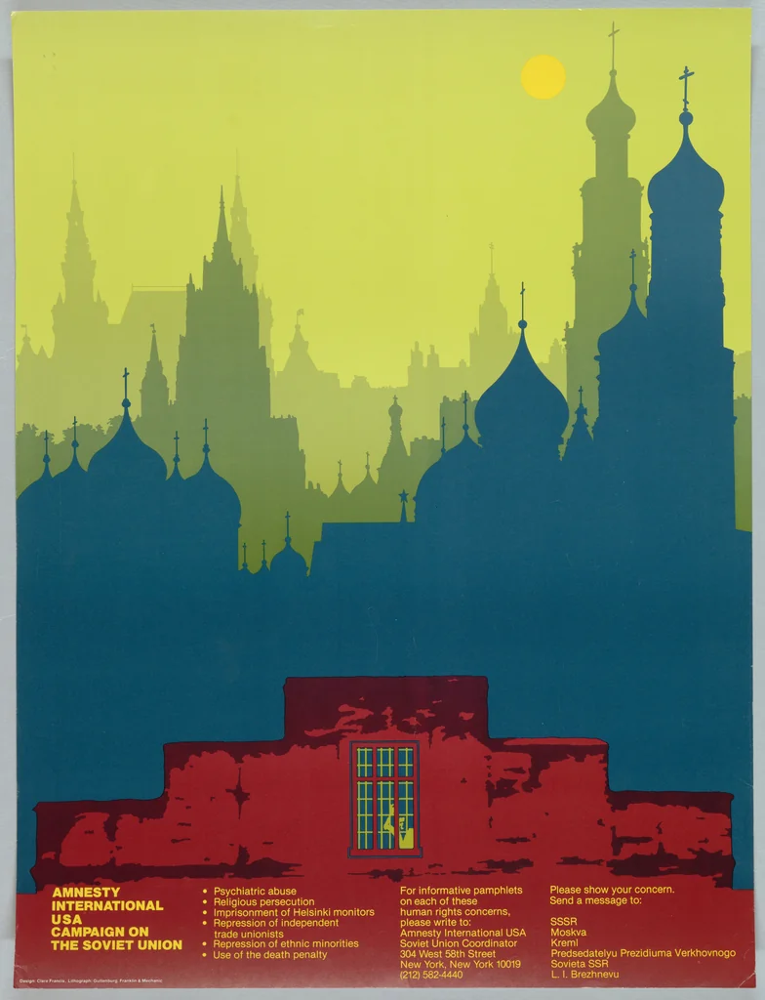

They Cannot Muzzle the Light, 1980 (法国) by Alain Carrier

  
Human Rights are Women's Rights, 1994 (埃及)

  
Political prisoners, the world over, 1981 (德国)

  
Rope Man By Bill Guhl and Beat Knoblauch  瑞士 1972年

  

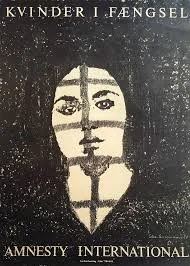  
阿富汗难民 2010年 Photographed by Steve McCurry in Pakistan

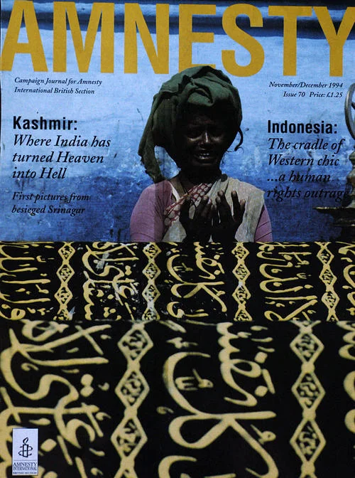  

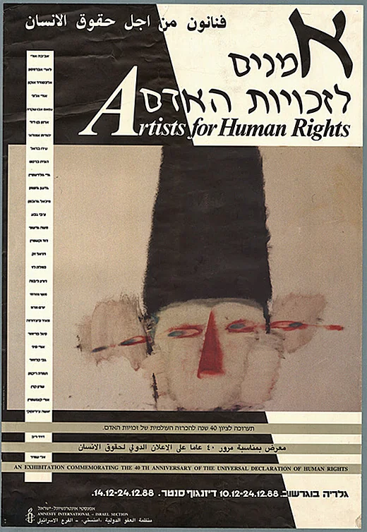  
