# 中国监狱纹身

说起监狱纹身，小编有个发小也在监狱里镀了一把：背部两只猛虎。监狱禁止纹身，一般犯人不会趟这种事，也没这份儿。据他说纹身用的染料是兑水研磨的煤炭汁，工具是普通的缝纫针，针的尾部绑细线，留出不到半公分的针头，细线浸炭汁沿针头进皮肤。他这个纹身三天扎完的，每个部位扎了三遍。本来设计稿中还有树和石，因陋就简成了下图这样（右上方的太阳是出狱后在理发
店补的）。

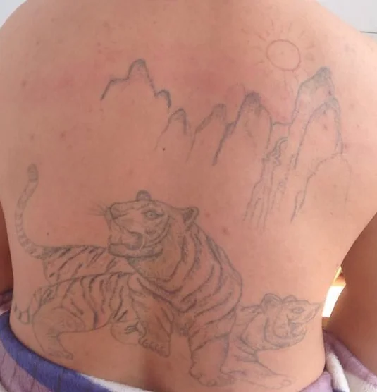

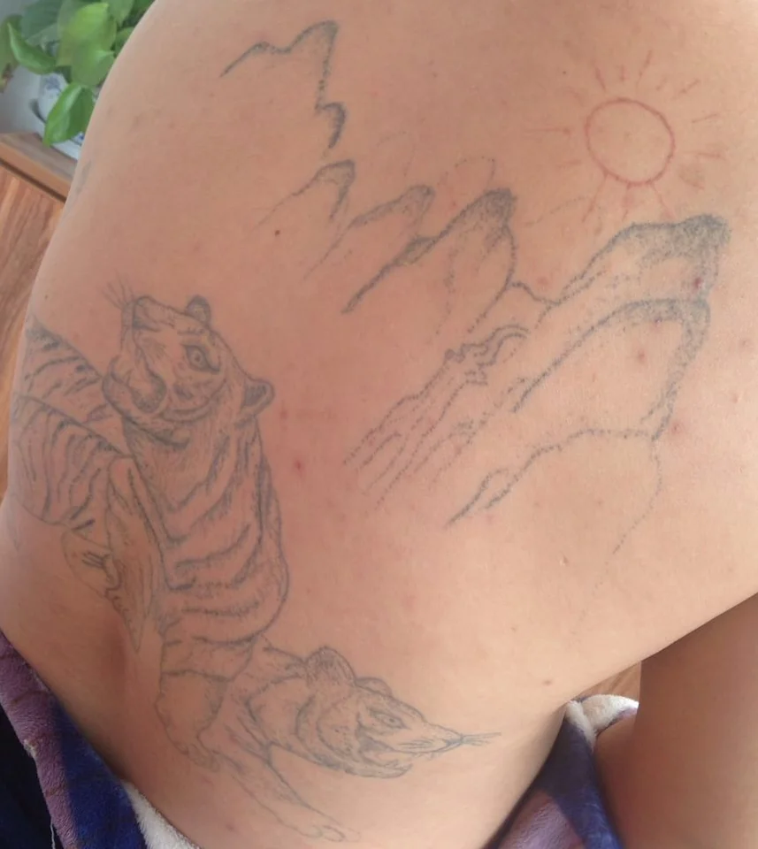

中山大学孙平先生的博士论文《监狱亚文化》中有关于纹身的篇章。该论文是孙博士2005-2007年在珠江三角洲两个监狱做调查的成果，虽然论述陈腐可笑，有些素材也不妨一看。

水城监狱犯人3700多名，520人有纹身，占犯人总数14%，山城监狱占16%。其中中虎、狼、龙、鹰、蛇等动物占大多数。还有花、女人、文字等。

以下是论文中呈现的纹身照片截图：

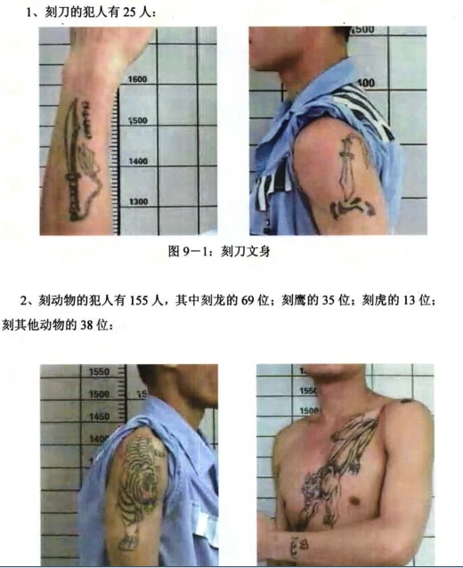

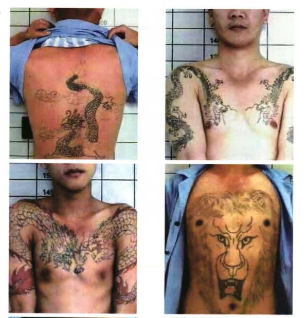

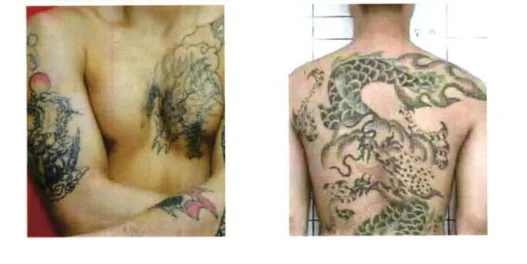

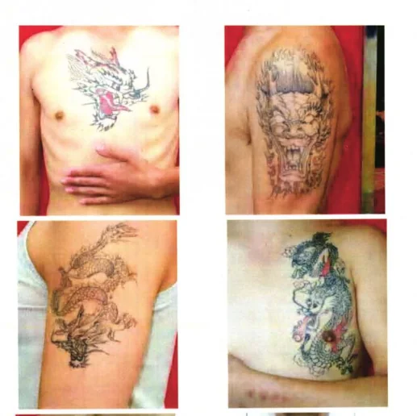

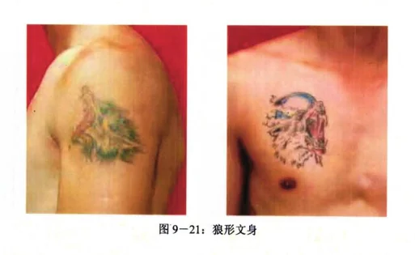

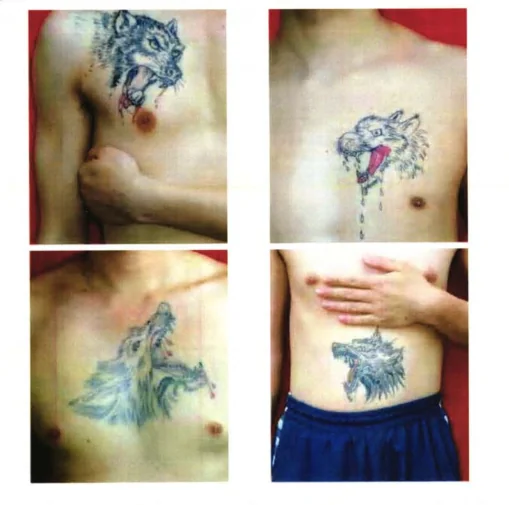

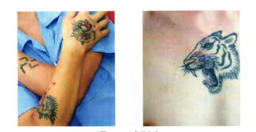

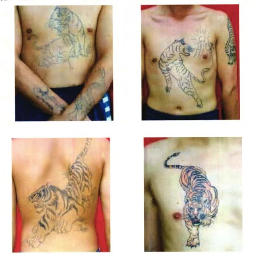

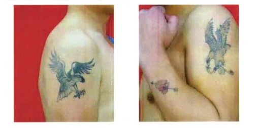

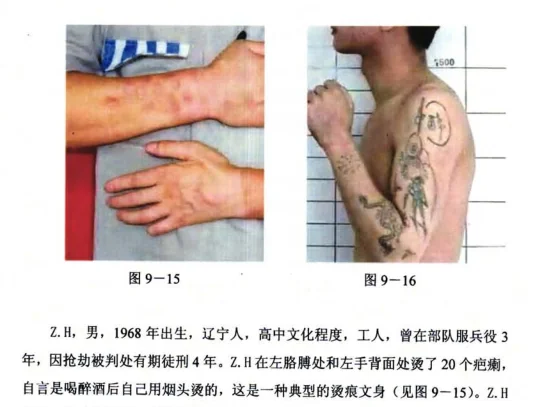

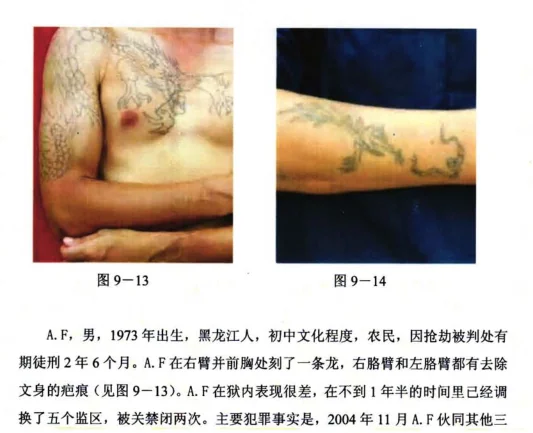

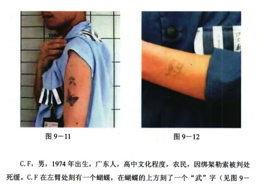

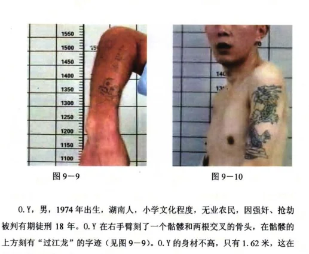

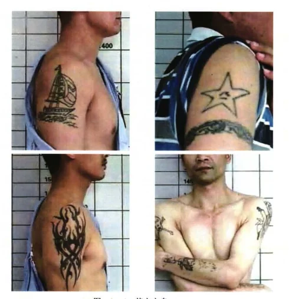

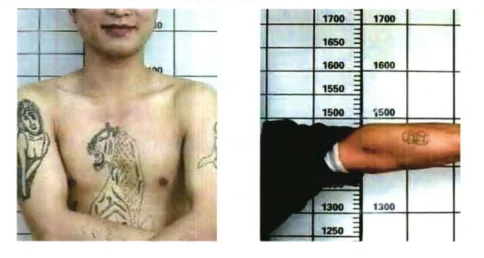

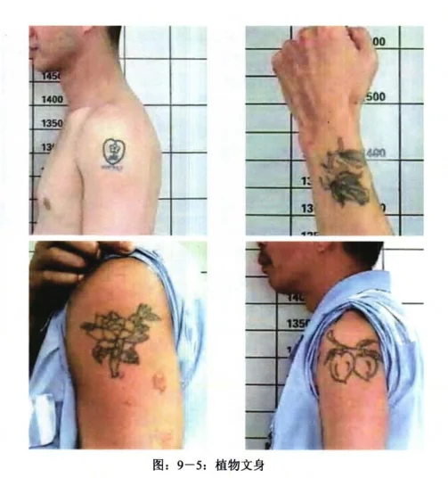

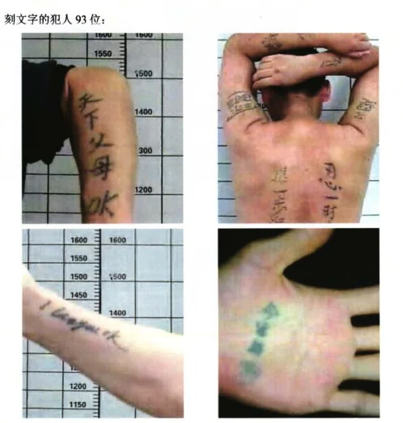

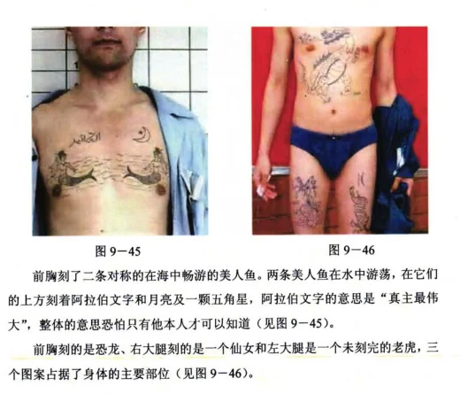

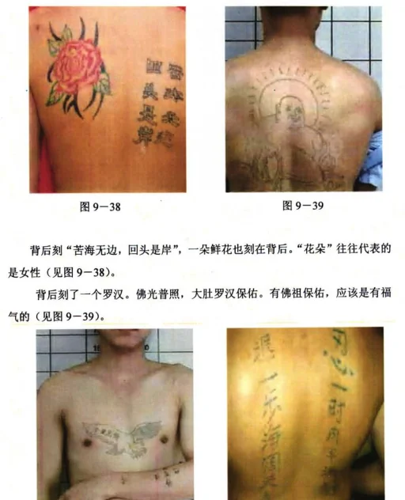

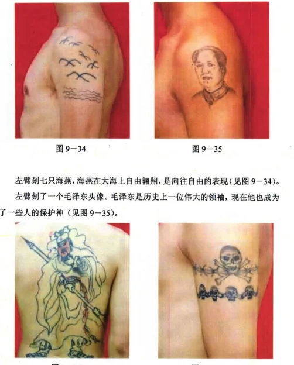

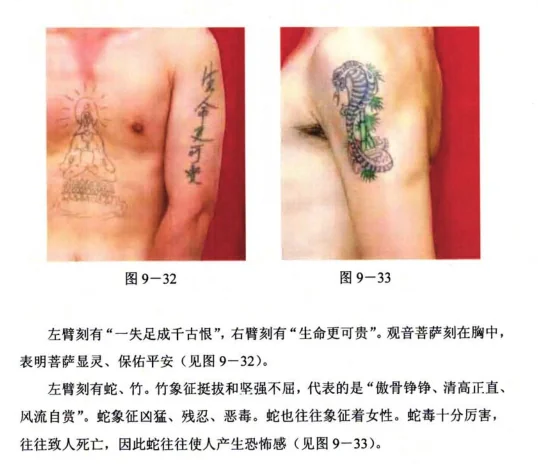

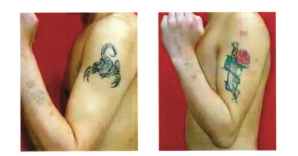

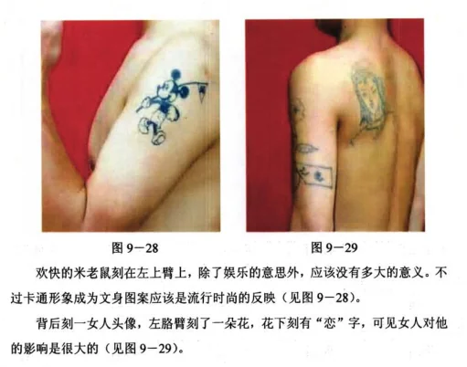

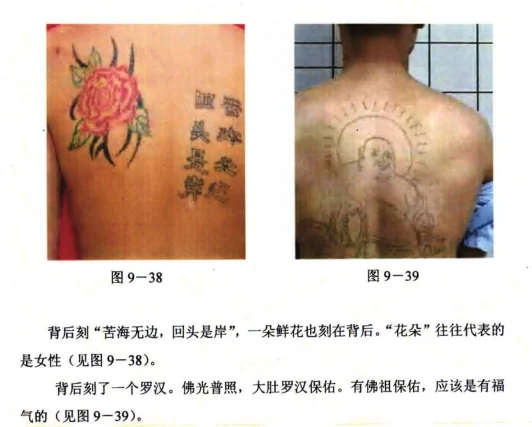

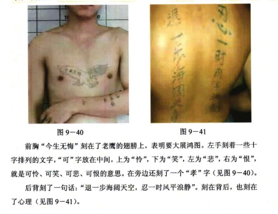

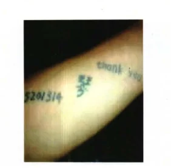

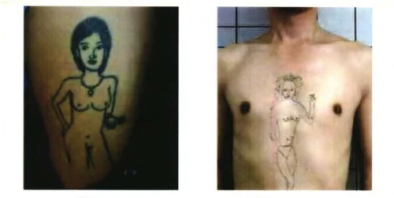

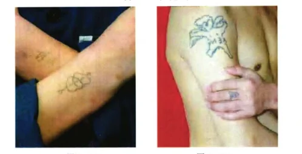

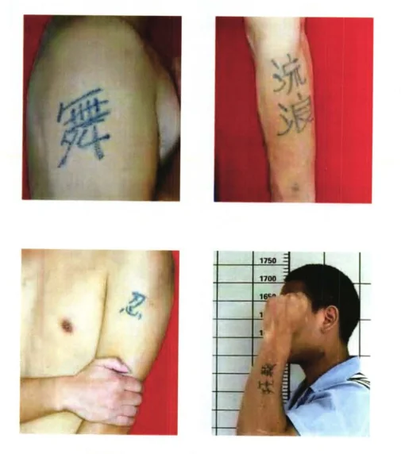

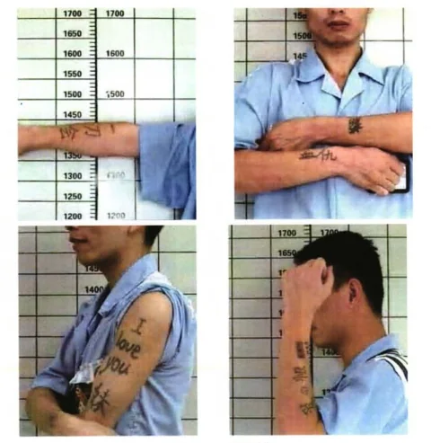

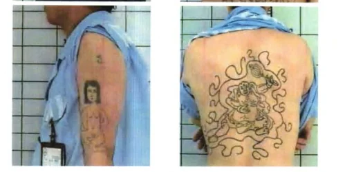

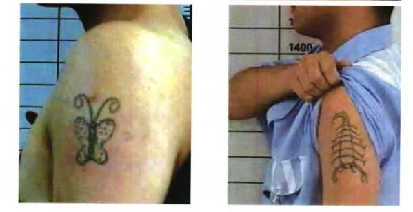
