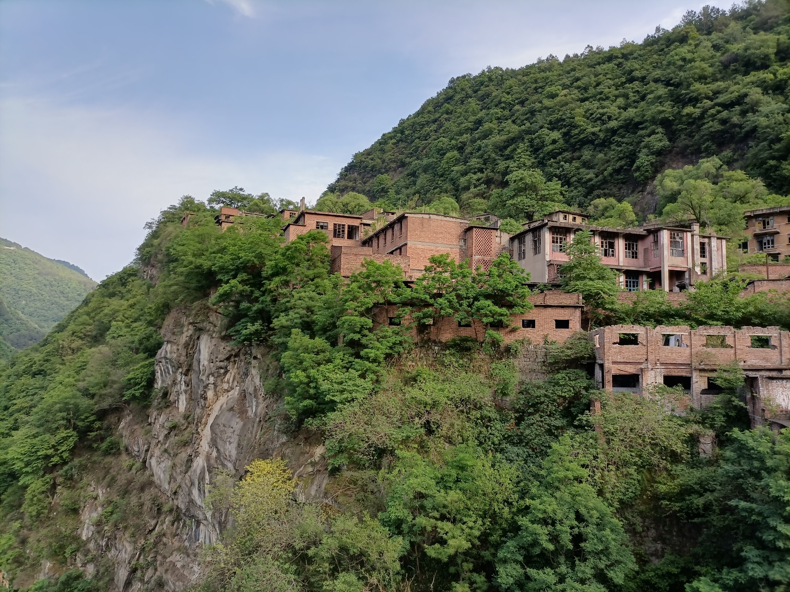
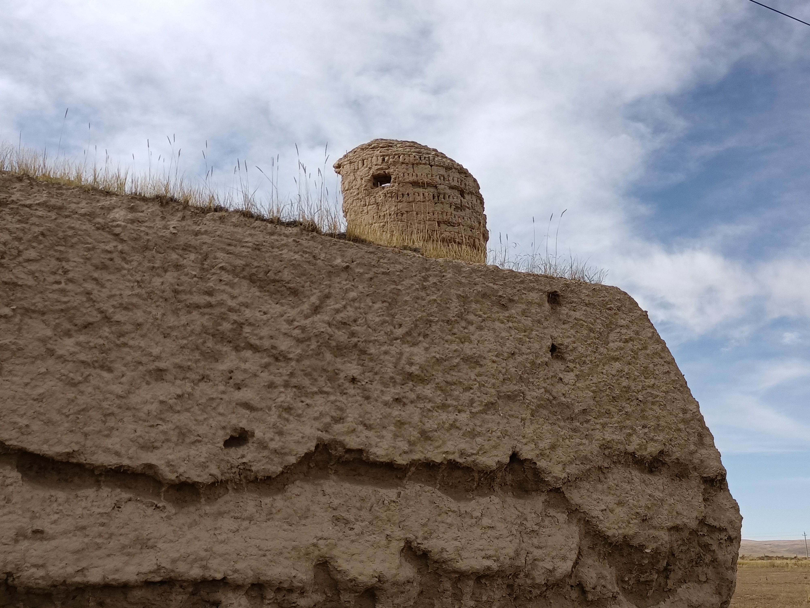
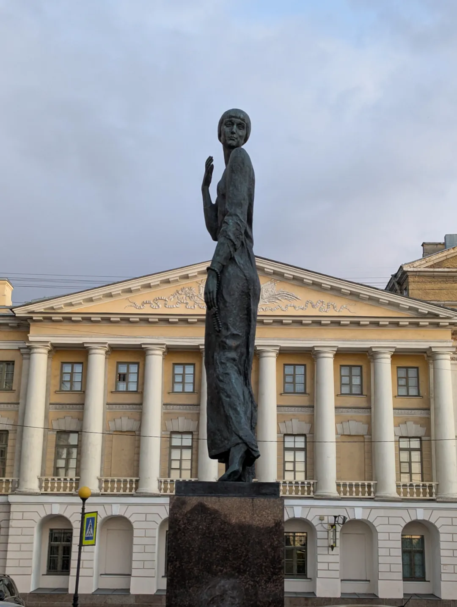
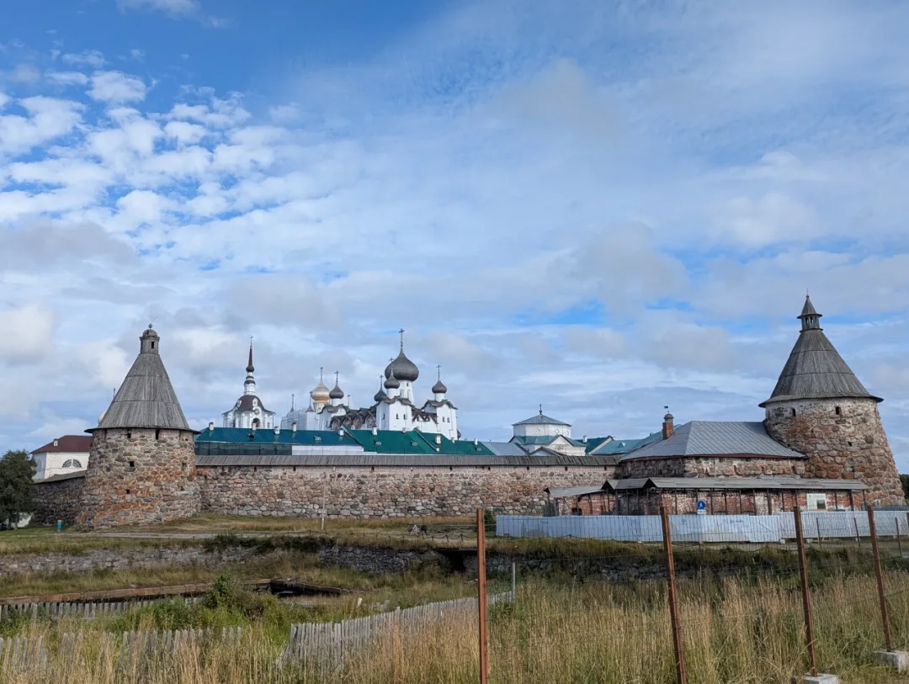
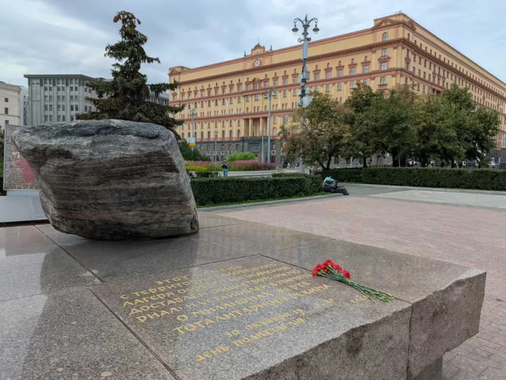
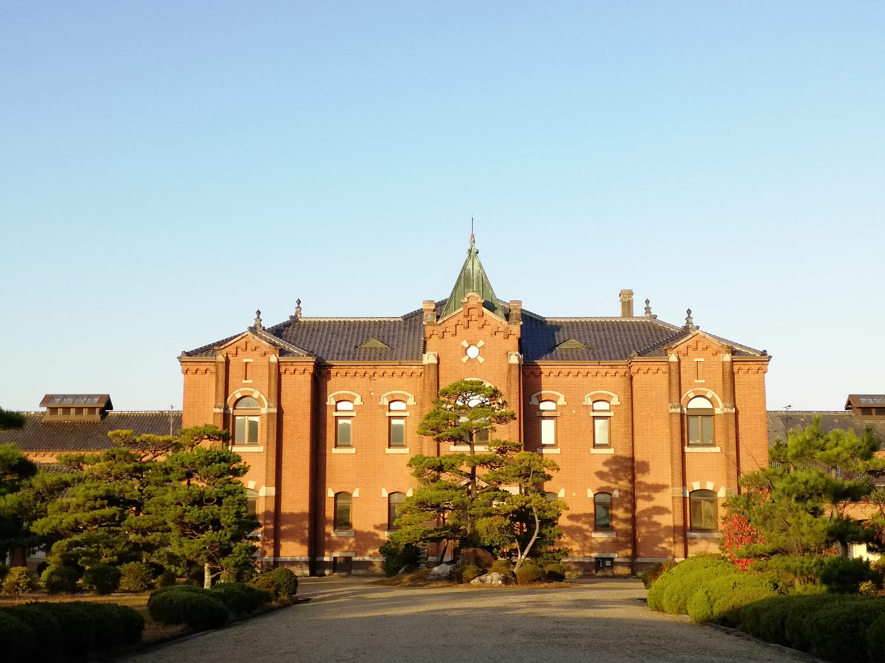
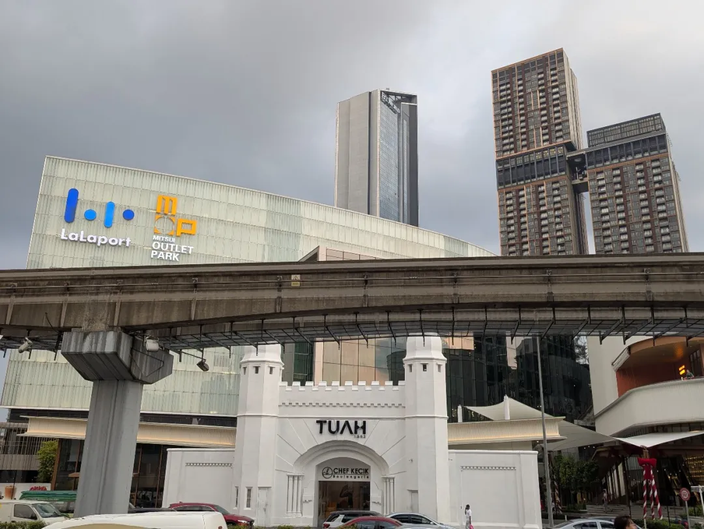
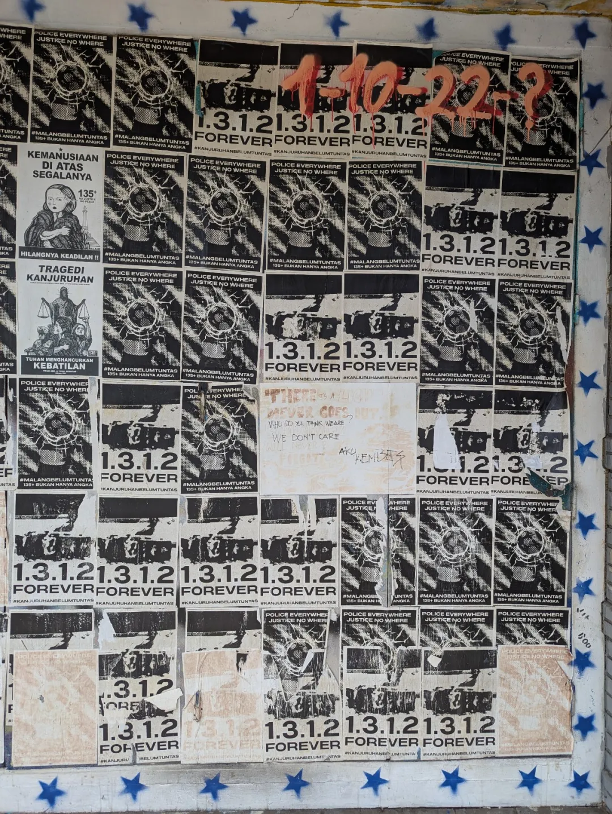
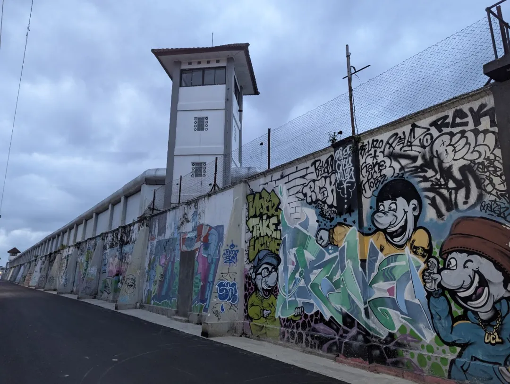

# 作为旅游主题的监狱

监狱作为旅游主题

这个题目看起来有点反差，大家常说“说走就走的旅游”，显然旅游代表着自由，但把监狱这个严格限制自由且常常让人不适的点作为自由（旅行）的主题，多少有点拧。

世界上当然有不少知名监狱景点，有些甚至是当地地标，比如美国的恶魔岛、东州监狱，南非的罗本岛、澳洲的墨尔本监狱等等。不过我所说的不仅仅是一个点，而是主题旅游，成线路的玩法。

狱望马上十年了，十年来爬梳各种监狱文章，自然有不少涉及到监狱旅游。我自己也常常出行，免不了关注目的地是不是有监狱博物馆、废弃监狱等等。如果有，我就显得格外有精气神。数年来，踏访了不少相关的点。包括监狱博物馆，比如旅顺日俄监狱、青岛的德式监狱；监狱改建的艺术区，如大馆、合柴1972；再是废弃监狱，这些年我和朋友们踏访了青海的劳改农场（《狱望》第7期）、四川雷马屏的劳改农场（《狱望》第7期）、湖北的沙洋监狱群（《狱望》第4期）、广元的俞家碥监狱（《狱望》第3期）等等，比如2023年和几位朋友进行的为期八天的青海劳改农场之旅，高原的壮阔山水、幽微的历史，废弃农场的视觉感等，给我们的感觉都非常饱满。而且后劲十足，当时的队友之后又数度回到青海（25年11月前我也去进行了第二次的寻访，25年12月他们又去），每次都能找到新的农场。

我想说的是，一定有很多人不满足于打卡常规景点，不满足于好山好水好吃好喝。这方面小红书有非常完备和详细的攻略，详细到告诉你拍照的时间和角度。但，除此以外，也还有各种不同的玩法。那么，监狱是不是也可以提供一种玩法？以监狱为主线，能带给我们一种什么样的旅行体验？是不是也可以看见有趣的东西？能不能帮助我们了解这个目的地甚至更大的什么？

我来举几个例子：

今年8月，我去了一趟俄罗斯，圣彼得堡的涅瓦河南岸有一座很美的阿赫玛托娃的铜像。如果不关注监狱，我大概率不会去看这座雕像（它不在旅游区）。即使看到了，我可能也不知道为什么这个位置有一座她的雕像，答案在对岸（涅瓦河北岸）的十字监狱。阿赫玛托娃在长诗《安魂曲》中做了交代，她的儿子列夫·古米廖夫被关在十字监狱，阿赫玛托娃一次次的在十字监狱门口排队，等候探望落难的儿子。

以及因为这个题材，我去了接近北极圈的索诺维茨基群岛（古拉格群岛的母体），如果不关注监狱，我不会去这个遥远孤寒的地方（受俄罗斯文化浸润的人可能会去），那真是舟车劳顿，但即使仅作为一般的旅游目的地，它也值得。

而莫斯科和圣彼得堡都有标志性的索诺维茨基石，取名政治压迫受难者纪念碑。如果不关注监狱，我可能不知道这两座城市的广场上摆放的两块看似普通的石头有什么寓意，它和背后的大楼又有什么关系。

比如9月份我专门去日本爱知县的明治村博物馆，这个村子迁建收集了五六十座明治时代的建筑，其中有两座是监狱建筑（金泽监狱和前桥监狱）。如果不关注监狱，我可能不知道明治村，也不会看到其他的那些明治时代建筑。

大家都知道1945年美国在长崎投下原子弹，但你知道离长崎原爆中心最近的是什么建筑吗？是长崎监狱浦上分监，离原爆中心100米。爆炸时，建筑直接核平，只剩一根烟囱。134个人死亡，其中，13名职工，35名家属，81名服刑人员。服刑人员中，有32人是中国人。您去长崎的和平公园，能看到放射形地基和“浦上刑务支所中国人原爆牺牲者追悼碑”。

以及我还在日本看了售卖服刑人员劳动成果的商店（CAPIC）、吉田松阴被处死的监狱（传马町牢屋）遗址、广岛拘置役外墙上200多米的壁画、无印良品准备改成酒店的奈良少年刑务所等等。

比如11月在吉隆坡商场 LaLaPort 寻找半山芭监狱大门的经历，我觉得也很好玩，那么多人穿过曾经让人胆寒的监狱大门去享用心仪的美食。

比如虽然我付出了一天的等待，最后没能进到玛琅的监狱里参观它的博物馆。但等待的时候，我看到了街上的涂鸦，看到了玛琅人的不屈服。以及虽然没能买到去巴厘岛的汽车票不得不转去计划外的泗水，但在泗水老城也看到了一座殖民时代的废弃监狱。我把这当成一个好玩的游戏。

比如在日惹，去探访现役监狱，却意外看到画满狱墙的涂鸦。

23年，我跟朋友去智利小城瓦尔帕莱索，无意中逛到瓦尔帕莱索文化公园，然后我看到岗楼，再看说明牌，该公园曾经是皮诺切特关押政治犯的监狱，后来改造为文化活动场所，有剧场、有画廊、还有不少舞蹈和音乐排练房。而过了好几天我才意识到，狱望刊载过的一篇文章里讲到过这个监狱的改建（第六期《监狱建筑改造大挑战》），这也是很有意思的相遇。
