# 美国监狱建筑初探

文/吴家东、朱文一

监狱建筑的发展与特定的刑罚制度和社会环境分不开。美国监狱建筑建立在西方监狱建筑变革创新的基础之上，在其特定的历史条件、司法制度、社会现实和罪犯改造理念之下，形成了自身的特点。

发展历程

据《监狱学》一书记载，早在奴隶社会时代，古希腊和古罗马就已经出现了早期的监禁建筑。在进入资本主义社会之后，近代监狱建筑开始出现。法国哲学家福柯在《规训与惩罚》一书中认为，正是由于资本主义生产关系的发展和人权意识的建立，才使得欧洲的行刑逐渐由身体刑逐渐转变为自由刑；因为只有当生产力发展到资本主义时代时，囚犯的自由才有了意义——剥夺他们的自由可以剥夺其劳动价值并为统治阶级所用。而据《外国建筑史》一书的介绍，1595年荷兰阿姆斯特丹矫正院（Rasphuis）的建立，是西方近代自由刑和监狱的开端。

阿姆斯特丹矫正院

在建国之前，美国的监狱建筑直接借鉴于欧洲，这些监狱大多采用欧洲中世纪城堡的建筑形式，以形成一种坚固的、牢不可破的心理暗示，如东州教养所（Eastern_State Penitentiary）、西维吉尼亚监狱（West Virginia State Penitentiary ）等。这种城堡式监狱大多采用大型的集体牢房，囚犯居住环境较为恶劣。在18世纪中后期，欧洲掀起了一场监狱改良运动，提倡教育矫正罪犯的自由刑观念。这场西方近代监狱的改良运动影响到美国，促使了现代监狱的诞生。

东州教养所

西维吉尼亚监狱

## 1. 大屋监狱时期

美国建国直至19世纪中期，监狱建筑的主要形制特点为一个大型屋宇容纳监狱的所有功能，所有囚犯监房位于同一个监区。大屋监狱的形式包括宾州制监狱、奥本制监狱及圆形监狱。

根据《监狱学》一书记载，1790年，宾夕法尼亚州的胡桃街监狱（Walnut_Street Prison）投入使用，标志着世界上第一所现代监狱的诞生。胡桃街监狱在原有老监所的北边加建了一个折线形建筑，构成一个完整的围合建筑体。胡桃街监狱的特点是采用了中间走廊、两侧细胞式监房的结构。这种监房布置形制在问世后很长一段时间被欧美各国借鉴和吸收，被称为“宾州制”监狱。

胡桃街监狱平面图

1817年，纽约州奥本监狱（Auburn Prison）建成使用，其监房布置方式是中间两排背靠背的这些监房一共有5层高，细胞式监房、外面两侧是走廊。而2层以上的走廊部分挑出在一个共享的上下通高的大空间里。由于监房互相隔开、背对并且与外界没有接触，这种监房布置方式是非常安全的，被称之为“奥本制”。

纽约奥本监狱

据《规训与惩罚》一书的描述，18世纪末英国功利主义哲学家杰瑞米·边沁提出了一种“圆形监狱”（Panopticon）的设计理念。这种监狱由一座中心岗楼和环形围绕岗楼的小监房构成，每个监房都有前后两个窗户。因为逆光效果，中央岗楼的监督人员可以清楚地看到监房中囚犯的行为，囚犯由于产生时刻被监视的心理而时刻迫使自己遵守纪律。这种设计理念在欧洲并没有得到推广，反而是在19世纪初被引入美国后，建设了一批以此为理念基础的监狱，如匹兹堡西部监狱（Western Penitentiary）、斯泰特维尔监狱（United States Penitentiary of Terre Haute）等。

圆形监狱剖面图

斯泰特维尔监狱内部

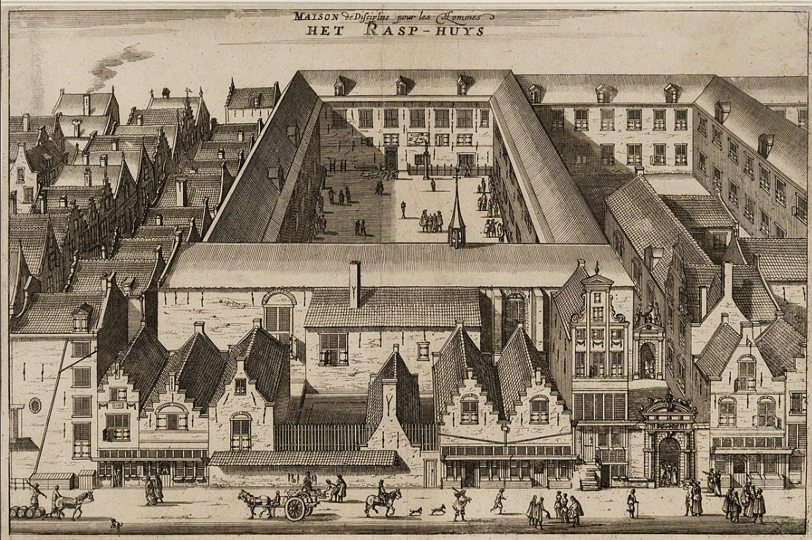

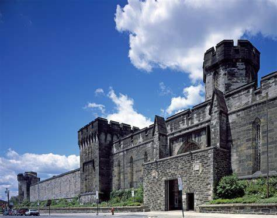

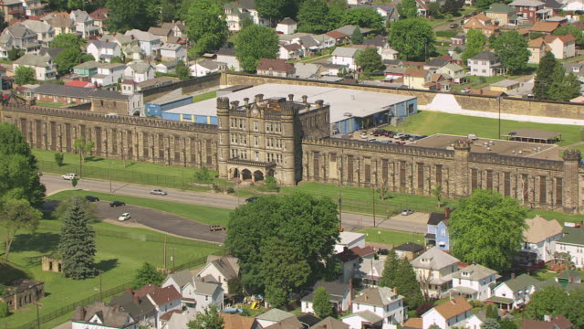

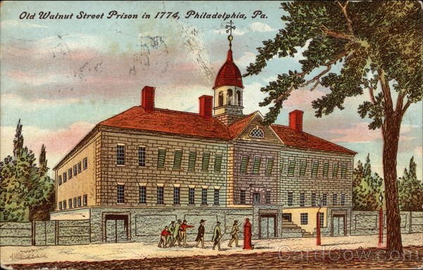

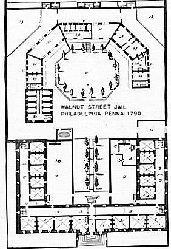

## 2. 翼状监狱时期

从19世纪中后期到20世纪中期，长达近一个世纪的时间里，“风车式”监狱和“电线杆”监狱这两种监狱建筑的布局形式占据了美国监狱建筑的主流。这两种监狱均采用囚犯监房分区的翼状布局，可将其合称为“翼状”监狱。

据《监狱建筑》一书记载，19世纪中期，“ 风车式（Radial Wings）”监狱开始在美国出现。这种监狱建筑由一座中心岗楼和放射状环绕在岗楼周围的若干监房单元组成。监房单元一般有3－4层高，两侧布置细胞式监房，中间为中庭和走廊；中央岗楼一般比较高，集合办公、监控及辅助功能，可以有效地监督囚犯的行为而又不至于对囚犯造成太重的心理负担。采用这种布局形式的监狱有新泽西州特顿州立监狱（Trenton_State Prison）、费城东州惩教所（Eastern State Correctional Facility）等。

费城东州惩教所

由《西方监狱建筑的空间特征及其演化》一文的研究可知，19世纪末，法国建筑师范西斯科·珀辛的“电线杆式（Telephone-Pole）”设计理念被引入美国。这种布局形式用通长的走廊将若干个平行布置的监房从中间串联起来，人员与物资的流动都通过中央走廊完成。“电线杆式”的监狱设计由于占地面积比以往的监狱小，管理效率高，因而随即在美国得到广泛使用，如阿肯色州的康明斯监狱（Cummins Prison）、德克萨斯州的伊斯特汉监狱（Eastham Unit）等。

康明斯监狱

伊斯特汉监狱

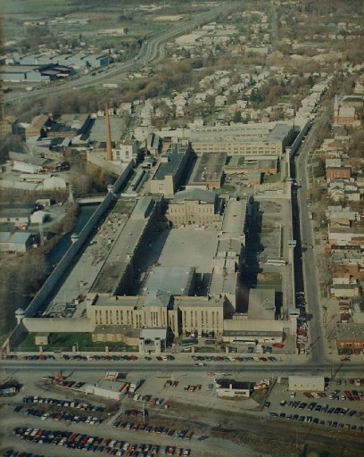

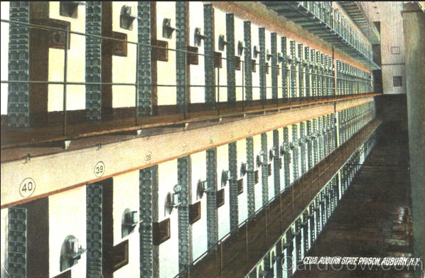

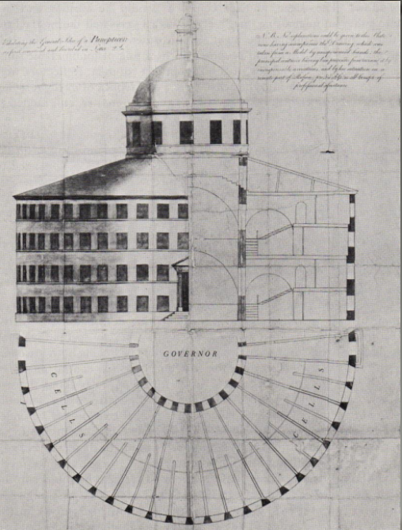

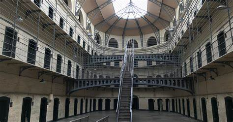

## 3. 多元化时期

1960年代，美国联邦及各地方政府相继推出各种有关囚犯权利的法律法规，而美国惩教协会也逐渐开始推广相关的监狱建筑建设标准。美国监狱建筑的形制开始变得更为多元，三角型、L型等新型监舍单元布置形式开始出现，内置监房式的布局方式被摒弃等。而1980年代之后，美国囚犯人口数量剧增，开始了新一轮监狱建筑的建设，这一时期的监狱建筑在兼顾科学的同时，也注重考虑监狱的经济性，位于城市或郊区的监狱日渐增多，各种新型的监狱不断涌现，如北支流监狱（North_Branch Correctional

Institution）、河边监狱（Riverside State Prison）、卡伦监狱（Curran Reception and Detention ）等。

北支流监狱

河边监狱

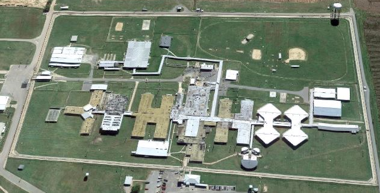

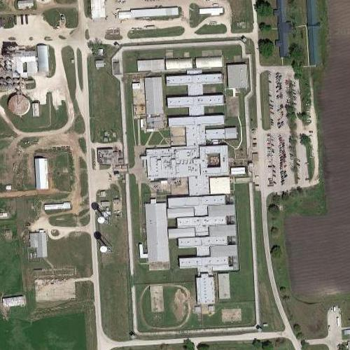

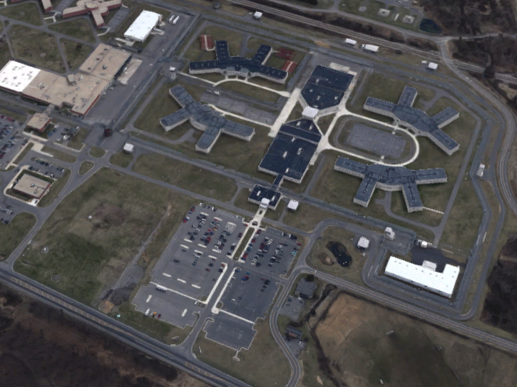

