# 百年前的美国监狱明信片

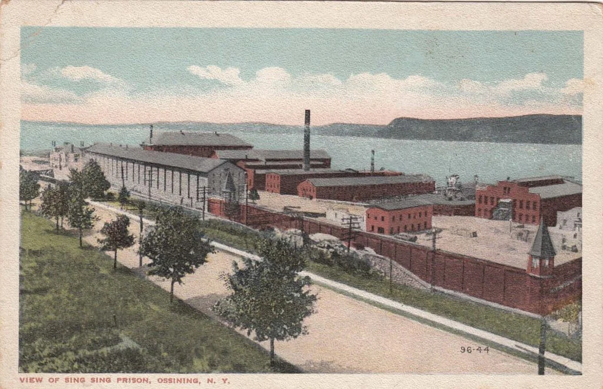

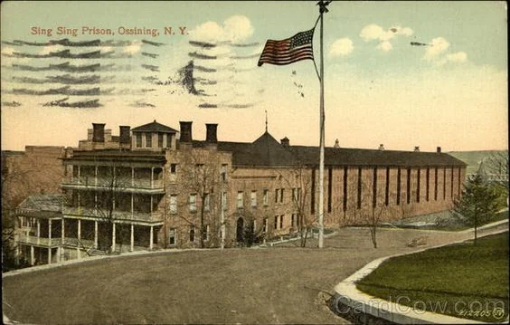

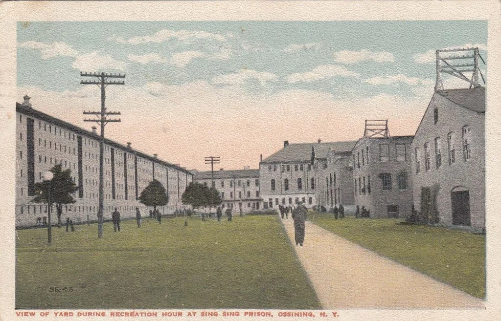

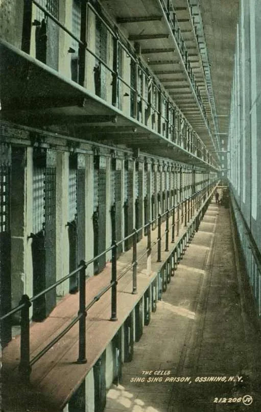

纽约州新新监狱（sing sing prison）

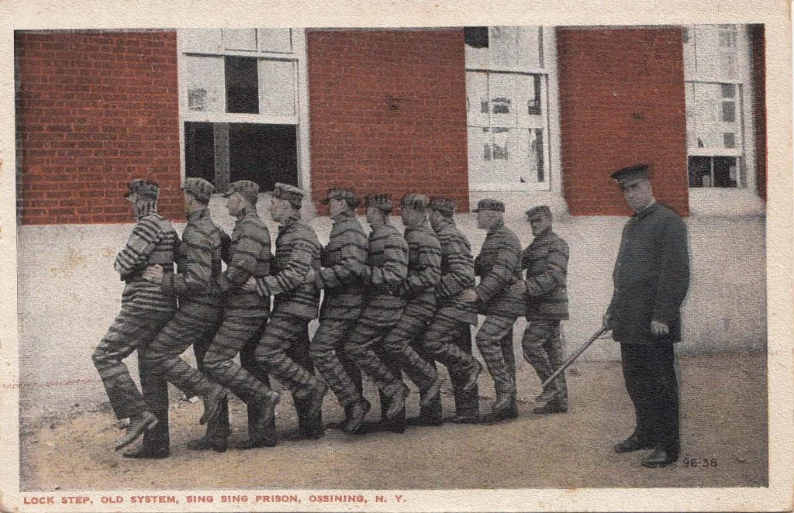

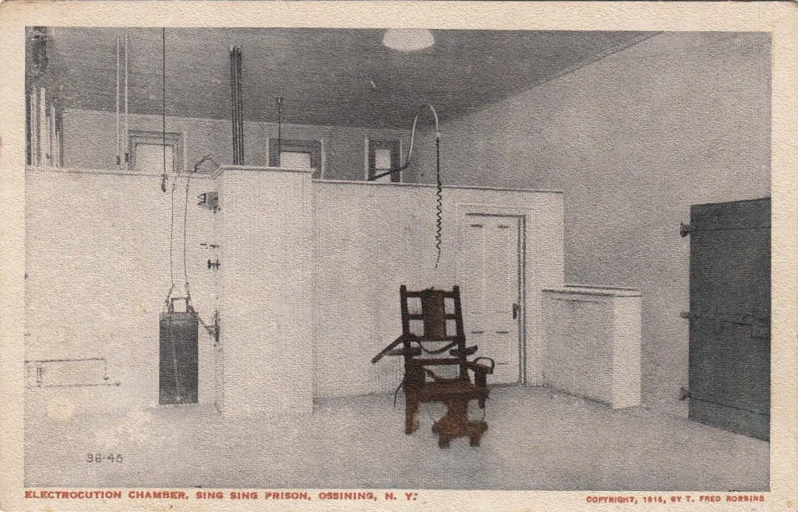

纽约州新新监狱

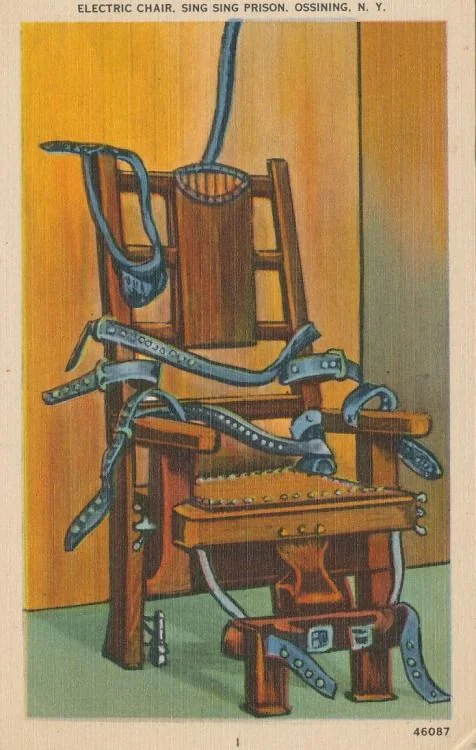

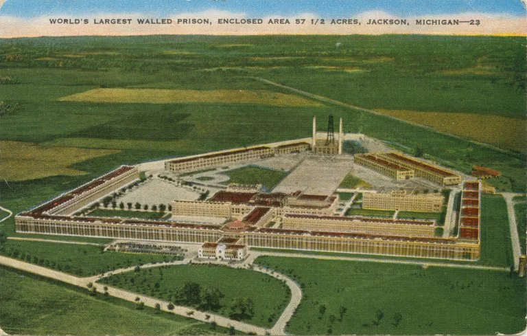

新新监狱

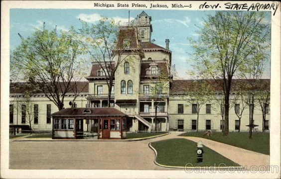

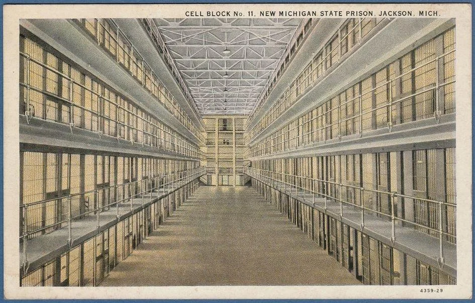

新新监狱监舍

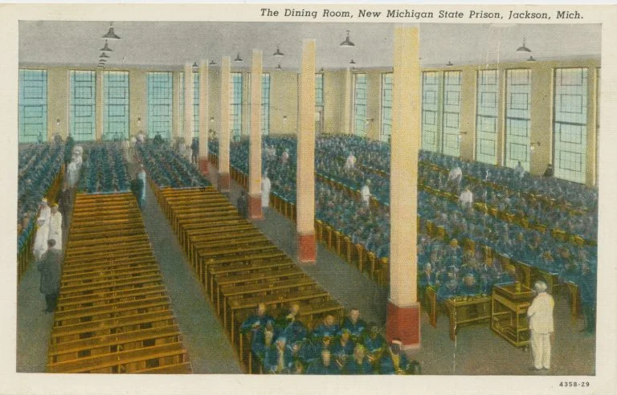

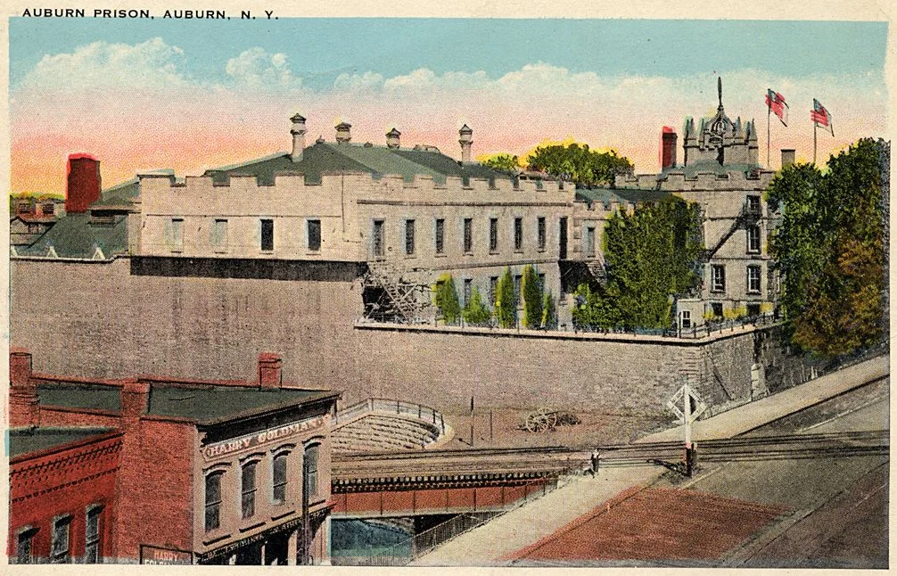

新新监狱

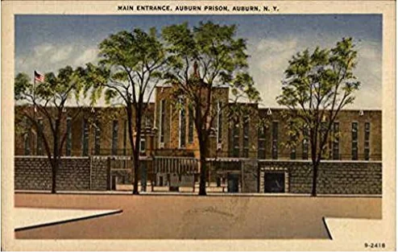

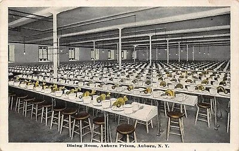

新新监狱的电椅

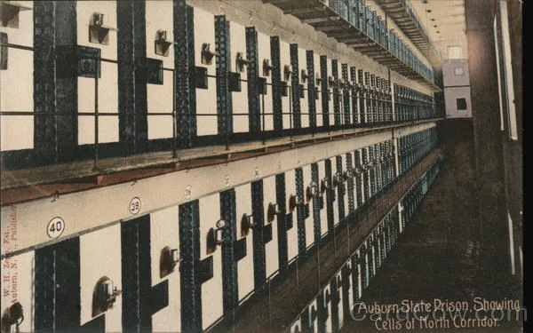

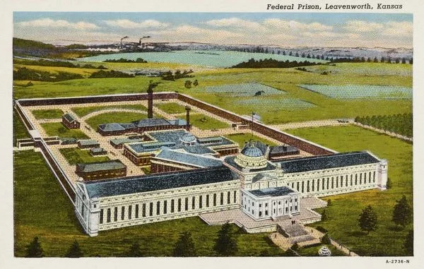

新新监狱的电椅

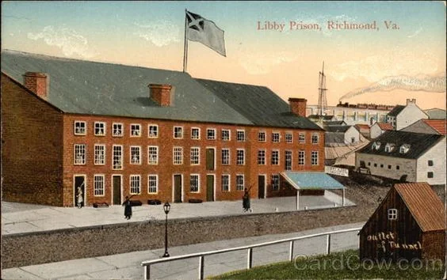

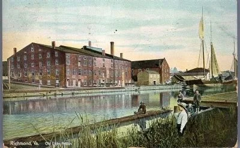

密歇根州杰克森监狱(Jackson Prison Michigan)

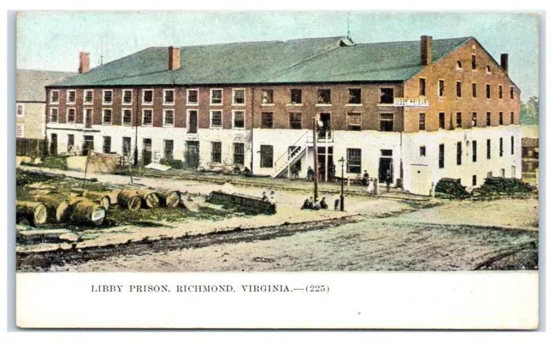

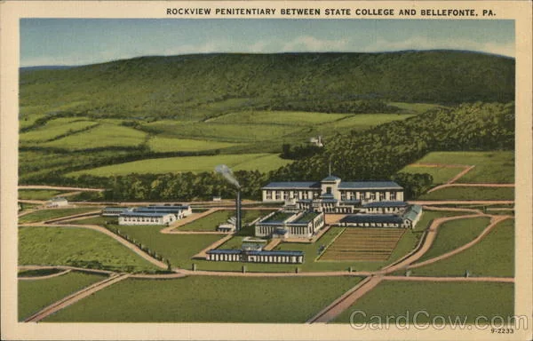

密歇根州杰克森监狱

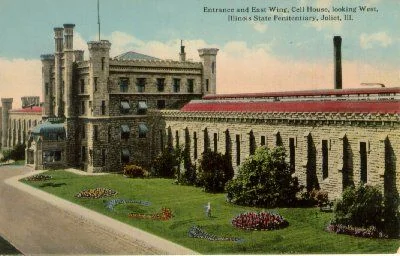

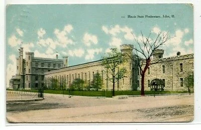

密歇根州杰克森监狱监舍

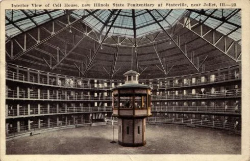

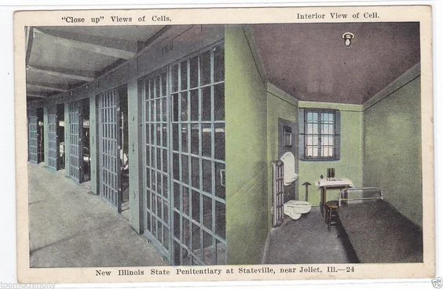

密歇根州杰克森监狱食堂

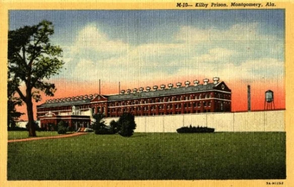

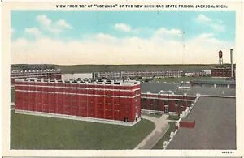

纽约州奥本监狱(Auburn Prison)

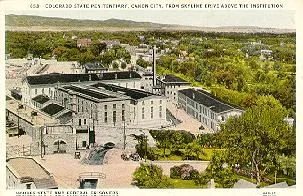

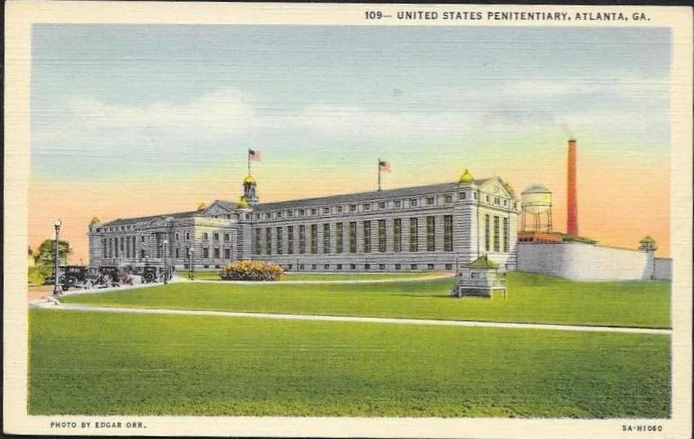

纽约奥本监狱

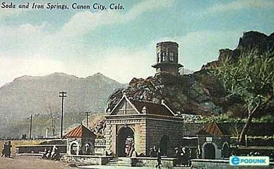

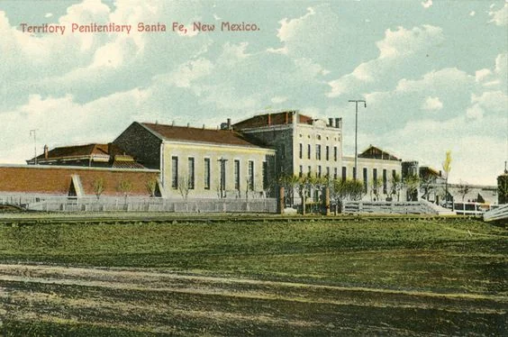

纽约奥本监狱食堂

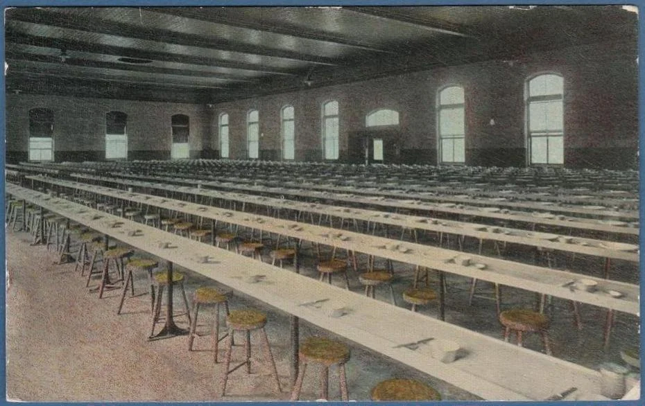

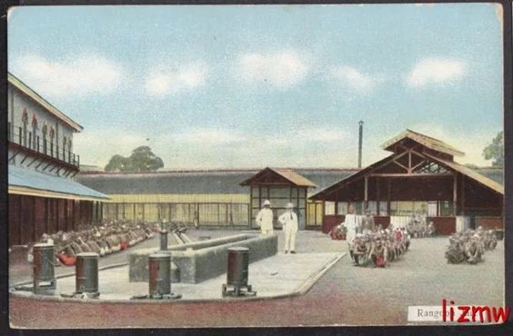

纽约奥本监狱监舍

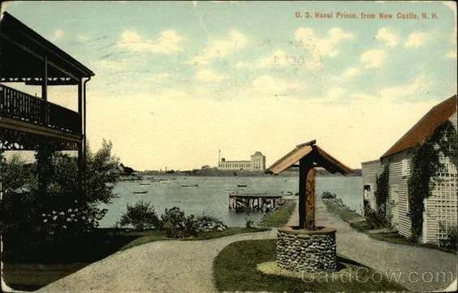

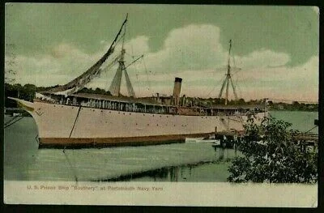

堪萨斯州利文沃思联邦监狱(Leaenworth Prison Kansas)

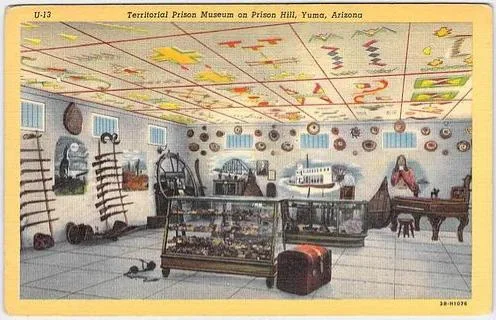

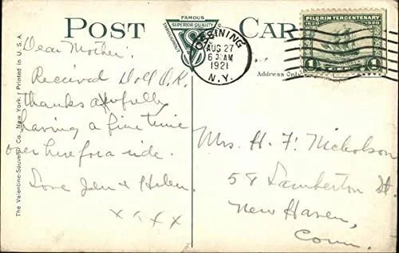

弗吉尼亚州里士满的利比监狱(Libby Prison Richmond)

弗吉尼亚州利比监狱

弗吉尼亚州利比监狱

新伊利诺伊州监狱（new Illinois State Penitentiary at Stateville, near Joliet）

新伊利诺伊州监狱

新伊利诺伊州监狱内景

新伊利诺伊州监狱监舍

阿拉巴马州基尔比监狱

阿拉巴马州基尔比监狱

科罗拉多州立监狱

亚特兰大州立监狱

马萨诸塞州波士顿萨福克监狱(Suffolk Jail Boston Massachusetts)  1915年

新墨西哥州监狱

餐厅

院内

海军监狱

囚船

亚利桑那州Yuma监狱博物馆 1940年代
