# 美国囚服百年流变简史

美国囚服百年流变简史

文/Nathan Gibson    译/狱望

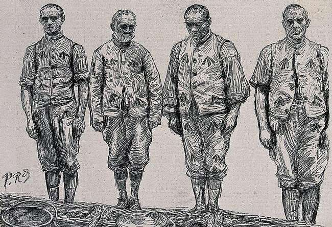

在犯人诸多被剥夺的权利中，选择衣服的权利首当其冲。一进监狱，他们就得告别自己的衣服，换上统一的囚服。尽管公众印象中的囚服都是大号睡衣般的黑白条纹，但在过去100年里，它们颇经历了几次演变。
虽然条纹囚服不再占居主流（它们正在回归），但囚服仍然遵循着同样的原则：一旦犯人越狱，他的穿着必须有很高的识别度。其他的考量包括低成本和实用，且不能太花哨。
地方官员可以按自己的考量选择不同的颜色和风格，全国各地的囚服各不相同。

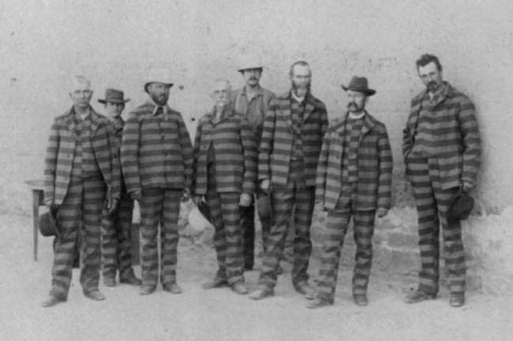

近年，Netflix的《女子监狱》（美剧）带火了囚服，但这种时髦并不见得是好事——该剧的粉丝们开始青睐橙色囚服，导致一所监狱不得不更换了犯人们的服装。

兴起于18世纪末

18世纪以前，世界各地的犯人们普遍没有统一的着装，他们都穿着自己的衣服。十八世纪后期和十九世纪，囚服才逐渐被监狱系统采用。

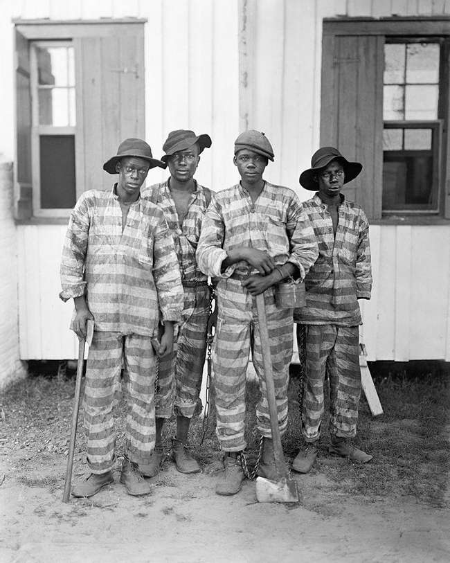

人们相信统一的服装能够强化纪律，希望这种统一有助于犯人们自律和改造。

早期的美国囚服以黑白条纹为特点

美国监狱从19世纪开始使用黑白条纹的囚服，如今这种色彩搭配已经是囚服的符号。如今，虽然已经不那么常见，但仍然有一些监狱在沿用。

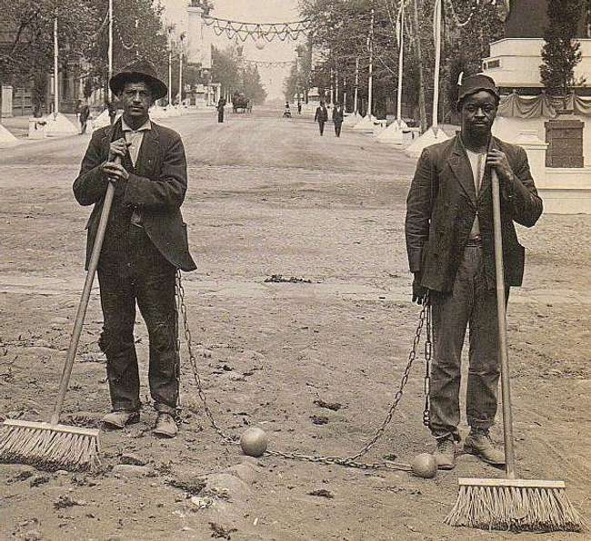

这种黑白条纹的设计一开始是为了羞辱罪犯，尤其是在犯人们被链子锁着在外面服劳役的时候。 

狱政管理思想的转变导致了黑白条纹囚服的逐渐淘汰

最初监狱被视为惩罚罪犯的机构，但到了20世纪初，人们开始认识到监狱应该是犯人改过自新的场所。这种态度的转变意味着不再着眼于贬低打压囚犯，而想办法让他们成为更好的公民。   

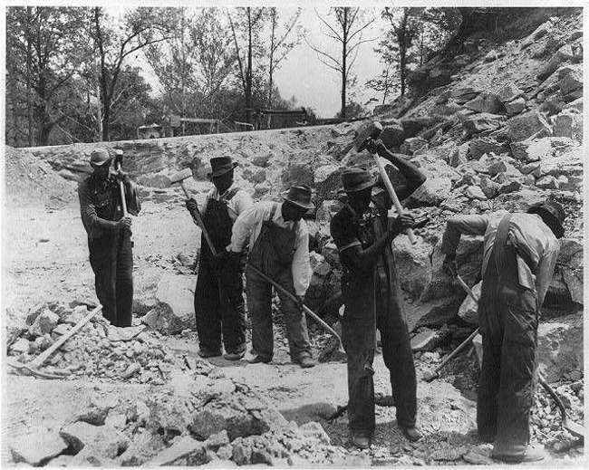

管理思想上的转变也体现到了囚服上。
            
20世纪初，工装成了普遍选择

以更体面的方式对待他们，试图使罪犯改过自新，这意味着制服不再需要那么显眼。纯色囚服和粗斜纹棉布在20世纪初成为普遍的选择。

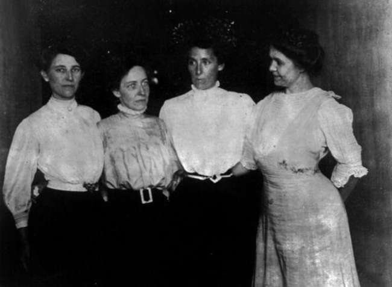

这些服装使犯人得以更舒适的工作。

20世纪中期，牛仔裤和单色衬衫大行其道

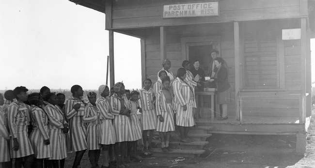

到了20世纪50年代，罪犯通常穿着粗斜纹棉布牛仔裤和单色衬衫。和20世纪初的囚服一样，这些衣服在工作时很实用，其他时候则显得很休闲。
这种服装也在一些监狱中被一直沿袭下来。

女犯享有更多的着装自由

20世纪初，许多监狱对女性着装没有严格的统一规定。例如，加利福尼亚女子监狱的女犯可以在不同面料、颜色和设计中做选择。             
人们认为女性罪犯是由于道德的败坏，他们鼓励犯人们更女性化一些。     
       
女子监狱也开始统一囚服

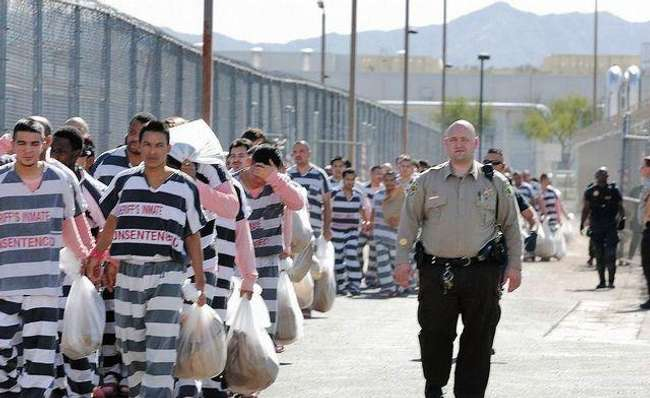

由于对心理学有了更好的理解，加上男女平等方面的进步，认为女性犯罪是因为她们不够女性化的想法遭到了谴责。20世纪中期，美国的女子监狱纷纷告别了便装。   
到20世纪90年代，大多数女子监狱都有了自己的囚服制式。
           
如今，男女囚服不再有明显区别

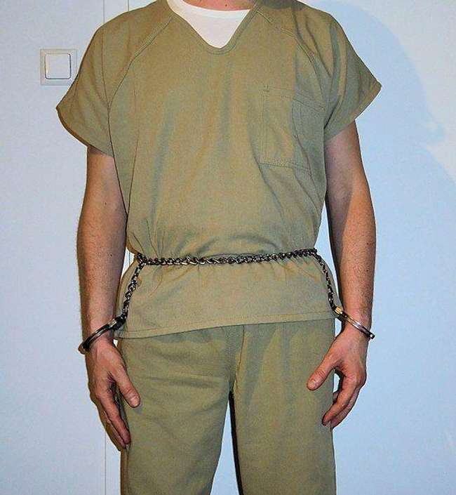

联合国列出了囚服的基本原则

1955年，联合国通过了《囚犯待遇最低限度标准规则》（2015年更新为《纳尔逊·曼德拉规则》）。这项决议虽然没有法律约束力，但作为会员国人道对待罪犯的准则得到普遍认可。             
该规则指出狱方应“发给适合气候和足以维持其良好健康的全套衣服。发给的衣服不应有辱人格或有失体面。”

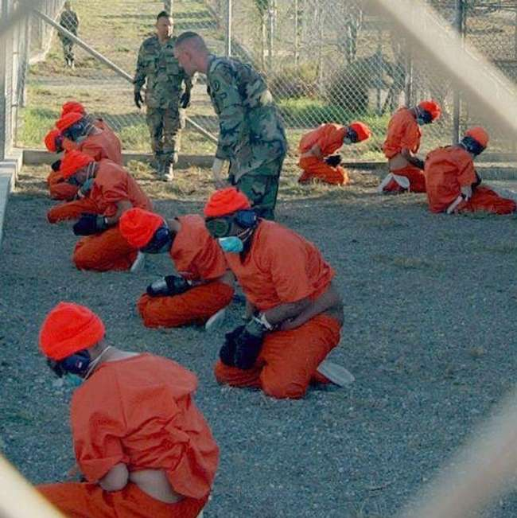

21世纪以来，工装囚服变得很普遍

近20年来，工装囚服越来越普遍。原因很简单：便宜。

只有重型犯才穿橙色囚服

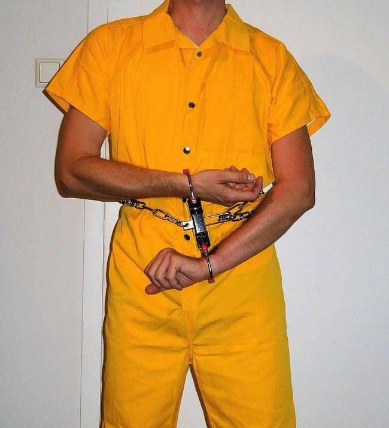

尽管近些年橙色和红色囚服成了犯人的符号，但事实上只有很少犯人这样穿。这是电视上经常出现关塔那摩等高度戒备监狱的新闻报道给大众造成的错觉。
尽管犯人在法庭上或监狱外偶尔也会穿橙色或红色。通常情况下，只有高风险的罪犯才会穿这些颜色，而且，目前的关塔那摩监狱里，大多数被拘留者都穿着蓝色、白色或米色衣服。该监狱将囚服转向更中性的颜色，以远离其备受争议的过去。 
           
不同颜色的囚服

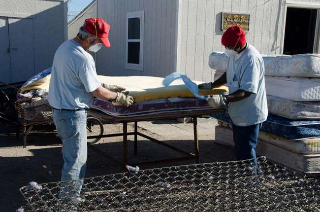

根据监狱长和当地官员的决定，不同地区的监狱采用不同的颜色和设计。一些人使用他们认为更具惩戒性的颜色，另一些人则比较随和。
不同的颜色也可以帮助工作人员识别犯人的身份，包括帮派、罪行、安全级别和工作职责。

一些男子监狱试图采用粉色囚服来减少犯罪：他们认为男性非常讨厌这些服装，以至于会不想再回到监狱。

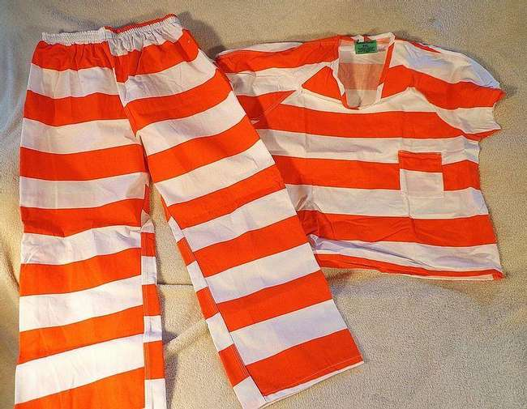

有些监狱允许犯人穿便服

一些低警戒级别监狱允许囚犯穿自己的衣服，当然，这些衣服需要满足狱方在面料和颜色上的要求。不过只有得到充分信任的犯人有这种特权。 
           

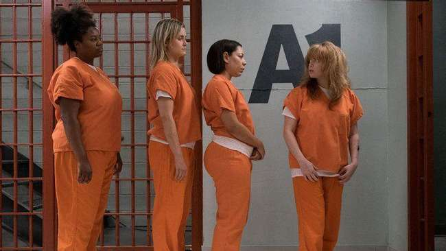

条纹囚服重新流行起来

为了讨好选民，避免部分选民认为犯人过得轻松舒适，一些政客和监狱长重新启用了条纹囚服。他们想借此传达一个信息，即他们没有“宠溺”犯人。
此外，有官员表示，纯色囚服会迷惑公众：如果囚犯穿着无条纹制服逃跑，公众可能会把他们误认为看门人、公路工人或护士。
          
《女子监狱》导致一所监狱更换了橙色囚服

Netflix的热播美剧《女子监狱》导致了至少一所监狱放弃了原来的橙色囚服。当橙色囚服在观众中流行开后，密歇根州萨吉诺监狱用黑白条纹囚服代替了原来的橙色囚服。
警长威廉·费德斯皮尔（William Federspiel）表示：“我们有时会让犯人外出工作，我不希望有人把他们搞混或者有犯人趁机逃跑。这是一个令人担忧的问题。”
