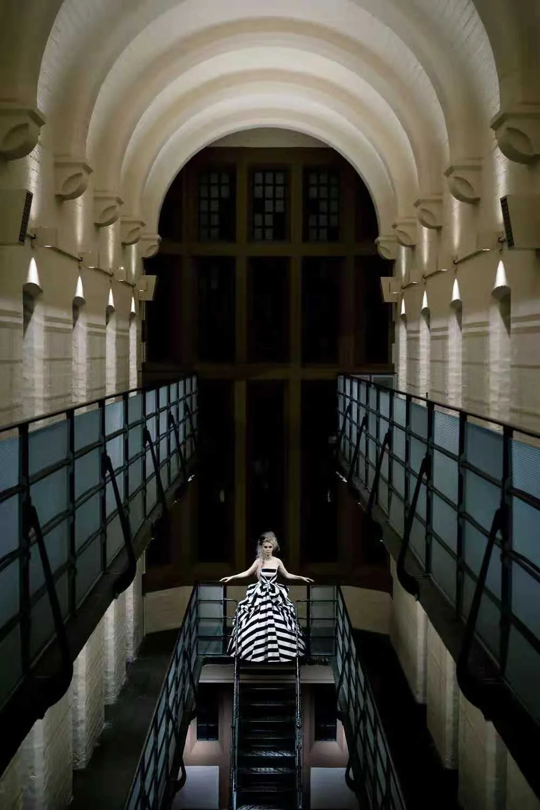
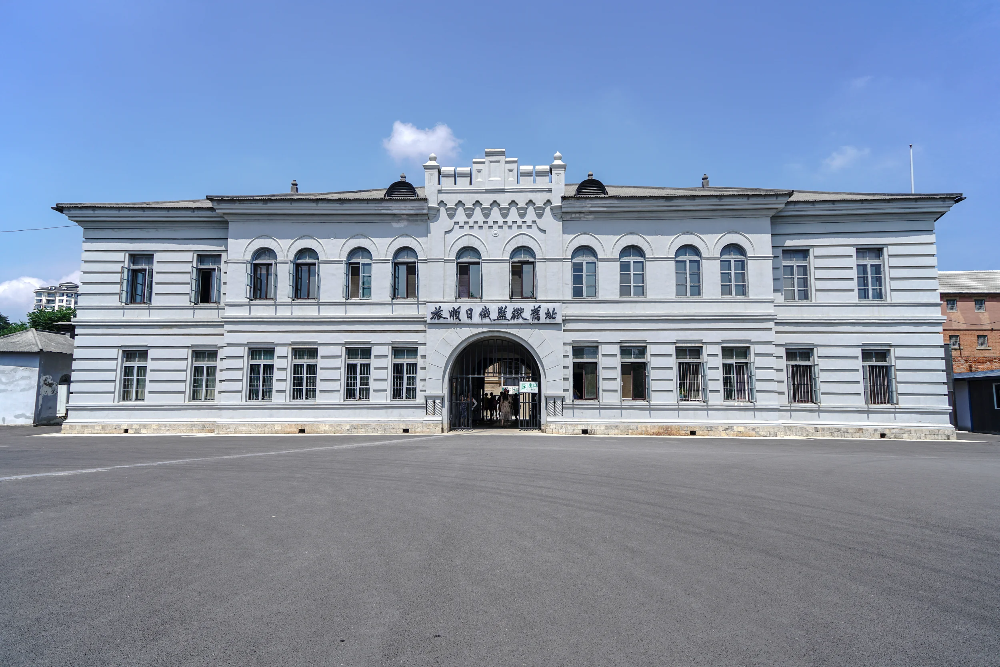
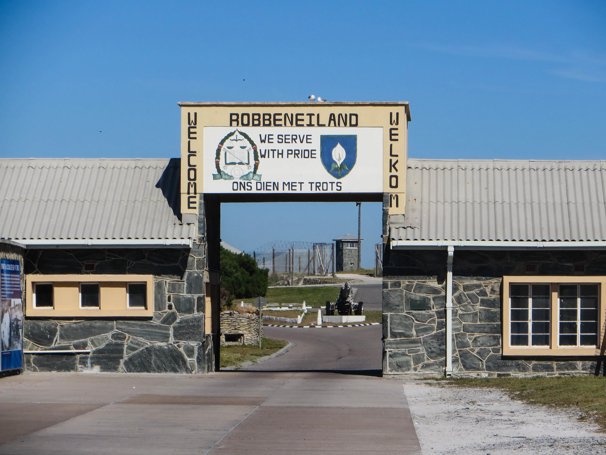
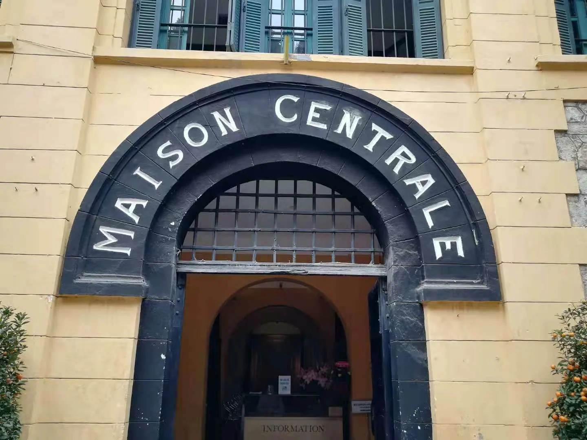
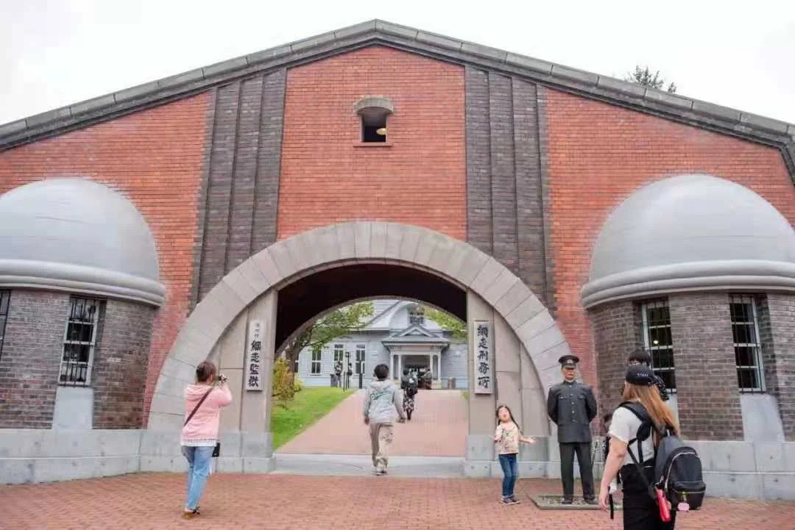
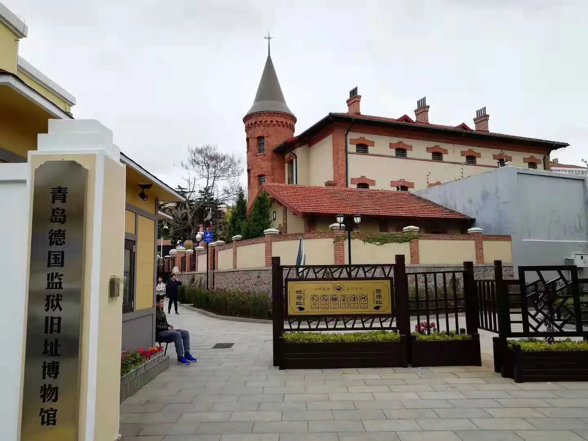
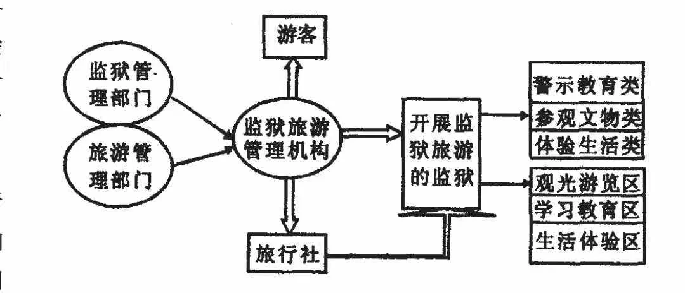

# 监狱旅游开发初探

文/刘建平 曹学文

合柴1972（原合肥监狱改造的艺术区）

随着 2006 年 7 月 4 日、7 月 26 日北京市监狱所属的北京市女子监狱和重刑犯监狱相继推出 “监狱开放日”首次对社会开放, 一种新的旅游业态—监狱旅游在我国将正式开始浮出水面。

## 1. 监狱旅游概述

## 1.1 监狱旅游概念界定

作为一种另类旅游, 本文认为广义的监狱旅游是指依托监狱特有的物质文化条件, 以监狱所具有的内部设施 、建筑风格、文化制度、生活场景和氛围等为吸引物, 以监狱、旅游管理部门与旅游企业等相关利益主体为市场经营主体,以具有特殊需求和公民人身自由权利、政治权利的特定人群为主要目标市场, 利用监狱内外物质条件、文化制度和生活方式等之间的差异, 提供给目标人群的集观光游览、学习考察、警示教育、体验生活为一体的旅游活动。

香港大馆（由域多利监狱改造的艺术区）

## 1.2 监狱旅游的分类

根据监狱吸引物和活动方式的不同, 笔者认为, 监狱旅游大致可分为观光型、体验型和观光体验型等三种主要的类型。但三者之间也没有十分明显的区别, 有时候在监狱里参观本身就是一种特别的体验。我们一般可以把以被遗弃、废弃的监狱或监狱遗址为主要景观和吸引物的监狱旅游称作观光型监狱旅游; 把以体验当前处于正常运转的监狱里的生活方式为主要目的的监狱旅游称作体验型监狱旅游; 如我们平常听说的某位作家去监狱体验生活算属于这类, 这种纯粹体验式的监狱旅游在国内外都还比较少见, 估计在全面进入体验经济时代后将会有很好的发展前景。而观光体验型监狱旅游可以称作狭义监狱旅游, 是集观光型和体验型两种类型为一体的综合型监狱旅游, 是当前监狱旅游发展的主要类型。

根据开发时间的先后和市场需求特点, 监狱旅游 ( 或监狱旅游产品) 又可分为参观监狱文物文化类、学习警示教育类和体验监狱生活类等类型。从监狱旅游的发展进程和演化路径来看, 它是随着时间的推移和社会民主、文明不断进步的同时逐渐出现、发展的, 最先出现的或者说最古老的监狱旅游类型是参观监狱文物文化类, 然后是学习警示教育类,进入体验经济时代占主要市场的将是体验监狱生活类。

## 1.3 国内外监狱旅游的发展及研究现状

旅顺日俄监狱旧址

目前为止, 以监狱为载体和依托的旅游活动与旅游形式的实例在国内外都比较多, 而这些旅游活动中发展得相对较早、到现在比较成熟的是利用年代久远和具有特殊价值的已经废弃的经过维修或改善的监狱进行的观光型旅游活动。如南非的罗本岛上的监狱因关押过包括南非前总统曼德拉等9000 多黑人运动领袖和积极分子, 被视为南非黑人反对种族隔离、争取民族自由解放的象征。新南非诞生后, 罗本岛于 1996 年被政府宣布为国家博物馆, 成为著名的旅游胜地。1999 年 12 月, 被联合国教科文组织列为世界文化遗产[1]。同样这种类型的旅游活动在我国也比较常见, 如位于我国山西临汾市洪洞县的 “苏三监狱”, 始建于明朝洪武二年 ( 公元 1369 年) , 距今已有 600 余年的历史, 是我国现存的惟一一座明代形制的监狱, 也是现存最早的监狱。因话本和 《苏三起解》、《玉堂春》等戏剧里家喻户晓的人物苏三而得名。监狱旧址被维修开发后, 成了体验我国明代监狱情形的著名景点。

罗本岛监狱

洪洞苏三监狱

相反, 国外利用已经废弃的监狱遗址或现仍在发生作用和正常运转的监狱进行观光体验型或纯体验型监狱旅游的时间相对较短, 典型案例也不多。如参考消息曾报道, 在拉脱维亚的港口城市利巴雅, 有一座 100 多年前沙皇俄国建造的监狱。自苏联解体后, 1997 年被关闭, 这里成了一片废墟。当地的历史学家和年轻人建议, 把这代表一段黑暗的历史的见证物保存起来并充分发挥其作用。于是, 该国将这座在被关闭的监狱作为一个旅游景点。人们可以在这种另类旅游项目中体验到囚犯的生活。自从推出了这种另类旅游项目后,不仅吸引了国内各界名人, 而且还吸引了欧洲人前来参观,目前参观者人数已经超过 1 万人。来参观的游客除在导游带领下进行参观外, 游人还可以穿上囚服拍照, 在黑暗的牢房中体验政治犯的生活[2]。广州日报大洋网也以 " 泰国监狱游成旅游热点 " 为题报道了泰国的监狱旅游, 文章记载了泰国邦广中央监狱成为了向往不同体验和行善积德游客青睐的旅游景点的情况[3]。而我国则由于意识形态等方面的原因, 在这方面基本上还是一片空白。

河内监狱博物馆

笔者在查找国内外对监狱旅游的研究文献时, 在中国期刊网 ( 清华) 输入 “监狱旅游”只找到了与监狱旅游相关的文章 3 篇①。这几篇文章分别对捷克和南非等国家利用一般公民对监狱的神秘感和求新求异的好奇心, 推出了监狱 ( 铁窗) 旅游的事情作了简单地介绍, 基本上属于一种新闻报道的形式, 且文章篇幅都很短, 也没有上升到理论的高度对监狱旅游来进行研究。而在外文数据库以 "prison tourism" 为关键词进行搜索时, 仅查到 1 篇理论文献[4]。在此文中, 加拿大 多 伦 多 大 学 的 Carolyn Strange 和 澳 大 利 亚 国 立 大 学 的Michael Kempa 以美国的 Alcatraz 和南非的罗本岛为实例,采用借助政策性文件、现场观察、进行旅游资源调查和对监狱博物馆工作人员访谈等形式为研究方法, 在介绍二者发展监狱旅游活动实践情况的基础上对其做了理论分析。在此文中, "prison tourism" 一词已经出现, 同时还提到有关专家把这种旅游称为 “dark tourism” ( 黑色旅游) , 但文章不仅没有对监狱旅游的概念进行明确界定, 也没有对监狱旅游开发进行系统阐述。

由上可知, 无论是国外还是国内, 虽然以监狱为主要吸引物和载体的旅游活动、旅游形式的实践和实例都比较多,但对监狱旅游进行过系统的理论研究的文献很少, 监狱旅游在理论上还基本属于一个新事物。因此, 本文对 “监狱旅游”概念的界定、开发监狱旅游的意义和理论框架的提出及论证具有首创性。我国借北京市监狱局推出 “监狱开放日”定期面向社会开放的契机发展以观光体验型为主的监狱旅游具有十分重要创新价值和现实意义。

北海道网走监狱

2 开发监狱旅游的意义

( 1) 开发监狱旅游通过借助监狱实行 " 监狱开放日 " 等制度和形式向公众开放, 可以让社会更加了解监狱, 使监狱的行政执法变得更加透明,同时可以争取得到社会力量对服刑人员改造的支持, 有利于犯人的改造。如本文开篇提到的2006 年 7 月 4 日上午, 来自中国地质大学的 30 名师生和 10名服刑人员家属参观了北京市女子监狱。这是北京市的监狱开始对社会开放, 接待普通群众参观。通过参观, 一些人改变了他们对监狱原来的印象和看法。

( 2) 开发监狱旅游可以使监狱对内成为爱国主义教育的载体和基地, 对外起到进行和平教育, 促进世界和平的目的。如位于我国辽宁省东部抚顺市内浑河北岸, 高尔山下的抚顺战犯监狱管理所, 关押过犯有战争罪的日本战犯、伪满洲国战犯、蒋介石集团战犯, 在战犯改造方面曾作出过杰出的贡献。该所停用后, 一九八六年五月, 经国务院批准, 将其作为改造战争罪犯的旧址, 正式对国内外开放。经过二次较大规模的维修, 目前建成了具有综合陈列馆、改造末代皇帝陈列馆、日本 “中归联”活动陈列馆, 以及 10 余个参观景点和服务设施比较配套的对外接待旅游参观的世界知名观光胜地。成为进行和平教育与进行爱国主义教育基地[5]。

( 3) 开发监狱旅游可以使监狱成为开展警示的课堂和平台。通常的做法是组织国家工作人员到监狱参观, 通过犯人现身说法进行警示教育, 以达到增强拒腐防变的能力。如某县检察院不到一年就组织县税务、质监、卫生、电信、农业、保险等部门共 900 余人前往某监狱开展警示教育, 而且当地主动要求开展这种活动的单位还有很多。开展监狱警示教育活动让受教育者亲自感受监狱的森严与肃穆, 耳闻目睹失去自由的痛苦, 从而警示自己懂得洁身自好, 尊重法律, 珍惜自由。

( 4) 开发监狱旅游把那保存完好年代久远、历史悠久的监狱开发成著名的旅游景点, 不仅可以丰富旅游品种和业态, 而且有利于对历史文化遗产和景观的保护。年代久远的监狱, 本身就是一种古迹, 更是对某一段历史的代表和见证。如坐落在澳大利亚塔斯马尼亚洲的塔斯曼半岛上的阿瑟港监狱, 是澳洲目前保存最完好的监狱古迹, 有 “澳洲的古拉格”之称。澳洲是英国在 19 世纪流放本国犯人的地方,从 1830—1877 年之间, 这里曾经关押了超过 1 万 2 千名的英国重刑流放犯人, 这些人是澳洲历史上第一批拓荒者, 前辈的景况造成了今天的澳洲人对监狱有一种特殊复杂的情感。因此, 阿瑟港监狱被开发成旅游景点以每年都吸引了众多的本国人来这里观光游览, 追忆历史。现在阿瑟港监狱被列入澳大利亚国家遗产名单, 在发展旅游业的同时也得到了很好的保护[6]。

阿瑟港监狱

( 5) 开发监狱旅游可以使一些历史悠久和具有特殊意义的监狱成为集文物保护、旅游观光、法制教育等多功能于一体的载体。如始建于 1900 年, 位于青岛市常州路 25 号的专门用于关押德国犯人的中国现存最早的殖民监狱—青岛监狱( 又名 “欧人监狱”) , 是当时德国殖民当局在青岛建设的首批典型的欧式风格建筑, 也是德国殖民主义者在青岛的标志性建筑之一, 具有历史纪念和建筑学研究的双重价值和意义。旧址按照 “修旧如旧”和保护老建筑周围特有的历史文化环境的原则改造后, 拆除了周围与古建筑群整体风貌不协调的建筑以及临时建筑, 改造和保留了有价值的建筑, 和青岛市老市政府、迎宾馆、天主教堂等欧式建筑融为一体, 并在地下增设法制教育培训设施。改造后的青岛监狱实行对外开放, 发挥了多方面的作用, 产生了很好的经济效益和社会效益[7]。而重庆红岩的渣滓洞监狱旧址、延安龙湾山原陕甘宁边区高等法院的监狱旧址作为文化遗产经修复后, 则成了旅游观光的胜地和进行保先教育、科学研究的基地。

( 6) 开发监狱旅游可以更好地保护中国传统文化。笔者认为, 与其他形式的旅游一样, 文化也是监狱旅游的核心和灵魂, 监狱文化作为一种亚文化是监狱旅游最大的卖点。同时监狱也是一种文化现象的空间形式, 监狱本身就是一种文化。现在我国较普遍存在监狱文化滞后于监狱硬指标发展的现象。现行监狱体制改革促进了监狱在行政执法、管理方式、精神状态、社会生活等方面的一系列深刻变化。而监狱文化的相对缺失势必给现代监狱的进一步发展将带来新的阻力。监狱旅游的开发, 实际是对监狱文化和监狱文化遗产的保护与开发, 而我国监狱文化毫无疑问是中国文化特别是中国传统文化的一个重要组成部分, 从这一点来说, 开发监狱旅游, 提倡 “文化兴监”, 对于研究和保护中国传统文化具有不可忽视的意义。

3 监狱旅游开发的可行性分析

( 1) 随着对外开放的进一步扩大, 公开行政和增加行政执法的透明度将成为一种趋势。开发监狱旅游可以起到监督行政、监督执法和强化监狱的社会职能等作用, 具有良好的社会效益, 监狱向公众和社会开放也将成为一种必然。

( 2) 当今, 监狱是国际人权斗争的前沿, 是维护国家国际形象、保证国家长治久安的基地, 更是社会文明进步的重要窗口。因此, 为了适应国际人权斗争的需要, 为了提高履行监狱职能、维护安全稳定的能力, 为了推进社会进步, 我们完全可以通过开展监狱旅游来整合资源, 利用监狱文化凝聚力量, 凸显现代狱政文明, 不断促进监狱全面、协调、健康发展。

( 3) 马斯洛认为, 人的需要具有多样性, 有些需要具有特殊性。“军队, 大学, 监狱”是人生的三个宝贵经历, 去监狱参观游览或体验囚犯的生活暗合了一部分人对监狱的神秘感和求新求异的好奇心理, 满足了一部分人追求刺激的心理需求。在体验经济时代, 开发监狱旅游有很大的市场潜力。

( 4) 监狱向社会和公众开放后, 如果趁势发展成监狱旅游, 参观监狱采取收费制或门票制, 可以为监狱部门、旅游部门、旅游企业等相关利益主体带来客观的经济效益, 在减轻国家财政压力的同时也有利于它们更好的运转。

4 监狱旅游的开发思路及理论体系

从旅游与旅游开发学的一般理论来看, 监狱旅游属于一种专项旅游产品。监狱旅游的开发思路, 简单来说就是在一个专门机构的领导和管理下, 以监狱遗迹遗址和现有监狱为载体, 按照特种旅游的开发模式, 赋予监狱以旅游的特点与内涵 ( 如图 1 所示) 。要搞好监狱旅游的开发, 本文认为需做好以下几方面的具体工作:

图 1 监狱旅游开发思路、理论框架图

## 4.1 建立管理机构、制定管理制度

建议由司法部 ( 或监狱管理局) 和旅游局安排部分在编人员联合组成统一的监狱旅游管理机构, 隶属二者, 向其负责。同时省、市两级可照此设立相应的监狱旅游管理机构。工作人员的工资可以由新产生的单位自筹解决, 享受同级机构的相等待遇, 这样不但没有增加公务员编制, 反而减轻了国家的财政负担。各级监狱旅游管理机构可以下设旅行社经营监狱旅游业务, 导游员可由各监狱的工作人员 ( 狱警、管教) 担任。各级监狱旅游管理机构由于涉及到两个上级机构的垂直管理, 需要划分、协调好司法部门和旅游部门的管理权限和职责, 同时需制定统一可行的监狱旅游管理的相关制度, 以避免造成多头管理、互相扯皮和管理混乱的局面。

## 4.2 制定行业标准、规范行业行为

监狱作为监狱旅游的载体, 与其它旅游活动的载体不同, 具有特殊性。这就要求主管机构从客观要求与实际特点出发, 制定不同于其它旅游类型行业标准和管理条例, 以保证其正常运作和良性发展。由于监狱是国家实行专政的国家机器和工具, 其日常运作的相关规定具有严格的法律性和程序性。因此监狱旅游的开展要以遵守 《监狱法》等相关的国家法律法规和管理制度为基础, 以不妨碍监狱的日常秩序和正常运作为前提。

至于具体运作, 监狱旅游管理机构可参考和借鉴北京市女子监狱和重刑犯监狱的做法, 制定统一的管理条例, 对进入监狱的旅游者的年龄、身份、参观时间和人数、预约制度进行规定。如它们规定参观者必须年满 18 周岁, 具有北京市户口, 未在该监狱服过刑。参观者凭身份证、户口本和当地政府 ( 街道、乡、镇) 证明, 在每月第一、第二周星期二( 法定节假日除外) 上午, 到北京市监狱和北京市女子监狱传达室预约登记, 经审核合格后按监狱通知前往。每月最后一周的星期三, 北京市监狱和北京市女子监狱安排市民参观( 每次人数不超过 40 人) , 大学生等集体组织可优先安排( 每次人数不超过 100 人) [8]。

## 4.3 进行功能分区、细分旅游市场

对开放的监狱进行功能分区等做法可以参考本文前面提到的北京市两所监狱的做法。这两所监狱开放的场所为服刑人员的生活区、学习区、劳动区, 包括服刑人员监舍、教学楼、会见室、心理咨询室、车间、礼堂、食堂等。为保护隐私起见, 参观活动不涉及与服刑人员的见面, 未经允许市民不得与服刑人员接触。但作为监狱旅游应该在此基础之上进一步的完善, 使之具有旅游的特征。我们可以把进行旅游开放的监狱分为观光游览区、学习教育区、生活体验区等。根据前面对监狱旅游的分类和现存各类监狱的特点, 需要对监狱旅游进行市场细分, 以便满足不同人群的需求和针对不同类型的监狱旅游区别进行开发、管理。对旅游企业、旅行社来说, 可以把监狱旅游产品市场细分为监狱警示教育类、参观监狱文物文化类和体验监狱生活类等监狱旅游市场。如可以把号称中国古代司法最后的样板、中国最典范的历史司法监狱, 与上海提篮桥监狱 ( 原租界监狱) 、东北旅顺日俄监狱 ( 外国在华监狱) 和重庆渣滓洞集中营 ( 政党监狱) 并列中国四大旧监狱的芜湖大清监狱开发成的监狱文物文化旅游。

## 4.4 监狱旅游开发应注意的其他问题

首先, 要在不违背国家法律、政策的前提下进行。要借助 “监狱开放日”这股东风, 争取国家的具体政策的支持和倾斜, 这是开发监狱旅游成功的前提和关键; 其次, 要按照依次分步的原则进行开发。我国的监狱数量众多, 条件各异, 硬件和软件设施都不一样, 考虑到所处地域及其公民的素质与监狱安全等问题, 开发监狱旅游时须慎重, 要具体问题具体分析, 区别对待, 不能一个模式全面铺开, 即使在条件成熟的地区 ( 如北京) 也必须在经过试点后, 才能依次分步进行开发; 最后, 进行监狱旅游时, 要事先精心组织、周密安排, 而不能盲目冒进, 更不能走马观花、流于形式。现在有的单位在进行监狱警示教育旅游时, 组织者没有将大量时间放在参观劳改场所和体验罪犯的监狱生活上, 而是放在观赏监狱的周边风景上, 在安排倾听服刑人员现身说法时也马马虎虎, 草草收场, 没有达到寓教于游的目的和效果。

5 结语

监狱旅游不仅是一种新的旅游业态, 更是一个新事物,在开发过程中不可避免地会遇到许多理论和实践难题。但监狱旅游的开发具有一定的可行性。本文对监狱旅游开发相关问题的探讨, 基本上还处于理论的创造、尝试阶段, 还需要到实践中去进行进一步的检验, 同时监狱旅游作为一种新型的旅游产品, 也处在实践探索的过程当中, 值得借鉴的经验并不多。最后, 笔者希望本文可以起到抛砖引玉的作用, 引起社会各界有识之士对这一课题的关注和支持, 以促进其健康蓬勃地发展。

注释:

①郭鲁芳.别具一格的特色旅游[J].国际市场, 1994,(12); 英子.别具一格的特色旅游[J].西藏旅游, 1995; 南非辟监狱为旅游胜地[J].中国健康月刊, 1995,(06)。

参考文献

[1] 邵春·曼德拉—非洲划时代的伟人[N].中国旅游报, 2006-06-16(11).

[2] 四川新闻网(旅游).另类旅游: 监狱里当囚犯[EB/OL].

http://www.newssc.org/gb/Newssc/travel/hqgg/userobject1ai231604.html,2004-12-25.

[3] 广州日报大洋网.泰国监狱游成旅游热点(2004 -10-22) [EB/OL].http://www. sina. com. cn,2004-10-22.

[4] Carolyn Strange and Michael Kempa. Shades of dark tourism: Alcatraz  and Robben Island[J]. Annals of Tourism Research,2003,30(2):386-405.

[5] 东 北 新 闻 网.抚 顺 战 犯 管 理 所(2005-06-28[EB/OL].

http://www.nen.com.cn/77991658293035008/20050628/1710172.shtml,2005-06-28.

[6] 星岛环球网.探秘澳大利亚“鬼城”透过阿瑟港监狱的悚然声响(2006-10-07) [EB/OL]. http://www.singtaonet.com/geography/t20061007_350713.html,2006-10-07.

[7] 青岛新闻网.欧人监狱改成德式监狱博物馆(2007-03-18)[EB/OL].

http://www.qingdaonews.com/content/200703/18/content_7736831.htm,2007-03-18.

[8] 钱卫华.本市监狱首次向公众开放[N].京华时报, 2006-07-05(6).

