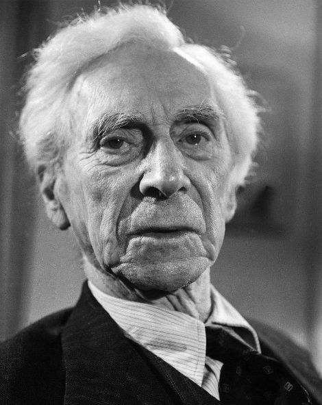

# 罗素的两次坐牢经历

选自《罗素自述》

## 十三、我在“一战”中被判入狱

这一时期我和政府之间的关系已经变得十分紧张。1916年我写了一份传单，讲述了一件事情：一个出于良心而拒绝服兵役的人，被政府无视道德条款而抓进监狱。反对服兵役协会将传单散发了。传单上并没有写上我的姓名。让我感到惊讶的是，那些散发传单的人被抓进监狱。于是我写信给《泰晤士报》，说明我就是这份传单的作者：“最近反对服兵役协会印发了一份关于艾弗里特案件的传单，艾弗里特先生由于自己的良心而拒绝服兵役，被军事法庭以违抗军令的罪名判处服两年苦役。有六人由于散发这份传单被分别判处刑期不一的苦役、监禁。我在此声明，我是该传单的作者，如果有谁要因此而被起诉和惩办的话，首先要对此事负责的人就应该是我。”

在伦敦市政府，在市长在场的情况下，我被起诉。我作了一个长篇发言来为自己辩护。我被判罚100英镑。我没有交齐罚款，因此我放在剑桥的财产被他们卖掉来冲抵罚款。而我的几个朋友又把它们买回来还给了我。我感到自己的抗议没有起到什么作用。在这期间，三一学院所有的年轻研究人员都应征入伍，并被授以军衔，而我被取消了讲师职务。

反对服兵役协会发行了一份名为《特别法庭》的周报，我经常为它写社论。在一期社论中我写道：美国士兵如果到了英国，会被用来破坏工人罢工，这本是他们在自己国家干惯了的事情。我是参照一份参议员报告的内容写了这段话。因此，我被判刑监禁半年。但这并不让我有多难受。它让我维护了自己的尊严，让我有机会去思考一些比人类毁灭较少痛苦的问题。由于贝尔福出面干涉，我被关押在轻罪囚室，这样我就可以阅读和写作，但不准进行和平主义宣传。我的感觉是，在监狱里呆着也蛮惬意的。这里不会有穷于应付的约会，不会有难以作出的决定，不会有不希望的人来访，不会有人来打断我的工作。我读了许多书，写了一本名为《数理哲学导论》的书，是对《数学原理》一书的通俗化，同时还开始写作《心的分析》一书。我对同监狱的人产生兴趣，认为他们的道德水准并不见得比其他人低下，或许其智力要略逊一筹，他们被抓进来就说明了这一点。如果不是在轻罪囚室，蹲监狱对于任何人来说都是一种可怕的严厉惩罚，对于那些习惯于读书和写作的人来说尤其如此。多亏贝尔福，我才免遭此厄。我很感谢他的干涉，但我仍然激烈反对他推行的政策。到达监狱时，看守照例进行详细询问，他的问话让我乐不可支。他问我的宗教信仰，我回答：“我是一个不可知论者。”他问这个词怎样写，然后十分感叹地说：“啊，竟然有这么多的宗教，我还以为大家相信的是同一个上帝呢！”这话让我乐了将近一个星期。一次，我在朗读斯特里基的《维多利亚时代名人录》，读到得意处不禁放声大笑起来，看守立即跑过来制止我，并说：一定不要忘了监狱是施行刑罚的地方。

我获准每星期可有一次来人探视，当然看守必须在场，而这仍然是让我特别愉快的时刻。往往是阿朵林和克莱特轮流来看我，有时还带有人。我发明了一种秘密通讯方法，就是把信隐藏在还没有划开的毛边书页里。当然，我不能当着看守的面说明这种方法，我就把一册《伦敦数学学会会刊》交给阿朵林，对她说，这个会刊要比它表面上看起来更加有意思。此前，我还尝试过另一种方法：将给克莱特的情书编进可让典狱长审查的书信中。我对典狱长说，我正在阅读法国大革命回忆录，发现了吉伦特党人比佐给罗兰夫人的信件，我将写给克莱特的法文信谎称为是从这些书上抄下来的。即使典狱长懂法文，比佐的情况跟我很类似，他也未必分辨得出来真假；而据我猜想，他并不懂得法文，却又不愿承认这一点，就稀里糊涂地让我的信通过了。

监狱里有许多德国人，其中有些人不乏才学。一次，我对一本论述康德的书发表了自己的看法，立即有几个德国犯人过来同我热烈地讨论起来了。在我被关押期间，苏俄的李维诺夫也被关在这里，远远地我可以看到他，但没有机会同他谈话。

我在监狱的心情可以从当时我给哥哥的信中得到反映，这些信都是必须经过典狱长审查的：

“(1918年5月6日)……这里的生活就像坐在一艘航海客轮之中，你同许多普通人被关在一起，除非你躲进自己的舱房，否则是无法避开他们的。我并不觉得他们要比一般人坏，如果根据其面部表情来判断的话，也许他们的意志力比较薄弱一些，我也只能根据这个来判断他们。这里的生活最难受的是见不到朋友。那天见到你，我感到快乐极了。下次你来时，最好再带两个朋友来，你和伊丽莎白都知道应该带谁。我渴望见到更多的朋友。你好像以为我在这方面的要求会逐渐冷淡下去，你想错了。要见朋友的渴望是不会冷谈的，虽然对他们的思念也会获得一种满足。

“在这里没有我原先预想的那样感到烦躁，烟抽完了也没有觉得特别恼火，不过再过一阵子也许就不是这样了。在这里就像是在休假，而且没有任何负担，再没有比这更为惬意的事情了。在这里无须关心尘世上的事，心境平和，灵魂安妥。在这里完全摆脱了这些折磨人的问题：我能够再做些什么？我是否还有未考虑周全的实际行动？我是否有权将一切撒手不管而钻进哲学之中？在这里我是不得不把一切撒手不管，这要比本想撒手、又怀疑这一选择是否正确省心得多。在我看来，监狱在某些方面要远远超出教会之上。

## 十九、我的第二次入狱

一天下午，在北威尔士，我和太太开车回到住处，在家门口发现一位警官正等着我们，他骑跨在摩托车上，表情有些尴尬，但并不让人讨厌。他给了我们一张传票，要我们9月12日到治安法庭接受审讯，传票上列的罪名是煽动民众和平抵抗。

我们去了伦敦，想听一听律师的意见，更主要的是想跟同事们商量一下。我并不想当一个殉道者，但我应该充分利用各种机会来宣传自己的观点。如果我们被判入狱，就可能引起某种社会骚动。也许这样就可以让原先不了解我们的人对我们的事业产生同情。我们已经从医生那里获得证明，说明我们最近生过重病，如果长期监禁可能导致严重后果。我们把证明给了将陪同我们出庭的一位专门律师。他表示，他完全有把握打赢这场官司，保证我和我太太不会被判入狱监禁。而我们希望的结果是，既不是不监禁，也不要监禁的时间过长。因此我们要他想办法不要让我们因受到宽大而免于处罚，也不要让我们被判的监禁时间超过两星期。结果我们两人都被判监禁两个月，同时法庭宣布，由于医生的证明，我们的监禁时间减少为一星期。

1961年9月12日上午10点半左右，我们和一些同事来到法庭，一路上有不少旁观者。当法庭判我监禁两个月时，旁听者中有人高声喊叫：“太可耻了！对一位88岁的老人！”这让我感到有点不舒服。我知道他们是好意，但我是自己故意要被监禁的，而且我认为年龄跟罪行的大小没有什么关系。如果要说有什么关系的话，也许年龄越大罪行也就相应地增大。或许那位宣判的法官说得很对，他说，像我这么大年纪的人，应该知道什么该做、什么不该做。不过法庭和警察对我们的态度还是比较温和的。庭审开始前，一位警察到处去找一块垫子来放在我坐的那个又窄又硬的凳子上，结果没有找到，其实这更好，不过我还是应该感谢他的好意。我感到高兴的是，法庭允许我发言，我原计划要说的话差不多都说了。

到中午，我们都已申诉完毕，法庭给我们一个小时的时间吃饭。走出法庭时，有一大群人向我们欢呼，还有一位女士冲过来同我拥抱，让我有些惊讶。下午听完判决后，我们等着囚车来后被运往监狱。这是我第一次坐囚车，上一次被判入狱时是坐出租车去的。我被直接送到了监狱医院病房，这一个星期大都是在病床上度过的。每天都有医生来检查，看我是不是领到了能够吃的流体食物。

在我被监禁期间，“百名委员组织”已经把我在监狱里写的信印刷成传单。传单的另一面是“百名委员组织”的紧急呼吁，号召所有同情我们的人在9月17日（星期日）5点到特拉法尔加广场集合，然后游行到议会广场集会和静坐示威。当时内政大臣已经下令禁止使用特拉法尔加广场集会，但“百名委员组织”决定不予理睬。遗憾的是，这一天我和太太还在监狱，不能参加。

星期一早上我们被释放，很高兴地同家人团聚，但立即被大批涌入的报社、广播电台和电视台的记者所包围。他们的长时间纠缠使得我们没有时间了解被监禁一星期来发生的重要事情。在监狱里，我们从报纸上看到，不仅在英国，还有其它许多国家，那些支持我们的人举行了各种集会和静坐示威来抗议对我们的囚禁。监狱里有些犯人收听了无线电广播，得知9月17日那天的示威游行十分成功。他们站在监狱大厅的阳台上，竖起大拇指向我太太大声喊叫：这次静坐示威大获成功。

世界各地的电视和报刊都报道了这次示威活动以及此前的囚禁事件，这让世界各国人民充分了解我们在做什么、想做什么以及为什么要这样做，获得很好的效果，而这正是我们所希望的，但我们对由此产生的公众热情估计不足。在开始时我们就作了细致安排：每一次示威活动，有可能遭到囚禁处罚的“百名委员组织”成员只能有几个。这样，就可以让示威活动不断持续下去，因为总有人在领导这一活动。然而人算不如天算，政府当局并不是根据某次行动来定罪，而是以煽动罪为由，一下子就判决了我们的一大批成员，打乱了我们原先的安排。在9月17日的静坐示威发生骚乱时，警察就进行了大肆逮捕。这时我们还不知道到底有多少成员被捕，直到后来才知道，“百名委员组织”成员所剩无几，他们穷于应付各种紧急事务和对未来行动的策划。当时我也十分忙碌：有许多事情是我被监禁后发生的，而且只有我才能够处理。

出狱后的那个星期天，我们回到北威尔士，但报纸和电视台的记者仍然蜂拥而至。不断前来访问的还有来自世界各地的人：意大利人、日本人、法国人、比利时人、美洲人等等。无休止地接待来访者让我们十分厌倦，于是一有机会我们就干脆开车躲到乡下去。在那里我们还遭到一次危险。一天下午我们沿着沙滩，绕过岩石，到一个小海湾去。路上的礁石被晒干的海草覆盖着，刚开始时我们还很小心地用脚试探着走，后来就不在意了。我走在最前面，结果一下子陷入泥中，深入大腿。只要一动，就会显得更深一些。我太太也差一点陷进去了。她想法攀上一块礁石，然后慢慢把我从泥潭中拖出来。我们的汽车有几次陷入沙坑或泥坑中，只得找人把它拖起来，其中有一次，把它拖出来的是一个核基地的大货车，对于我这个以反对核战争为己任的人来说，这是一个既可气又可笑的事情。

（黄忠晶译）

伯特兰·罗素（Bertrand Arthur William Russell，1872年—1970年），英国哲学家、数学家、逻辑学家、历史学家、文学家，诺贝尔文学奖获得者，分析哲学的主要创始人，无神论或者不可知论者，和平主义社会活动家。
