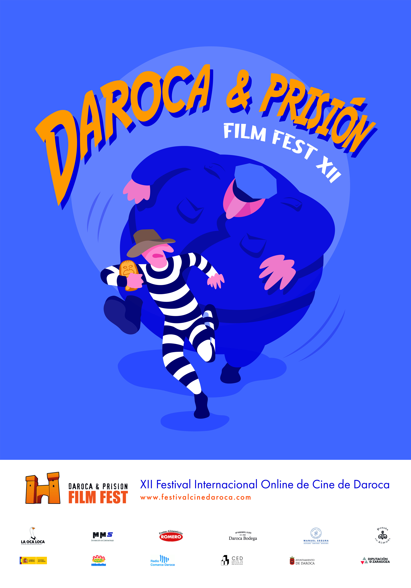
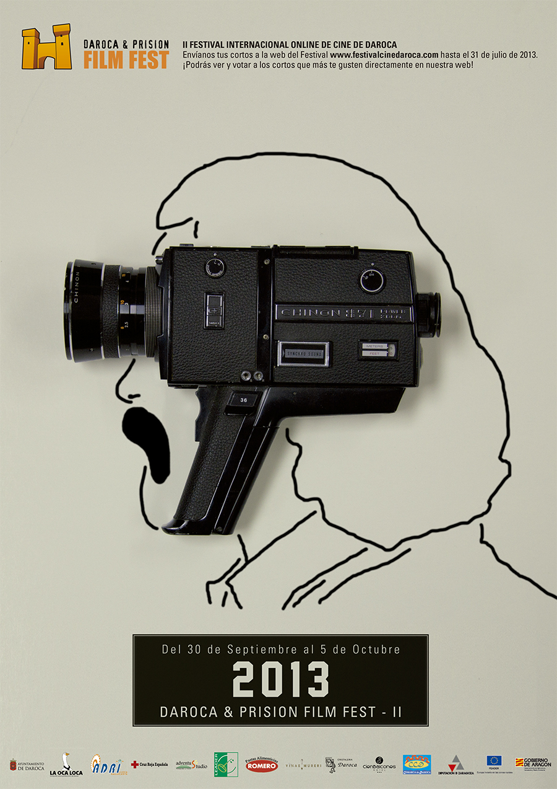
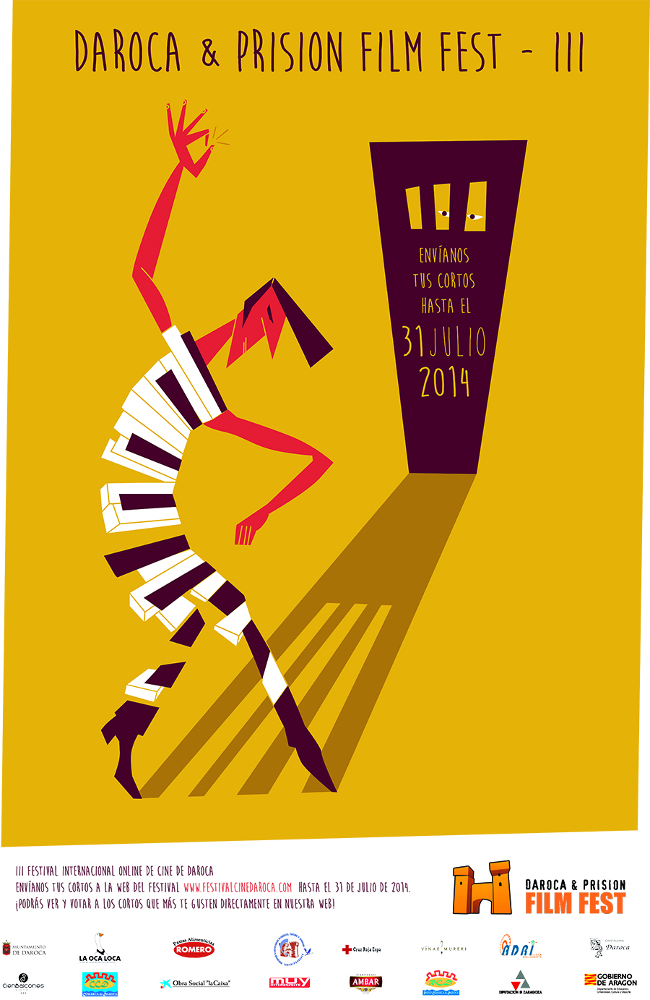
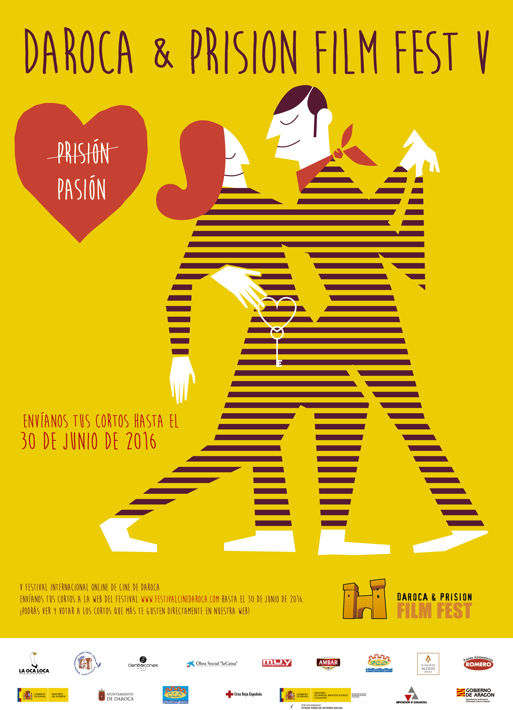
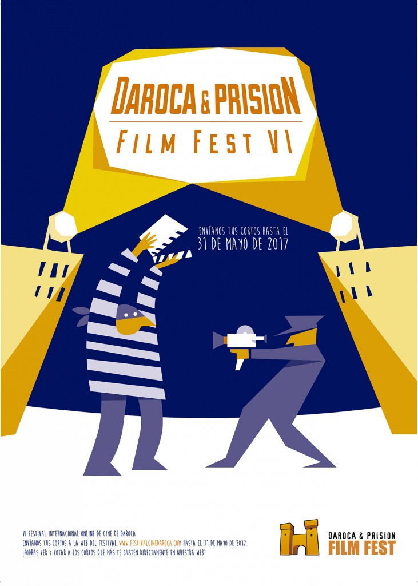
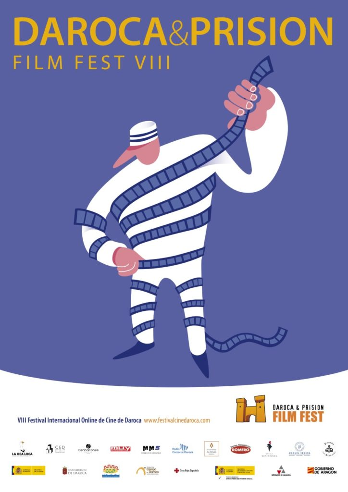

# 监狱主办的达罗卡电影节

举办时间：2023年11月18日—19日举办届数：第12届官网：https://filmmakers.festhome.com/

达罗卡监狱电影节位于西班牙历史悠久的小镇达罗卡，是最有特色的电影节之一，它由达罗卡监狱中心主办。旨在“在监狱的墙上凿一个自由与希望的洞。”（"open a hole of freedom and hope in the walls of our prisons"）电影节评委除了专业电影人和学者，还包括达罗卡监狱电影小组的犯人。达罗卡监狱于2005年推出电影制作计划，培训并组织犯人拍摄电影。2012年该监狱举办电影节，并在全球征片，至今，达罗卡电影节已经连续举办了11届。2023年达罗卡监狱电影节报名截止时间：2023年3月31日无报名费

须提供西班牙字幕时长在30分钟内类型不限，主题不限（更欢迎监狱主题）展映主形式：在线电影节设特别主题单元：监狱影片将在9月1日至9月30日在电影节官网展示，并接受观众票选最高奖项包括500欧元及奖杯

往届达罗卡电影节海报选：

