# 米尔班克监狱

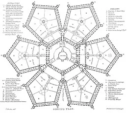

米尔班克监狱平面图

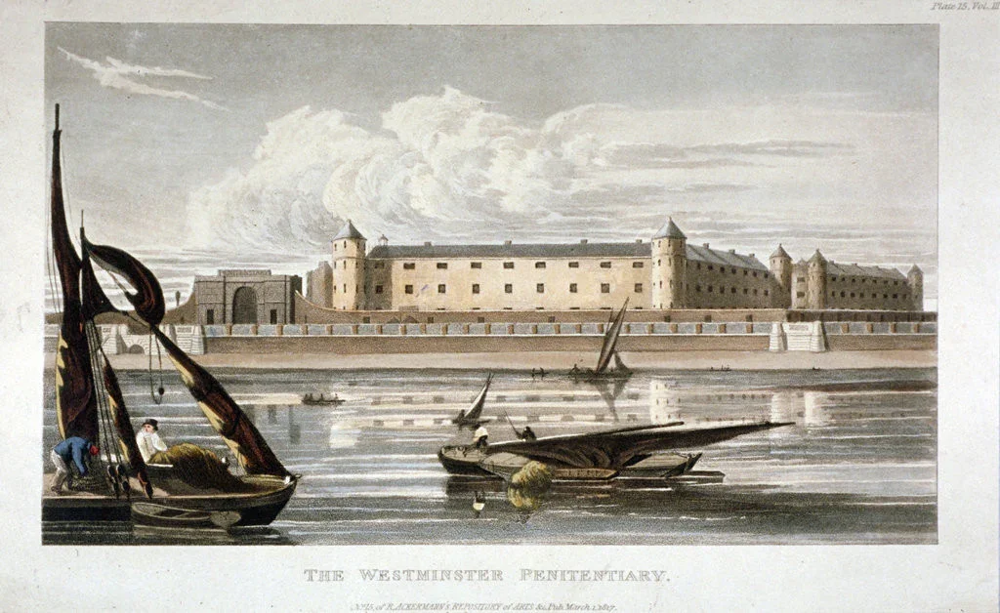

米尔班克监狱，全称米尔班克国家感化院（Millbank National Penitentiary），原址位于伦敦晤士河畔威斯敏斯特区米尔班克路，它不仅是英国第一座感化院，也世界监狱走向现代化的第一个里程碑式实验。从1816年运营至1890年，1892年起逐步拆除，原址目前为泰特英国美术馆等。

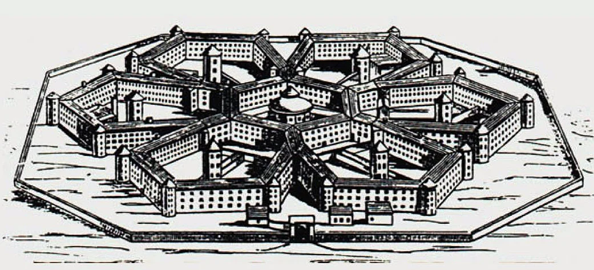

18世纪中期，工业革命兴起，犯罪率飙升，当时英国还没有完善的监狱系统，以身体刑为主。所谓监狱，大多由城堡、塔楼、地牢等充当临时拘留所，如伦敦塔、牛津城堡、兰开斯特城堡。其管理混乱，条件恶劣，疾病滋生。

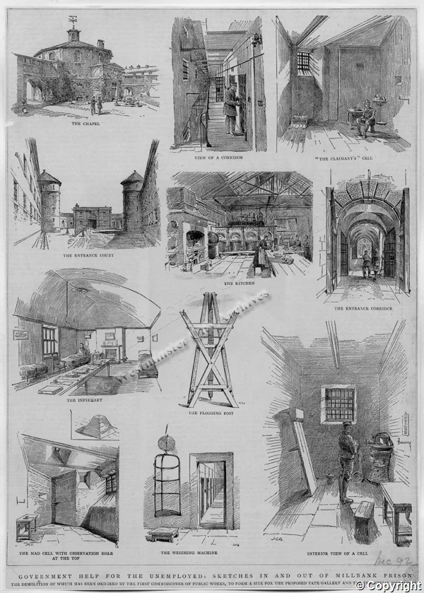

1777年，改革家约翰·霍华德发表了《英国及威尔士监狱状况》，呼吁监狱改革，建立行之有效的改造系统，改善卫生条件和引入感化理念。他与威廉·布莱克斯通、本杰明·富兰克林等人促成了1779年《监狱法》（Penitentiary Act）的出台，米尔班克感化院正是这一法案的产物。

1799年，英国王室委托同样是改革家的杰里米·边沁以1.2万英镑从索尔兹伯里侯爵手中购得米尔班克的土地，用于建造边沁构想的全景敞视监狱（Panopticon）作为全新的英国国家监狱。由于种种原因，边沁的方案不幸于1812年搁浅，他黯然离场。之后，由43家参赛者投标角逐该项目，桑赫斯特皇家军事学院的设计师威廉·威廉姆斯（William Williams）胜出，他设计了精妙的六边形辐射监狱。同年，建筑师托马斯·哈德威克（Thomas Hardwick）在对方案进行调整后开始施工建造。18个月后，地基出现了沉降，已经建到六英尺高的外墙开始倾斜并开裂。至此已经花费了26000英镑，哈德威克被开除。约翰·哈维（后赴美建了东州监狱）接手了该工程。1815年，哈维被解职，由罗伯特·斯米尔克（后设计大英博物馆）接替，后者于1821年完成了该项目。

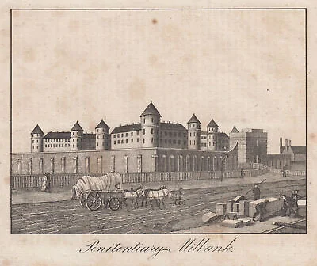

米尔班克监狱的设计独具匠心：中间是六边形的中央庭院，环绕中央庭院的是六座五边形建筑，每座五边形有三层牢房和五个小庭院，庭院中央设有瞭望塔。围墙为八边形，高约5米，配护城河。整体占地超过16英亩，宛如一座“美轮美奂”的堡垒。每一座五边形建筑的三个外角都有一座马特洛式（Martello-like）圆塔，高出主体建筑一层，既是瞭望点，又容纳楼梯和卫生设施。整个监狱有约1000间牢房，每间约4米×2.5米，带小窗、木床、吊床、木凳、洗盆和书籍（包括《圣经》、祈祷书和算术书）。设计为单独监禁，意图通过宗教和教育感化囚犯。中央建筑内设一教堂，用于宗教服务和教育。劳动区包括纺织车间、制鞋房和洗衣房。

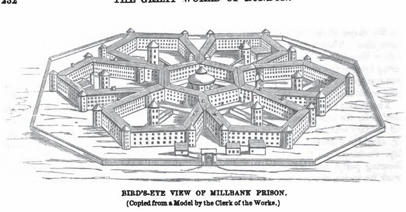

米尔班克监狱与威斯敏斯特钟相距不远，威斯敏斯特钟每十五分钟它会响一次，囚犯在牢房能清楚地听到。曾有囚犯在日记里说，每天只能听到这一种声音让自己倍感孤独：“日夜不息，声声入耳...如怪兽之声，唱着时间的挽歌。”

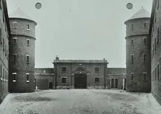

然而，这座宏伟的建筑从一开始就问题重重。1816年6月，第一批女囚入住时，建筑仍在施工中：墙体吱吱作响，几扇窗户无端碎裂。于是，斯米尔克与工程师约翰·雷尼又拆除了三座塔楼并用混凝土“筏式基础”加固地基——这是自罗马帝国以来英国首次使用混凝土基础。大大增加了建筑成本，最终总共花了50万英镑，是原预算的两倍还多。

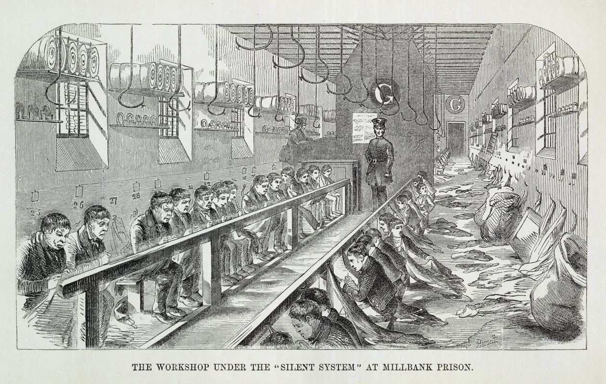

1816年6月26日首批女囚入住后，1817年1月男囚进入。到1822年底，这里关押了452名男囚和326名女囚。米尔班克监狱的初衷是通过单独监禁（18个月）和劳动（如纺织、制鞋）改造囚犯，替代流放澳大利亚的刑罚。然而，现实打败了理想。

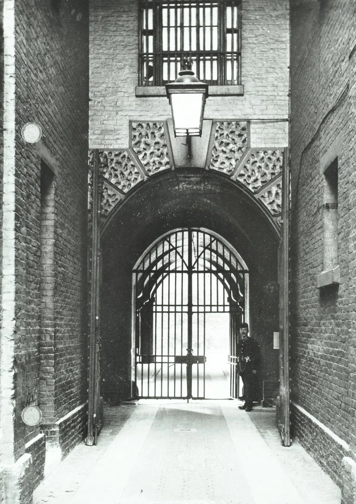

首先，单独监禁让人难以承受，导致精神疾病频发，1823年，监狱不得不考虑采用混合模式：初期隔离+后期集体劳动。

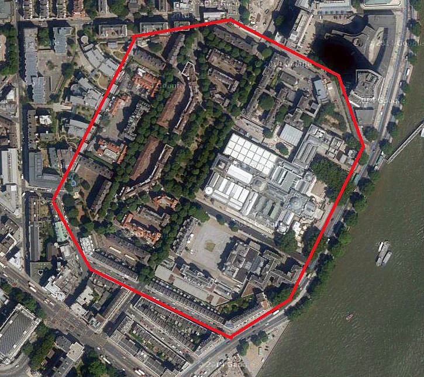

其次，疾病肆虐，囚犯饮食匮乏（面包、稀粥为主），米尔班克的潮湿环境滋生疾病，加之卫生条件差，痢疾、坏血病和抑郁症频发。1822-1823年的疫情迫使监狱暂时关闭，女囚获释，男囚转移至伍尔维奇（Woolwich）的监狱船（hulk）。1837年的疫情更是致死数十人。

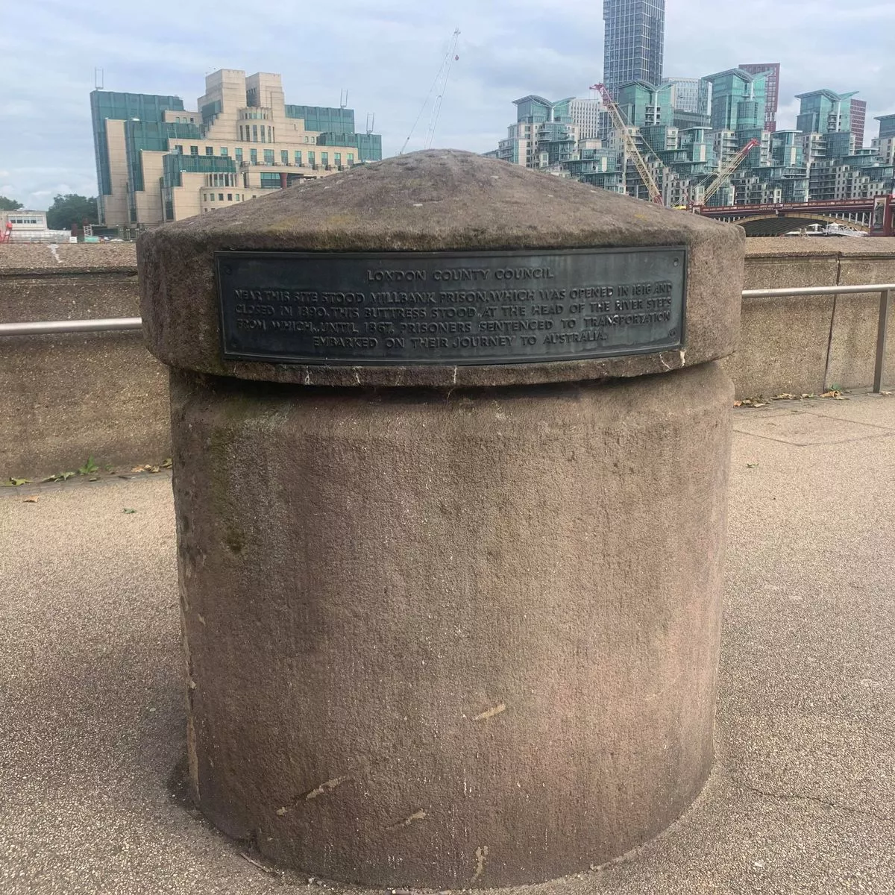

第三，管理混乱，成本高企。米尔班克巧妙的走廊有如迷宫，连狱卒都会迷路；囚犯利用通风系统传声，隔墙交流，违背了隔离初衷；年运营成本高达1.6万英镑，难以承受。

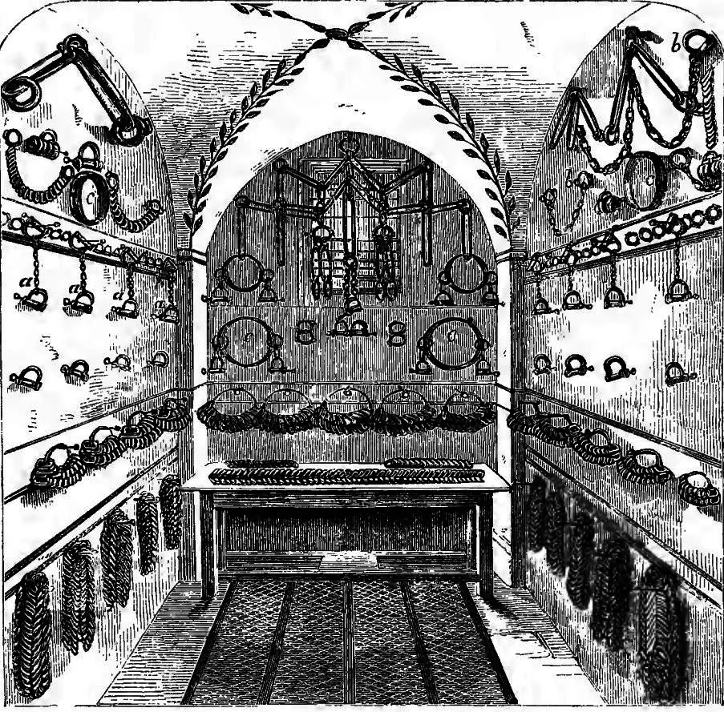

1842年，本顿维尔监狱启用，1843年米尔班克监狱被降级为普通监狱和流放前拘留所。之后，每年有数百名囚犯在此等待3个月，之后被流放至遥远的澳大利亚。1853年英国议会废除流放政策，大规模流放结束，米尔班克转型为地方监狱和军事监狱，直至1886年政府决定逐步关停米尔班克，1890年正式关闭，囚犯转移至本顿维尔等监狱。

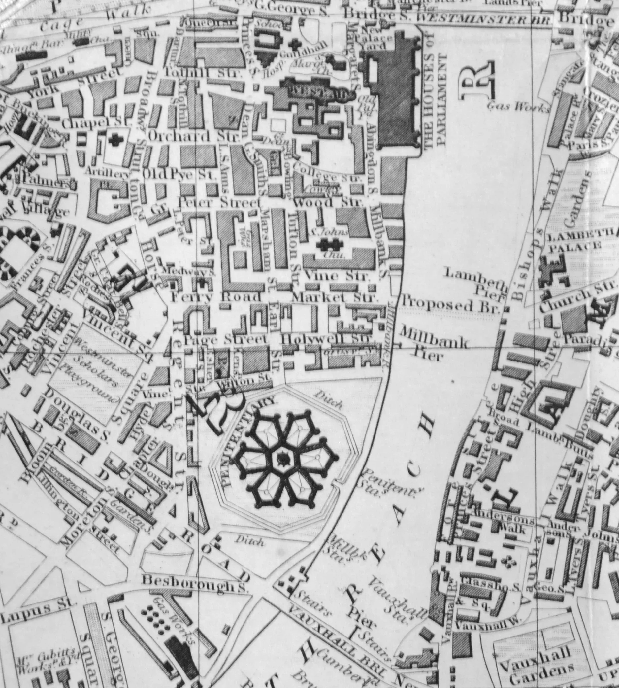

1892年起，米尔班克监狱逐步拆除，至1903年完成。原址被重新开发建造为泰特英国美术馆和其他设施。泰特英国美术馆（1897年启用）：占据核心区域，花园中保留原监狱护城河遗迹。河边有一座低矮粗壮护柱，上铭刻：“附近曾有米尔班克监狱，该监狱于1816年启用，1890年关闭。这个护柱在河阶的顶端，直到1867年，被判处流放的囚犯都是从这里登船前往澳大利亚。（Near this site stood Millbank Prison which was opened in 1816 and closed in 1890. This buttress stood at the head of the river steps from which, until 1867, prisoners sentenced to transportation embarked on their journey to Australia.）
