# 旋转监狱——镀金时代的机械囚禁史

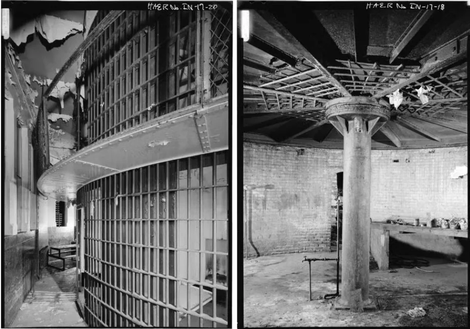

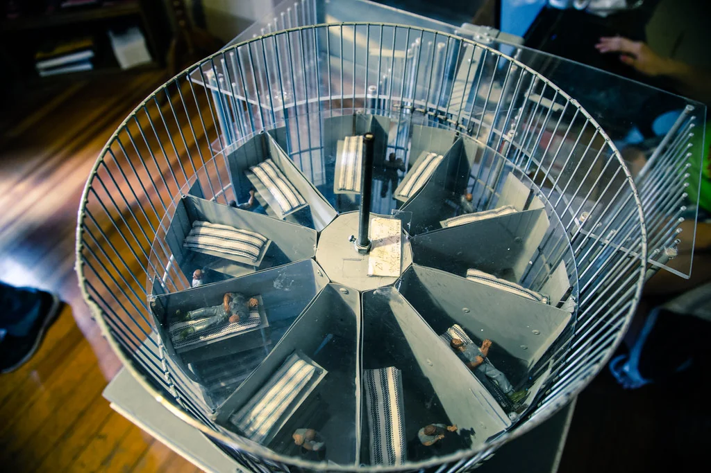

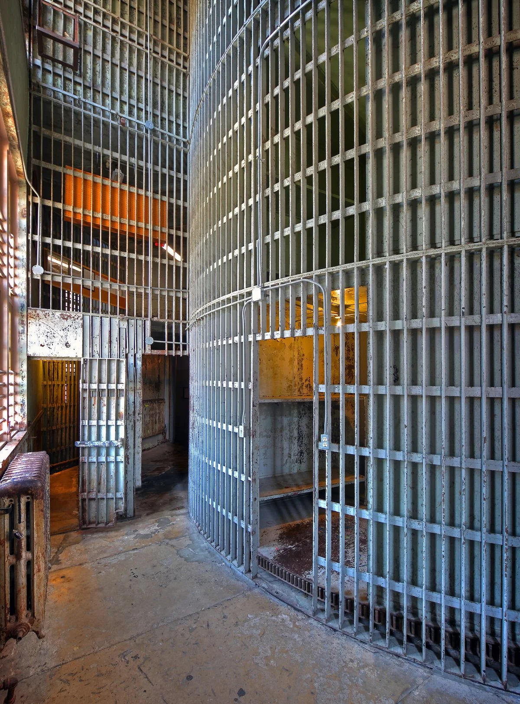

当监狱成为一台机器

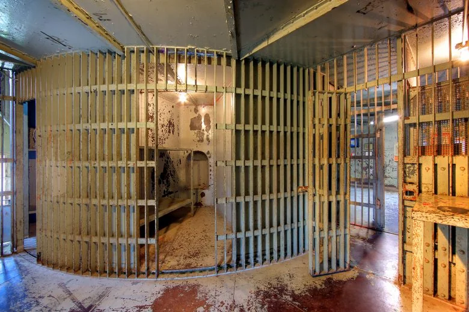

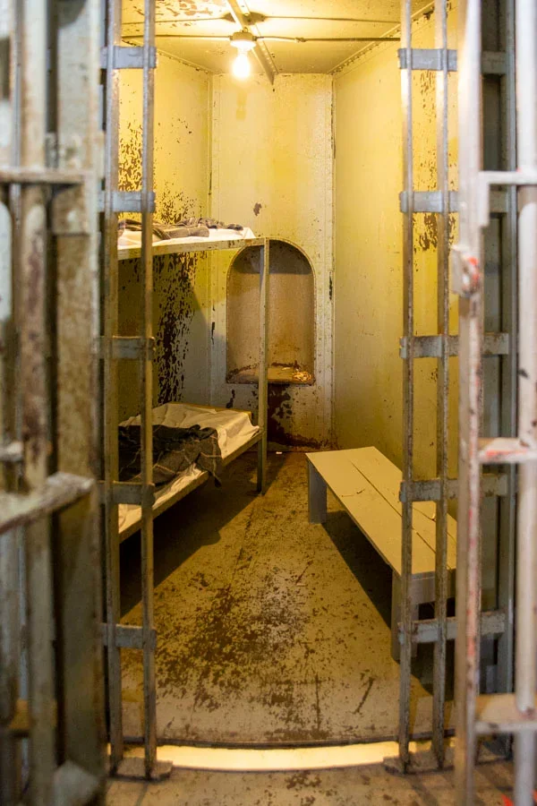

1881年，美国印第安纳波利斯（Indianapolis, Indiana）的建筑师威廉·布朗（William H. Brown）和铸铁厂老板本杰明·霍尔（Benjamin F. Haugh）脑洞大开，发明了他们认为既安全性又能提高管理效率的监狱——旋转监狱（rotary jail）。“一种无需狱警与囚犯直接接触即可控制的监狱”。该监狱以带可旋转轴承的圆柱形监区为核心，圆柱被分割为若干个楔形牢房，可叠加数层（如下图所示），牢房的外面有一圈铁笼，铁笼只有一个门，只有当牢房旋转至与笼门对齐时，该牢房的犯人才能出来。而这一切，只需要一个狱警转动曲柄就能实现。狂喜之下，他们为自己的发明申请了专利并积极进行推广。

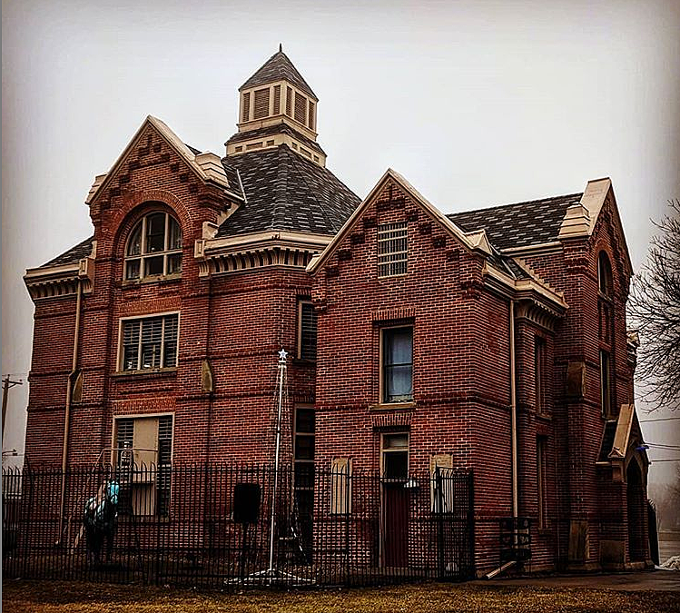

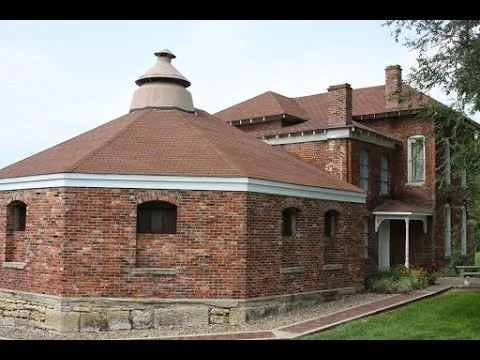

维多利亚牢笼

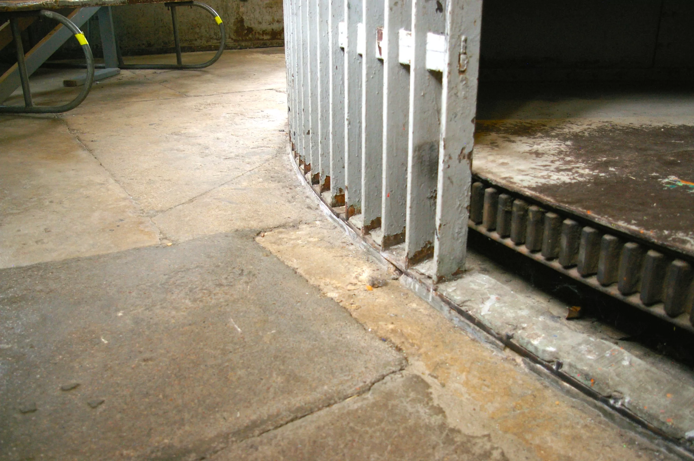

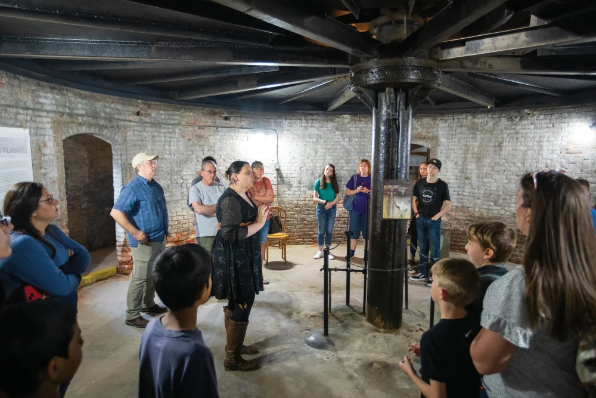

1882年6月，首座旋转监狱——蒙哥马利县旋转监狱 （Montgomery County Rotary Jail）在印第安纳州克劳福兹维尔（Crawfordsville, Indiana）启用，由霍夫的铁厂建造，有两层16间牢房，旋转牢房重约27吨，直径约6米，耗资3万美元（含旁边的警长住宅）。

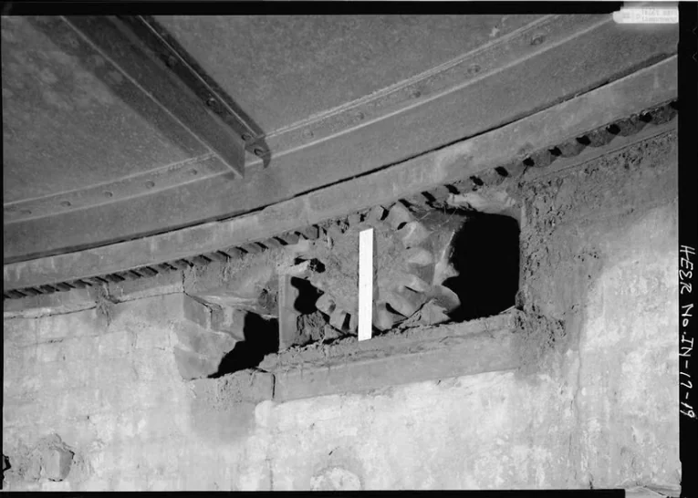

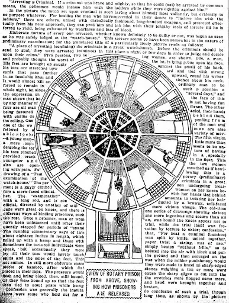

蒙哥马利县旋转监狱外观

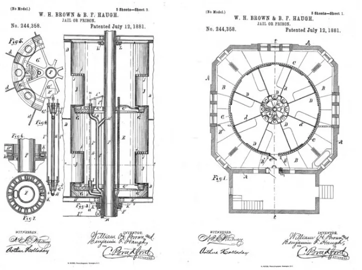

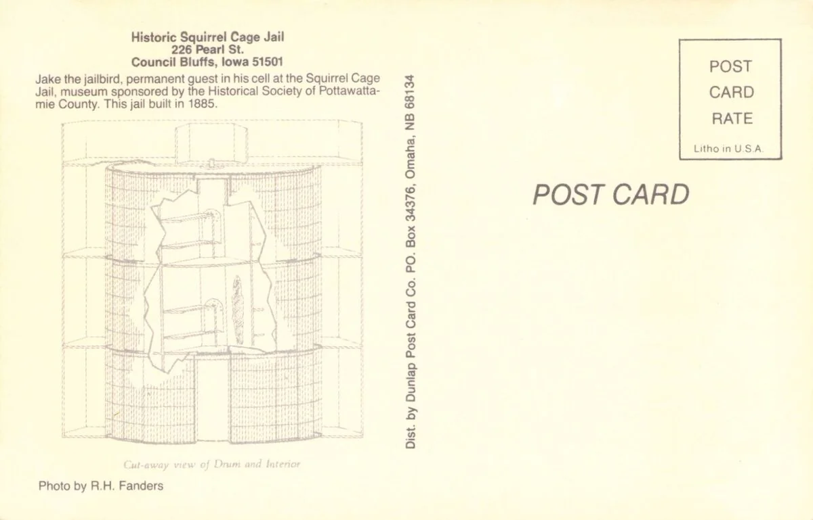

1885年，通过发行债券募足工程所需资金后，爱荷华州波塔瓦塔米县（Pottawattamie County ）耗时五个月建成了一座古典与未来糅合的监狱：40多吨重的三层旋转铁笼暗藏于维多利亚风格的红砖墙内。罗马式拱窗、石灰石雕饰与精致的砖砌，让这座监狱宛若豪宅，成为当时世界上最大的旋转监狱（康瑟尔·布拉夫斯监狱）。

康瑟尔·布拉夫斯监狱（Council Bluffs jail）1889年密苏里州加勒廷戴维斯县（Gallatin）的单层旋转监狱

1882-1889年间，美国中西部共建造了6至18座旋转监狱（具体数量因记录不全而存疑），分布在印第安纳州、爱荷华州、密苏里州等地。因牢房像旋转轮中的笼子，它们被称为“松鼠笼监狱”（Squirrel Cage Jail）。

机械乌托邦的残酷现实

然而，问题很快显现：牢房通风和采光都不够，还有火灾疏散隐忧。1904年，密苏里州玛丽维尔监狱的一名囚犯的头被旋转的铁笼夹伤，成为第一家放弃旋转模式的监狱。1930年代，大多数铁笼被焊死或弃用。1969年，康瑟尔·布拉夫斯监狱将囚犯送走；1973年，服役91年，关押过数千人后，蒙哥马利县监狱永久关闭，1975年，蒙哥马利县文化基金会将其改造为博物馆，同年，加勒廷监狱关闭。

从机械奇观到历史遗存

70年代末尾，所有旋转监狱被关闭，堪萨斯州威奇托旋转监狱的笼子被送到本地动物园再就业。之后，仅剩的三所旋转监狱陆续转为博物馆。1996年，蒙哥马利县恢复了该监狱铁笼的旋转，供游客参观。
