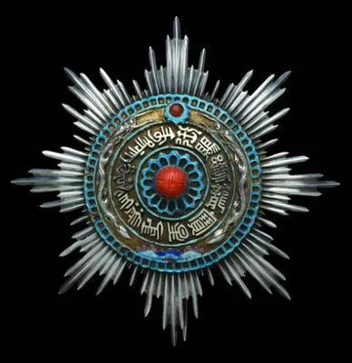
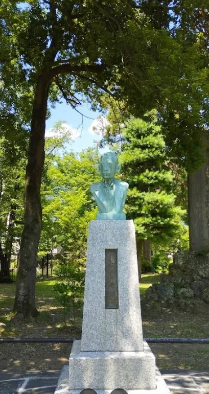
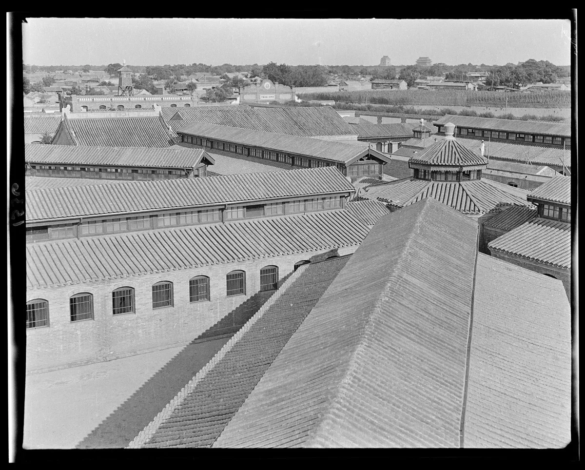
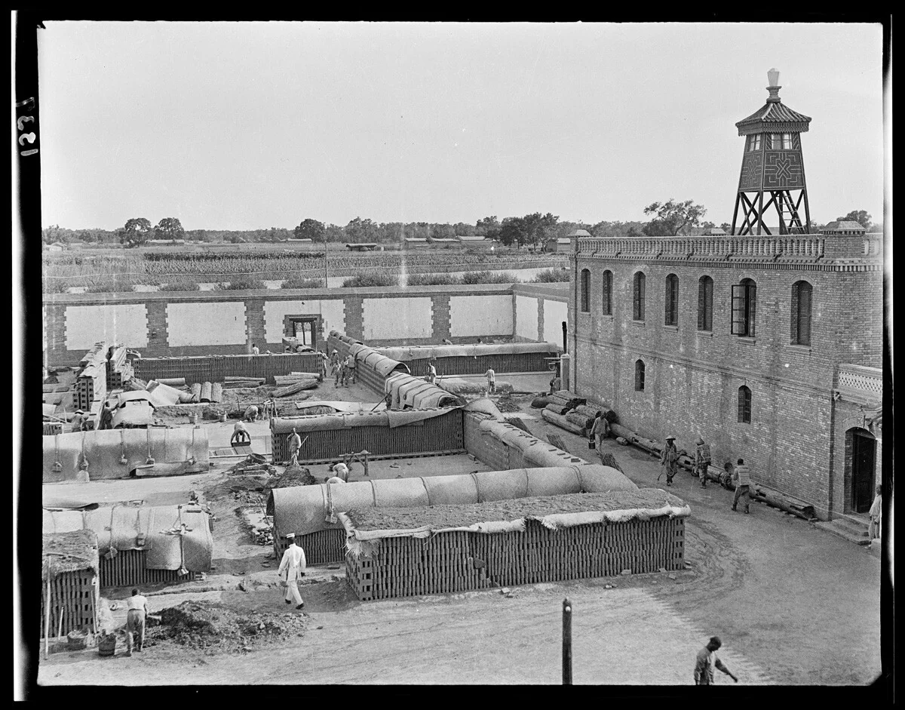

# 小河滋次郎与清末监狱改良

资料来源：《走近文明的橱窗：清末官绅对日监狱考察研究》，作者：孔颖

宣统二年(1910年)六月，清廷准法部右侍郎沈家本奏，第二次授予日本人小河滋次郎二等第二宝星（授予外国人的勋章）。

小河滋次郎是谁？

日本上田市城迹公园内的小河滋次郎像

小河滋次郎(1863-1925年)，日本近代监狱学权威。生于长野县上田市，在东京专门学校毕业后到德国留学，1886年返日后在内务省警保局工作，历任各地典狱，其后转到司法省任监狱事务官，1891年任监狱局狱务课课长。1895年，第五次万国监狱会议在巴黎召开，小河任委员列席。该会每五年举行一次，小河连续出席至第八届，其间周游欧洲及美国，考察各国监狱情况。明治三十一年(1898年)起，被东京帝国大学法科大学聘任监狱学讲座，明治三十九年(1906年)获东京帝国大学法律博士学衔，明治四十年(1907年)参与起草日本监狱法，并积极提倡废除死刑。可谓日本近代监狱学之父。

小河滋次郎为何得到清廷嘉奖？

清末的中国亟需狱政改革，而其最快捷之方法则是通过学习近邻日本，移植以德国为主的大陆法系监狱学传统。移植的主要途径有四种:留学、考察、翻译日本监狱学论著、聘请日本顾问。

早在1907年，小河滋次郎就获得大清二等第二宝星，当时清廷为感谢他作为日本监狱学泰斗，对大清派去日本的数百名留学生竭诚相待、倾心传授。小河曾为其中国学生王元增的著作《日本监狱实务》撰写序言:“清国留学生，与余有师弟之谊者，前后至数百人之多。”教授监狱学规模较大的教育机构有:法政大学法政速成科、东斌学堂、东京警监学校。其中，东京警监学校为袁世凯委托日本警视厅开办的专为中国培养警察及监狱官的学校；法政大学法政速成科是日本法政大学接纳了中国留学生的办学提议，在中日双方政府的支持下所开设的。留学期间，小河还积极带领留学生去日本的监狱进行参观考察。

据统计，清末翻译的近代监狱学著作共计35种。除了《比利时监狱则》和美国纽约监狱协会所编的《纽约监狱协会报告书》之外，其余33种均为日本监狱学书籍的中译本。而33种译著中，小河的著述达18种。与位列第二的佐藤信安（2种）比，可谓遥遥领先。

1907年，沈家本派员延请小河滋次郎到清国任狱务顾问并教授监狱学。1908年5月13日（光绪三十四年四月戊辰）小河携眷于抵达北京，任狱务顾问，并自次月起，兼任附设于法律学堂之监狱学专修科教职（月薪800银元，较之中国同僚的薪俸，约高5-10倍；较之日本同行也高出3-5倍。从中看得出修律大臣沈家本对狱制改良的重视与期待。）

作为晚清聘请的日本四大法学顾问之一，小河滋次郎在担当大清狱务顾问的两年间，任教京师法律学堂监狱学专科，培育监狱管理人才，以东京巢鸭监狱为样本设计京师模范监狱，制定《大清监狱律草案》，并留下一份具有高度史料价值的备忘录——《清国狱制》，记录了清末监狱改良的实况。

## 一、培育监狱管理人才

沈家本在光绪三十三年(1907年)四月十一日《奏请实行改良监狱折》中呈请注意四事之一，即养成监狱官吏，建议于各省法律学堂或新式监狱内附设监狱学堂，采用特别任用法，并改定狱官品级。七月法部议复:“京师法律学堂应设有监狱学一科，请责成该学堂监督认真办理。并饬下学部，于京外法政学堂一律增设监狱学专科，选法政高等学生派入专门研究，年半毕业，考给文凭，专备臣部及各省提法司谘议改良及调查管守之需，以收速成之效。其已设新监狱等处，并应附设监狱学堂，由该督抚酌量妥办。”八月学部通咨各省法政学堂增设监狱学专科。十一月沈家本奏请，在京师法律学堂内附设监狱学专修科，由法部、大理院选员入学，毕业后专备京内外各署管理监狱之用;并请将法律馆存款全数发充专修科经费。该奏案获准后，于翌年五月正式实施，担任专修科的教员正是小河滋次郎。

小河滋次郎对该学堂的性质、课程、日本教习做过简单介绍:“法律学堂设立于光绪三十二年(明治四十年，1906年)，独立不属任何部门。予即执教鞭于此，冈田、志田、松冈、岩井、中村等诸君亦居此。此所现有六百名左右生徒，分一年半之速成班与三年教育之完全班，已前后毕业两届学生。”

从上海图书馆保存的当时学员的课堂笔记，可以一窥小河的授课略貌。该课程内容分两部分：一为《监狱学》，比照冈田朝太郎制定的《大清刑律草案》做阐发；一为小河起草的《大清监狱则草案》，根据清朝实情，比照日本监狱法，加以述传授。关于业去向，小河做过说明：“予所授学生，非同于常，乃专为接受予之教育而特设之监狱班，从各地募来之特殊学生。此班形式上为法部即司法省委托法律学堂所办，实际全由法律学堂经营，与法部几无关涉。学生计约百二十人，多在法部官吏或大理院等其他裁判所在籍人员中选拔，毕业后应作为监狱官担当实务要职。科目除监狱学外，尚有与监狱相关学科，即刑法、刑事诉讼法、行政法、统计学精神病学等，由各科专家任教。学生之教育程度、年龄等非常不同，有年长之高级官吏，不乏阅历学识，亦有年轻不具备完全学历者。然皆兴味盎然，热心学习，故数度测试，一般均能成绩优秀。予自不必言，学校当局者亦甚满意。”

对照“法部奏酌拟监狱专修科毕业生分别委用办法折”可以印证，学生确为法部大理院选拔而来。光绪三十四年(1906年)五月开学，至宣统二年(1910年)五月毕业。120名学员，除考试不合格者，最优等五名、优等14名、中等24名、下等26名，共计69名学生获毕业文凭，合格率为57.5%，可见考核严格。合格者专备京内外管理监狱各署任用。

## 二、设计京师模范监狱

1907年，法部新设典狱司，专掌狱政，由留学日本警监学校的田叶任郎中。1908年5月，法部建议兴建模范监狱。1909年3月31日，法部奏报京师模范监狱的选址和详细的建造计划。监狱建筑的图式设计由小河担当完成。关于京师模范监狱的格局、建造、沿革等，情况如下:

京师模范监狱1910年开始建造，日本监狱管理专家小河滋次郎博士规划，祥盛、文新、柴恒源等十家木厂承包工程，分为前、中、后三区。前区正中为大门，座西向东，门内左为物品陈列所，右为看守教练所。前区之北为病监，南为十字形平面的幼年监房。中区为中央办公楼。后区为正式监房，分南、北两组，平面均为扇形，每组五道监弄，集中到圆形大厅。厅上有瞭望楼，厅内设教诲堂、处罚室、看守室等监舍尽端为三座工场。1911年建成，1914年增建女监，改称“京师第一监狱”1916-1918年增建北新监。至1922年，共占地约200亩，房屋603间。建筑均为砖木结构灰砖清水墙，铁皮屋顶。有砖拱、壁柱等装饰，是清末流行的仿洋形式。但由于建造时只有大约的规划而缺乏详细施工设计图，所以不但造型比例似是而非，结构上也有下少错误，以致出现木屋架下弦垂弯、砖平拱多数开裂的现象。

图片

小河的备忘录中记有他对此事的看法，透露了北京模范监狱存在的深层隐患。

北京修筑模范监狱。由予设计，今已依案动工，估计两年后落成总之，新监狱在形状上可以反映予之设计，但在内容上未必合乎予之设想。予所设计者形式而已，至于内容构造则全无干系，由清国人包办，且既无建筑方面的专业技师，亦无通晓监狱制度的专家参与，全盘由外行人经营监管，结果可想而知。之所以称作模范监狱，乃考虑依此为将来改良全部监狱之范本，理想是将来新筑都则此法式。

图片

据民国时期北京监狱典狱长王元增的报告，刚接手时的京师模范监狱在地势监房等方面均不合格。建造监狱，选择地形，当属首要。然而，京师模范监狱恰恰地处京城最低处，“地甚卑湿，四周开凿大沟，而沟水无排泄，积久变成绿色，时逢大雨，护城河之水横流而人，沟为之溢，兼以附近一带，苇荡相接，浊水停留，毒气蒸发，病者必多”。监房质量也不过关:“监房建筑不固，一遇大雨，到处渗漏，基址较事务室更低一尺，故潮湿尤甚，霉腐之气扑鼻难闻:虽开放窗户，而房内仍不见干燥，泥土亦不坚硬，步履稍重，砖即下陷。窗坎不用木石，以铁栅直插墙内，虽障以铁丝网，包以铅皮，拆毁仍易;铁栅之外附设木框，装置玻璃窗，不但不便启闭，且有雨水滴人;房门自外推人，窒碍尤多;杂居房有长至十五密达半者，而深仅二密达有余，向门孔窥视，则房内左右均不能见；空气光线除夜间独居房及八人杂居房外，均不足用。”小河的预见不可不谓高明。

图片

图片

除北京模范监狱外，小河受顺天府尹王乃征之聘，为顺天府设计新式监狱。1910年王乃征升任湖北布政使离开北京，小河对失去一热心经营狱政的实权人物深表惋惜:

今之中国正热心专攻经营之狱政及广泛意义上社会救济保护制度之改良……北京地方长官即顺天府尹王乃征等，最为热心尽力。王乃征提出在顺天府建造一新式监狱，嘱予设计，全部采用予之方案，本应着手建筑，可惜在予回国之际，王君荣升湖北布政使离开北京。建设未必中止，所憾者，失此有意狱制改良者也。

此外，小河还指导了山东省济南监狱建筑设计。

## 三、编纂大清监狱律草案

小河赴任中国狱务顾问之前年，即1907年，曾参加《日本监狱法》的制定，该法于明治四十一年(1908年)三月二十八日以“法律二八号”公布，故可以设想小河参照此法起草了《大清监狱律》。该律完稿后上送审查，于1910年正式颁布。小河当时写道:“予之任务，除教导学生外，尚有起草清国监狱制度和设计监狱改建之事。予所立案之监狱制度，一旦递交法律馆(相当于法典调查会)，通过审查后，即于本年度(1910年)奏报。审查的结果，可能多少会有些许变更，但大体的主义、组织等方面，较予之立案不会有大变动。"

《大清监狱律草案》的告成可谓意义重大。宣统元年六月甲辰(1909年8月12日)，御史麦秩严上奏称:“各省的模范监狱及罪犯习艺所中，罪犯之分配、作工之选择、经费之调度等问题不少，盖因典狱官缺乏训练及不得不遵循旧章程所致。因此必须修改章程、彻底训练典狱官，始不失改良之宗旨，以行感化矫正之实。”道出了监狱改良之症结所在及情势之急迫。在宣统二年(1911年)十二月，宪政编察馆奏报的准备实施宪政的年度计划表中，监狱则的颁行及各省模范监狱的建设即作为保障新刑律实施的前提条件记录在列。

由小河起草《监狱律草案》，凡240条。现存《大清监狱律草案》有前后两个版本。前述京师法律学堂笔记中的监狱律在前，共241条；另标有宣统三年(1911年)五月字样，共240条，少了前161条。缺失原因不明，但此外总体相同，仅仅在措辞上，后者较前者更切意到位，就章节标题而言，第4章原“戒护”改为“管束”、第12章“领置”改“保管”、第13章“暂释”改“假释”。草案系小河总结1907年参与制定的《日本监狱法》的经验教训，并比照清朝实情，认真细致制定的。

小河起草的《大清监狱律草案》模仿《日本监狱法》的同时，也做了修改以适应中国国情。例如，未决监和已决监照理应单独建筑，但因经费问题，允许在同一处分开而建。有的条款理念甚至比日本还先进例如，在《大清监狱律》中规定犯人可携带1岁以下孩童，被告人则可携带3岁以下的孩童。而在日本不分犯人或被告人，只许携带1岁以下孩童。此外还采纳了当时世界最新条例，患精神病及传染病的患者，如无法在狱内接受适当治疗，可委托家人照料或移交医院治疗。

监狱改良以建筑为根本问题，而其时各处监狱，仍循旧为杂居制，《监狱律草案》系以分房拘禁为原则，法理事实不相符合，故小河草案当时未能实行。但在小河的指导下，作为监狱学教材，在京师法律学堂得到了研习和传播。且民国的监狱法及各监狱学校监狱法课程，均多以此项草案为蓝本。

辛亥革命后，中国分别于1913年、1928年和1946年颁布了新的监狱法。据日本法律学者岛田正郎研究，后来的监狱法和小河草拟的没有多大偏离。尤其是民国二年的《中华民国监狱规则》，由于建国仓促，无法从容地将法律一一审订，便将清末监狱法草案稍加删改，以司法部令二八四号径付公布。综上可知，清末小河着手起草的大清监狱则，由于清廷覆灭，不及公布实施，但人民国后，实际上仍被采用。因此使中国狱制能够近代化，小河的功绩不可灭。

## 四、撰写《清国狱制》

小河于宣统二年(1910年)返日后，辞去官职，在日本关西一带热心从事社会事业，大正十四年(1925年)去世。去世后，其藏书遗赠给家乡长野县小田市立图书馆。该图书馆将赠书列为《小河文库》保存，以资纪念。书目收于《上田市立图书馆藏书分类目录》(1931年印行)。书目中所列的书，只有刑事法及社会关系的书籍，但在末尾附记有未整理的行李一件。岛田正郎曾特意寻访，得知仅存行李的内容目录，其中一项《中国留学生及中国法制关系》，实物却不知去向，不禁痛惜。

值得庆幸的是，小河氏曾撰写《清国狱制》一文，于1910年投在《刑事法评林》第2卷第9、10号。作为清末监狱改良的直接参与人的小河，以外国专家顾问身份从客观角度记录清末狱制改良情形，可与中方史料比照互为补充，具有宝贵的一手史料价值。

清朝狱制一直受到西方各国强烈抨击，然而不少地方却得到小河的肯定评价。小河赴华之前曾想象清朝监狱必定状况恶劣，然而实地考察之后，却得出与此前想象不同的客观评价:“予赴任之初，先视察法部属下之南北旧监。监内仍用戒具，众多囚徒混同杂居，终日无所事事，予见此不由颦。然大体卫生尚可，病人较少，所有囚徒之健康基本保障，未见不堪牢狱之苦之惨状。”由此，他对改良中国的监狱很有信心:“今日清国监狱之状态自不待言，大体尚不免处于不完全状态。然就实际所见，未如所想之劣。……不完备中具有改良之可能性……予以为即令暂不改建监狱，就目前状况，颇有实施改良之余地。”

小河在试图以现代狱制思想改良清朝监狱的同时，还对中国传统法律中富有人情味的规定做了不乏同情的介绍。例如，出于不令断子绝孙的考虑，允许死刑犯单独见妻的优待政策:

囚徒见亲，“支那”有独特有趣之制度，即获死罪者可每月一次在所谓“下院”之相当宽敞之接见堂与妻相见，其时两人单独见面，官员离场，时间宽裕，一般三十分至一小时。其旨不令断子绝孙也，此恤死囚之恩，古已有之。文明各国之监狱制度中，仅限刑事被告人与律师之接见，官员不在场监督，而死囚与妻子之单独会面恐怕惟“支那”有之。

当时，明治日本由于实施修订刑法采用法定主义，造成在监犯人横溢的不良现象。于是，小河对于清朝监狱“在监者人数少的好现象”给予了充分肯定:

参观“支那”监狱，最感美慕者，其在监人数意外之少，妇人及未成年人尤其罕见。非一般犯罪者少也，妇人及未成年人亦然。犯罪检举若与日本同法，在监者当多数十倍。此况多少与法律及警察有关，但其要因乃实行便利主义之故，辅之以家族制度之力量，一定程度上控制了妇女、子弟、婢仆之犯罪。

此外，对于清朝监狱事实上采用不定刑期制，小河也毫不掩饰地表示赞赏:

当今不定刑期制度在文明各国之法制社会乃一大问题，是否采纳，意见百出，美国以外，均未见实行。此问题在本年十月美国华盛顿召开之万国监狱会议上作为附议事项进行研讨，但余以为通过无望。然而此不定刑期在今日“支那”正以“无期监禁”之名义实行。无期监禁与终身监禁完全不同，不定刑期即不定期限，拘禁犯人直至其表现出改悛情状。且判无期监禁者，常于三年后得释，一年获释者亦有不少此外，如遇狱囚得病且治疗困难之情形，可交亲属疗养。

小河在文末展望了清末狱制改良的前景:

予于“支那”狱制改良之前途颇为乐观。改良机运今已次第展开，此乃今日不争之实。“支那”人以仁道为为政之根本，天生有强烈之恻隐心，不过尚待发现尔。击之而鸣，且必有大反响。狱制改良若以仁道主义说明之，则“支那”人更易了解，继则更视为必要，则油然激发断然实行之勇气。现北京模范监狱建筑之议一出，广东商人一人便捐私财三万两，继则驻南洋领事提出捐筑费一万两，此等在日本皆难以想象.

1910年，中国应邀组团赴美参加第八次万国会议。可见清政府以明治日本为媒介推行的监狱改良成果开始得到西方国家的认可，而小河无疑是这背后最大的功臣之一。

