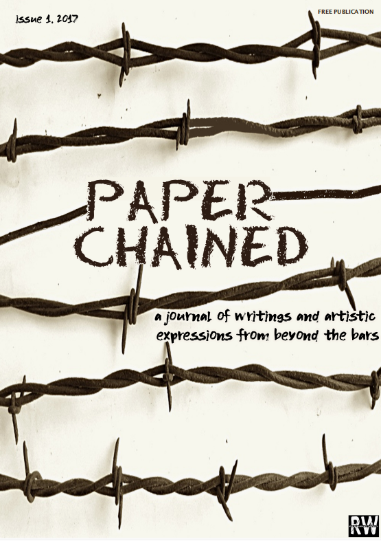
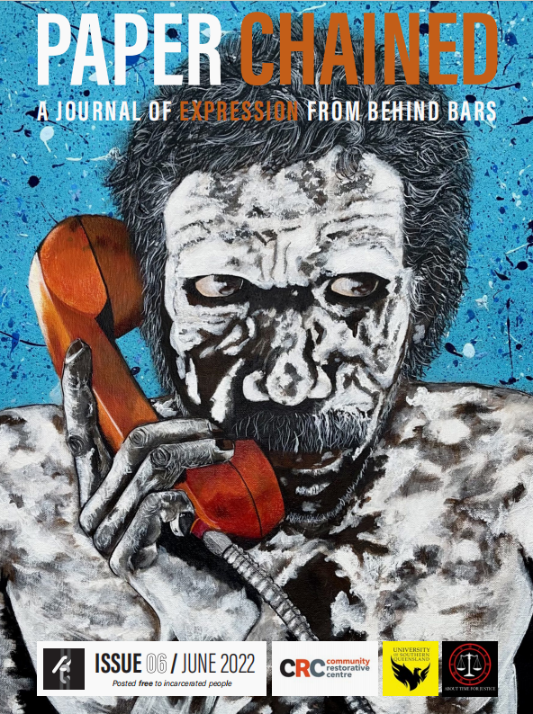
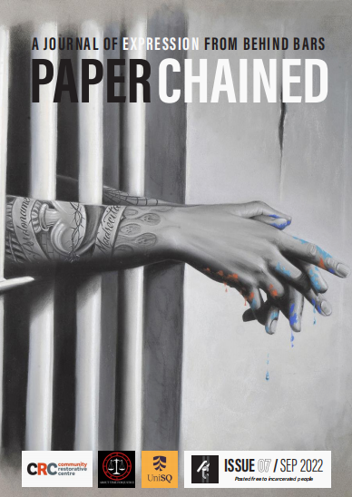
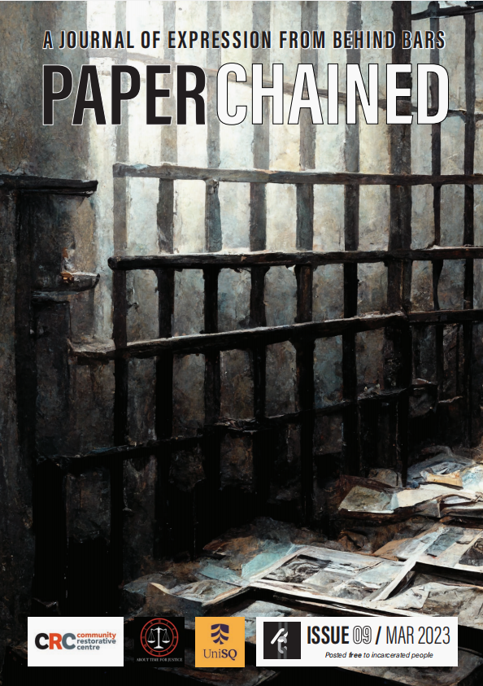
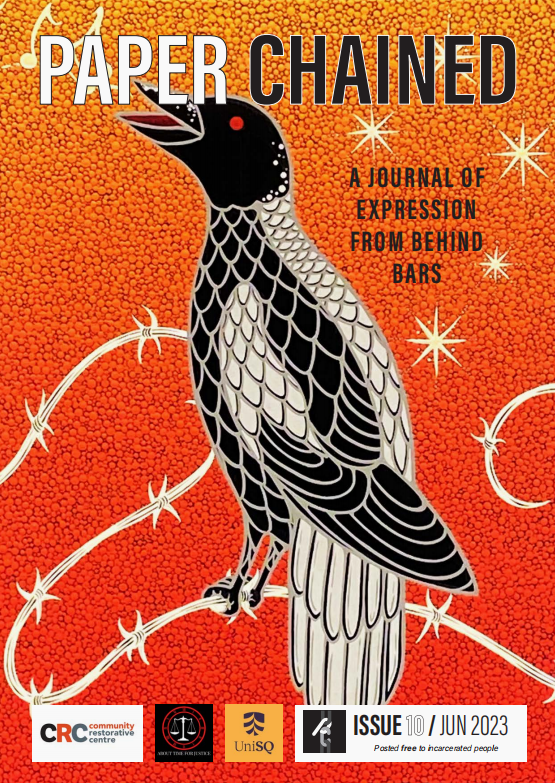
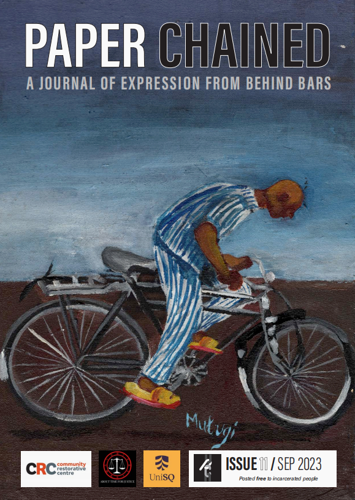
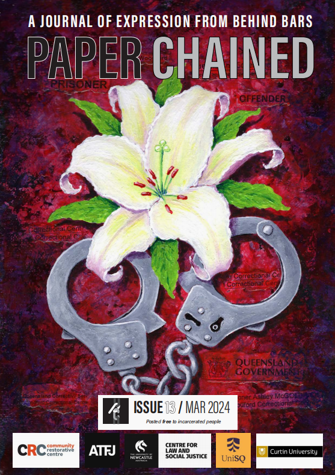

# 澳洲友刊《Paper Chained》

《Paper Chained》（链书？）是一份澳大利亚监狱艺术刊物，最初由一位在押犯的亲属创刊于2017年1月。目前发行20期，每期30-40页，有十来篇文章，刊登来自在押犯、前在押犯及其家属的投稿，以及其他与监禁相关的作品，内容包括诗歌、绘画、书籍&电影推荐、访谈、探访世界各地监狱、随笔等（有几期还有填字游戏）。

2021年，制作了三期之后，创办人无暇更新，由从新南威尔士州监狱获释的作家兼艺术家达米安·林南（Damien Linnane）接手。疫情期间，该杂志开始发行电子版，由此，从200份印刷版跃升为多达12,000次的点击量，一些监狱也自行印刷，供服刑人员翻阅。随后，林南得到悉尼的社区修复中心（CRC）资助。杂志趋于稳定，副标题确定为狱中人表达的期刊（A Journal Of Expreesion From Behind Bars），按季度出版。仍以印刷版和电子版两种形式发行，免费邮寄给各地的在押犯。

杂志官网为：www.paperchained.com，网站上可以免费下载所有过刊（也可以在公号内回复paper获取网盘链接）。

“我们的目标是为服刑人员提供一个建设性的、创造性的表达途径。我们相信，通过写作和艺术，我们可以帮助他们重返社会，改善他们的心理健康和福祉，让他们发出自己的声音，并帮助他们与面临类似挑战的人们建立联系。除了鼓励写作和艺术等有益的活动外，Paper Chained 也致力于为服刑人员提供有用的信息和娱乐资源。”--Paper Chained

2024年5月，该杂志在悉尼长湾惩教中心的Boom Gate画廊举办了Paper Chained International 囚犯艺术展。由新南威尔士州州长玛格丽特·比兹利（Margaret Beazley）揭幕。展出了来自8个国家（包括澳大利亚、肯尼亚、新西兰、美国和墨西哥）25所监狱的107件艺术作品。涵盖监狱生活场景、抽象画、风景画和城市景观画、自画像、刺绣以及美洲原住民和毛利人的绘画。

2025年3月，Paper Chained 在澳大利亚布里斯班举办Beyond the Bars 艺术展。
