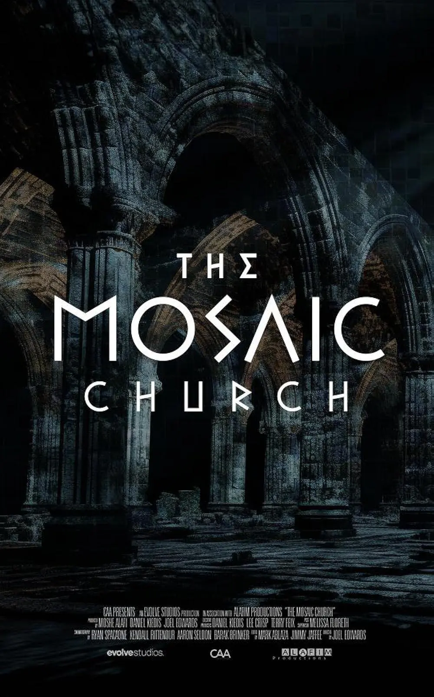
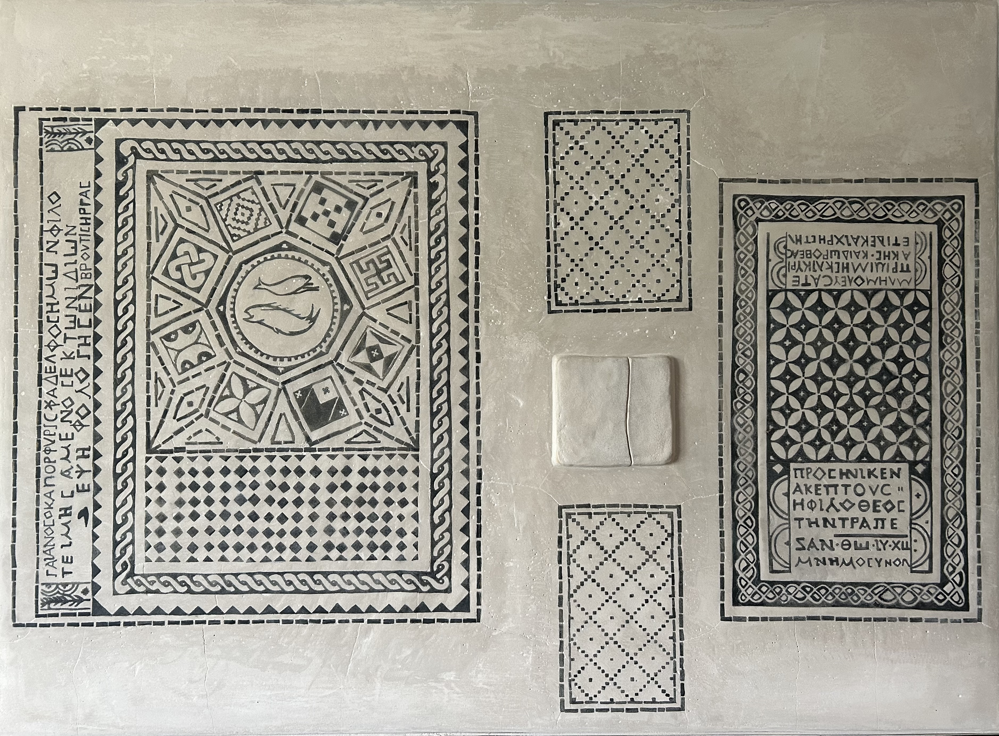
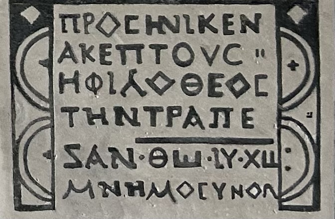
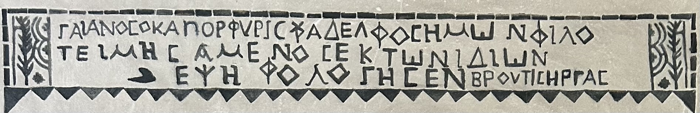
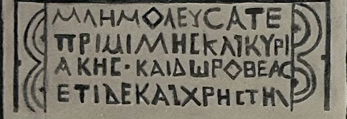
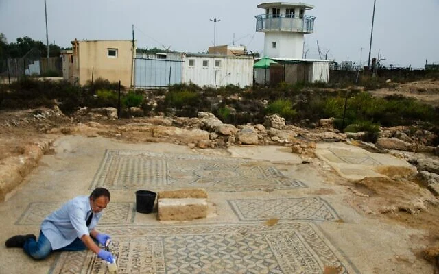

# 马赛克监狱

2004年，以色列卢德市附近的米吉多监狱（Megiddo Prison）因囚犯爆满而启动扩建工程。在动工前的例行文物排查中，工作人员意外发现了古老的马赛克地板。该地板面积约54平方米，由马赛克石块精细拼接而成，图案包括两条鱼（早期基督教象征）、几何花纹，以及三处用希腊文书写的铭文。

铭文内容如下：

“The god-loving Akeptous has offered the table to God Jesus Christ as a memorial.”

（敬神/爱神的阿克普图斯为纪念上帝耶稣基督而奉献了这张祭台/圣餐桌）

“Gaianus, also called Porphyrius, centurion, our brother, has made the mosaic at his own expense as an act of generosity.”“Brutius has carried out the work."

（加伊阿努斯，又名波菲里乌斯，百夫长，我们的弟兄，慷慨出资制作了这幅马赛克。由布鲁图斯施工完成）

“Remember Primilla and Cyriaca and Dorothea, and lastly, Chreste.”

（纪念普里米拉、茜里卡和多罗西亚，以及克里斯蒂）

考古学家推测，这块马赛克地板属于公元3世纪（约230年）的一座早期基督教祈祷厅（prayer hall）或小型礼拜场所。它被视为迄今已知最早的基督教崇拜场所遗迹之一，也是最早明确将耶稣称为“上帝”的实物铭文证据。这一发现填补了早期基督教从地下秘密崇拜向公开场所过渡的历史空白，证明即使在罗马帝国仍迫害基督教的时期，基督徒已在军营或乡村地区建立了小型崇拜空间。该马赛克因此被誉为“21世纪最重要的基督教考古发现之一”。可能由于戴克里先（Diocletian）迫害基督教的缘故，该地板于公元305年左右被小心掩埋并覆以土层，从而得以完整保存至今。发掘后，该马赛克得到精心保护、记录和覆盖。2024年，以色列考古部门将其移出，并在美国的华盛顿圣经博物馆展览。未来将在原址附近建立博物馆进行展示。

米吉多监狱建于20世纪中后期，毗邻著名的古代遗址米吉多（古称哈米吉多顿，即圣经《启示录》中预言的末日战场所在地）。
