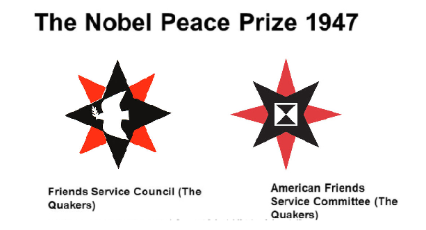
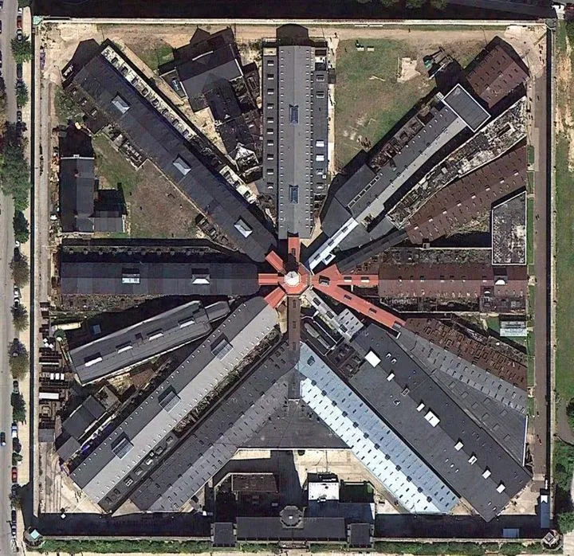
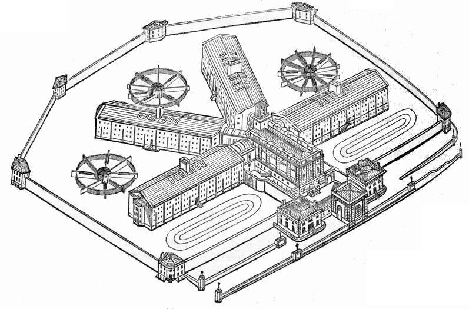
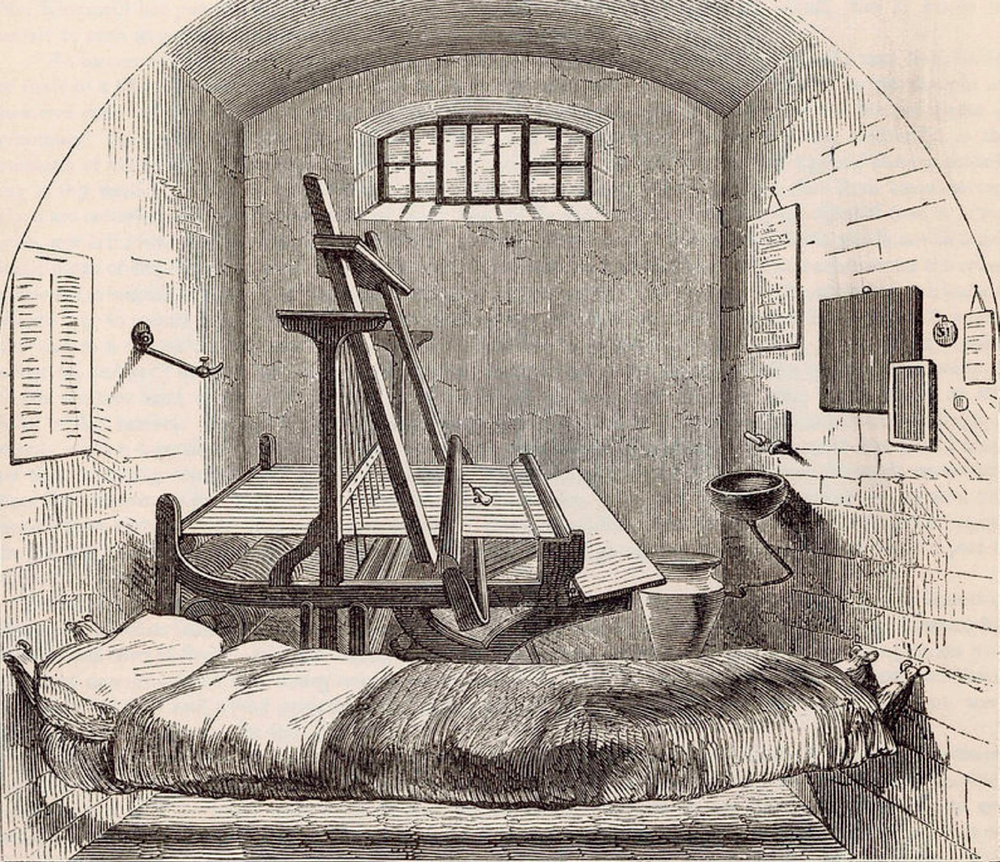
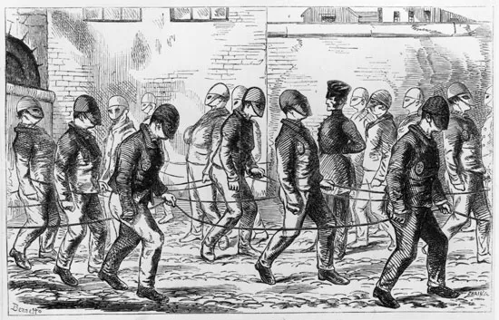
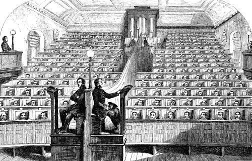
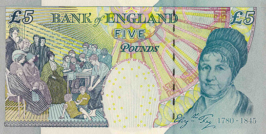

# 贵格会与18世纪监狱改革

贵格会（Quakers），正式名称为“公谊会”（Religious Society of Friends），是17世纪中期兴起于英国的基督教新教派别，由乔治·福克斯（George Fox）创立。其核心信仰是“内在之光”（Inner Light），强调个人与上帝之间的直接沟通，无需牧师或教条中介。敬拜形式通常是静默聚会，信徒在安静中等待神的启示。贵格会主张简朴、和平、正直、社区、平等和管理。

贵格会提出多项在当时颇为激进的主张：

## 1.拒绝向权贵“脱帽”及使用尊称：他们相信人人平等，无需对任何人行礼。

2.拒绝支付什一税：当时的英国法律要求所有人向国教（圣公会）缴纳收入的 10%作为税款。贵格会认为宗教是个人事务，国家不应强迫。

3.拒绝宣誓。当时的政府要求公民必须进行“效忠宣誓”。贵格会根据圣经中“不可起誓”的教导，拒绝在法庭或任何场合宣誓。他们认为：“我平时说的话就是真话，如果需要通过宣誓才说真话，岂不是说明平时在撒谎。”

## 4.拒绝服兵役。主张不参与任何战争，也不为战争纳税。

这些“离经叛道”的主张使贵格会成员被视为“国家公敌”或“疯子”，遭到排挤、逮捕甚至处死。创始人乔治·福克斯一生 8 次入狱，累计被关押超过 6 年。1650 年，他首次在德比受审，面对法官贝内特的审问，福克斯引用圣经，劝法官“在上帝的话语面前颤抖”（Tremble at the word of the Lord）。 贝内特觉得这个乡下人居然敢教训法官，反唇相讥，嘲笑福克斯及其追随者是“颤抖者”（Quakers）。

贵格会后来传播到世界各地，目前全球约有60万信徒。它也曾传入中国：民国时期，美国贵格会差会在江苏省南京、英国差会在重庆、成都等地开展工作。其中，英国贵格会是华西协合大学（华西医院前身）的创办方之一。

贵格会在教育、商业、科学等领域成就斐然，例如巴克莱银行（Barclays）由巴克莱家族创办，吉百利巧克力（Cadbury）由吉百利家族创办。著名成员包括美国总统理查德·尼克松和赫伯特·胡佛、民谣歌手琼·贝兹等。

贵格会积极推动社会正义，尤其在废奴运动中发挥关键作用。1688年，宾夕法尼亚的贵格会签署了人类历史上第一份正式反对奴隶制的抗议书。他们组织了“地下铁道”（Underground Railroad），冒生命危险帮助数千黑奴逃往北方。1787 年，英国废奴协会成立，其12名创办人中有9名为贵格会信徒。他们持续游说议会，最终促成1807年英国禁止奴隶贸易法案的通过。

1947年（贵格会成立300周年），诺贝尔奖委员会将该年的诺贝尔和平奖颁发给美国和英国的贵格会组织，以表彰他们在两次世界大战期间为战争受害者提供的无私援助。

历史学家房龙曾感慨：如果贵格主义能取代清教主义成为美洲大陆的主导，这个民族的历史暴力会少很多，也会更幸福。

贵格会在监狱改革中的关键作用

贵格会成员因自身的多次入狱经历，对监狱制度有深刻思考。他们将静默祈祷与忏悔的理念引入监狱改革，认为监狱不应是报复工具，而应是帮助罪人通过安静、隔离和祈祷面对罪恶、实现灵性转变与重生的场所。这种观念与启蒙运动的“人道化”高度契合，推动惩罚理念从“肉体折磨”转向“灵魂改造”。贵格会强调改造而非惩罚，禁止酷刑，注重劳动、教育、提供食物、衣物和宗教指导，将监狱视为“工作的场所”和“上帝的静室”。

在威廉·佩恩（William Penn）领导的宾夕法尼亚殖民地，这一理念得到最早实践。佩恩作为贵格会领袖，利用王室欠其父（皇家海军上将威廉·佩恩）的债务，于1681年从查理二世手中获得约45,000平方英里的美洲土地，建立宾夕法尼亚（Pennsylvania，意为“佩恩的林地”）。他基于贵格会原则设计政府框架，1682年底抵达后召集省议会，通过《大法典》（Great Law），其中核心改革包括：

废除死刑（除预谋杀人外）：贵格会认为只有上帝有权剥夺生命，死刑剥夺了悔改机会。

宗教自由、陪审团审判、婚姻自由、土地公平分配。

监狱改革：禁止酷刑、囚犯每日劳动并参加祈祷与学习，通过劳动和反思实现改造。监狱提供食物、衣物和宗教指导。

在贵格会介入前，监狱仅是临时关押等待判刑（绞刑、流放或羞辱）的地方，男女混住、疾病横行、暴力频发。贵格会引入“隔离能防止罪恶传染”的理念，让囚犯专注于内在之光，实现“道德新生”。这直接催生了19世纪著名的“单独系统”（separate system）。

1790年：费城贵格会团体与本杰明·拉什共同设计的费城胡桃街监狱（Walnut Street Jail）这是世界首座“感化院”（Penitentiary，源自“忏悔”一词），实行“隔离、静默、祈祷”模式。

1829 年，更为激进的东州感化院（Eastern State Penitentiary）落成。由贵格会成员主导设计，建筑模仿教堂拱顶，象征“上帝的注视”。管理上实行严格的单独监禁（除牧师探视），囚犯出门需带头罩，互相之间不允许说话。狱警都穿着软底鞋，避免发出声音。被称为“费城模式”（Philadelphia System），招致全球模仿。

英国的本顿维尔监狱（1842年）直接复制该模式。

本顿维尔监狱

本顿维尔监狱的囚室

戴面具出行的囚犯

本顿维尔监狱格子间教堂

一段时间的运营后，狱方发现，由于绝对的孤独和静默，很多犯人出现了精神问题，

后来，单独劳动改为集体劳作。虽然该模式有诸多缺陷，贵格会还是深刻影响了现代监狱制度，推动了监狱管理理念从惩罚向矫正的转变。

另一位值得一提的贵格会成员是英国改革家伊丽莎白·弗里（Elizabeth Fry，1780–1845），被誉为“监狱天使”，其头像还曾出现在2002至2016年版的5英镑纸币上。

右侧及左侧中坐者为弗里，她左边是一起探视的同工，右边为女犯人和她们的孩子。

1813年，弗里访问伦敦新门监狱（Newgate Prison），目睹了女囚与孩子挤在肮脏环境中，深受震撼。她自费为她们提供干净衣物、食物，教授女犯读书和缝纫，以便她们出狱后能够自食其力；为狱中儿童开办学校。1817年，她成立“改善女囚协会”，推动监狱改革。最终促成英国议会立法，通过了男女分监和聘用女看守的制度，有效改善了监狱环境，防止了针对女囚的性剥削。

