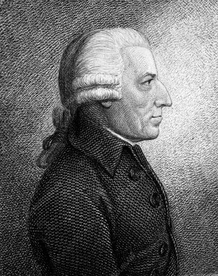
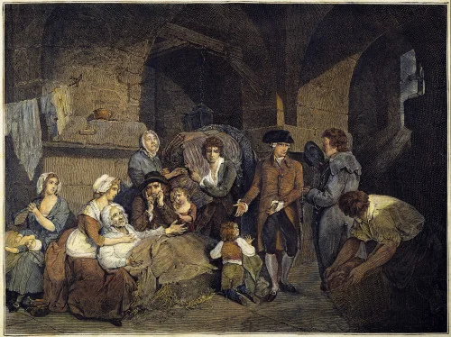
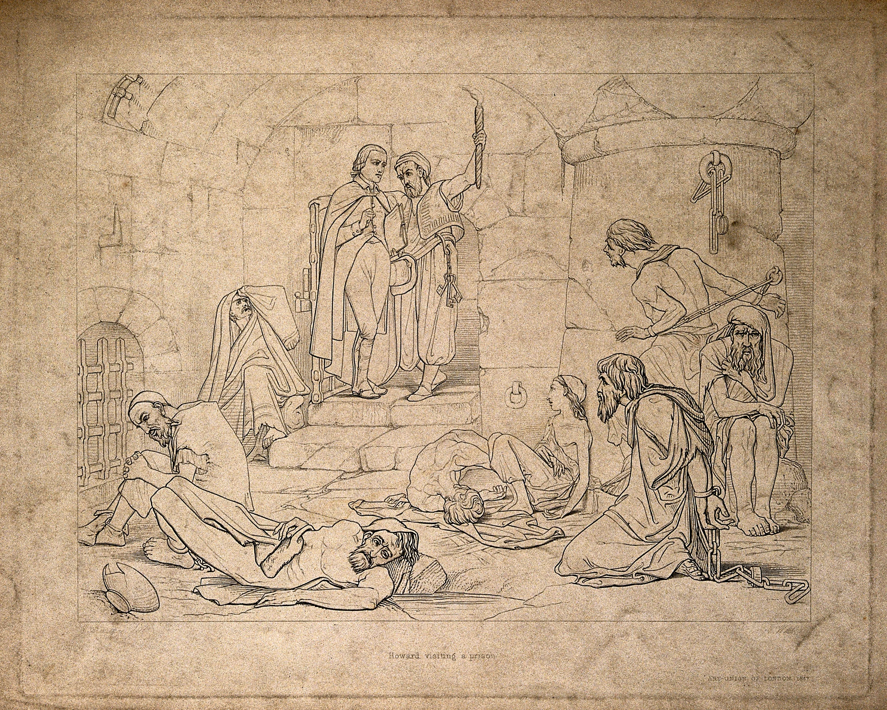
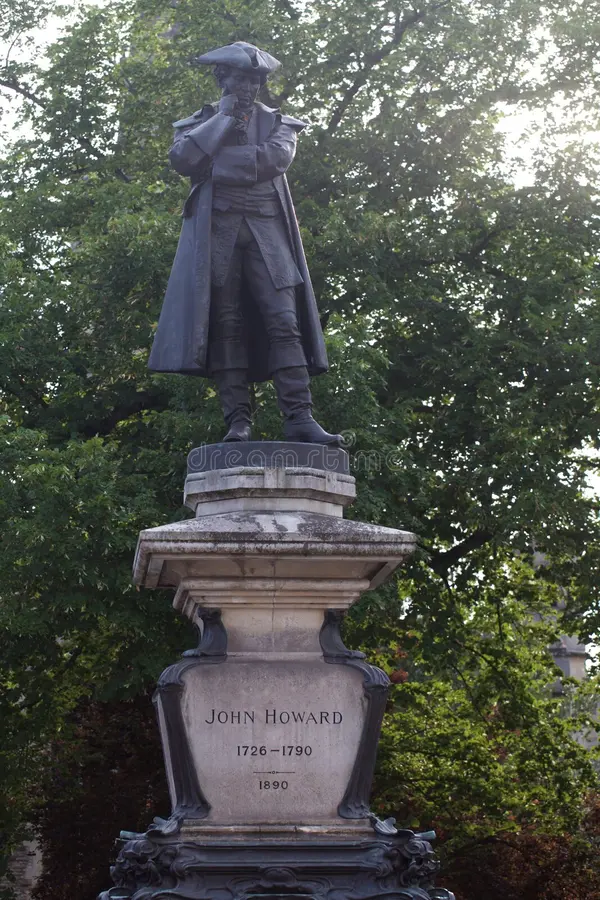
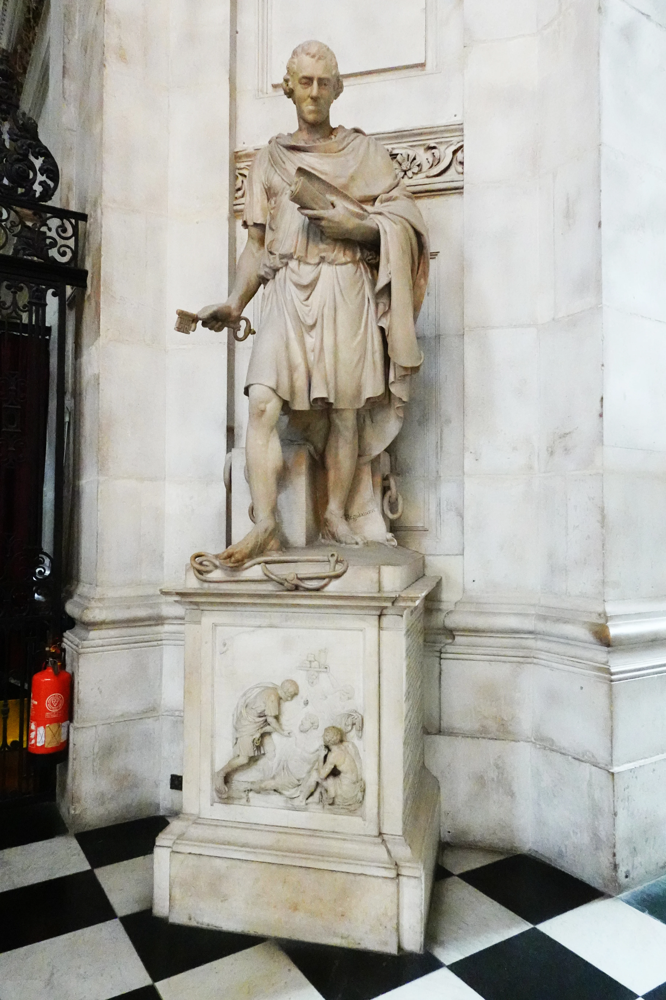

# 监狱界的徐霞客：约翰·霍华德与他的暗黑苦旅

前两天发了一篇推文，里面附了张照片（上图），这是美国人Sidney D. Gamble拍的京师模范监狱的教诲室。墙上挂了六张画像，分别是孔子、老子、观音菩萨、耶稣、穆罕默德、约翰·霍华德。有读者问，约翰·霍华德是谁？今天就来介绍一下约翰·霍华德。

18世纪的欧洲，当贵族们流连于社交沙龙，旅行家们热衷于游历名山大川时，有一位英国绅士却把余生所有的精力、财富，甚至生命，都投入到了人类文明最阴暗的角落——监狱。他就是被誉为英国“监狱改革之父”的约翰·霍华德。

霍华德（John Howard，1726–1790）并非法律学者，也不是狱政官员。他家境优渥，生活平静。乐善好施，是一位虔诚的加尔文教徒。一次意外，开启了他与监狱的缘分。1756年，在前往葡萄牙途中，霍华德被法国私掠船俘虏，亲身体验了监狱的阴冷与饥饿。不过很快，他就得到释放。

17年后（1773年），霍华德被任命为贝德福德郡的高级治安官。在视察本地监狱时，他被眼前的景象震撼：管理混乱，肮脏不堪，犯人挤在潮湿恶臭的地牢里，疾病肆虐。更令人愤慨的是，许多被判无罪的人，因为交不起给狱卒的出狱费被超期羁押，无法出狱。

霍华德决心为这片“人间地狱”做些事情，他决定考察监狱的普遍情况，用数据和报告呼吁改革。

这场“监狱考察之旅” 持续了17 年，足迹遍布英国本土及欧洲大陆大部分国家，甚至延伸到土耳其和俄国，亲自踏入并记录了超过300所监狱。

当时的监狱狭小拥挤、污秽肮脏、通风又差，极易感染和传播斑疹伤寒，以至于人们把这种病叫监狱热。普通人自然避之唯恐不及，连法官都不愿靠近。霍华德则毫不畏惧，他认真记录下各项细节：监狱平面图、牢房数量与尺寸、通风采光、饮水排污、犯人数量、刑期、伙食、健康状况、死亡率、管理人员数量及薪资情况等。

1774年，他向英国下议院委员会提供的证据促成了两项改善监狱状况的法案通过——《废除出狱费法案》和《囚犯健康法案》。

1777年，霍华德出版其心血之作：《英格兰和威尔士监狱状况》（The State of the Prisons in England and Wales, with Preliminary Observations on some Foreign Prisons），把问题摆在所有文明人的桌面，开启了世界范围内的监狱改革进程。

由是，霍华德成为议会监狱改革的权威人物，并参与起草了1779年的《监狱法》，首次引入了英国公立监狱政策。他率先提出了单人牢房的概念，倡导清洁卫生、分类关押、单独监禁、强制劳动、宗教教育及狱卒薪资制度。

1789年，年逾六旬的他再次远赴俄国。在赫尔松（现属乌克兰）考察时，为救治感染者不幸染上伤寒，于1790年初病逝于俄国。

霍华德与徐霞客有诸多相似之处：二人都身体力行，不畏艰险，旷日持久地行走在路上，并将这种“行走”当作毕生志业；二人都有理工男的冷静，留下大量详实的记录；其成果皆超越了个人经验，转化为公共财富，改变了人们对他们各自领域的认知方式。且最后二人都献祭于自己的事业，为后人所称道。只是，一个记录了地理的景观，一个记录了文明的溃疡。

附上英国资深大律师哈利·波特（Harry Potter）的著作《牢影》（Shades of the Prison House: A History of Incacreration in the British Isles）中关于约翰·霍华德的部分，该文专业而优美，值得一读。

霍华德的努力和著作为打开人类心智做了大量工作。他的足迹遍布欧洲，到过地牢深处，了解过悲哀和痛苦之所，丈量过苦难、抑郁和蔑视的深渊，缅怀被遗忘之人，陪伴被忽视之人,拜访被遗弃之人，比较、整理全英格兰所有人的苦难。这是一次发现之旅，一次慈善的环球航行。

——埃德蒙·伯克(Edmund Burke)

他为人类所做的，很少有人能做到，除了他，没人愿意做。道德荒漠的天平上，立法者和作家的辛劳远不及他，就像地球在天堂之下。他的国度是一个更好的世界;他以信徒的身份而生，以殉道者的身份而亡。

——杰里米·边沁

第十一章：在地牢深处用餐

1777年，《英格兰和威尔士监狱状况》(The State of The PrisonsinEngland andWales)一书出版，为了能够广泛传播，定价十分低廉。对监狱来说，此书仿若一部《末日审判书》。它全面调查了不列颠群岛及其他地区的监禁机构。虽然之前也有关于英格兰监狱情况的出版物，例如十六世纪末，约翰·斯托就曾将伦敦监狱列人了他的调查著作，并发表了关于马歇尔希监狱和舰队监狱的报告。但还从未有过如今这样一本书。该书的编写时间比当年征服者那部《末日审判书》编纂时间还要长，后者经王室下令编纂，由一整支文官队伍合力完成。而这本书仅仅是由一位不知疲倦的谦逊的中年中产阶级地主完成的。他不惧恶劣天气，骑马走遍全国，多次走访了无数监狱机构，收集了大量事实，并把他的发现和建议落于笔端，完成了这部鸿篇巨制。他把自己的大仁大义之作献给了下议院的议员们，感谢他们的鼓励。而他们也对他的非凡努力表示了应有的感谢。

这些努力的非凡之处，不仅体现在调查范围和细节上，也体现在做出这些努力本身的伟大理想中。谁愿意在生命的最后几十年里，以巨大的个人健康和财富为代价，不断奔波于国内外，并非去参观不列颠和欧洲的名胜古迹和城市，而是去走访各地最阴湿、最肮脏、最恶臭的死亡陷阱?是谁不仅要去监狱，还要去传染病院和其他监禁机构?答案就是约翰·霍华德。

本章中这位超凡的英雄，在1773年开始了他这一伟大的慈善事业，时年四十七岁。他在卡丁顿过着平静的小地主生活，始终从事慈善事业。这一年，这位在班扬传教的独立教堂做礼拜的小个子，一个不起眼的异见人士，出人意料地成为贝德福德郡的高级治安官。与其他担任这一职务的人不同，他毫不推卸自己的责任(其中之一便是走访郡里的监狱)。他对他所发现的一切感到震惊——肮脏、苦难、贪赃枉法、不人道，最可恶的是本该无罪释放的犯人被继续关押，因为他们无法支付出狱费。他决心用余生来做些事。世人同情人类的苦难，而他却同情最可悲、最无助之人遭受的苦难。他是一个虔诚随和的加尔文教徒，此次是奉主之神圣使命去看望被监禁的人。当然，这也可能是魔鬼的诱惑，因为两次丧偶的霍华德只有一个孩子，他很可能想逃避他为人父母的责任。他的孩子不安分，是个叛逆的青年，最终被送进了疯人院。同时，也可能出于对自己是个不合格父亲的忏悔。或者三者兼而有之。

无论动机是什么，霍华德开始改变债务人、不法之徒和重刑犯们的生活；并以此来改变自己的生活。他的生命有了新的意义。他的努力、感悟和坚持护佑着刑罚改革的微弱火光，最终使之燎原。他人生剩下的十七年将在马鞍上度过，足迹遍布不列颠群岛和欧洲大陆，为他伟大的批判著作收集证据。尽管他全情投入，但在宗教方面并不偏执。他甘愿冒着生命危险去减轻教皇党人、伊斯兰教徒或印度教徒的痛苦，就像冒着生命危险去减轻加尔文教徒、浸礼会教徒或独立派教徒的痛苦一样。他常常冒着生命危险做事。霍华德的体魄从来不算健壮，计划和行程无情逼人，但他为了理想都忍受下来了。最终，这要了他的命。在俄国鞑靼传染病院旅行走访时，霍华德被感染，继而高烧不退，于1790年1月20日在黑海附近的切尔森病逝，并长眠于此。鉴于他经常游走在这样的环境中，竟然能活这么久，也算是令人吃惊。克制、清洁以及对上天的信任是他的保命神药，这似乎对他很有帮助，一直保护他到工作几近完成为止。”

全欧洲都称颂他是伟大的慈善家，他是第一位本人雕像被放进圣保罗大教堂的人。主任牧师米尔曼称，也许没有人能像约翰·霍华德那样减轻了如此多的人类苦难。但霍华德不会同意这种看法。他曾叫停了为他匆忙树立雕像的公开募捐，他认为这种做法可悲而不仁慈。他从来不为肖像而生，就连最后的愿望都是谦虚的:把我静静地埋在土里，在我的坟墓上放一个日晷，让我被遗忘。他谦逊而期待被遗忘。最终，他没有得到日晷，但也从未被遗忘。在为他竖立的众多雕像中，有两座异常引人注目:一座在贝德福德，那里是他伟大事业的开始；另一座在切尔森，他的生命在那里结束。但是，他最伟大的丰碑，也是他持久影响力的证明，却并不在伦敦的大教堂，而是在教堂最著名监狱的入口处。霍华德和伊丽莎白·弗赖的上半身像立在苦艾监狱的门楼之上。镶嵌在石料上的他们，比其他所有监狱改革者都要高出一截。

在霍华德的时代，中央政府既不管理监狱，也不管理惩教所。它们都由伦敦城不同部门和地方治安官员负责，而具体管理则更多出于商业目的。霍华德特别关注贝德福德郡监狱的收费制度。根据该制度，应刑满释放的囚犯只有在支付食宿费和其他账单后才会被释放。牧师劳埃德(Lloyd)每年因其牧师工作而获得二十英镑的报酬，医生盖兹比(Gadsby)因其在监狱和惩教所的工作而获得十二英镑的报酬，狱吏没有工资，完全靠向囚犯收取费用。每个债务人都要支付十七先令四便士的释放费，还要向狱吏额外支付两先令，那些没有担保人的囚犯和轻罪囚犯也会被收取同样的费用。即使是无罪释放的人也要在交钱后才能获得自由。这一切都稀松平常，开诚布公:板子上画了一张费用表，所有人都能注意到。霍华德向郡治安法官申请，要求给狱吏发工资以代替他们收取费用的行为。法官们非常赞同，但希望有先例可循。

霍华德想找出一个先例。他决定走访邻近各县的十六所监狱，看看贝德福德郡有多特别。这些监狱没什么不同，都不公正，藏着许多不幸的故事。"这是对进一步行动的鞭策。在随后的十七年里，霍华德对英伦三岛进行了三十八次旅行走访，对欧洲大陆进行了七次，这仅仅是第一次。他四处走访、回访了许多监狱，深人到监狱的最深处，审问关在里面的人，收集整理了大量关于监狱和监狱工作人员的事实和资料。

在每个监狱机构，他都记录了狱吏、牧师和医生的名字，以及这些人收取的费用；还有其他人收到的工资。工作人员的品格甚至比建筑物的状况更重要。在走访位于切斯特城堡的郡监狱时，他就指出重刑犯日间房不安全，城堡的墙体已经腐坏(在1775年发生了一次大越狱事件)。同时他也评论说，看守人小心谨慎，富有人情味，不应受到责罚。"

尽管他语气冷静，但还是说出了对所遇之事的反感。例如，在访问卡迪夫郡监狱时，他站在一个新近被腾空的地牢里，深感震惊。那名囚犯仅仅因为七英镑的债务，在那里待了十年，最后绝望而死。在伊利主教的监狱里，由于想确保安全没有漏洞，看守人对囚犯采取各种安全措施，手段残忍。他们被锁在地上，腿上套着沉重的铁条，脖子上套着带刺的铁圈。霍华德对此深感愤怒。还有一间牢房，他发现异常拥挤、肮脏不堪，里面的可怜虫更宁愿被绞死。他看得越多，工作范围就变得越大。他在两三个郡监狱里发现一些可怜人，长得就非常悲惨。他们来自布菜德维尔监狱，于是他把这些机构也囊括进了调查的范围。他做事有条不紊。他并不是心怀偏见的人，该赞美的地方也会赞美。在约克城堡辖区内，有一座“为债务人而建的高尚监狱，为本郡争得了荣誉”。他指出，这些房间通风良好，环境健康。这毫不意外，因为这座1705年建造的建筑是英格兰第一批专门设计的监狱之一，就像巴洛克式宫殿一样。”

他把发现的情况记录在案，旁边加上批注。他提出了许多合理的建议，特别是关于监狱人员配置的问题。为避免囚犯遭到剥削，他敦促各监狱都应该配一名领工资的看守人，因为如果工作尽忠职守，再怎么鼓励都不为过。同样，还应任命一位在专业上有声望的医生；任命一位基督牧师，他不应满足于主持公共仪式，而应与囚犯交谈，告诫挥霍的人，劝诫没有思想的人，安慰身患疾病的人。”为此，他每年应得到五十英镑的报酬。

他提出了如此彻底的方法，做出了极富洞见性的研究，得出的关于英国监狱悲惨状况的结论无可辩驳。在旅行走访中，霍华德寻找并发现了其他路径。苏格兰的监狱就很反常，只关押了很少的囚犯，这要归咎于监禁所带来的羞耻感，也得益于家庭教育所倡导的端正言行，以及快速的审判和处决。虽然债务人被赶进肮脏且令人反感的牢房，贫穷的罪犯被关在爱丁堡市政厅可怕的牢笼里，但监狱从不会给妇女上铁链，被判无罪的人也会立即从法庭上被释放，不用支付任何看守费用。”苏格兰模式所提供的并不是一个监狱的样本，而是给人们上了一课:少用监狱。

为了找到他心目中的理想监狱，霍华德必须要将目光投向更远的地方。荷兰赢得了他的钦佩。他详细记述了在荷兰的所见所闻。监狱安静而整洁，囚犯都没闲着，他们努力工作，秩序井然。男人在木材厂(即劳改厂，将木头锉成木屑作染料用)劳动，女人在纺纱厂干活。目的就是让他们勤奋工作，这样他们就会保持诚实的品格。道德和宗教教育是最重要的。每个惩教所都任命了牧师，他们不仅要进行公共礼拜，还要指导和教诲囚犯。阿姆斯特丹的拉斯维斯监狱建于1596年，在一座修道院的基础上改造而成，以帮助囚犯改过自新为目的。这里的刑期很长，条件简陋，铿木工作也很辛苦(包括粉碎巴西染料木原木，以生产染料粉)。在屹立不倒的大门上，刻着寓意深刻的铭文，大意是“野兽必须被人类驯服”。被人类驯服，被基督教改造。霍华德不舍得离开这个国家，这里为他所关注的重要主题提供了大量信息。他不知道最该欣赏哪一个?干净整洁的监狱，囚犯的勤奋和有规律的劳作，还是行政官和摄政官们展现出来的人文关怀和对此问题的重视？洁净显然是离虔诚信仰最近的那一个。

......

他的工作很快就传开了。1774年3月，在开始旅行走访后不久，下议院就传唤他，要求他对刑事问题提供专业意见，那时距离他第一次出版研究成果还有很久。他强调，...监狱不应该复制这个堕落的世界，而应该从更高的理想出发。监狱应该产生善，而不是恶。闲散、赌博、咒骂、酗酒、通奸等行为不应被容忍，更不应被鼓励，而应以实干、秩序和正直取而代之。监狱文化形成了无秩序的“自治”，一批又一批的囚犯靠着这种文化在社会中创造了自己的另一个社会，并找到了忍受甚至享受监禁的方法，让身体和道德污染比比皆是。施政者应该压制这种文化，并以外部管控取而代之。独处、沉默等政策应当强制实行，以有利于悔改。自我控制和自我尊重是要达到的目的。纯粹从实践的角度来看，严格的隔离政策可防止越狱，保护弱者不被剥削，并保证那些检举同伙者的人身安全，这些都是显而易见的好处。

尽管改革萌芽缓慢，但霍华德还是在肥沃的土壤上播下了他的种子，有越来越多的声音支持对监狱系统进行重大改革。......务实的霍华德列举了事实和数字，为日后政治行动提供了根本支撑，本顿维尔监狱也因此而动工建造。

在他的努力下，两项法律立即制定完成:一项是取消出狱费，另一项是引人卫生措施以对抗“监狱热”。霍华德亲自确保这些措施得到执行，因为他自掏腰包印制了这些法律文本，并将其送至英格兰各郡的监狱。

他的影响远没有消失。他长期坚持的目标是建立一个全国性的监狱系统，定罪之人在晚上被关在单人牢房，保证他们的隐私和安全，白天一同干苦工，始终接受着虔诚的改造制度的影响。......伦敦地区建了两所国家监狱，男女各一所。狱吏有工资，看守人的工资与监狱劳动利润成正比。囚犯们将穿上囚服，通过良好举止和努力工作来获得减刑。霍华德是三个监工之一，任务是为第一所这样的监狱寻找一处合适的落脚地。但三人对此一直无法达成一致意见。两年后，无法妥协的霍华德辞职，重新开始了他的旅行走访。没有了他雷厉风行的支持，同时因为成本增加，以及流放工作的重启迫在眉睫，人们热情减退，工程停滞不前。

尽管在政府层面受挫，但监禁作为惩罚的观念得到了广泛接受，霍华德的刑罚思想也得到了广泛的渗透。但他对长期独立监禁所持的保留意见似乎并没有被大多数人采纳。社会坚信犯罪会传染，并希望找到灵丹妙药来解决问题，再加上基督教的热情等因素，英格兰对监狱建设和重建的需求增大，时间和金钱投人不断增加。1784年，议会明确授权法官拆除并重建郡监狱，并为此以财产税为担保发债借钱。当局禁止使用地牢，并实行分类管理。......

1775年，里士满公爵开始重建位于霍舍姆的苏塞克斯郡监狱。他听取了霍华德的建议并与之合作。霍舍姆监狱于1779年投人使用，目的是遏制和减轻社区监禁的不良影响，防止初犯再次犯罪。这里位置很好，并根据医生的建议处理好空气流通，以防止"监狱热”。债务人和重刑犯被分开关押，每个重刑犯都有一个单人牢房。人们既怕疾病传播，也怕恶习传染。这里不收费，狱吏有报酬，牧师也有。新的监狱制度令该地区犯罪率减少一半。这一新尝试与《监狱法案》无可争议地确立了独立监禁的做法，辅之以囚犯有序的劳动，同时进行宗教教育。...

开拓者不止里士满一人。1791年，乔治·阿尼色佛菜斯·保罗爵士(Sir George.Onesiphorus Paul)在重建格洛斯特监狱时采纳了霍华德的建议。该监狱以霍华德称赞过的根特监狱为蓝本，由霍华德的首选建筑师威廉·布莱克本(WilliamBlackburn)设计，他认为监狱的主要任务是规范囚犯的社会能力。他为利物浦(1786年)、曼彻斯特(1787年)和普雷斯顿(1788年)设计了诸多监狱，理念上将待审嫌疑犯与已定罪的犯人分开，将刑事犯与债务人分开，将男女分开，将成年男子与男孩分开，旨在防止污秽传播。他的规范化社会交往理念在格洛斯特监狱付诸实践，这在世界范围内是一次创举。这一理念后来颇具竞争力，倡导夜晚独立监禁，白天沉默工作。约翰·贝歇尔(JohnBecher)牧师同样推崇霍华德，也很积极。1808年，在他的动下，索斯韦尔惩教所也按类似思路建造。

在战争、高课税和国家危机时期，竟然有这么多钱投入到地方监狱改造中，确实挺让人吃惊。在不到十年的时间里，有四十二所监狱和惩教所经历了重建，其中许多都以霍华德命名，甚至有些监狱的门楼上还装饰着这位改革者的半身像，什鲁斯伯里监狱就是一个例子。这些监禁之所在地方上受到如此重视，表明公众——或至少是出钱最多、掌握财政大权的贵族——内心已经被深深地刺痛了。

然而，霍华德并不满意。他在其伟大著作的第二版中坦言，由于地方当局的关注，保护囚犯健康的法案付诸实施，监狱已不再是让刽子手都自愧不如的疫病栖身之所。同时，公众被自由和人道主义精神所熏陶，一直关注减轻囚犯痛苦的事业。所有一切都挺好，但进步精神似乎令人意外地停止了，几乎没有触及那个更重要的目标，即监狱的道德改革。维多利亚时代的法官马修·达文波特·希尔(MatthewDavenport Hill)对此表示认同。他认为，除了在清洁、通风、排水等符合公众仁慈认知方面发生的变化外，霍华德的其他种子都落在了荒石堆中。他痛心疾首地表示，哪怕只要用一丁点儿哲学思维考虑的问题都已不再被关注，这些问题必须被重新拾回。
