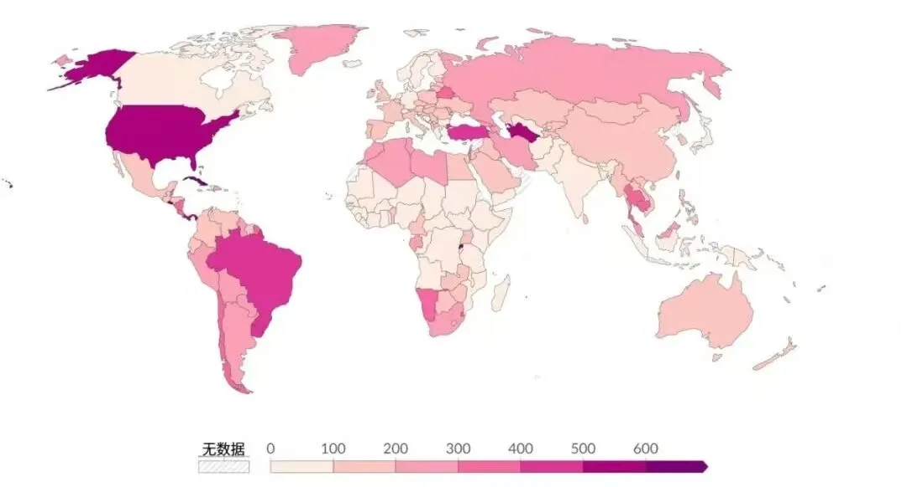

# 世界监狱人口简报 2.0

世界监狱人口简报 2.0

2016年3月15号，狱望推送了第一篇文章：世界监狱人口简报。该文内容摘自世界监狱研究中心（隶属于英国伦敦大学国王学院）发布的世界监狱人口简报（第十一版）。该中心的数据来自223个国家＆地区的监狱管理局（少部分数据间接来源于联合国统计资料、欧洲刑事统计局和美国人权报告等）。2024年5月，该中心发布了第十四版世界监狱人口简报（数据截至2024年4月）。依上篇，再做一些摘录：

## 1、目前全世界有超过1099万服刑人员（包括审前羁押人员和还押再审人员。2015年的数据为1055万。）

朝鲜、索马里、厄利特里亚的数据依旧缺席；中国数据不完整。此外，被国际不承认的当局关押的囚犯以及被关押在警察设施中且未计入已公布的国家监狱人口总数的审前羁押人员的数据也未包含在内。因此，实际总数高于1099万人，很可能超过1150万人。

2、美国的服刑人员有180万，中国169万，巴西84万，印度57.3万，俄罗斯联邦有43.3万，土耳其31.4万，泰国27.3万，印尼26.5万。（这8国合计约618.8万，占世界监狱人口56.3%。）

3、监狱人口比率（每10万国民中监狱人口比率）：萨尔瓦多高居榜首，为1086人，其次是古巴（794人）、卢旺达（637人）、土库曼斯坦（576人）、美属萨摩亚（538人）、美国（531人）、汤加（516人）、巴拿马（499人）、关岛（475人）、帕劳（428人）、乌拉圭（424人）、巴哈马（409人）、安提瓜和巴布达（400人）、泰国（391人）和巴西（390人）。该比率的中位数是140。略低于一半的国家和地区（49%）的国家监狱人口比例低于150。

世界各地的监狱人口比例差异显著，甚至同一大陆的不同地区之间也存在显著差异。非洲，西非国家的监狱人口比例中位数为50，而南部非洲国家的监狱人口比例中位数为243；美洲，北美洲国家的监狱人口比例中位数为 220.5，而中美洲国家的监狱人口比例中位数为 310.5；亚洲，南亚国家（主要是印度次大陆）的监狱人口比例中位数为 90，而东南亚国家的监狱人口比例中位数为 166；欧洲，西欧国家的监狱人口比例中位数为 73，而横跨欧亚大陆的国家（例如俄罗斯和土耳其）的监狱人口比例中位数为 267；大洋洲，监狱人口比例中位数为 184.5。

4、自2000年以来，世界监狱人口总数增长了27%，略低于同期世界总人口的估计增幅（31%）。各大洲之间存在显著差异，各大洲内部也存在差异。大洋洲监狱人口总数增长了84%，美洲增长了39%，亚洲增长了43%，非洲增长了53%；相比之下，欧洲监狱人口总数下降了26%。欧洲的这一数据反映了俄罗斯（下降59%）以及中欧和东欧（下降48%）监狱人口的大幅下降；除俄罗斯以外的欧洲其他地区的监狱人口增长了12%。南美洲（增长224%）和西亚（增长141%）的增幅尤为显著。

5、女性监狱人口总数约为73.3万，其中美国（174607），中国（145000），巴西（50441人），俄罗斯（39153人），泰国（33057人），印度（23772人），菲律宾（17121人），土耳其（16581人），越南（15152人），墨西哥（13841人）和印度尼西亚（13044人）。（这 11 国合计约54.18万，占到世界监狱女性总数的73.9%）。

6、女性监狱人口比例最高的国家（每10万人口中的女性服刑人员人数）是美国（52），接下来是泰国（47）、萨尔瓦多（42）、卢旺达（41）、土库曼斯坦（38）、文莱达鲁萨兰国（36）、巴哈马（35）、乌拉圭（35）、中国澳门（35）、白俄罗斯（30）和俄罗斯（27）。

各大洲的女性监狱人口比例也存在显著差异。非洲的比例最低，为每10万人口3人。亚洲的比例为7（剔除中国和印度为8）；欧洲为11（剔除俄罗斯为8）；大洋洲为10；美洲为27（剔除美国为15）。

7、全球监狱中女性和女童人数自2000年以来增加了57%，当时总数约为46.6万人。同期，男性服刑人员人数增加了约22%，而总人口增长率（根据联合国数据）约为32%。

8、自2000年以来，亚洲女性服刑人员总数增加了一倍多，而总人口增长率为28%。大洋洲和美洲，女性服刑人员人数的增长也超过了总人口的增长。非洲，女性服刑人员人数的增长速度与总人口的增长速度大致相同。欧洲的女性服刑人员人数下降了5%，与此同时，总人口略有增长（剔除俄罗斯的数据，欧洲女性服刑人员人数增长近25%，而同期人口总增长率不到6%。）

9、2000年以来，一些国家女性和女童服刑人员人数出现了显著的增长。中美洲最为明显，萨尔瓦多的女性服刑人员人数增长了七倍多，危地马拉增长了近六倍；南美洲，巴西增长了五倍；东南亚，柬埔寨增长了九倍，印度尼西亚增长了七倍。

10、女性和女童占全球监狱人口的6.8%。非洲国家，女性服刑人员的比例为3.5%，欧洲为6.1%，大洋洲为7.0%，亚洲为7.3%，美洲为7.7%（美洲的数据因美国庞大的女性服刑人员群体而出现偏差；若不计入美国，美洲服刑人员中女性和女孩的比例为5.8%。）

11、全球有15个司法管辖区女性和女童占监狱人口的10%以上。比例最高的地区依次是：中国香港（21.0%）、中国澳门（17.8%）、老挝（13.7%）、缅甸（12.3%）、泰国（12.1%）、越南（12.1%）、危地马拉（12.1%）、文莱达鲁萨兰国（11.9%）和阿联酋（11.7%）。

12、全球有超过300万人作为审前羁押人员/还押人员被关押在监狱等惩教机构中。此外。考虑到其他国家/地区官方信息缺失的情况，以及未被计入各国总数的警察设施中的审前羁押人员，全球被审前羁押和其他形式的还押监禁的人数将远远超过300万。审前羁押人员/还押人数前十的国家有：美国467,000人，印度389,000人，巴西214,000人，菲律宾117,000人，俄罗斯112,000人，墨西哥102,000人，巴基斯坦74,000人，泰国67,000人，土耳其62,000人，孟加拉国61,000人。在大多数国家（67%），审前/还押候审犯占监狱总人口的比例在10%到40%之间。但在非洲约一半的国家，审前/还押候审犯占监狱人口的比例超过40%。各大洲的比例分别为：非洲 38%，美洲 28%，亚洲 41%，欧洲 22%，大洋洲 40%。全球比例为32%。

13、审前/还押监禁人口占总监狱人口比例最高的国家是：圣马力诺 (100%)、黎巴嫩 (87%)、海地(82%)、孟加拉国 (76%)、列支敦士登 (75%)、印度 (74%)、巴基斯坦 (73%)、马里 (72%)、美属萨摩亚 (70%)、加蓬 (70%)、刚果民主共和国 (70%)、斯里兰卡 (69%)、几内亚比绍(68%)、老挝 (67%)、利比里亚 (66%)、尼日利亚 (66%)、中非共和国 (65%)、菲律宾 (65%)和多米尼加共和国 (65%)。

14、美属萨摩亚（美国）的审前/还押监禁率居世界首位，每10万人口中有377人被监禁，其次是波多黎各（美国）（371）、关岛（美国）（280）、圣卢西亚（200）、美属维尔京群岛（195）、巴拿马（182）、维尔京群岛（英国）（175）、特立尼达和多巴哥（174）、纳米比亚（172）、多米尼克（171）、汤加（170）、安圭拉（英国）（167）、巴巴多斯（162）、加蓬（158）、巴拉圭（158）、玻利维亚（153）和巴哈马（151）。

15、自2000年左右以来，审前/还押监禁人数增长了近39%，比同期世界总人口的增长率高出5.4个百分点。卢旺达和俄罗斯联邦的审前/还押犯人数大幅下降，对审前/还押犯总人数的变化产生了很大影响。如果将这些国家从总数中剔除，世界其他地区的审前/还押犯人数增长了57%。各大洲之间存在显著差异：非洲总人数增长了24%，如剔除卢旺达的数据（该国发生了1994年的种族灭绝导致审前羁押人数暂时上升），非洲总人数上升了60%。安哥拉、贝宁、埃及、加蓬、马里、毛里求斯、纳米比亚、塞内加尔和塞拉利昂的人数增加了两倍；美洲总人数增加了59%，玻利维亚和巴拉圭的人数增加了两倍，阿根廷、巴西、厄瓜多尔、危地马拉、秘鲁、委内瑞拉和一些较小国家的人数增加了一倍多；亚洲总人数增加了74%，柬埔寨的人数增加了六倍，马来西亚、约旦和菲律宾的人数增加了两倍，印度、印度尼西亚、斯里兰卡和黎巴嫩的人数增加了一倍。相比之下，哈萨克斯坦的审前/羁押犯人数下降了57%；欧洲总人数下降了28%，主要原因是俄罗斯联邦的人数大幅下降（52%），以及波罗的海国家和捷克共和国、摩尔多瓦、波兰和中欧/东欧国家的人数也大幅下降。如果剔除俄罗斯的数据，欧洲总人数比2000年左右的总数下降了7%；大洋洲各国的人数增加了313%，原因是澳大利亚的审前/还押监禁人数增加了四倍多，新西兰的人数增加了近六倍。

16、监狱人口最少的十个国家&地区为：安道尔 61，瑙鲁 38，安圭拉（英国） 36，马绍群岛 35，摩纳哥 31，库克群岛（新西兰） 28，圣马力诺 15、 法罗群岛（丹麦）13，图瓦卢 11，列支敦士登 8。

有兴趣的朋友可自行与十年前数据进行对比：世界监狱人口简报详细数据可前往世界监狱研究中心查阅下载（www.prisonstudies.org）

