# 犯人和他们的狗  Paws for Life

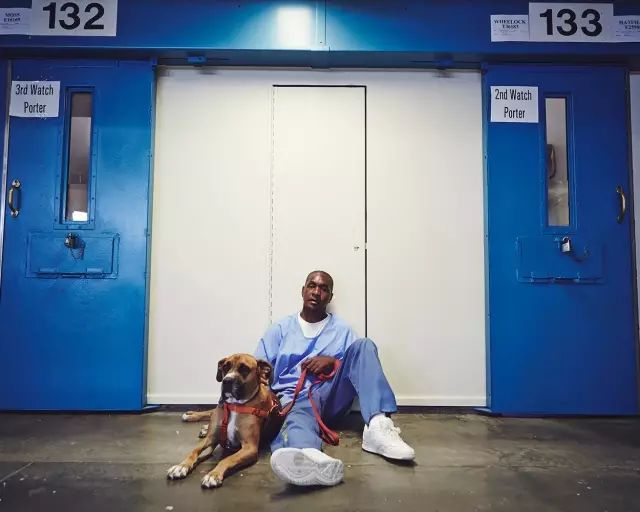

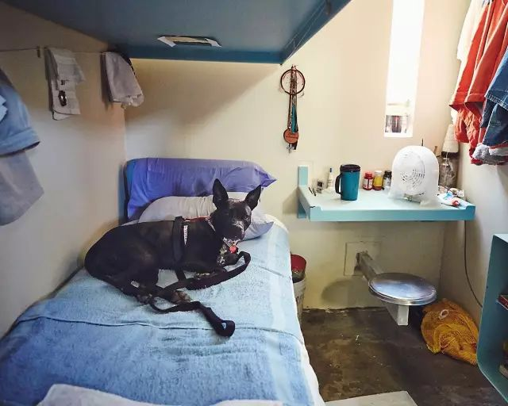

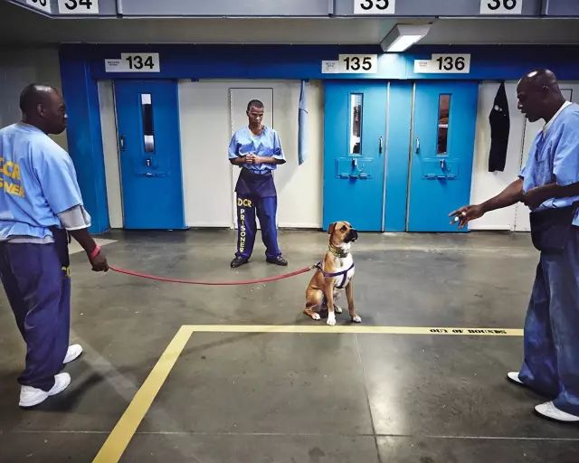

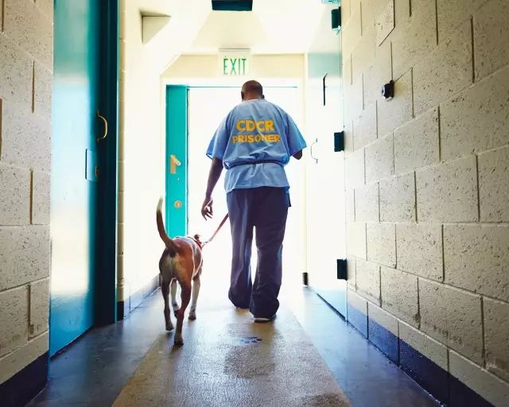

以下文章来源于PADMAG ，作者PAD

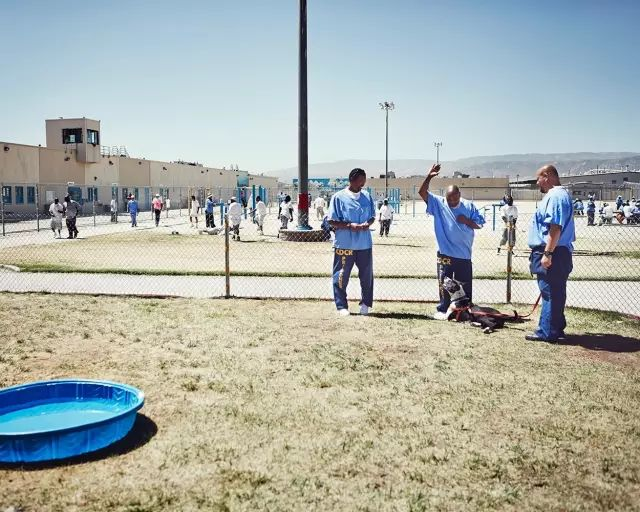

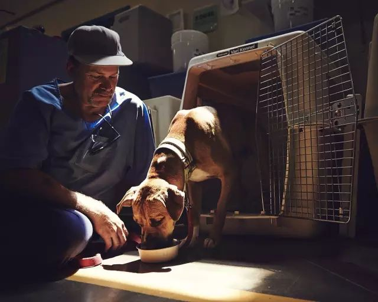

PADMAG.

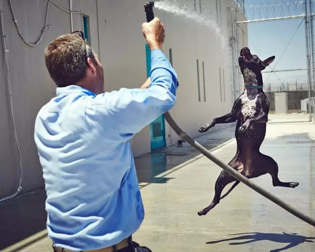

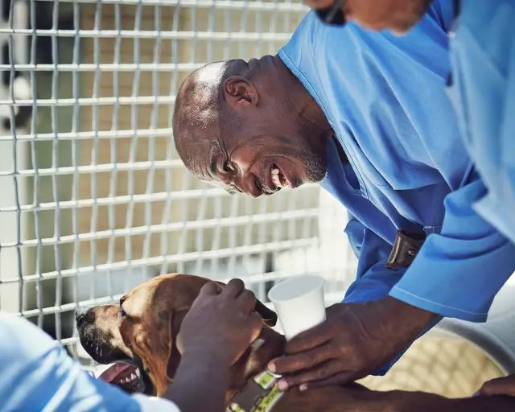

有趣有故事的摄影、设计、艺术

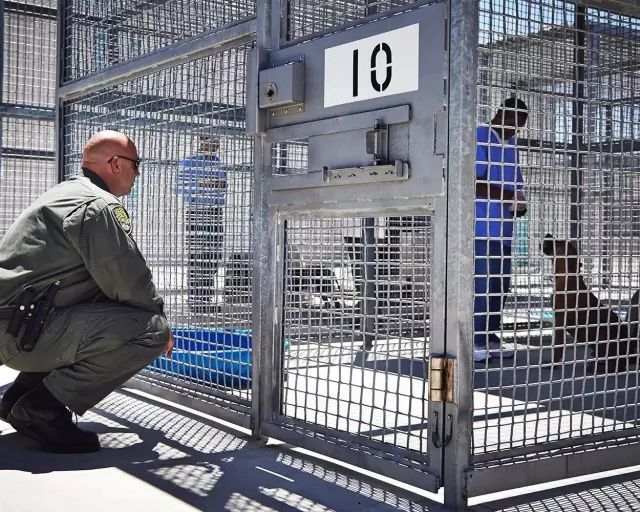

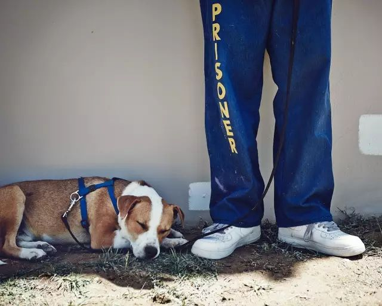

我明白被关起来的感觉，这给了我一个机会，让我能为这个被我伤害的社会做点什么。

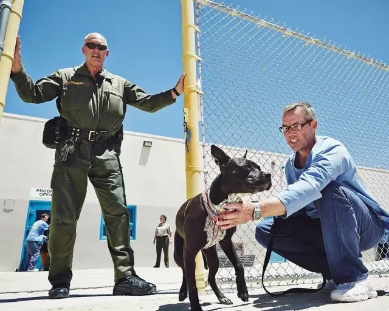

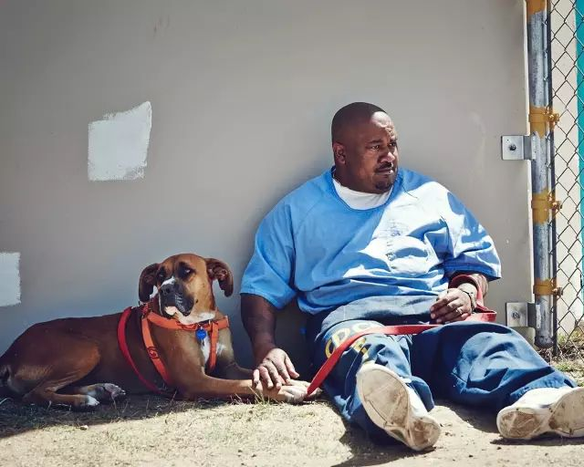

这是2014年美国洛杉矶州立监狱，一位名叫Travielle的犯人写给Paws for Life申请信中的一段。

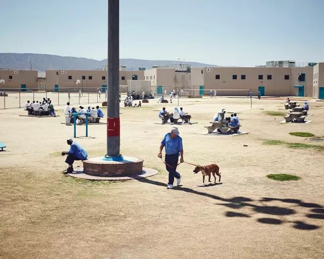

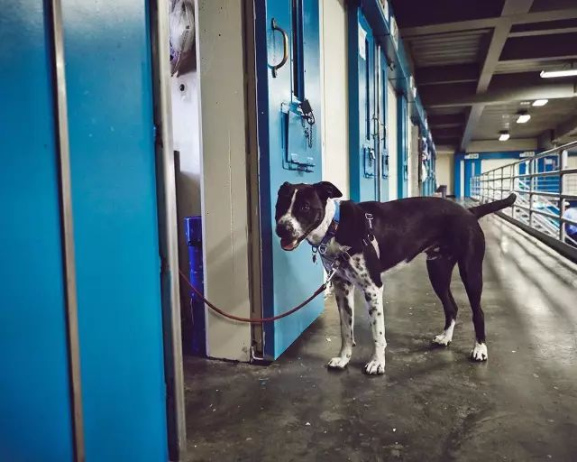

Paws for Life是位于圣莫妮卡的非盈利动物保护组织Karma Rescue所倡导的一个计划，他们与监狱合作，让监狱中的部分犯人能有机会与流浪狗一起生活。在专业指导下帮助流浪狗改掉一些街头习性，使其更有可能被人收养，免去被处以安乐死的命运。

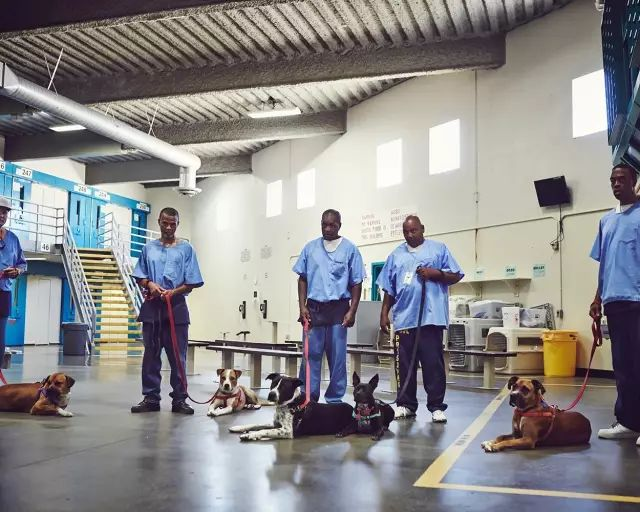

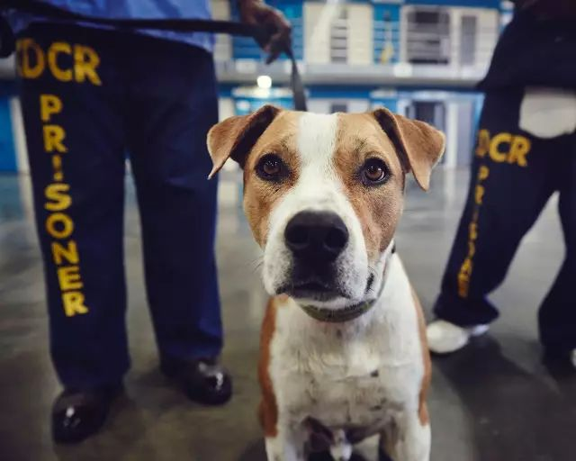

摄影师John DuBois——同时也是该计划的志愿者，和这些狗一起进入监狱，记录下狗和犯人们的生活。

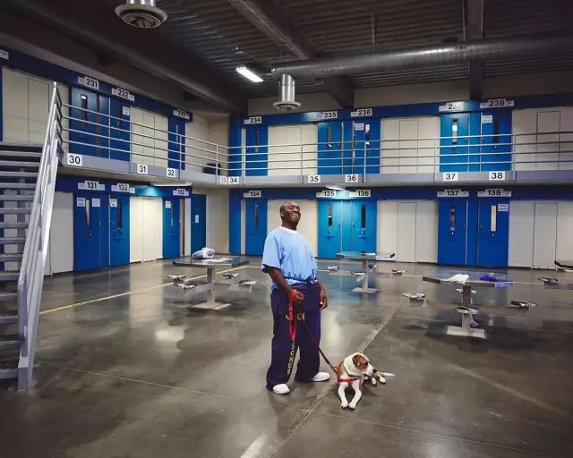

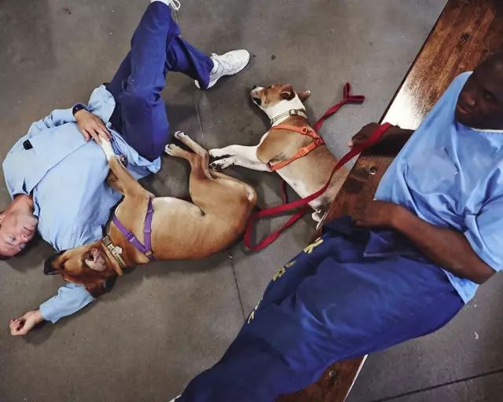

这所监狱中关押的大多是重刑犯，很多人被判终身监禁，当他们第一次看到狗时，好多人哭了，有犯人想起入狱前他曾养过的爱犬。

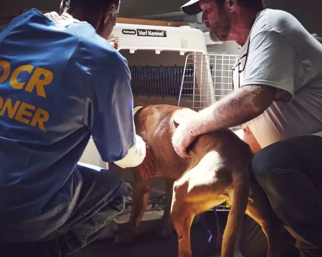

这些狗将和犯人们共度12周，它们在牢房公共区域睡觉，几乎完全由犯人们照顾。白天，除去训练的时间，狗也被允许和它们的主人在牢房中度过部分时间，它们会和主人一起看电视、散步、玩耍、拥抱，但就寝还是需要回到自己睡觉的地方。

很多被判终身监禁的人可能此生再无可能回到外面的世界，但通过该计划，他们训练过的狗得以重返社会，成为某个家庭中的一员。

最伤心的时刻是当这些狗训练有素，成功被人领养，犯人们不得不跟它说再见。几个月之后，新一批流浪狗被再次送到监狱，整个过程得以重复。

我听到不止一名犯人说，狗狗教会他们如何再次去爱别人，也学会接受别人的爱。

在文章的开始，最初写申请信的那名犯人Travielle在和他的狗告别时说，

它不知道我在狱中，它不会管我是谁，它爱我。这个计划抚慰了我的心，帮我与真实的社会建立了某种联系。

摄影师官网：www.shaughnandjohn.com

Paws for Life计划：karmarescue.org/paws-for-life
