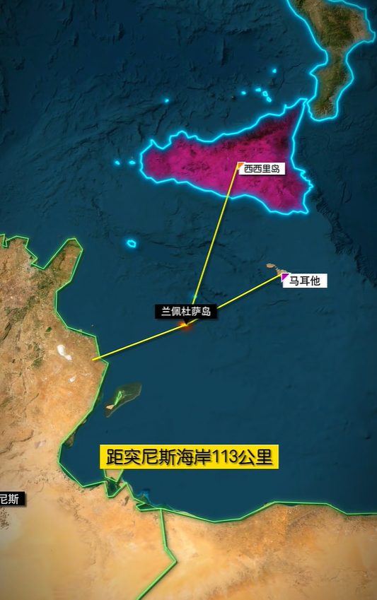
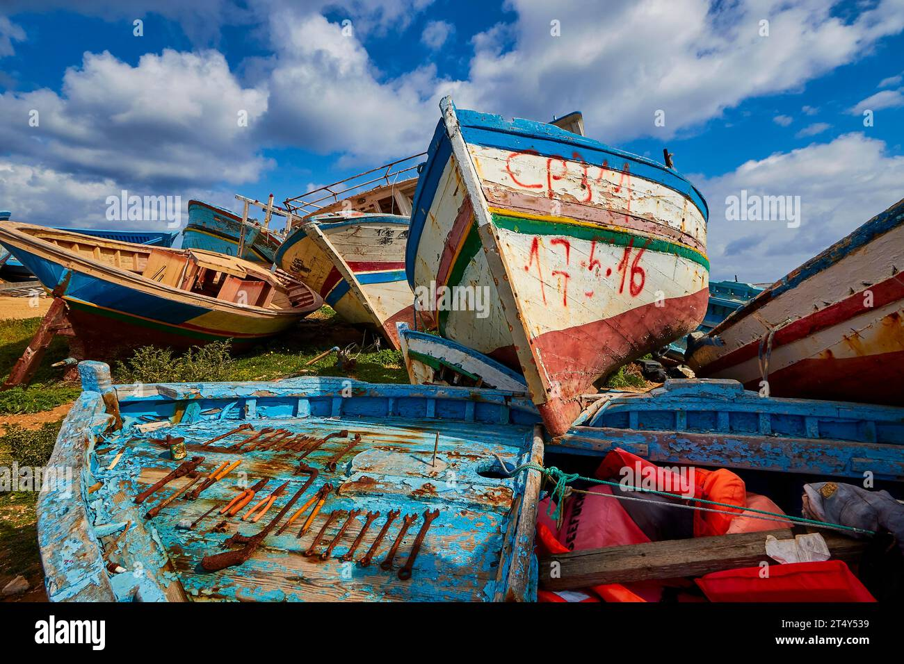
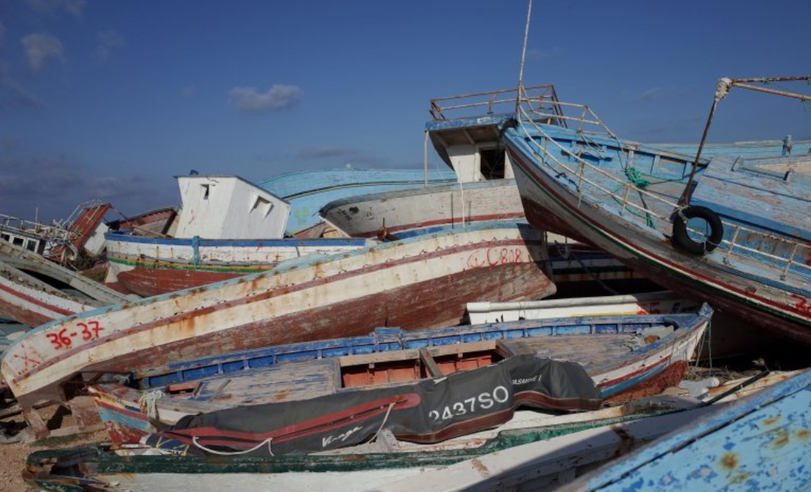
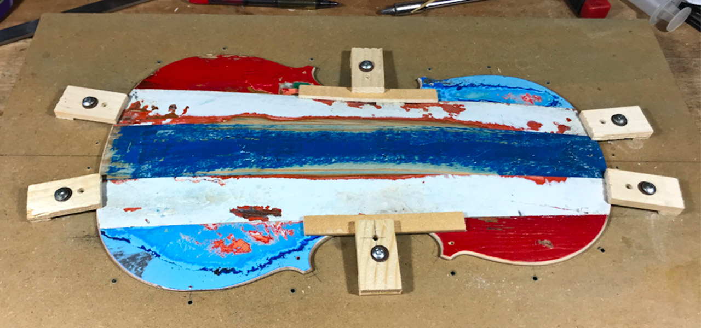
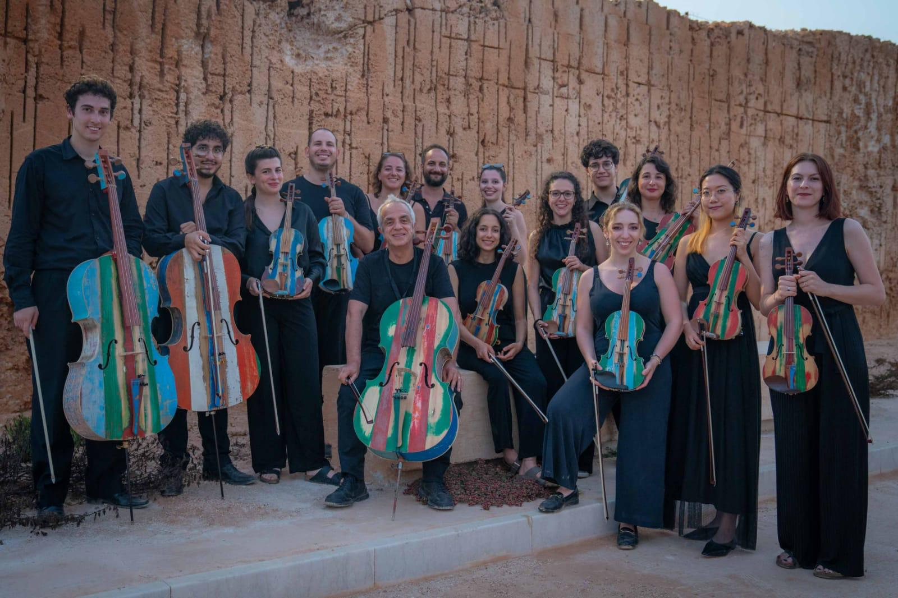
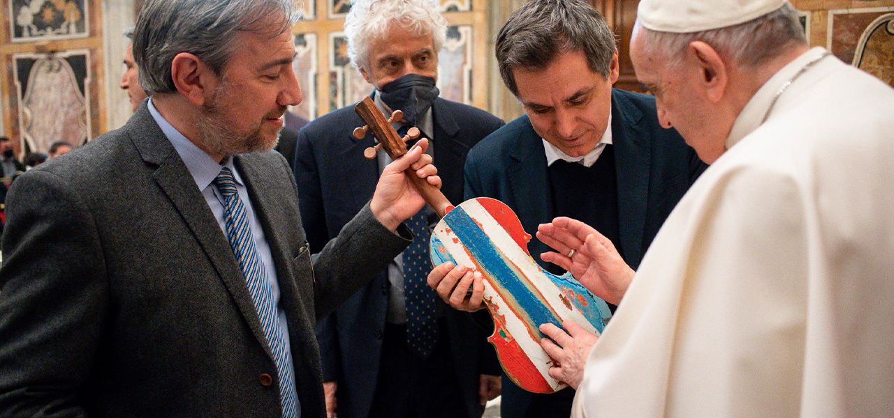
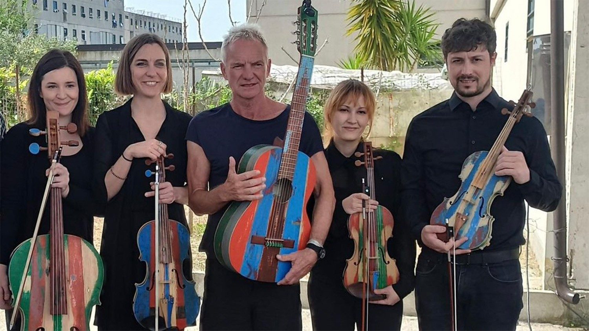
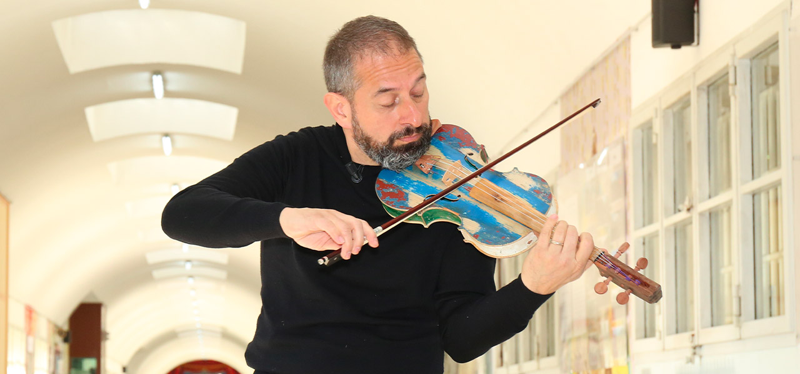
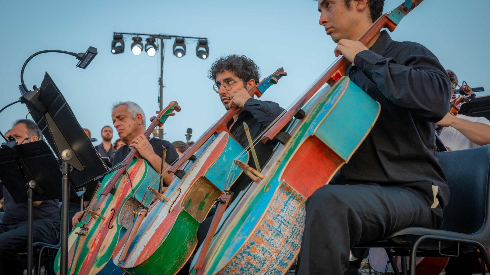
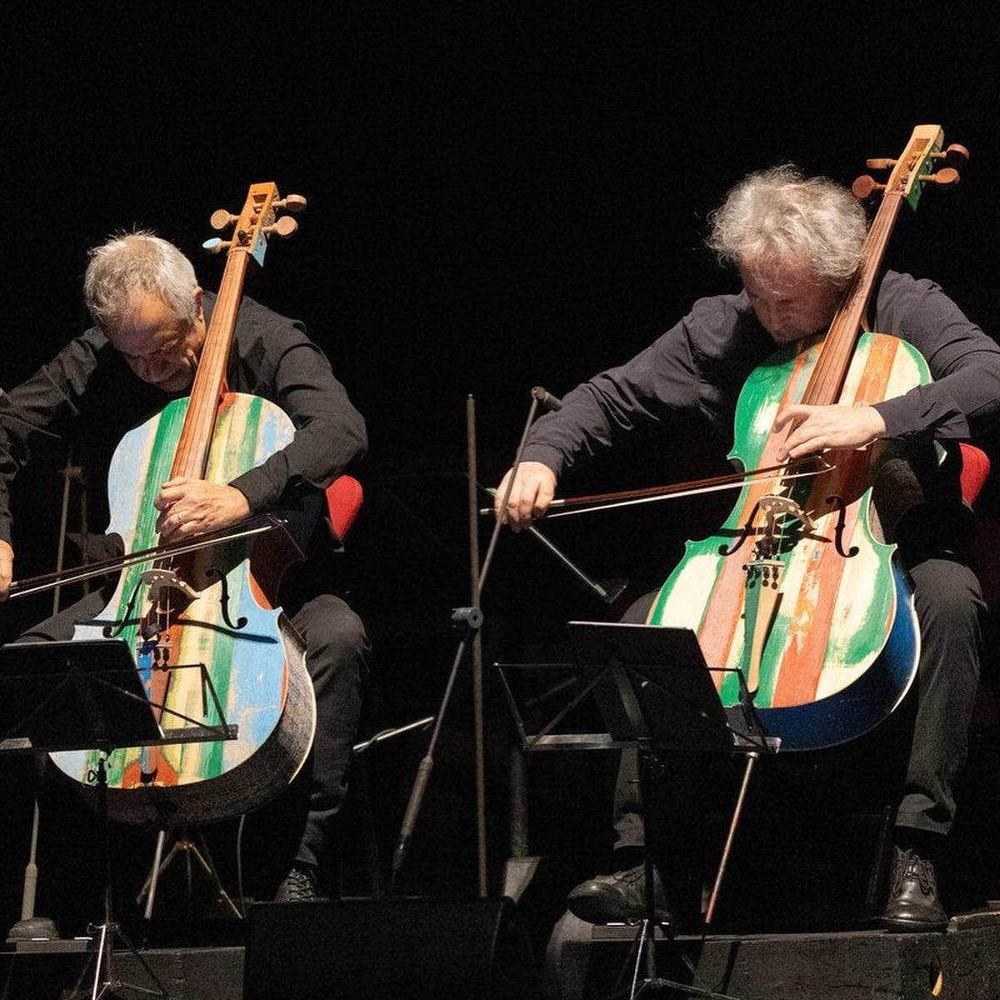

# “蜕变”--意大利囚犯改造项目

兰佩杜萨岛是意大利最南端的岛屿，距离非洲大陆非常近，因此成为大量非洲及中东移民进入欧洲的主要通道之一。数据显示，自2000年以来，已有上百万难民通过这里偷渡入欧。然而，但由于船只简陋、严重超载以及恶劣天气等因素，途中经常发生脱水、窒息、倾覆溺水等惨剧。近20多年来，已有数万人因此丧命（2016年柏林金熊奖作品纪录片《海上焰火》便是基于这一问题拍摄的）。

《海上焰火》中关于移民偷渡的片段，推荐观看全片

那些承载了希望与绝望，见证了死亡与苦难的船只，在难民登岸后，通常被弃置岸边，再也无人问津。久而久之，兰佩杜萨岛的海岸上堆积了大量难民船的残骸，任由海浪冲刷、被岁月侵蚀。

这片海滩被称为“移民船墓地”

2022年，几百公里之外的意大利大陆腹地，一个将难民危机、艺术创作与囚犯改造三大主题串联起来的“蜕变”（Metamorfosi）项目悄然启动。该项目由意大利“心灵与艺术之家”基金会（Fondazione Casa dello Spirito e delle Arti）发起，将废弃的移民船运到米兰奥佩拉（Opera）监狱和那不勒斯塞贡迪利亚诺（Secondigliano）监狱，在专业师傅的指导下，由服刑人员通过双手将这些浸泡过苦咸海水、承载无数悲喜泪水的木料“蜕变”为能奏出旋律的乐器。

而那些曾迷失方向、犯下过错的人，也在雕琢木材、奏响旋律的过程中，重新找到了自我的价值。

工人们特意保留了木料斑驳的漆面，于是这些乐器有了独特的辨识度。

这份跨越苦难的艺术再生项目，得到了教宗方济各的高度认可与祝福。第一把“海洋小提琴”被带到梵蒂冈，教宗亲自为它祈祷。祝愿这些乐器以及整个蜕变项目，能联结更多善意。

2023年4月底，著名摇滚歌手Sting，走进了那不勒斯塞贡迪利亚诺监狱，用蜕变项目生产的第一把吉他，与海洋四重奏（Quartetto del Mare）合作，演奏了他的经典歌曲《fragile》。

这段视频被收录在 Sting 妻子 Trudie Styler 制作的纪录片《Posso entrare? An Ode to Naples》（中文译名《那不勒斯之歌》）中。

2024年2月，海洋乐队在米兰斯卡拉大剧院完成首演，赋予巴赫与维瓦尔第的经典作品一层穿越苦难的厚重。

而就在几天前的1月10日，这场艺术救赎之旅又迎来了新的高潮：著名意大利指挥家里卡多·穆蒂带领切鲁比尼青年管弦乐团走进米兰奥佩拉监狱，用“海洋乐器”奏响了震撼人心的交响乐。 维瓦尔第的《A大调弦乐与羽管键琴协奏曲》、威尔第的《纳布科》序曲与《奥赛罗》中的《圣母颂》接连上演，囚犯组成的圣维托号合唱团还与乐团共同演唱了威尔第《纳尔科》中的《飞吧，思想，乘着金色的翅膀》（又称《希伯来奴隶合唱曲》），这首描绘被俘犹太奴隶对故土的深切思念的作品，在意大利统一运动时期被赋予了强烈的民族象征意义。

“蜕变”不仅寓意船骸转变为乐器，也指向受刑人的更生。

该项目告诉世人，苦难并非终点，即使是破碎的船骸，在善意与艺术的浇灌下，也能绽放新生。而每一个迷失的灵魂，都有机会完成属于自己的蜕变。
