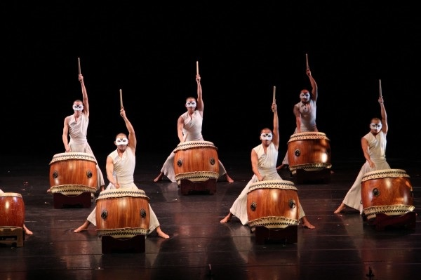
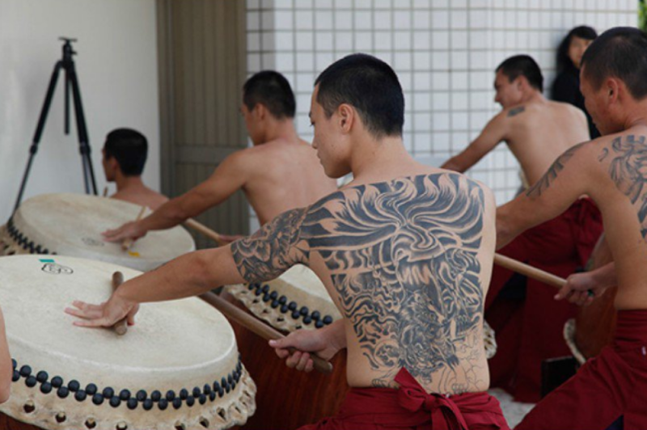
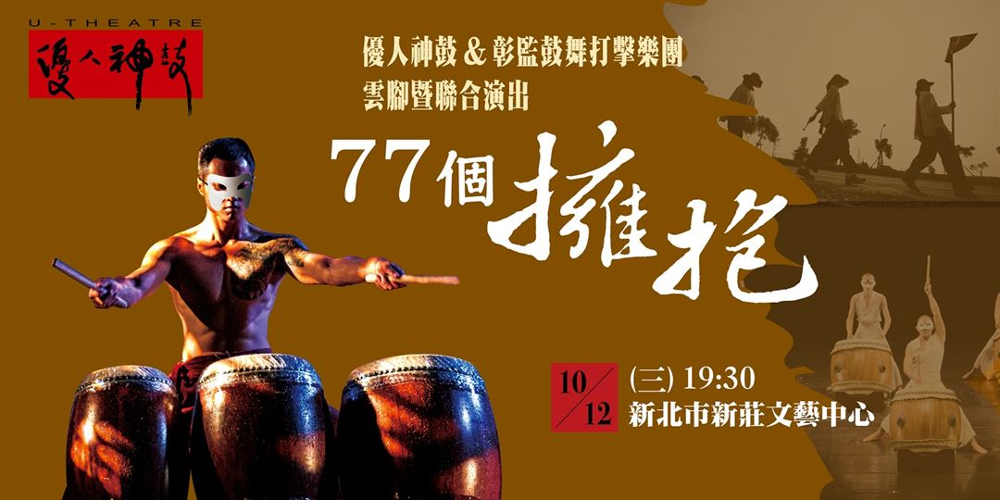
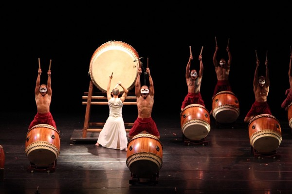

# 优人神鼓X[彰监鼓艺计划]

优人神鼓X[彰监鼓艺计划]

优人神鼓（U Theatre），是台湾的表演艺术团体，前身为优剧场，1988年由创始人刘若瑀于台北创立；1993年更名为优人神鼓，优人神鼓秉持著道艺合一的精神，强调“先学静坐，再教击鼓”，以打坐、打拳、打鼓做为训练核心，揉合舞台剧导演格洛托夫斯基身体训练、东方传统武术、击鼓、太极导引、民间戏曲、技艺、宗教科仪、静坐等元素，创立了一套独特的表演形式“当代肢体训练法”。
“彰监鼓艺计划”

2009年，优人神鼓与彰化监狱合作推出“彰监鼓艺计划”，刘若瑀后来讲到：一开始只是去做文化交流，然而，当时的彰化县文化局局长建议优人神鼓到彰化监狱教授打鼓，起初，我并没有想太多，只觉得这是一件应该做的事，便一口答应下来，在彰监成立「彰监鼓舞打击乐团」。于是，优人们开始每周固定到彰监教课，征选出16位团员，从压腿拉筋开始，松开他们僵硬的身体，再通过击鼓逐渐打开他们的内心，之后安排神圣舞蹈，甚至内观课程，让他们看见自己，接受自己，放下自我。

经过一段时间的训练后，我们决定带他们走出监狱，表演给更多社会大众欣赏。这样做不但打破狱政史的纪录，也造成社会各界的热情回响，更带给这群受刑人非常大的鼓舞。一生中从没获得过鼓励的他们，台下的掌声代表着社会对他们的接受、鼓励与感动，也让我们发现原来人心的距离并没有那么遥远。彰化监狱是青年监狱，这些年轻的受刑人都二十几岁而已，往回推算闯祸的年纪几乎通通都在青少年阶段。现今的教育无法适才的给予机会，这些年纪的孩子心性本就浮动，往往因为冲动而犯下大错。他们都是台湾的未来，我们应该给予机会，让他们看见自己，进而了解自己，找到生命的方向，发挥自己的力量。「鼓是一种不算细致的乐器，刚好可以和他们身体的力量结合。」刘若瑀说起收容人接触鼓的模样，表示他们的学习态度都很好，也从中学习到如何团结合作，一起学习如何打鼓。收容人阿华（化名）表示，一开始会有一种无力感，但在经过一次一次的练习以后，成就感会渐渐滋长。提到自己最大的改变，阿华表示，自己的脾气变好很多，比从前容易控制住自己的脾气。
"77个拥抱"
2016年彰监鼓艺计划推出"77 个拥抱"的巡回演出，由刘若瑀率领优人神鼓及彰监鼓舞打击乐团透过云脚方式，以步行深入西台湾的11个矫正单位传递爱，也在七个县市中举办演出，展现收容人士经过训练后的成果。

「原谅」与「接受」是刘若瑀一直传达的讯息，也是《77 个拥抱》暗藏的意涵，圣经里提到要原谅一个人70个七次，刘若瑀认为 70 个七次其实是无限次的意思，带着这些现在或曾经在监狱中的孩子是困难的，他们可能还是会不小心走向回头路，价值观的不同也会产生冲突，但是原谅他们所犯的过错，不放弃任何一个人，他们就有下一次的机会去改变自己，刘若瑀希望能传递拥抱和爱的精神，希望每一个孩子都能被引领至对的道路。
改变正在发生
到2016年，已有三位更生人成为优人神鼓正式团员、二位担任专职技术人员，这样的改变不是非常快，但是对于每一位彰监鼓舞打击乐团的成员来说，这是他们人生的转折点。

“有一位叫「阿甘」的正式团员，表现相当优异；他发自内心真诚地与被害人合解而获得完全的原谅，是矫正署推动「修复式正义」的典范。正是因为这些感动，让我们更加坚持这项计划，虽然剧团必须募款支持计划的开销，但看见收容人内在真正的转变，才是这个计划真正的价值！”

「无论他们是否继续打鼓，希望他们未来看见自己的内心，走自己的路！」刘若瑀坚定地说。
