# chalie manson

Look at Your Game GirlCharles Manson - LIE: The Love & Terror Cult

查尔斯·曼森（Charles Milles Manson，1934.11.12—2017.11.20）美国历史上最有名的连环杀人犯之一，曼森家族的灵魂人物。1971年因女星莎朗·塔特（大导演波兰斯基的妻子）和拉比安卡（LaBianca）谋杀案而被判入狱（他的罪行远不止这些），此后终身在加州圣昆廷监狱服刑。

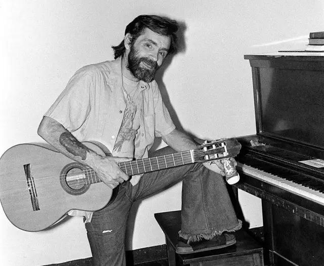

关于曼森以及曼森引发的社会现象，各方面的研究连篇累牍，以他为主题的纪录片、故事片也层出不穷。今天，我们看一看曼森与音乐。

60年代末曼森组建了一个叫曼森家族（Manson Family）的类公社组织，音乐便是他给社员做魔法洗脑的法宝之一，其中不乏他自己写的歌。

1967、1968年他录了一张名为《谎言:爱与恐怖的崇拜》（Lie:The love And The Terror Cult）小样。1970年发行，印数2000张。

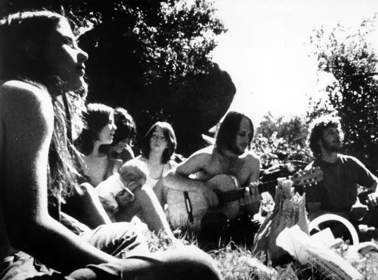

曼森的照片因为组织杀害了好莱坞明星的新闻登上1969年12月19日的美国“生活杂志”，他的专辑封面用了那期杂志的照片和字体，不同的是他把LIFE里的“F”删掉，转变为“LIE”，讽刺社会报道——骗人！我根本无罪。

Eyes of a DreamerCharles Manson - LIE: The Love & Terror Cult1968年海滩男孩（Beach Boys）改编了曼森的《停止生存》（Cease to Exist）以Never Learn Not to Love为名发行。
Never Learn Not To LoveThe Beach Boys - I Can Hear Music: The 20/20 Sessions

曼森第一次蹲监狱时就喜欢上披头士的歌。他经常对信徒们说自己是耶稣转世，而按《圣经》的说法，要有先知来告诉世人耶稣降临，先知就是披头士的4名成员。当披头士出版了那张著名的《白色专辑》（White Album 1968年）后，曼森就宣布，一场革命就要爆发了。依照他的解释，专辑中的《革命》（Revolution）宣告了革命即将到来；《小猪们》（Piggies）则代表被打倒的统治阶级；《黑鸟》（Blackbird）预示举行起义的是黑人，等等。在这场革命中，黑人最终将打败白人，统治这个世界。而他曼森则率领一批信徒躲进一个“无底洞”中躲过这场大劫。

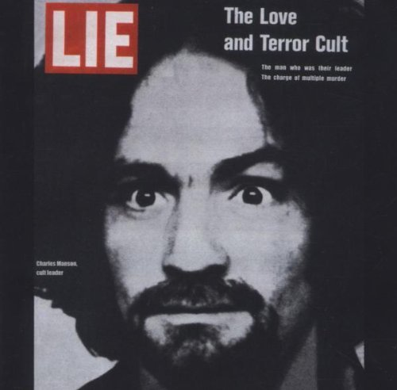

RevolutionThe Beatles Connection - Live In Concert

1969年，这个组织已经有25个主要会员和60个一般党员。一天，曼森宣布进行终极计划“旋转滑梯”（Helter Skelter），这个计划的名字同样来自披头士乐队的一张专辑名，而这个计划是打算发动末日的种族和阶级战争，扬言只有他的信徒才可以存活下来。

Helter SkelterPaul McCartney - White Album Tribute (Part Two) 45th Anniversary [1968 - 2013] - Songbook & Audiobook

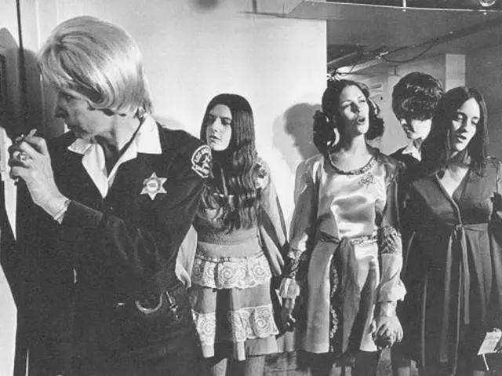

漫长的审判期间，他的家族成员一直旁听，不开庭的时候，她们在法庭外面守候，坚信曼森会无罪释放，有三位姑娘一直守候了190多天。

伏法后，他在圣昆廷监狱也没闲着，一直用录音机录歌送出来，他的家族成员帮他发行，从1983年到2013年，他至少发了18张专辑。包括在狱中写的诗。1993他还在圣昆廷做了一次演出。

And I'd Like to Say Hello to Some of My FriendsCharles Manson - San QuentinPrison TapeVarious Artists;Charles Manson - The Birth of Tragedy Magazine's Fear Power God

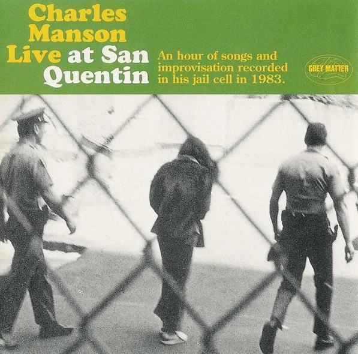

曼森历年发行的专辑：

White Rasta    1983

Poor Old Prisoner Boy    1989

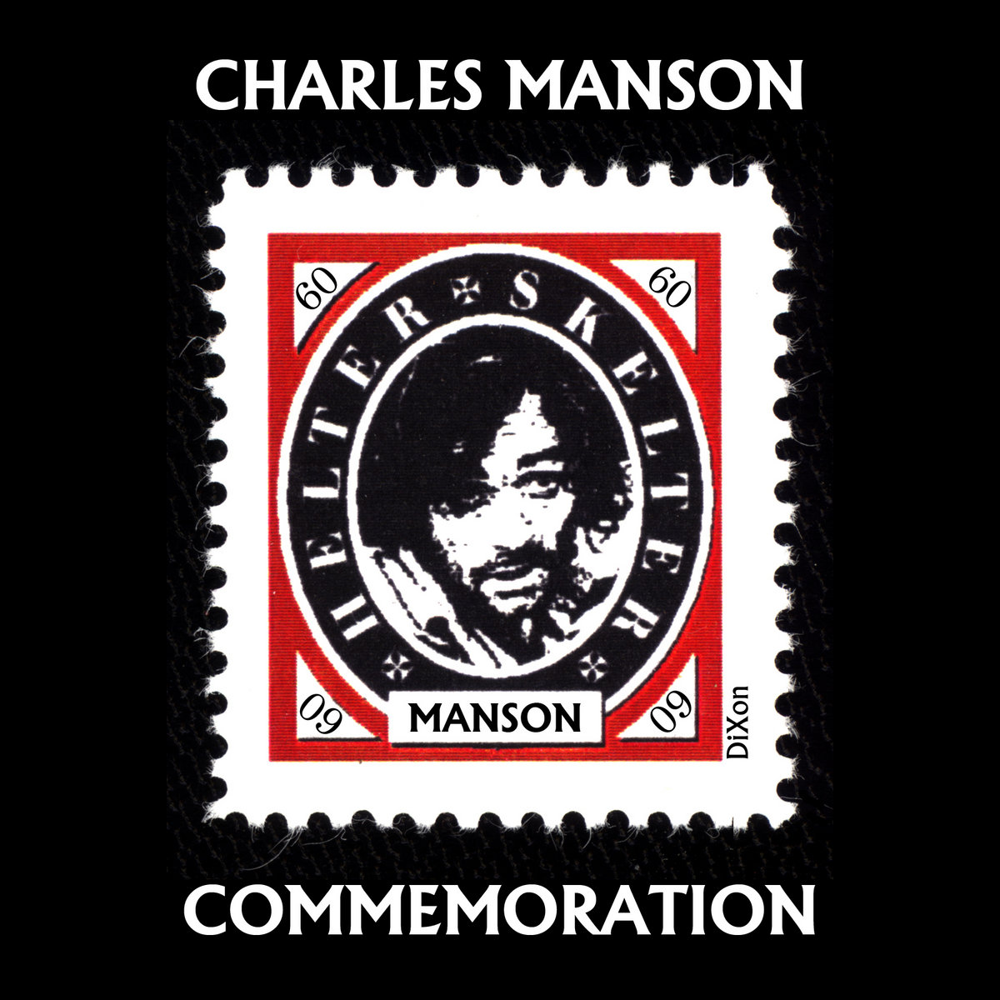

Son of Man   1992

Live at San Quentin   1993

Charles Manson   1993

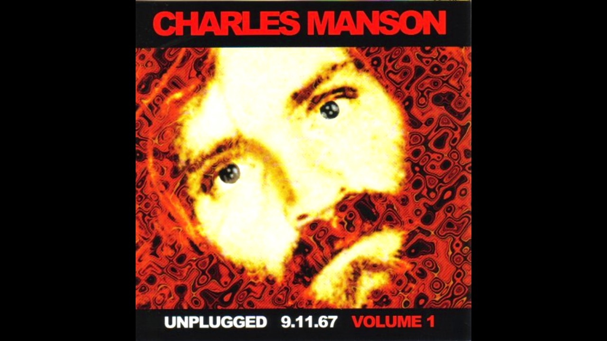

Commemoration   1994

Manson Speaks   1995

The Way of the Wolf    1998

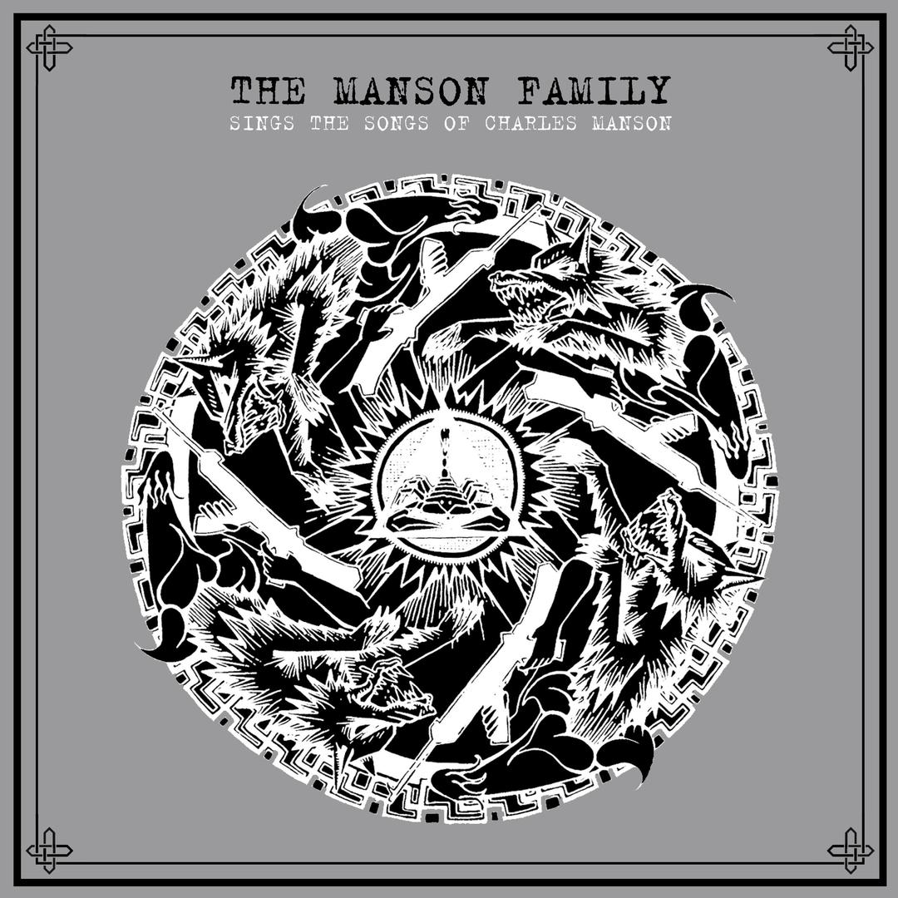

Unplugged 9.11.67 Volume 1

A Taste of Freedom     2001

All the Way Alive    2003

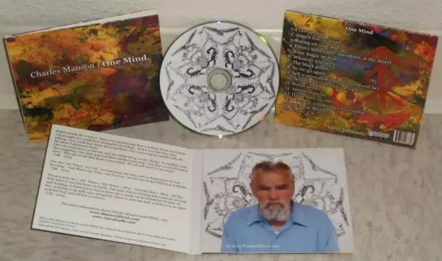

One Mind    2005

Charles Manson Sings   2006

The Summer of Hate – The '67 Sessions    2007

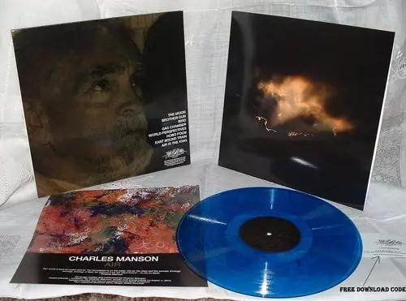

The Wit and Wisdom of Charles Manson   2008

Air (CD/LP/Digital Download, Magic Bullet Records, 2010)

ATWAR (Cassette Tape, White Devil Records, 2010)

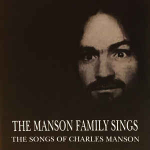

Trees (CD/LP/Digital Download, Magic Bullet Records, 2011)

The Lost Vacaville Tapes (LP, Underworld Productions, Inc, 2013)

I'm Free NowCharles Manson - Commemoration

And I'd Like to Say Hello to Some of My FriendsCharles Manson - San Quentin

曼森家族发行过数张专辑，《Manson family》《The Family Jams》等，不少都是曼森写的歌。

曼森家族成员鲍比·博索莱尔（Bobby Beausoleil），曾作为首席吉他手出现在《谎言》的多首曲目中，入狱后也发行了几张唱片。另一位成员史蒂夫·“克莱姆”·格罗根（Steve "Clem" Grogan）也积极参与音乐创作。出狱后，一直是加利福尼亚当地几支乐队的成员。

枪花翻唱过他的《Look At Your Game,Girl》，GG Allin1987年翻唱了《Garbage Dump》Garbage DumpGG Allin - Res-Erected

​玛丽莲·曼森把自己的艺名改为曼森，以曼森为名的歌更是不胜枚举。Charles Manson(He's So Handsome)Diemonsterdie - Honor Thy Dead
