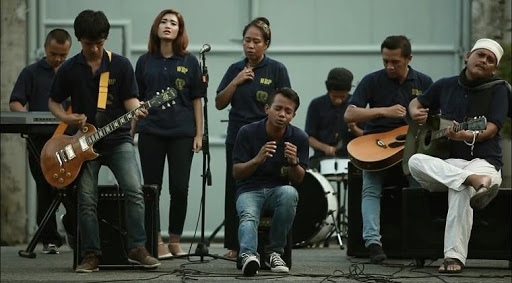
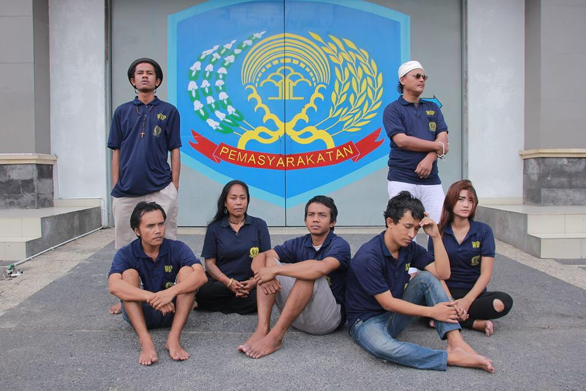
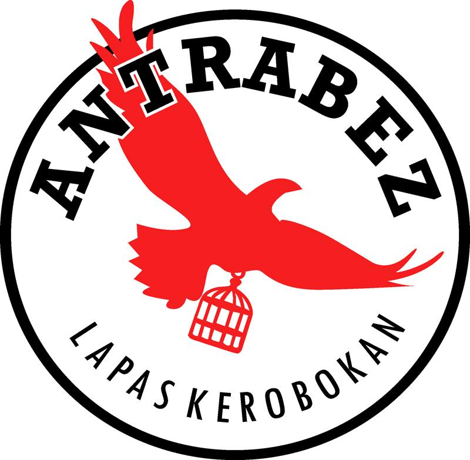
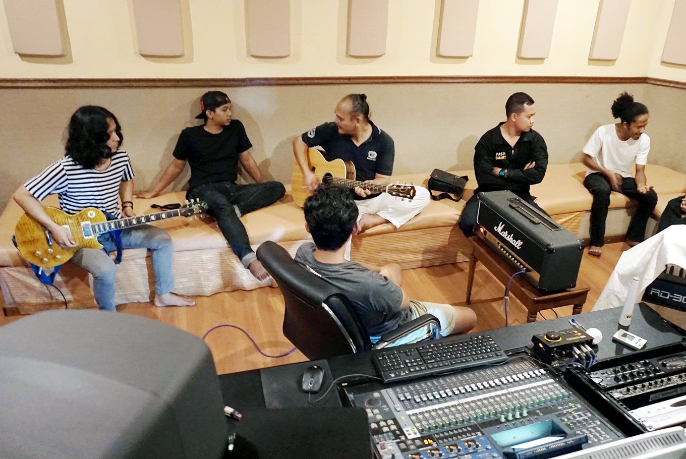
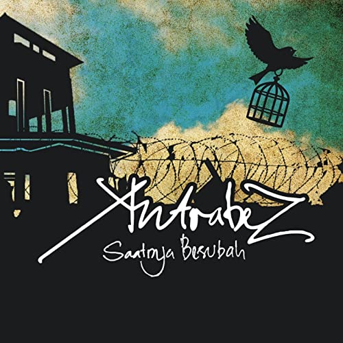
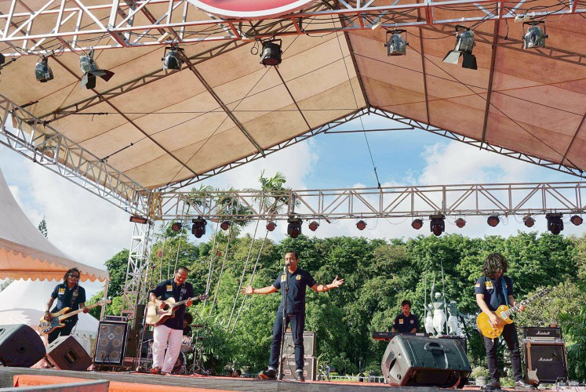
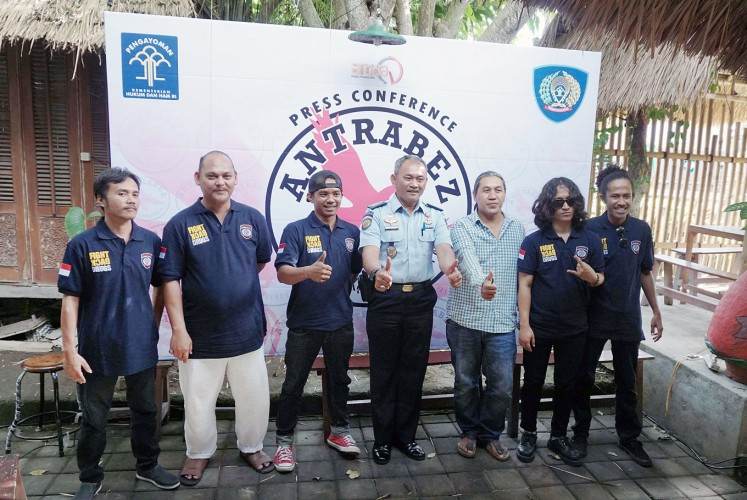

# 巴厘岛Antrabez乐队

ANTRABEZ是2016年5月成立于印尼巴厘岛克罗柏坎监狱的一支乐队，乐队成员都是该监狱的服刑人员，ANTRABEZ在印尼语里意为铁栏杆。

2016年初，里法（Rifa）与乐队彩排完，准备回家换衣服，乐队晚上还有演出。在离家不远的地方，他拐进一条小巷，拿起了一个藏在花盆里的小塑料袋。几秒钟后，五名警察抓捕了他。

“我以为那是我生命和音乐事业的终结。” 29岁的里法说。

警察在小包里发现一克甲基苯丙胺。

“我从朋友那里买的，我付了钱，他告诉我去哪里拿。我本想演出之前用。”里法说。

里法因购买并吸食毒品被判处五年徒刑，来到巴厘岛最臭名昭著的监狱克罗柏坎。

在监狱里，他遇到了七个同样热爱音乐的朋友，并于2016年成立了一支名为Antrabez的乐队。

乐队由吉他手Octav发起并领导，Octav目前因毒品犯罪被判四年监禁。被捕前，他在巴厘岛拥有辉煌的音乐生涯。

乐队其他成员包括，三位歌手：法布里（Febri），坦特里（Tantri）和西拉（Sila），以及键盘手罗兰德Ronald，鼓手道斯（Daus），贝斯手米奇（Micky）。

坦特里和西拉服完刑后离开了乐队，法布里，道斯和米奇决定出狱后仍然留在乐队。

登巴萨的安提达音乐工作室距离监狱大约40分钟路程，Antrabez非常幸运地获得了当时监狱长普里汉塔拉S. Prihantara的全力支持，允许他们去安提达音乐工作室录制了第一张专辑的全部六首歌。

Antrabez于2016年发行了他们的首张专辑《 Saatnya Berubah（改变正当时）》。

专辑发行后，他们得到大量支持。电影制片人埃里克（Erick EST）帮助他们拍摄了“ Syukuri Ujianmu”（感恩考验）的MV，音乐家和设计师Igo Blado设计了专辑封面。

Antida Music的制作总监Anom Darsana于2016年10月在监狱里组织了他们的首场音乐会，并邀请了Navicula和Superman is Dead（SID）等知名乐队。

作为专辑的执行制作人，监狱长普里汉塔拉还向他们捐赠了一套乐器。此外，在普里汉塔拉的允许下，Antrabez设法在巴厘岛各地演出，包括Denpasar电影节和Ubud作家与读者节。

乐队参加2017 DTIK音乐节

## 2017.12.3，安塔贝兹乐队在2017巴厘岛反腐败音乐节上演出。

Antrabez乐队成员在新闻发布会上与克罗柏坎现任监狱长托尼·南戈兰（中间）和Antida音乐制作人、导演Anom Darsana（第3位），宣布着手制作第二张专辑。

2018年3月他们发行了第二张专辑《NO LIMIT》（无限），该张专辑包含十首歌。

