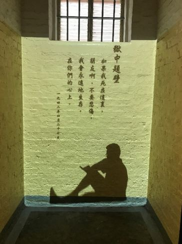

# 戴望舒

戴望舒（1905－1950年），杭州市人。现代派象征主义诗人、翻译家。1950年在北京病逝，享年45岁。

1923年，戴望舒考入上海大学文学系，师从田汉。1927年写出《雨巷》，1929年，出版了第一本诗集《我的记忆》。1932年，任《现代》编辑；11月初，赴法国留学，先后入读巴黎大学、里昂中法大学。1935年春，被里昂中法大学开除回国，1936年10月戴望舒与卞之琳、孙大雨等人创办了《新诗》，抗战爆发后，戴望舒转至香港主编《大公报》文艺副刊，创办《耕耘》杂志。1938年3月，一起发起成立中华全国文艺界抗敌协会；5月，抵达香港；8月，主编《星岛日报·星岛》副刊。

1939年3月，“文协”香港分会成立，为适应环境，改称为“中华全国文艺界协会留港通讯处”，戴望舒当选为首届干事，同时兼任研究部和西洋文学组负责人，《文协》周刊编辑委员；7月，和艾青主编《顶点》；10月，参与“ 文协” 香港分会、中国文化协会、中华漫画界协会香港分会、中国青年新闻记者学会香港分会联合举办的“ 鲁迅逝世三周年纪念会” 的策划和筹备工作。

1941年12月，日本侵略者占领了香港，1942年3月，戴望舒因戴望舒因主持《星座》副刊“对抗皇军”被捕入狱刑，受尽酷刑。1942年5月，经叶灵凤设法保释出狱。

狱中题壁

如果我死在这里，

朋友啊，不要悲伤，

我会永远地生存

在你们的心上。

你们之中的一个死了，

在日本占领地的牢里，

他怀着的深深仇恨，

你们应该永远地记忆。

当你们回来，

从泥土掘起他伤损的肢体，

用你们胜利的欢呼

把他的灵魂高高扬起。

然后把他的白骨放在山峰，

曝着太阳，沐着飘风：

在那暗黑潮湿的土牢，

这曾是他唯一的美梦。

我用残损的手掌

我用残损的手掌

摸索这广大的土地：

这一角已变成灰烬，

那一角只是血和泥；

这一片湖该是我的家乡，

（春天，堤上繁花如锦障，

嫩柳枝折断有奇异的芬芳）

我触到荇藻和水的微凉；

这长白山的雪峰冷到彻骨，

这黄河的水夹泥沙在指间滑出；

江南的水田，你当年新生的禾草

是那么细，那么软……现在只有蓬蒿；

岭南的荔枝花寂寞地憔悴，

尽那边，我蘸着南海没有渔船的苦水……

无形的手掌掠过无限的江山，

手指沾了血和灰，手掌粘了阴暗，

只有那辽远的一角依然完整，

温暖，明朗，坚固而蓬勃生春。

在那上面，我用残损的手掌轻抚，

像恋人的柔发，婴孩手中乳。

我把全部的力量运在手掌 贴在上面，

寄与爱和一切希望，

因为只有那里是太阳，是春，

将驱逐阴暗，带来苏生，

因为只有那里我们不像牲口一样活，

蝼蚁一样死……那里，永恒的中国！

偶成

如果生命的春天重到，

古旧的凝冰都哗哗地解冻，

那时我会再看见灿烂的微笑，

再听见明朗的呼唤——这些迢遥的梦。

这些好东西都决不会消失，

因为一切好东西都永远存在，

它们只是像冰一样凝结，

而有一天会像花一样重开。

等待 （一）

我等待了两年，

你们还是这样遥远啊！

我等待了两年，

我的眼睛已经望倦啊！

说六个月可以回来啦，

我却等待了两年啊。

我已经这样衰败啦，

谁知道还能够活几天啊。

我守望着你们的脚步，

在熟稔的贫困和死亡间，

当你们再来，带着幸福，

会在泥土中看见我张大的眼。

## 1943.12.31

等待 （二）

你们走了，留下我在这里等，

看血污的铺石上徘徊着鬼影，

饥饿的眼睛凝望着铁栅，

勇敢的胸膛迎着白刃：

耻辱粘着每一颗赤心，

在那里，炽烈地燃烧着悲愤。

把我遗忘在这里，让我见见

屈辱的极度，沉痛的界限，

做个证人，做你们的耳，你们的眼，

尤其做你们的心，受苦难，磨练，

仿佛是大地的一块，让铁蹄蹂践，

仿佛是你们的一滴血，遗在你们后面。

没有眼泪没有语言的等待：

生和死那么紧地相贴相挨，

而在两者间，颀长的岁月在那里挤，

结伴儿走路，好像难兄难弟。

冢地只两步远近，我知道

安然占六尺黄土，盖六尺青草；

可是这儿也没有什么大不同，

在这阴湿、窒息的窄笼：

做白虱的巢穴，做泔脚缸，

让脚气慢慢延伸到小腹上，

做柔道的呆对手，剑术的靶子，

从口鼻一齐喝水，然后给踩肚子，

膝头压在尖钉上，砖头垫在脚踵上，

听鞭子在皮骨上舞，做飞机在梁上荡……

多少人从此就没有回来，

然而活着的却耐心地等待。

让我在这里等待，

耐心地等你们回来：

做你们的耳目，我曾经生活，

做你们的心，我永远不屈服。

## 1944.1.18

心愿

几时可以开颜笑笑，

把肚子吃一个饱，

到树林子去散一会儿步，

然后回来安逸地睡一觉

只有把敌人打倒。

几时可以再看见朋友们，

跟他们游山，玩水，谈心，

喝杯咖啡，抽一支烟，

念念诗，坐上大半天

只有送敌人入殓

几时可以一家团聚，

拍拍妻子，抱抱儿女，

烧个好菜，看本电影，

回来围炉谈笑到更深

只有将敌人杀尽。

只有起来打击敌人，

自由和幸福才会临降，

否则这些全是白日梦

和没有现实的游想。
