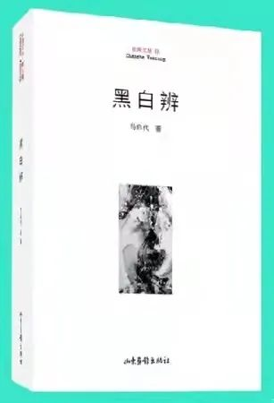

# 马启代

马启代，1966年生，山东东平人，自由撰稿人，主编“长河文丛”《山东诗人》《长河》杂志，现居济南市。 1985年11月开始发表作品，创办过《东岳诗报》等民刊，出版过《太阳泪》（三人）、《杂色黄昏》《仰看与俯视》《心巢》《火浴》《黑如白昼》《黑白辨》等诗文集22部，入选过各类选本200余部，获得过山东首届刘勰文艺评论专著奖、第三届当代诗歌创作奖、2016首届亚洲诗人奖（韩国）等，入编《山东文学通史》。《黑如白昼》是他的炼狱之作，从628首诗作中选成，诗中彰显着对生命尊严的坚守，对真理自由的渴望，是一曲精神的长歌和不可多得的精神诗志。《特区文学》（2015.2）和《名作欣赏》（2015.7中旬刊）先后刊发评论专辑。

近日，目光如秋风，在书的原野上收割不停

——划、画、标、删……，用尽我半生所学、所知和所思

举着目光的秋风

把那些闪亮的观点、段落、句子、字词，一一梳理

在地头，用那些熟悉或陌生的农具，密密匝匝，系上标记

捆打起我的思考、意见和建议

把我此时心灵的悸动，以文字的形式，留在上面

在监狱，我无法渴求别的收获，只能因地制宜，自力更生

把所见、所历、所闻，独自煎熬

由太阳点火，收藏岁月里冶炼出的诗的粮食

## 2011.10.06 泰狱

埋在阳光里

春节只是个节日，立春才是

节气。埋在阳光里，痒且疼着

摊晒开，一肚子的劳改饭

让节日的味道，在节气里漫延

泰山坐在北面，阳光只埋到它的

胸部，我只能看到这些

那面假寐的山坡，足足陪了我一冬

每当天晴都来看我，它在铁窗的

另一边，已好多好多年

阳光，是否带雷电的高墙

睁着眼太痛苦，闭上双目吧

仍能看到身躯摇摆着头颅，如

树干在狂风里，扭动着思想

也如，看到了我的前世与今生

一种叫忧郁的东西，始集聚，上升

如雾，阳光下看不到，它正躲在

苏醒的土层里，很浓，很辽阔

睁开眼，我看到泰山动了动

我体内的冰层，发出了咔嚓的响声

## 2011.02.06泰狱

旁观者

被冤枉者，被葬送者，被错杀的人

被愚弄者，被挟裹的人

那些不愿说话，不敢作证的人

那些呼救者，那些呐喊的人

那些掩盖真相者，还有利用真相的人

还有愚蠢者，玩弄法律的人……

我是见证者。为良心写作的人

诗人，这个世界多余的人。一位旁观者

## 2011.03.06泰狱

春天，与桃花的私语

桃花，不开就不开吧

别轻信宣传，现在天还太冷

冻死了雪花，冻败了杏花

他们还在制造冤案

桃花，要开就晚些开吧

那些赏花的人，不一定爱你

躲开淫秽的目光，贪婪的目光

到山寺里躲躲，等待真正爱你的人

桃花，要开就现在开吧

到我梦里来开，到我诗里来开

你知道我有多么得爱你

我无法去看你，你就大胆地来吧

我储备了足够的温度，刚好适合你

我们两相厮守，慢慢地享用一生

## 2011.03.06泰狱

梦

夜深几许，一层一层将我覆盖

猛然醒来，灵魂，刚回到高墙的脚下

我不敢睁眼。故去多年的母亲

正微笑着看我，我怕，一个翻身

把母亲困在监舍，灵魂

像我，成为游荡在诗行中的孤儿

## 2011.03.01 泰狱

这些年，我被藏在一纸判决里

这些年，我被藏在一纸判决里

横竖都是错码和乱文，用尽四十四年的修行

也无法看懂。一千日的闭关

怎么都读不出优美

我给世界暗送过很多很多秋波

云卷云舒，无人愿解风情

这些披着黑衣的母语，一点也不威严

已经害了许多人的词句们，已被深度绑架

像掌管它们的人，杀人，越货，却不沾血迹

个个正襟危坐，人人都像无辜

但我通悉它们的冤屈，那些主子的骨头

这个时代，已非同已往

法官们比后现代诗人更会制造神圣的病句

在这个国度，我学会了像文字一样忍辱负重

现在唯一能做的

就是与这些像我一样的汉字彼此交好

我要把它们喂养，暖活，重新发芽

他日，一起行走天下……

## 2011.03.17 泰狱

风中，一粒流浪的微尘

风，能把那面山坡吹暖

一粒微尘的内心，可能很凉

风，能把那面山坡吹绿

一粒微尘的精神，不见新芽

风，能把那面山坡吹亮

一粒微尘的眼睛，无法睁开

风，能把那面山坡吹活

一粒微尘的思想，围着电网

一粒微尘，在风里不由自主

它攥紧故乡土，攥紧一场暴风雨

在风里，沉默不语……

## 2011.03.17 泰狱

我曾一把将雪攥哭

雪是凉的，自己把自己冻成了六角形

雪的心是热的，攥到手心开始发烫

雪的凉抵不过我的凉，雪的凉

与我的凉相遇，就会被冻出汗来

我曾将一把雪攥哭

我的嚎叫吞没了它的哭声

我用力把它攥成霰弹

那是我整个冬天，唯一可以使用的武器

我把它当做手雷，与整个寒冷对抗

一次又一次地抛出去……

后来，我的手心里总传来隐吞的哭泣声

伸开手，每一个纹路间都闪耀着波光

靠近看，都是呼痛的泪水……

## 2011.03.19 泰狱

一个春天的下午

一个犯人，是坐着死去的

在操场。在监狱。在下午。在春天

一阵风走过，像谁一挥手

给一个生命，轻轻画了个句号

透过网状的铁窗，我目睹了这一过程

直到我听到救护车的尖叫

那是气体和气体，在激烈碰撞

直到那人在阳光里变得冰凉

春天，不给死去的人一丝温度

阳光尖锐，明亮，缄默，干干净净

天空漫无边际，埋着一场葬礼

而我无法说出它内心的火焰

家 书

没有烽火，也就是不见硝烟。已是六月

乱云飞渡。城墙之内——

家书，也只是一个古典的意象

万金只是一个比喻，一个被用旧的形容词

谁说古人不爱钱？家书的翅膀全是黄金

能飞，有光芒，还一直价格飙升

——最薄的圣经：每一个字都会说话

会唱歌。小小的字符内心广阔

会在夜深时不安静地流泪

——我的家书是一个女人的短信，57个字符

承载了她给我的青春。现在

她正把中年，一点一点地浓缩成问候

我把风雨幽闭。沧桑生羽，生情，也生江河

如今，我正将光阴一寸一寸搓长

将那个女人的手机号码，一寸一寸搓短

## 2011.06.27 泰山

这个春天，我看到的天空比井口大

这个春天，我看到的天空比井口大

比我的一个意象小。咫尺之涯

就是我的边疆

这个春天，失去的与得到的基本相抵

骨缝里的寒气，呼吸中的沙尘

还有几缕迷途的花香

这个春天，不知道需要多少场细雨

才能使我的人生不断辽远

才能让风的影子飞高

这个春天，我没有种下一只翅膀

只在诗行里给几粒种子安了家

如今，词语也许已经发芽

这个春天，我把天空一再深翻

把来年的云朵犁成了田垄

藏起来整个天堂的黄金

## 2011.04.30 泰山

手上都是小草绿色的血液

肯定是一股风扑了过来

把一片小草，狠狠地摁在了地上

这个季节，什么都挂着春天的名义

再肆虐的风，也只能叫春风

春风这把剪刀，却不知掌管在谁的手里

剪出细叶，也剪掉细叶，还有花朵

我感到了那些小草的压力

几近窒息，无法开口，只能任春风摆布

我是隔着铁窗看到的，还有玻璃

我是感到什么东西正狠狠地压在我的身上

我想翻身，手上都是小草绿色的血液

大年初一，阳光空阔，我偶尔看了一眼泰山

——泰山应当是母性的，像我的祖母，盘腿而坐

祖母你好！容我囚衣在身，不会跪拜任何人

在人间，我也不接受神的赏赐

——十八盘一根一根，怎么看也是男人的肋骨

祖母，不成为另一座大山，就枉做您的子孙

胸肋后面，我也有一颗山的心脏

泰山是长满腿的，雾已退去，它就前来等我

——泰山是长满腿的，雾一退去，它就前来等我

或者，它学会了隐身术，会在武警巡逻时隐身

在我来到窗前时突然出现

你看，阳光刚到，它就到了，它托风告诉我

那些爱我的花草又回来了

——我举起两目调整焦距，一山春意把我醉倒

春天，一只风筝落在高墙内

一只风筝，在天空，肯定

被什么绊了一脚，整个天空颤抖着

风筝跌跌撞撞，向下坠落

那只春天的飞鸟，彩色的云

谁放飞的梦想，哪个孩子的希望？

曾让整个天空亮起来，高起来，蓝起来

而它浑身摇晃，抓不住一片云朵，一丝风

也许它累了，内心的激情已经干枯

也许它完成了行程，看到了心中藏着它的人

肯定有许多目光牵引着它

甚至，许多只枪弹的准星咬住了它

自由的飞翔或坠落，都是某些人的猎物

我没有听到呼喊，追逐，嬉笑，呼救

越到低处，它坠落得越加安详平静

仿佛在赴一场约会，或找到了久违的家园

在春天里受伤。落在高墙之内

一个生命躺在空旷的水泥地上，大口地喘息

## 2011.03.23  泰狱

山的那面最好有一片公墓

安家落户的都是普通人

——每当夜深，星辰困倦成白眼，风声栖息于树林

我都希望有孤魂野鬼停在窗前

若能有狐仙造访，我也会给她起一个漂亮的名字

可惜这座山的整个西坡都属于禁地

只能想象，山的那面最好有一片公墓

安家落户的都是普通人

我情愿与鬼魂毗邻而居，和睦相处

无事可做时，我邀三两素心之鬼前来闲聊

或扮作进京赶考的书生，或扮作妩媚动人的娘子

当然，这样的聚会只能在没有太阳时进行

而且要翻山越岭、穿越这片军管区

倘被探照灯击退，我也只有扼腕叹息

好在黑夜常有，月黑风高常在

如果来不及撤退，多少的欢娱和怨愤

都可以放进我的十万诗行里躲藏

有时我就在文字里酣眠，或者在里面挥斥方遒

春天啦，我忙起来

春天啦，我忙起来

我要学着看护好太阳

让它慢慢地行走，慢慢地变热

不被冬天留下的寒潮绊倒

风，患上了流感，为防止传染

也需要我来护理。我要尽快把天空变蓝

还有我的心情，要和星星一块擦亮

如果那些到南方打工的候鸟，提前回来

我得劝乌云冷雨们，给让出归途

春天啦，我要行动起来

把大地上的积雪清扫干净，美丽的雪花

我要收藏，用诗意好好的养着

我要咳出喉咙里的冰，招呼嗜睡的小家伙们

赶紧醒来，伴着清风，吃点阳光的早餐

我要让梨花变得更白，让桃花变得更红

给那些受孕的花草树木预备好产床

如果那些监禁多年的囚子，盼来大赦

我要劝年年前来探视的春雨们，控制好心情

在每一朵含苞的花蕾上

咬紧了，咬紧了，咬紧那滚烫的泪水……

## 2011.03.07  泰狱

在墙内，遭遇一场清明雪

去年冬天，我曾放牧过它们的父兄

这些微小的尘粒，被辐射伤害的孩子

一个一个追不上远去的亲情

无家可归，纷纷扑向春天的背阴处

它们也想取暖，被温暖俘虏，一个一个

灵魂抱着泪水，掉进我有些潦草的前半生

## 2011.03.18  泰狱

诗者说

被禁锢的人哪

给他监室，他就获得天空

给他枷锁，他仍生长翅膀

什么也不给他

他就拥有剑、闪电、火焰

诗歌和风

## 2011.01.07
