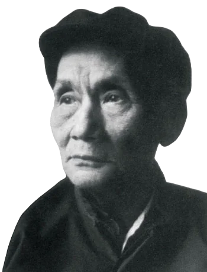

# 聂绀弩

聂绀弩（1903年-1986年）湖北京山人，原名聂国棪，笔名绀弩、耳耶、悍膂、臧其人、甘努、二鸦、澹台灭闇、迈斯等，诗人、作家、编辑家、古典文学研究家。

聂绀弩17岁离开家乡，开始了跌宕人生。他在马来西亚当过小学教员，到缅甸做过报纸编辑；进过黄埔军校，参加过国民革命军的“东征”，留学过莫斯科中山大学，当过国民党中央宣传部总干事和中央通讯社副主任，1934年加入中国共产党，参加过新四军，做过香港《文汇报》主笔。受邀参加开国大典，任过中南区文教委员会委员、中国作协古典文学研究部副部长、人民文学出版社副总编辑兼古典部主任等职。

1955年，“胡风事件”发生，随后中共中央发出《关于开展斗争肃清暗藏的反革命分子的指示》，开始肃反运动。聂绀弩因受胡风、康泽的牵连，在肃反运动中被隔离审查，反省3个月。最后受到留党察看和撤职处分。

1957年，聂绀弩被划为右派，开除党籍，1958年7月送北大荒的黑龙江省密山农垦局850农场劳动。因一场火灾，以“故意纵火”罪被捕入狱。妻子周颖得知后，北上北大荒营救，经托人疏通，使他以“判刑一年，缓刑一年”假释出狱。1959年初夏，被分配到《北大荒》文艺编辑部工作。1960年回京。

1967年1月25日，因为“攻击诬蔑无产阶级司令部”，聂绀弩在北京东直门外新源里寓所被作为“现行反革命”逮捕，先后羁押在功德林监狱、半步桥监狱。1969年10月，根据中国人民解放军总参谋长黄永胜发布的“林彪副主席第一号令”，以疏散首都的犯人、加强备战为由，聂绀弩被转押到山西省，在山西省运城地区稷山县看守所羁押5年。1972年6月，公安机关将聂绀弩案起诉到法院审理。1972年12月，北京市中级人民法院进行了一次审讯。1974年5月8日，北京市中级人民法院以“现行反革命罪”，一审判处他无期徒刑。聂绀弩当庭多次提出不上诉。1974年5月24日，聂绀弩交出了一份上诉书，提出上诉。同日，稷山县看守所将聂绀弩的上诉书寄给了北京市高级人民法院。1974年10月9日，北京市高级人民法院派员到稷山县看守所审讯，经过思想教育，聂绀弩当天撤回了上诉。1974年10月17日，北京市高级人民法院作出刑事裁定，准予聂绀弩撤销上诉。此后，1974年10月末，他被移送临汾的山西省第三监狱服刑。

得知聂绀弩被判处无期徒刑后，1975年5月至10月，周颖先后给周恩来总理、邓小平副总理、王震副总理写信申诉，后又致信胡乔木申诉。1975年10月11日，胡乔木将申诉信批转给主管政法工作的华国锋。1975年11月2日，华国锋批交中华人民共和国公安部“派人查问情况”。北京市高级人民法院乃商议决定，将聂绀弩的无期徒刑改判为有期徒刑15年，准其监外就医。此意见报经中共北京市委批准。但因反击右倾翻案风及周恩来逝世，这个改判的判决书迟迟未发出。直至1977年4月，北京市高级人民法院才决定到山西宣布改判的判决书，但却得知聂绀弩已在1976年9月获释，此事乃作罢。

1975年，中共中央决定释放在押的和刑满留场就业的原国民党县团以上党政军特人员。1976年5月，法院、公安、统战部门联合下发一个通知，要求各地继续清理安置遗漏的国民党县团以上党政军特人员。1976年，山西省高级人民法院按照这份继续清理国民党县团以上党政军特人员的通知，将聂绀弩列为“国民党军警特人员”，裁定予以释放。1976年9月25日聂绀弩获得释放。

## 1.麦垛

麦垛千堆又万堆，长城迤逦复迂回。

散兵线上黄金满，金字塔边赤日辉。

天下人民无冻馁，吾侪手足任胼胝。

明朝不雨当酣战，新到最新脱粒机。

## 2.锄草

培苗每根草偏长，锄草时将苗并伤。

六月百花初妩媚，漫天小咬太猖狂。

为人自比东方朔，与雁偕征北大荒。

昨夜深寒地全白，不知是月是春霜。

## 3.情景

挝面雪花抡掌大，压肩袱被比山高。

荒原一白全无路，冻涧微低不见桥。

到四分场泥滑滑，进人事室风萧萧。

逮捕证上先签字，双手骈伸就铐牢。

1958年初冬，聂绀弩被派到一间宿舍里烧炕。那天柴添得有点多，加上风大，火势很猛，火星从烟囱飞出，燃着了屋顶的茅草。火很快被扑灭了，只有屋顶的茅草被烧掉，损失很小。

事后，聂绀弩却被抓走了。当年一份《关于右派分子在密山垦区劳动改造情况》的报告中提到：“特别是中东局势紧张时，他们乘机蠢动，活动更为猖狂……如文化部右派聂绀弩在烧炕时不会烧火，把房子烧掉等。”聂绀弩被定为“纵火犯”，判刑一年。

## 4.《周婆来探后回京》

行李一肩强自挑，日光如水水似刀。

请看天上九头鸟，化作地上三脚猫。

此后定难窗再铁，何时重以鹊为桥。

携将冰雪回京去，老了十年为探牢。

## 5.怀张维

《第一书记上马记》，绝世文章惹大波。

开会百回批掉了，发言一句可听么？

英雄巨像千尊少，皇帝新衣半件多。

北大荒人谁最健，张维豪气壮山河。

*《第一书记上马记》为张维著小说

## 6.送王觉往东方红农场

贪与王阳一局棋，虎林白日任高低。

废书焚去烹牛肉，秋水汲来灌马蹄。

共织荒原为锦绣，独憎人世有夫妻。

东方红要诗千首，豆麦开花等你题。

## 7.岁尾年头有以诗词见惠者赋谢

奇书一本阿Q传， 广厦千间K字楼。

天地古今诗刻划，乾坤昼夜酒漂浮。

燕山易水歌红日，曲妇词夫惦楚囚。

多谢群公问消息，尚留微命信天游。

*K字楼指北京公安局看守所。

## 8.解晋途中与包于轨同铐,戏赠

牛鬼蛇神第几车，屡同回首望京华。

曾经沧海难为泪，但到长城岂是家。

上有天知公道否，下无人溺死灰耶。

相依相靠相狼狈，掣肘偕行一笑“哈”。

## 9.赠老梅

你也来来我也来，一番风雨几帆歪。

刘玄德岂池中物，庞士元非百里材。

天下祸多从口出，号间门偶向人开。

杂花生树群莺乱，笑倒先春报信梅。

## 10.画报社鱼酒之会

口中淡出鸟来无? 寒夜壶浆马哈鱼。

旨酒能尝斯醉矣，佳鱼信美况馋乎。

早知画报人慷慨，加以荒原境特殊。

君且重干一杯酒，我将全扫此盘余。

## 11.嘲王子夫妇怕冷

塞北逢春不似春，清明过了雪霏纷。

丈夫刚胆何寅悚，娘子铁腰少欠伸。

此夜四窗皆白昼，全家一坑共奇温。

无人道是南归好，只道外婆惦外孙。

## 12.萧军枉过

剥啄惊回午梦魂，开门猛讶尔萧军。

老朋友喜今朝见，大跃进来何处存？

八月乡村五月矿，十年风雨百年人。

千言万语从何说，先到街头饮一巡。

## 13.赠高抗

几年才见两三回，欲语还停但举杯。

君果何心偷泪去，我如不死寄诗来。

一冬白雪无消息，此夜梅花谁主裁。

怕听收音机里唱，梁山伯与祝英台。

## 14.血压三首之三

尔身虽在尔头亡，老作刑天梦一场。

哀莫大于心不死，名曾羞与鬼争光。

馀生岂更毛锥误，世事难同血压商。

三十万言书说甚，为何力疾又周扬。

## 15.悼胡风

精神界人非骄子，沦落坎坷以忧死。

千万字文万首诗，得问世者能有几。

死无青蝇为吊客，尸藏太平冰箱里。

心胸肝胆齐坚冰，从此天风呼不起。

昨梦君立海边山，苍苍者天茫茫水。
