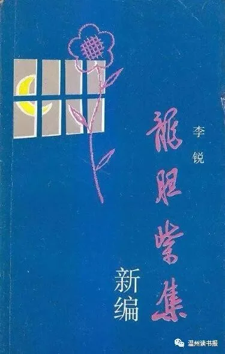
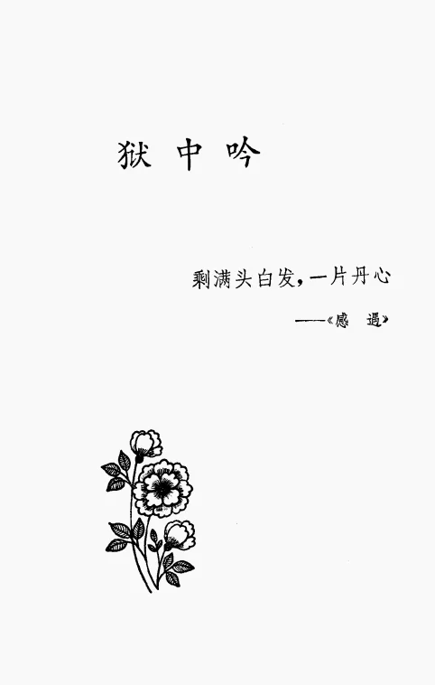

# 李锐

李锐（1917年-2019年），男，原名李厚生，曾用名李候森，生于湖南省岳阳市平江县。1936年春参加革命工作，大学文化。1937年5月加入中国共产党。曾任中央顾问委员会委员、中共中央组织部副部长。

2019年2月16日，李锐同志（部长级待遇）因病医治无效在北京逝世，享年102岁。

人物生平：

1934年至1937年，在国立武汉大学机械系学习，任武汉秘密学联负责人，从事学生运动工作。

......

1945年至1948年任冀热辽日报社社长。

1948年至1949年任中共中央东北局高岗政治秘书、陈云同志政治秘书。1949年8月至1952年9月任新湖南日报社社长、湖南日报社社长，中共湖南省委宣传部部长。

...... 1958年1月后任毛泽东同志兼职秘书。

1959年7月庐山会议上受到严厉批判，撤销一切职务，开除党籍。

1960年2月下放北大荒虎林850农场劳动。

1961年12月北京闲住。

1962年12月在安徽磨子潭水电站劳动，当文化教员。

1967年11月10日－1975年，北京秦城监狱关押8年。

......

1982－1984年任中组部常务副部长。后任中共组织史资料编纂领导小组组长。

以上资料选自百度百科。

著作：

《毛泽东的早期革命活动》，湖南人民出版社，1980年

《龙胆紫集》，湖南人民出版社，1980年

《李锐日记（出访卷）》 ，作家出版社，1998年

《庐山会议实录》等

《龙胆紫集》为李锐在秦城监狱中用棉签蘸紫药水写在《列宁文选》空白处的数百首诗歌，1980年出版。

图片

《龙胆紫集》序

一九六七年十一月到一九七五年五月，我被关在京郊狱中。为了使身心健康，保持精神正常、脑力不衰，除每天坚持在斗室中慢跑外，只好学习做旧诗词。越哼越发生兴趣。头几年，用报纸上的某些新闻或新人新事为题，即兴口占。当然不外打油调，随作随忘，只有极少数能记下来。也许是多次苦求引起“怜悯”之心，一九七二年底，“提审”者为我在六铺坑的存书处找来二十几本书。“鲋鱼涸辙忽天雨”，日子就好过了；吟咏的范围，亦随之扩大。

一九七三年，有一天跑步跌倒，手碰破了，护士给了我一小瓶龙胆紫和几根药棉签。灵机一动，发觉可作“奇墨怪毫”。于是靠墙坐在矮床上，面对哨兵的监视孔，越发规矩地捧着书本读书，偷偷地将这“一箩筐酸果子”---几百首诗词录在《列宁文选》(两卷集)上的空白处。这样干了一年多。当然也作了万一的准备，牢骚太盛的“毒草”用了代替的辞句；而且还一韵到底写了二百多句五言《语录歌》夹在其中。

这种冒犯监规的活动，一九七四年底和一九七五年初两次被哨兵发现，《列宁文选》和另一本《剩余价值学说史》先后被没收去了。当时的心情很泰然，再重的处罚不过是继续关下去罢。

将近八年的单监生活，我是襟怀坦白的。这些帮助我精神正常、脑力不衰的诗词，内容主要是两个方面:讴歌革命，回忆平生。讴歌革命，作为一个共产党员，毋需解说;为什么如此不厌其烦罗罗唆唆回忆这平凡的一生呢?因为想到儿女，总企望他们将来有缘见到这些东西，知道这个父亲并非“牛鬼蛇神”。

一九七九年一月恢复工作之后，这一箩筐酸果子当然不值一顾了。三月间因病住医院，一位青年时代的老朋友同住在院，也有我相似的经历，不过他没有这样一箩筐，而且果子不是酸的。谢谢他的耐心，将这些酸而涩的小果子一个个摸了一下，说是很有一些值得一尝，鼓励我编成一个集子。这件事也使一些熟人感到兴趣，另一位青年时代的朋友为这集子选定这个名称。

六十年代到七十年代,中国人民所经历的这一场浩劫，我们子孙万代都应当记住。相信历史决不会重复。

我个人愿意留下这一点小纪念。是为序。

作者

一九七九年十二月

本辑选自《龙胆紫集》中的【狱中吟】部分

图片

自题《龙胆紫集》

翰墨何言怪？

说来不值钱。

小瓶龙胆紫，

半截药棉签。

学诗

偶来佳句几忘食，

每续残篇即失眠。

无事自寻烦恼事，

只因不惯太清闲。

何苦吟

长吉日苦吟，母谓欲呕心。

穷有弱马跨，奚囊随后跟。

嗟我亦何苦，偷闲时抒情。

既无纸与笔，又难以发声。

推敲真费力，加倍劳心魂。

若不反复诵，事后记不清。

律绝尚好作，长赋实难成。

三四年前句，杳然不可寻。

虽是打油调，四百首犹存。

如此学风雅，古今有几人？

入此周年

昨岁飞来入此时，

恍如梦里久呆痴，

薄衾不耐寒和病，

挨到天明尚乱思。

安家

朝朝鸟叫仍惊鸟，

岁岁花开未见花。

只要有书来作伴，

自然无处不安家。

(经过多次请求，一九七二年底，从六铺坑为我取来存书二十多本，狂喜不已，吟得此绝。)

入此二周年

既已来之则应安，

温书读报日驱闲，

清心寡欲能消病，

已是轻装待阵前。

五十

依然一个旧魂灵，风雨虽曾几度经：

延水洪波千壑动，庐山飞瀑九天惊。

偏怜白面书生气，也觉朱门烙印黥。

五十知非犹未晚，骨头如故作新兵。

斜 阳

日赐斜晖一小方，

人谁不爱浴阳光；

气功长跑朝朝练，

白水蔬餐顿顿香。

方 丈

少时徒有羡鱼情，

白发何妨学后生：

方丈穿梭日十里，

我还越活越年轻。

旱游

平生酷好浪中泅，

曾记童年命几休；

心醉江河湖海里，

如今旱鸭仍旱游。

过节

孤身已惯过佳节，自语无端吟旧章。

未睹花容春已去，时闻蝉唱夏方长。

冻窗晶亮知飞雪，霜月团围难赐光。

何事呆呆墙角望，蜘蛛又在挂丝忙。

封窗

连夜西风空树枝，高窗又到密封时。

夕阳浴鸟明春见，晓日飞霞隔岁期。

世上波澜空自料，胸中肝胆有谁知。

萧然一榻起居上，岁岁年年哼废辞。

无言

或云独坐可忘老，

其实无言渐变呆。

表壳呼为锅盖事，

偶然念及自生哀。

(王若飞出狱后，竟叫表壳为锅盖。)

榻上

切切何所待？朝朝报一张。

空知万物事，徒结九回肠。

笼鸟毛时落，故林春更芳。

日居此榻上，世界正沧桑。

中年

中年虽失偶，到处可为家。

黄叶自然落，白头何用嗟。

夜分却反侧，世上竞繁华。

若遇冬阳月，当开岭上花。

静与闲

也来回首十年间，两字包之静与闲。

问卜前程唯影对，缅怀先烈渐心安。

有书作伴门罗雀，无牍劳形日看山。

窗上晷移知午酉，一张报纸一天观。

虞美人·呆坐

当今莫道无烦恼，万事逢忙了，

一天呆坐又黄昏，昔日寸金难买寸光阴。

无年无节无周末，夜夜安眠药。

彰彰报应十年闲，人寿几何翘首问苍天。

苦吟

寄寓京郊不记春，

一钱不值是光阴。

古人无病伤春去，

我却因闲作苦吟。

杜宇

偏教杜宇耳边啼，

夜读生还季子词。

十四年来谁一问，

非生非死到何时!

沁园春感遇

十四年来，能不兴叹，内讼殷勤。

自高山坠涧，褫魂夺魄；中年息驾，隔世离群。

北徒乌苏，南迁大别，寄食闲居愧对人。

八秋矣，忽罡风万里，连夜飞京。

我生如此逢辰，又六度春来不觉春。

忆周旋冰雪，久甘荠藿；戴披星月，勤学耕耘；

湖上独泅，山中踽步，翻羡当时自在身。

魔障了，剩满头白发，一片丹心。

蝶恋花·京 郊

修得京郊山下住，十二楼台，百二圜垣处。

旦暮唯闻鸦雀语，堂堂岁月滔滔去。

来日娇杨成茂树，短短头毛，推落霜如许。

心事翻腾谁可诉？壮怀付与雕虫句。

六周年

纵目晴空白塔尖，

胡同院落眼帘前，

车声人语儿童闹，

未顾尘寰已六年。

(一九七三年元宵住第六医院)

病

病房催白发，万事总关心。

窗外即工地，床头唯脉音。

胸中血耿耿，天下事纷纷。

何日重辕驾，扬鞭再远征？

(一九七三年秋住复兴医院，楼外施工，机声隆隆。)

对镜

未顾“尊容”快七年，

今朝对镜照华巅；

虽非意外心仍动，

万感无辞可一言。

(住复兴医院时，可自刮胡须，对镜有感。)

十六字令

闲(三首)

闲，修得山居日面山，看不厌，风雨艳阳天。

闲，日影移窗旦夕看，随缘伴，灯照蠹鱼眠。

闲，欲语无人十六年，真无奈，口自对心谈。

榻上吟

年年落叶夜敲窗，屈指幽居八度霜。

旦夕所亲唯一榻，问君遣日有何方？

流水不腐枢不蠹，依旧惜阴无事忙。

昔年颇觉大遗憾，今日何幸小补偿：

日日读书穷究理，朝朝看报不厌详。

真源了悟无穷乐，美食反刍分外香。

熟读诗词知格律，皓首穷经见海洋。

辞旨字义勤其底，鲁鱼亥豕不昧茫。

夏来长跑治哮喘，冬仍冷浴免风伤。

斗室恰如“面壁”处，方丈堪为健体房。

鉴古观今从不懈，思尤补课习为常。

不觉书空吟旧句，时常即兴赋新章。

实在无聊请针线，补而又补旧时裳。

人问寂寞亦如是，蹉跎岁月又何妨。

久病安危帐懒算，逢时否泰运全忘。

无忧无虑自不惑，患得患失难免狂。

娇女诗(梦江南一首，七绝六首)

四周岁，说话有多刁，

为甚爸爸偏疼我，

一回家里就娇娇？能不忆幺幺!

偏怜最小偏疏远，

今日幺幺满十周。

难释于怀唯此事，

此诗吟罢未休休。

(一九六八年)

女颜多变梦中身，

一瞥匆匆又七春。

料是模糊难认父，

街头邂逅两行人。

(一九七四年)

每到清明启半窗，

年年雏鹊学高翔。

我儿长个甚模样？

是读高中或下乡？

(一九七五年)

忆小妹

小妹今年可下乡？

不知战斗在何方？

此身竟使孩儿累，

何事方之心更伤。

(一九六九年)

一九七五年五月三十日离京

此门走出也无家，

一阵春风两眼花。

老汉单身重上路，

耕耘三度旧生涯。
