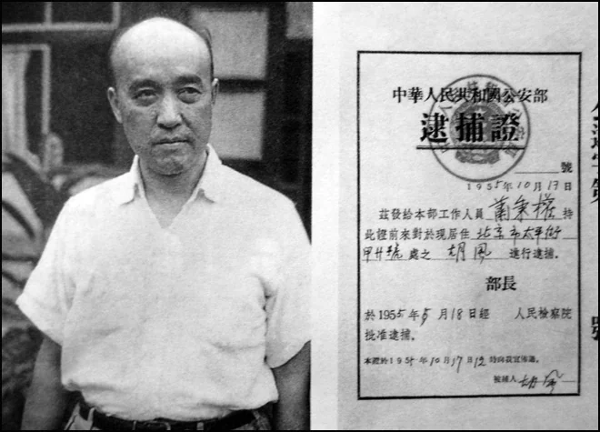
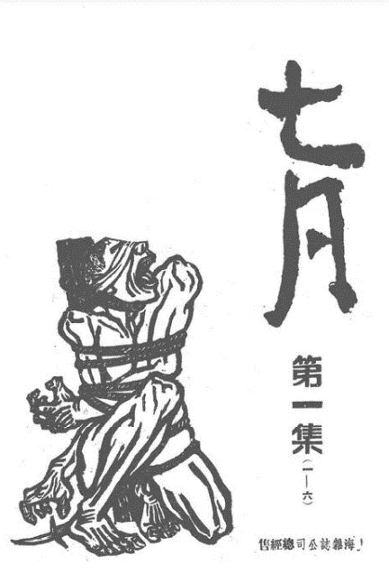
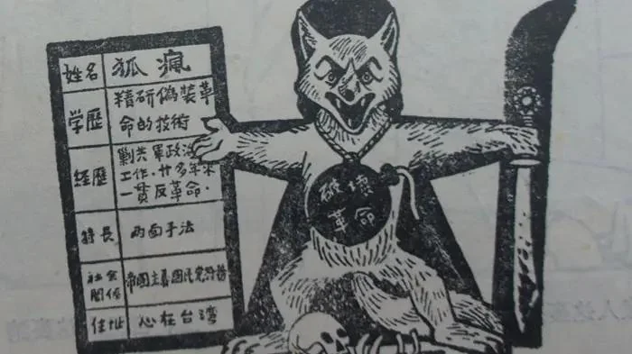
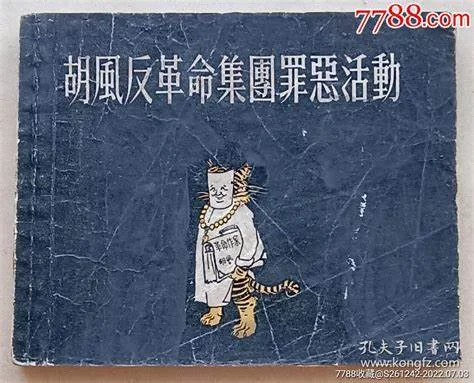

# 胡风的诗

胡风，原名张光人（1902—1985），湖北蕲春人。文艺理论家，批评家。长期在文艺领域工作，创办并主编《七月》《希望》等杂志，出版多本著作。

胡风的创作理念向来与毛泽东提出的红色文艺理论（如文艺为人民群众服务）不太一致。说起来也没什么特别，无非胡风认为在题材的问题上作家应该有充分的选择自由，应根据所熟悉的生活和适于自己创造力发挥的条件去决定写作的题材，以及不要一味将人民抽象化理想化等。1945年开始，双方陆续有过一些争论，如周扬、茅盾、黄药眠、何其芳、胡乔木等人批评胡风的“主观战斗论”，胡风未予理会，仍然坚持自己的主张。

1949年，中华人民共和国成立，胡风写下交响长诗：《时间开始了》。在新的纪元下，他担任了《人民文学》杂志编委、中国作协书记处书记。还是第一届全国政协委员、中国文联主席团委员、常务理事，第一届全国人大代表。

1951年，轰轰烈烈的整风运动开到文艺界，目的是确立毛泽东思想在文艺界的绝对领导地位。11月，《通讯员内部通报》刊登了一些读者给《文艺报》的来信，提出应该对胡风的文艺思想展开批判。1952年6月8日，《人民日报》转载了舒芜的一篇文章《从头学习〈在延安文艺座谈会上的讲话〉》。文章指出，胡风的文艺思想“是一种实质上属于资产阶级、小资产阶级的个人主义的文艺思想”。根据周恩来的指示，周扬召集在京的部分文艺界人士同胡风举行了座谈。胡风不承认自己的文艺思想有什么错误。中共中央决定对其文艺思想做公开批判。1953年，《文艺报》陆续发表了林默涵、何其芳等批评胡风文艺思想的文章，《人民日报》同时做了转载。胡风不服，1954年7月，胡风向中共中央政治局递交了一份30万字的长篇报告，即《关于解放以来的文艺实践情况的报告》（所谓“三十万言书”），对批评进行了反驳。

1955年1月20日，中宣部向中共中央提出开展批判胡风思想的报告。指出胡风的文艺思想“是反党反人民的文艺思想”，他的活动是宗派主义小集团活动。26日，中共中央指出，“胡风“披着‘马克思主义’的外衣，在长时期内进行着反党反人民的斗争，对一部分作家和读者发生欺骗作用，因此必须加以彻底批判”。升级为“反党反人民”。

1955年2月，毛泽东介入，他在一份批示中要求文艺界“应对胡风的资产阶级唯心论，反党反人民的文艺思想进行彻底的批判”。全国性的批判运动全面展开。

此后，毛泽东再次定调，将“胡风小集团”改成“胡风反党集团”（不久又改为“反革命集团”），将文艺思想批判一下升格到政治上对敌斗争，指示中宣部和公安部成立“胡风反革命集团专案小组”。

刘白羽带领公安人员于1955年5月16日对胡风进行搜查，5月17日胡风被拘捕，投入秦城监狱。

同时，专案组在全国各地调查胡风集团的反革命份子，各地掀起了声势浩大的声讨“胡风反革命集团”的运动。共清查了2100多人，逮捕92人，隔离62人，停职反省73人，到1956年，正式认定78人为“胡风分子”。

十年半后，1965年11月26日，北京市高级人民法院判处胡风有期徒刑14年，判决说：“被告胡风早在大革命时期，即投靠国民党反动派，进行反革命宣传鼓动，为国民党的反动政策效劳。后又为首组织反革命集团，勾引公职人员，盗窃国家机密，造谣诬蔑，企图颠覆中国共产党和人民政府对文化事业的领导，破坏人民民主事业，犯有严重的反革命罪行。”此时胡风已经被监禁10年，得以年老体弱监外执行剩下三年多刑期，四天后获假释回家。12月，胡风走出秦城监狱，全家团聚过了一个春节。春节后，胡风夫妇被通知离开北京到四川成都去。不久，文革开始，胡风夫妇被送到成都西边的芦山县苗溪劳改农场监护劳动。1967年11月，四川省公安厅在没有任何罪名的情况下，以原政法机关“包庇”了“胡风集团”为由将胡收监，押至成都，再度入狱。1969年5月，胡风14年刑期已满，给军管会打报告，要求出狱，得到的指示是“关死为止”。1970年1月，胡风以“写反动诗词”和“在毛主席像上写反动诗词”(其实是在报纸空白处写诗)的罪名，被四川省革委会加判无期徒刑，不准上诉，关押于大竹县四川省第三监狱。胡风后在监狱得精神分裂症，多次自杀未果。1973年，胡风妻子梅志被调到胡风身边照顾他。

1978年，胡风被释放出狱。安排为四川省政协委员。胡风对1965年判决不服，于1979年4月向中共中央提出申诉。1980年9月，中共中央做出审查结论，所谓“胡风反革命集团”案件是一件错案。指出：“‘胡风反革命集团’一案，是当时的历史条件下，混淆了两类不同性质的矛盾，将有错误言论、宗派活动的一些同志定为反革命分子、反革命集团的错案。中央决定，予以平反。”而对诸如“胡风的文艺思想和主张有许多是错误的，是小资产阶级的个人主义和唯心主义世界观的表现”；“胡风等少数同志的结合带有小集团性质，进行过抵制党对文艺工作的领导，损害革命文艺界团结的宗派活动”，还有胡风在20年代担任所谓“反动职务”，写过“反共文章”，“进行反革命宣传鼓动”等政治历史”问题”则予以保留，胡风不接受平反文件，拒绝签字。

1985年6月8日，胡风病逝。但胡风的家人对1980年并不彻底的平反、尤其是官方悼词不服，胡风遗体在很长时间内并未下葬。这年4月，经中共中央书记处批准，公安部发出正式撤消了1980年第一次平反文件中对胡风“历史问题”的措辞。

1988年6月18日，中共中央发布《关于为胡风同志进一步平反的补充通知》，正式撤消其个人主义、宗派主义、唯心主义等罪名，“胡风反革命集团”案才被彻底平反。

胡风将他在秦城所居的囚室称作“怀春室”，在长期的监禁生涯里，“离群独居，和社会完全隔绝，又无纸无笔，只好默吟韵语以打发生活。因为只有韵语才能记住，最多是五律和五言排律。合成一部，题名为《怀春曲》。”他自创了一种易于记住的‘连环对诗体’，写完后，反复吟诵，牢记在心。1966年胡风一家迁至四川成都后，“不出门的时候，胡风就将他在狱中默吟的诗句陆续抄出，一边抄一边改。”

以下几首诗选自《怀春室杂诗》

一九五五年旧历除夕

竟在囚房度岁时，奇冤如梦命如丝；
空中悉索听归鸟，眼里朦胧望圣旗；
昨友今仇何取证？倾家负党忍吟诗！
廿年点滴成灰烬，俯首无言见黑衣。

一九五六年春某日

愁思结阱捕狼时，错把陈麻当铁丝;

惯向清泉求活水，敢将敝帚当征旗;

曾经沧海曾经火，只为香花只为诗。

十载痴情成噩梦，春光荡漾上囚衣。

一九五六年五月十七日

竟到周年受谪时，沉冤不白命如丝;

惯从一面窥全面，忍见红旗变黑旗;

发肤已焦犹烤火，舌唇尽裂怎吟诗?

成千手印兼签字，只为循真脱黑衣。

*这一天他写了八首诗

一九五六年秋某夜

又是囚房入夜时，月光如水亦如丝；

梦中恍惚儿颜泪，墙外飞扬帅手旗；

宁向童年哀故友，不将孤烬铸新诗，

只因错把真言发，锁在囚房着黑衣。

一九五六年冬某日

不堪一错各分时，友谊伤残似断丝;

狱室几间关闯将，文场一片树降旗;

东逢死叶西逢茨，拔掉鲜花葬掉诗;

极目两间休荷戟，铁窗重锁失戎衣。

拟出狱志感

其一

长昼无声苦度时，恹恹日影照风丝;

惊闻赦令双行泪，喜见晴空一色旗;

拾得余生还素我，逃开邪道葬歪诗;

牢房文苑同时别，脱却囚衣换故衣。

1957年春某日吟成,北京怀春室1966年某日抄出,北京负曝斋

以下几首诗选自《流囚答赠》。

*《流囚答赠》是胡风到四川成都后，与友人聂绀弩、萧军、熊子民等的和诗、答诗。

次原韵报阿度兄（十二首）

一

竟挟万言流万里，敢擎孤胆守孤城。

愚忠不怕迎刀笑，臣犯何妨带铐行。

假理既然装有理，真情岂肯学无情？

花临破晓由衷放，月到宵残分外明。

次韵答今度(四首)

负曝披风大索居，是非功过总多余。

横眉默读埋名信，剖腹珍藏没字书。

知命不愁高客访，铸情难觉故人疏。

闲花小草皆生意，绿满阶前莫剪除。

次原韵报阿度兄(十二首)

一

竟挟万言流万里，敢擎孤胆守孤城。

愚忠不怕迎刀笑，巨犯何妨带铐行?

假理既然装有理，真情岂肯学无情?

花临破晓由衷放，月到宵残分外明。

二

可笑扬雄贱两都，虚文枉负鬓毛乌。

输他司马留情史，累我降龙闯祸书。

享我清茶而浊酒，管他帝也与王乎?

分香润色怜花草，善与通灵木石居。

三

拈毫至信探三昧，荷戟孤忠走两间。

古物愚顽今物傲，真人创作假人删。

沱、扬、嘉、岷流真水，华、泰、嵩、衡笑假山。

尽可韬光将剑铸，还该息影把门关。

1966年5月24日

*今度及阿度均为聂绀弩

1966年2月胡风赴成都后，聂绀弩曾寄赠诗若干。胡风这组《次原韵报阿度兄》即答诗。现仅见十二首中前九首的聂原诗，部分经聂改动后收入《散宜生诗》。

第一首聂原诗为：

人有至忧易白发，诗经大厄句长城。

十年睽隔先生面，一夕仓皇万里行。

最念风云龙虎日，不胜天地古今情。

手提肝胆轮困血，料倚车窗站到明。

第二首聂原诗为：

子为迁客去成都，吾爱小庄屋上乌。

今日密云风习纪，几人三十万言书。

汤圆抄手当尝了，司马相如有后乎?

一事堪骄杜工部，无须自缮草堂居。

“小庄”为胡风被押赴成都前在北京朝阳门外短期居住的寓所。当时，聂绀弩与夫人周颖曾去看望。

“密云风习纪”即胡风评论集之一《密云期风习小纪》。

第三首聂原诗为：

龄官戏串牢坑里，阿Q人生天地间。

得半生还当大乐，无多幻想要全删。

百年大狱千夫指，一片孤城万仞山。

客子休嗟泥滑滑，河洲定有鸟关关。

次耳兄原韵并慰三郎（四首）

四

厌听装腔假气娇，敢忧雨顺与风调。

定沾贱墨歌三面，且舀清流饮一瓢。

曲径通幽藏鬼伥，深堂保密躲人妖。

宵残小噪君休讶，桀犬闻钟更吠尧。

*耳兄为聂绀弩，三郎为萧军。

作者的夫人梅志在《伴囚记》中谈到这些赠答唱和的诗词时写道：“收到老聂的信，要我们将他的信和诗都烧掉，以免将来受株连。我把他的信都理了出来，望着那红条八行信笺上写的漂亮的蝇头小楷，要将它们付之一炬，很是不舍。……我想了一个办法，将那些信纸一张张分开，用它来包筷子。这样，十多张纸很快就成了两个筷子卷。我想，不管到哪里都可以带走了。”“在第二、三天，我们又收到了老聂的来信。信写得很简短，意思是要我从速将他的诗烧去，并且说以后不再来信了。……情况是不妙的。F(指胡风)要我立即将老聂的诗烧掉。我只好又将它们一张张从筷子卷里揭下来，由F一张张地放在炉子上烧。焚朋友的诗稿，在我们还是第一次。心情是十分沉痛的。F安慰我说，‘你放心，这些诗他会记得的，因为是用心血写成的。’F和他的诗，当然也都记在F的脑子里了。”

附：《时间开始了》选段

《时间开始了》是胡风写作于1949年底到1951年初的大型交响乐式长诗，由《欢乐颂》《光荣赞》《青春曲》《英雄谱》和《胜利颂》五个乐章组成的抒情长卷，其中《欢乐颂》是第一乐章。《欢乐颂》描写了政治协商会议开幕时的欢乐场景，表达了欢呼祖国解放、歌颂毛泽东主席的真挚而热烈的情感，展现了革命前进的艰苦卓绝的历程。

《时间开始了》

第一乐章：欢乐颂

时间开始了——

毛泽东

他站到了主席台底正中间

他站在飘着四面红旗的地球面底

中国地形正前面

他屹立着象一尊塑像……

掌声和呼声静下来了

这会场

静下来了

好象是风浪停息了的海

只有微波在动荡而过

只有微风在吹拂而过

一刹那通到永远——

时间

奔腾在肃穆的呼吸里面

跨过了这肃穆的一刹那

时间！时间！

你一跃地站了起来！

毛泽东，他向世界发出了声音

毛泽东，他向时间发出了命令

“进军！”

掌声爆发了起来

乐声奔涌了出来

灯光放射了开来

礼炮象大交响乐的鼓声

“咚！咚！咚！”地轰响了进来

这会场

一瞬间化成了一片沸腾的海

一片声浪的海

一片光带的海

一片声浪和光带交错着的

欢跃的生命的海

海

沸腾着

它涌着一个最高峰

毛泽东

他屹然地站在那最高峰上

好象他微微俯着身躯

好象他右手握紧拳头放在前面

好象他双脚踩着一个

巨大的无形的舵盘

好象他在凝视着流到了这里的

各种各样的河流

毛泽东

他屹然地站在那最高峰上

好象他在向着自己

也就是向着全世界宣布：

让带着泥沙的流到这里来

让浮着血污的流到这里来

让沾着尸臭的流到这里来

让千千万万的清流流到这里来

也让千千万万的浊流流到这里来

…………………………………

我是海

我要大

大到能够

环抱世界

大到能够

流贯永远

我是海

要容纳应该容纳的一切

能澄清应该澄清的一切

我这晶莹无际的碧蓝

永远地

永远地

要用它纯洁的幸福光波

映照在这个大宇宙中间

海在沸腾

毛泽东

他屹然地站在那最高峰上

那不是挥动巨掌

击落着无数飞箭

而奔驰前进的

火焰似的列宁底姿势

那不是斩掉了一切毒瘤以后

重量和力量的凝合体

泰山石敢当的

钢柱似的斯大林底姿势

毛泽东

列宁、斯大林底这个伟大的学生

他微微俯着身躯

好象正要迈开大步的

神话里的巨人

在紧张地估计着前面的方向

握得紧紧的右手的拳头

抓住了无数的中国河流

他劝告它们跟着他前进

他命令它们跟着他前进

诗人但丁

当年在地狱门上写下了一句金言：

“到这里来的，

一切希望都要放弃！”

今天

中国人民底诗人毛泽东

在中国新生的时间大门上面

写下了

但丁没有幸运写下的

使人感到幸福

而不是感到痛苦的句子：

“一切愿意新生的

到这里来罢

最美好最纯洁的希望

在等待着你！”

祖国

伟大的祖国呵

在你忍受灾难的怀抱里

我所分得的微小的屈辱

和微小的悲痛

也是永世难忘的

但终于到了今天

今天

为了你的新生

我奉上这欢喜的泪

为了你的母爱

我奉上这感激的泪

祖国，我的祖国

今天

在你新生的这神圣的时间

全地球都在向你敬礼

全宇宙都在向你祝贺

雷声响起了

轰轰轰地在你头上滚动

雨点打来了

花花花地在你头上飘舞

祖国呵

为了你

全宇宙都在欢唱

这大自然底交响乐

那么雄伟又那么慈和

飘流在这一片生命的海上

我感到了你巨大的心房

在激烈地鼓动

梦幻的我的眼睛

朝向了右边一瞥

看见了一个老人底侧脸

他的头发象一蓬秋草

他的胡子钢一样翘着

激动得张开着的嘴巴

忘记了动作

我感到了

他的额头上在冒着热汗

我感到了

在我看不到的他的眼睛里面

在燃烧着火焰

我的战友

我的兄弟

我看见了你！

你在臭湿的牢房垂死过

你在荒野的乡村冻饿过

你和穷苦的农民一道喂过虱子

你和勇敢的战友一道喝过血水

你受过了千锤百炼

你征服了痛苦和死亡

这中间

多少年多少年了

但你的希望活到了今天

你的意志活到了今天

今天

激动着你的此刻

你忘记了过去的一切罢

但过去的一切

使你纯真得象一个婴儿

仿佛躺在温暖的摇篮里面

洁白的心房充溢着新生的恩惠

你也感到了

这摇撼着雷雨的大交响底抚慰罢

那是催生歌

也是催眠曲

我梦幻的心

荡漾着一片醉意

越过你的侧脸

飘忽地回到了七月一日的狂风暴雨下面

好猛烈的狂风暴雨

好甜蜜的狂风暴雨

夹着雷声

飞着电火

倾天覆地而来了

被你吹着淋着

是三万个战斗的生命

用歌声迎接你

用欢笑迎接你

用舞蹈迎接你

因为

只有你这响彻天地的大合奏

只有你这湿透发肤的大洗礼

才能满足这神圣的生日所怀抱的大

欢喜

圆形的大会场

象一个浮在大宇宙中间的地球

整列在那边缘上的

湿透了的无数红旗

飘舞得更响更欢

好象在歌唱

飘舞得更红更鲜

好象是跳跃着的火焰

被它们照临着的

三万颗战斗的心

被暴雨洗过

被狂风吹着

也更响更欢

也更红更鲜

突然

那个克服了艰险的历程

走到了胜利的战列前行的钢人

中断了他的发言

用着只有那么镇定

才能表现他所感到的光荣的声音宣

布了：

——我们的毛主席来到！

三万个激动的声音

欢呼了起来

好象是从地面飞起的暴雨

三万个激动的面孔

转向了一边

好象是被大旋风吹向着一点

三万个激动的心

拥抱着融合着

汇成了掀播着的不能分割的海面

圆形海面的边缘

整列着

湿透了的无数红旗

飘舞得更响更欢

好象在歌唱

飘舞得更红更鲜

好象是跳跃着的火焰

它们歌唱着

朝向一点

它们跳跃着

朝向一点

三万个战斗的生命

每一个都在心里告诉自己：

——毛主席，毛主席，他在这

里！

——毛主席，毛主席，他和我们

在一起！

他在这里

在他正对着的那一边

矗立着四幅巨像

——马克思、恩格斯、列宁、斯

大林

劳动人类底四颗伟大的心脏

人类福音底四面神圣的旗子

四幅巨像

前面放射着灯光

正对着他们天才的学生毛泽东

和三万个战斗的生命

所汇成的海面

四幅巨像

背后是无际的天空

黑沉沉的远方

雷声还在隐隐地滚动

电火还在一闪一闪地飞现

四幅巨像

被这大自然底交响乐伴奏着

使我们和大宇宙年青的生命融合在

一起

使我们和全地球未完的战斗连结在

一起

一刹那通到无际……

一刹那通到无际——

今天

毛泽东

他站在这里

头上

轰轰的雷声在滚动

花花的雨声在歌唱

掀播着这声浪和光带交错着的

又一个生命的海

海

掀播着

涌着一个最高峰

毛泽东

他屹然地站在那里

他背后的地球形上

照临着碧蓝的天空

梦幻的我的眼睛

又看见了

那四幅巨像

矗立着

若隐若现

那碧蓝的亮光中间

好象飞来了雷声底隐隐滚动

好象射来了电火底一闪一闪

毛泽东！毛泽东！

由于你

我们的祖国

我们的人民

感到了太空底永生的呼吸

受到了全地球本身底战斗的召唤

毛泽东

你屹然地站在最高峰上

你感到了那个呼吸

你听到了那个召唤

你微微俯着身躯

你坚定地望着前面

前面

是那个唯一的方向

前面

是无数河流汇合之点

你两脚踩着无形的巨大的舵盘

你坚定地望着望着

那上面闪现过了什么呢？

闪现过了一个面影：

赤裸着身子

被绑着送向法场

在英勇地喊着口号吗？

闪现过了一个面影：

被装在麻袋里面

抛到了河里

传来了一声水响吗？

闪现过了一个面影：

双脚被捆了起来

由烈马倒拖着

奔驰而过吗？

闪现过了一个面影：

在草地里陷了下去

儿童的脑袋沉没了

双手还在抓扑吗？

闪现过了一个面影：

在雪山边坐了下来

即刻僵冻住了

定在那里永远不动吗？

闪现过了一个面影：

为了不让敌人发现

用母亲的战栗的手扣住幼儿底咽喉

望着他僵冷下去了吗？

闪现过了一个面影：

抱着炸药包

冲到碉堡底下

让身体和它同时粉碎了吗？

闪现过了一个面影：

把飞舞的红旗插上了敌人阵地

身里的热血同时喷了出来

在旗杆旁边倒下了吗？

一颗挂在电线柱子上的头颅

闪现过了吗？

一具倒毙在暗牢里的尸体

闪现过了吗？

一个埋进土里的半截身子

闪现过了吗？

…………………

…………………

他们

你的战友

你的兄弟

你的同志

艰险的时候想到你

忍苦的时候想到你

受刑的时候想到你

献命的时候想到你……

今天

在祖国新生的温暖怀抱里

他们复活了

踏着雄壮的步子

现出欢喜的笑容

亮着温爱的目光

举起健康的手臂

蜂群似地来了

浪潮似地来了

来了来了

来向你欢呼

来向你致敬

来向你祝贺

毛泽东！毛泽东！

中国第一个光荣的布尔塞维克

他们的力量

汇集着活在你的身上

你抓住了无数的河流

他们的意志

汇集着活在你的心里

你挑起了这一部历史

毛泽东！毛泽东！

中国大地最无畏的战士

中国人民最亲爱的儿子

你微微俯着巨人的身躯

你坚定地望着前面

随着你抬起的手势

大自然底交响乐涌出了最高音

全人类底大希望发出了最强光

你镇定地迈开了第一步

你沉着的声音象一响惊雷——

“全人类四分之一的中国人从此站立

起来了！”

——一九四九、十一月十一日夜十时半，成。     十一月十二日夜十一时，改。 　　在北京。
