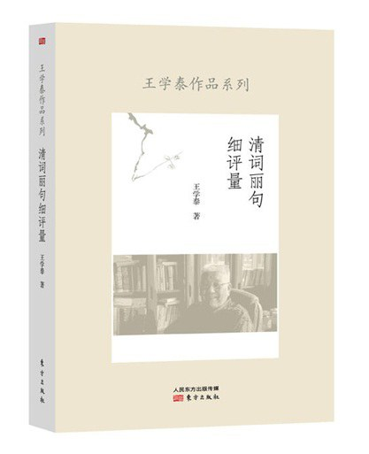

# 二十世纪长恨歌——柏杨先生的旧体诗

二十世纪长恨歌——柏杨先生的旧体诗

摘自王学泰《清词丽句细评量》，东方出版社2015年7月出版

以杂文名世、也以杂文获罪的柏杨却以诗歌创作荣获1992 年美国凤凰城国际诗人联合会“国际桂冠”奖。让一生沉浸于文学的柏杨真有点不知道哪块云彩有雨的感觉。

诗在柏杨的文学创作中确属弱项。他在自己的诗集的序中说：中国人是一个诗的民族，从有文字以来，就有诗篇，迄二十世纪初叶，历久不衰。最大的特征是，几乎每一个知识分子都会欣赏诗，都会做诗。我不能例外，唯一不同的是，我只会欣赏诗，不会作诗。直到身陷绝境。第一首《冤气歌》及第二首《邻室有女》，是在调查局狱，无纸无笔，用指甲刻在剥蚀了的石灰墙上，甲尽出血，和灰成字。

“调查局狱”实际上是看守所，因为案尚未结，看管最严。怕犯人与狱内外相关人士私通消息，没收了一切与记载、传播有关的器具，第一就是纸笔。此时柏杨产生了写诗的冲动，“痛呼父母，穷极呼天”，诗歌大约就是文学中的“天”。诗论家钟嵘在《诗品序》中就讲过，人们遇到种种不幸，受到不公正的待遇，“凡斯种种，感荡心灵，非陈诗何以展其义，非长歌何以骋其情?”巨大的心理郁积要靠诗歌来陶写，柏杨用血肉在监狱的墙壁上写下自己的爱与恨。柏杨第一、二首诗几乎概括了其创作最主要的内容。常说“愤怒出诗人”，《冤气歌》所发抒的就是一股不可遏止的愤怒、愤恨。《冤气歌》脱胎于文天祥的《正气歌》，只是把正气改成冤气，并借古代著名的冤狱与自己的遭遇做对照，感情强烈，如一团怒火，喷薄而出，但艺术上稍嫌粗糙。这类作品恰恰是柏杨诗获奖的主要依据。国际桂冠诗人联合协会会长给柏杨得奖的通知书评价其诗是“一个天赋作家根据真实经验的监狱文学，其中充满坚定的指控和历史研究”。因为这些作品是国家机器迫害人权的证据，它是历史。

柏杨传世的六十多首诗以写监狱生活的为多，描写了国民党专制下关押、审讯、取证、审判等一系列司法过程的野蛮、荒谬。如关押犯人的囚室与方苞《狱中杂记》的清代“刑部狱”几乎无别：

囚室

重锁密封日夜长，朦胧四季对灯光。

天低降火类炉灶，板浮积水似蒸汤。

起居坐卧皆委地，呻吟宛转都骨僵。

臭溢马桶堆屎尿，拥挤并肩挥汗浆。

身如残尸爬黄蚁，人同蛆肉聚蟑螂。

群蚊叮后掌染血，巨鼠噬罢指留伤。

暮听狂徒肆苦叫，晨惊死囚号曲廊。

(自注：“政治犯枪决时，总在凌晨天色将明未明时执行。”)

这种拘押犯人的监室发生在20 世纪下半叶，真是对人类文明的亵渎。监狱状况是一个国家文明程度的标志，网上有一篇文章名为《我在英国坐监狱》，一个在英国犯了“超速行驶罪”的中国人写的，他笔下的英国监狱除了限制人身自由外，其他一如旅店，连犯人吃饭都是头天预订。作者随便订了一份通常的英国饭，同号的黑人就好意地告诉他：你是中国人，我们监狱中没有中餐，可以叫狱方到饭馆去订，不能歧视你。作为一个中国人，读了这段真是觉得不可思议。然而这就是文明。

柏杨诗昭示了国民党专制的野蛮。审讯时，这一点尤为突出：

小院

男子剥衣坐冰块，女儿裸体跨麻绳。

棉巾塞口索悬臂，不辨叱声与号声。

除夕

人道人权一笔勾，斗室恰如刀俎场。

毒言詈语能挫骨，坐冰压趾两相忘。

互证相符织成线，空言狡展结文章。

自动招认夷狄法，坦承不讳传统方。

何患无辞肉喂虎，欲加之罪狼食羊。

裸女跨绳(小时候也听说过国民党侦缉队对女犯搞这种酷刑，令人不寒而栗，掌此刑者，真非人类，没想到还把这种酷刑带到了台湾)，赤体坐冰等骇人听闻的刑讯即在古代也是法律所不允许的，属于法外酷刑，只有酷吏才搞，而酷吏是不被社会认同的，大多也没好下场。

重证据还是重口供是现代法治与古代“刑治”(有人也称“法治”，但这种“法”就是齐整百姓、治理天下的鞭子)的重要区别。国民党政府也自称是实施“法治”的，也有《六法全书》，但在审判中重的还是犯人“招认”(用法律语言说就是自证其罪)，而取得“招认”的手段则是酷刑。柏杨案的判决更是荒唐，脱离案由、不论证据，完全是法官的“自由心证”。柏杨案由本是文字狱，在翻译漫画《大力水手》时涉嫌讽刺蒋介石父子。然而以文字加罪于人毕竟违反现代文明，拿不出手，摆不到世界台面上来，最后是按照《戡乱时期惩治叛乱条例第二条第一项》起诉的，变成了“匪谍案”：

冤气歌

二十年前事，当时已朦胧。

清算复锻炼，现出新内容。

受训有学院，参加有民盟。

逃亡有路费，居住有叮咛。

上海闹恋爱，北平又立功。

好友成间谍，台湾追人踪。

诗中所述就是在酷刑下柏杨“自证其罪”所编造的故事：在逃台前，我参加了民主同盟，接受了共产党的训练，还受到奖励。后跑至上海，受民主同盟负责人许逢熙领导并与其女秘书恋爱。这个故事足以使其丧命。最后只是证据不足，判十二年有期徒刑，剥夺公民权八年。

闻判十二年

刀笔如削气如虹，群官肃然坐公庭。

昔日曾惊鹿为马，而今忽地白变红。

兀狼有权制冤狱，书生空恨无强弓。

自怜一纸十二年，迎窗冷冷听秋风。

(一判决书：姑念情节轻微，免死，处有期徒刑十二年)

气势如虹的法官似乎在维护“国家”法治，无比严肃，其实柏杨一案连“罪名”都变来变去，从所谓“侮辱国家元首”罪到“参加叛乱组织”罪，这样的法律还有什么严肃可言?一切都是为政治服务，说直白些就是为当权者服务，惩治他们所厌恶的人，所以还是鲁迅准确：“我以为法律上的许多罪名，都是花言巧语，只消以一语包括之，曰：可恶罪。”

柏杨描写冤案经历的诗歌很注重现场描写，留下真实的记录，在艺术上却显得“质木无文”，但由于表达直率也自有其震撼力。柏杨被判刑之后，转到专关押政治犯的绿岛去监禁，这里本来叫火烧岛，是个荒岛，后被国民党政府开发为“国防部感训监狱”，条件极其艰苦。柏杨细致地描写了押运过程：

我来绿岛时，状如待烹狗。

胸背缝数字，一三一二九。

两人共一铐，绳索缚双肘。

满目皆兵卫，飞机压顶吼。

巨舰载千里，横卧甲板首。

烈阳似火烧，甲板烫炙手。

阵雨衣尽湿，阵风百骨抖。

历尽三昼夜，仍见笑开口。

犯人被剥夺了一切尊严，真如鸡狗。绿岛是严管犯人的“劳改场”，其条件较台北监狱更为恶劣：

我在绿岛

我在绿岛时，改服黑衣裳。

编号二九七，一一剃发光。

重犯十数人，独锁六区房①。

囚室仅容身，旋转苦彷徨。

寒风刺肌骨，海雨透铁窗。

偶闻浪声急，百折断回肠。

寂寥日复日，日日对寨墙。

不知人世事，唯怀父母邦。

(自注：①国防部绿岛感训监狱，为放射状二层四角大厦，一角称一区，六区在二楼，专囚重要政治犯)

一个作家竟成了“重要的政治犯”。柏杨还写了监狱的日常生活，如写女儿来探监：

几番铁链过门前，几番哀号震铁栏。

肠萦女儿悲离别，魂惊鞭后咽寒蝉。

天上千年如一日，狱中一日似千年。

到此人生分岁月，听风听雨两茫然。

这大约是还在审讯期间，正是度日如年之际。女儿也是初次看到父亲的犯人模样，引起了巨大恐惧和悲痛。家人挂念监狱的亲人，犯人秉笔写家书时内心充满了矛盾：

家书

伏地修家书，字字报平安。

字是平安字，执笔重如山。

人逢苦刑际，方知一死难。

凝目不思量，且信天地宽。

对于犯人来说，他直接的社会关系就是一起关押的狱友，柏杨写给狱友的诗极亲切：

重逢

君自泰源来①，我自景美至②。

昔日同铁窗，今日再逢此。

承君频询问，告君别后事。

某人尚未判，某人镣压趾。

某人定无期，某人已伏死。

某人妻绝裾，某人母殁世。

某人女沦落，某人子乞食。

都在缧绁中，相劝莫泪湿。

(自注：①台湾省台东县泰源乡有一监狱，亦囚政治犯，此狱于1971 年改收普通犯，将政治犯移解绿岛。②景美，即台北县景美镇，台湾警备总司令部军法处和军法处看守所，均在此处。柏杨囚此四年之久)

后来柏杨在自传中也多次提到他的一些狱友。

柏杨狱中诗特别感人的部分是写给女儿和岛内外援救自己的梁上元、陈丽真、虞和芳、孙观汉等人的诗篇。特别是孙观汉本是美国原子物理学家，与柏杨无亲无故，完全出于道义，投入援救运动，持续多年，直到他走出绿岛。柏杨回到台北，写了一首《寄孙观汉》：

今日踉跄回台北，人物都非两渺茫。

去时家园如完瓯，于兹覆巢鸣寒螀。

念我身老童心在，仍将丹忱酬热肠。

先把无穷感恩意，第一修书报孙郎。

十年一梦，家与事业全都完了，在苦难中柏杨意外得到了友谊。大约也正是这些相识与不相识人的热忱，才使他保持了童心、保持了对爱的期待。《出狱前夕寄陈丽真》也极感人。陈丽真仅仅是他的一位读者，但从柏杨入狱起，坚持给他送饭、探监，为其冤案平反奔走，其间她遭受过特务、军警的恫吓，家人的不理解，然而她坚持了下来，把这件善举做得有头有尾：

我昔登车时，君送楼梯右。

惊恐满双目，频频绞双手。

我家骤然破，我命悬刀口。

茫然无凭依，赖君为奔走。

曾被官传问，又被警押肘。

君独无所惧，仍探狱中叟。

名虽为师生，情如兄妹守。

君儿为我甥，君婿为我友。

我幸留残年，已成丧家狗。

接我千里外，安我北窗牖① 。

义深难为谢，无力置杯酒。

唯盼天晴日，同拂洛阳柳。

(自注：①陈丽真在家腾出一室，安顿柏杨，并函告柏杨，将亲赴绿岛狱门迎接，后经有关人员劝阻，改赴高雄迎接，失望而归)

像陈丽真这样的义人，自古以来也不多见。一个弱女子要有多大勇气和定力，为一个本不相干的老头儿做出如此大的牺牲，我读柏杨诗和柏杨监狱经历时都为陈丽真内力的强大而震撼。《看，那个丑陋的中国人》中说：“在景美军法处看守所，政治犯倾巢南下的前几天，陈丽真冒险又一次送来了日用的盥洗用具，使举目无亲的他，被囚入火烧岛政治监狱的那天，在亲友调查表中，得以写下陈丽真的名字。台湾两千万人中，她是柏杨唯一的亲人。”这次陈丽真也没有接到柏杨，虽然刑满，但政府仍不放过他，把他放在监狱隔壁的“管训队”做管训“教官”，这个“官”连离开绿岛回家探亲都不被允许。

迫害与苦难并没有把柏杨炼成铁石心肠，读者从《邻室有女》这首诗可以感受到经历了无数苦难的豫中汉子感情细腻的一面。其小序云：“调查局监狱，位于台北三张犁，各房间密密相连，却互相隔离，不通音讯。稍后颇闻女子语声。有感。”诗云：

忆君初来时，屋角正斜阳。

忽听莺声啭，蓦地起彷徨。

翌日尚闻语，云购广柑尝。

之后便寂然，惟有门锁响。

初响是提讯，细步过走廊。

再响是归来，泣声动心房。

君似患喉疾，咳嗽日夜扬。

日嗽还可忍，夜嗽最凄凉。

暗室幽魂静，一嗽一断肠。

我本不识君，今后亦不望。

唯曾睹君背，亦曾系君裳。

同病应相怜，人海两渺茫。

我来因弄笔，君来缘何殃?

君或未曾嫁?眼泪遗爹娘。

君或已成婚，儿女哭母床。

今日君黑发，来日恐变苍。

欲寄祝福意，咫尺似高墙。

君应多保重，第一是安康。

愿君出狱日，依然旧容光。

女性的社会主动性一般弱于男性，监狱中女犯也远少于男性。看守所突然来了一个女犯，而且是少女，这引起男犯的关注是很自然的。应该说柏杨的关注是出自诗人角度，是对美和弱者的关切。监狱四壁高墙，剥夺了犯人“看”的权利，于是听力就特别敏感。此诗前半首就描写“听”到的关于女犯的种种声音。娇如黄莺的话语声，沉重的铁门声，走廊上细碎的脚步声，这些使我们想起当年越国秀女，穿着木屐，蹀躞在馆娃宫响蹀廊中，声音清脆，身材窈窕，激起读者对美的想象。如此美人，被打入连壮汉都能消融的“调查局狱”，会有什么结果?自然不难推测。接着描写被审讯后的情状。女犯审讯后，掩泣而归，她受到了恫吓、侮辱，甚至刑讯?哭声已经让人揪心，咳嗽声，特别是夜深人静后的咳嗽，更令人震颤。这些都是因为闻其声而引起的推度之词，但这种不确定想象使得诗人所表达的关切之情更具有张力。诗人希望的是，美不要被苦难摧毁。当然这只是诗人的一厢情愿，监狱用不长的时间就能改变许多东西。《邻室有女》这种低回婉转、缠绵悱恻的叙事风格颇有古乐府风范。有人说柏杨的获奖实际上是因为这首诗。

柏杨诗五言优于七言，五言更擅长表达细腻的、缠绵往复的情感。柏杨常说他是野生动物，很粗糙，带有蛮性遗留，但其诗细腻的一面更感人。

附

柏杨：从“国民党特务”到“匪谍”

在抗战中，国共两党都在大力争夺知识青年。国民党处在主流地位，名分与物质条件好;共产党有高远的理想和意识形态，宣传技巧与力度都远胜于国民党，在青年学生中的口碑也好。两党各有所长，柏杨追随了国民党是有点偶然性的。

柏杨先生2008 年4 月在台湾新店耕莘医院逝世，两年后人民文学出版社出版了二十五卷本的《柏杨全集》，除了他翻译的《资治通鉴》外，其余作品囊括殆尽。第二十四卷主要是“柏杨回忆录”。

柏杨一生备经苦难，极富传奇性，我读其自传最感兴趣的是两件事：一、抗日战争时，像柏杨这样自称“野生动物”、颇有反抗基因的青年，怎么追随了国民党，而没有选择当时尚处于弱小、但却是抵制主流、或明或暗与国民党及其政府对抗的共产党?二、柏杨的冤案。这是20 世纪六七十年代台湾文坛的一件大事，柏杨以写杂文得罪国民党当局，犯了鲁迅所说的“可恶罪”，使他以“匪谍罪”坐牢九年零二十六天(1968.3.7—1977.4.1)。

柏杨虽出身于中产阶级的家庭，但其不幸源自幼年丧母，很小就受到继母的极度虐待。父亲的关照只能增加继母对他的仇视，于改善生活待遇无补。父亲将他送回老家河南辉县，由于性格孤僻(柏杨自称“个性顽劣”，不乖、不服管，所以“姥姥不疼，舅舅不爱”)，再加上教育制度上的问题(教师体罚和得罪校长被开除)，少年时的柏杨就有了一种叛逆意识。因为生活不稳定，数度迁居，转学与升学就成为柏杨最头疼的关隘。为了过关，他数次伪造学历证件，伪造证件在民国时期是较严重的违法行为。叛逆性格与违法行为逐渐地把柏杨推上与主流社会相对抗的位置，在社会动荡之际，这类人很容易参与革命或造反活动。

抗日战争打响后，柏杨正上高中，由于爱国激情，更是为了寻求出路，摆脱“假文凭案”可能爆发的威胁，他参加了设在南阳县的“军事政治干部训练班”。这个班训练三个月，毕业后“省政府负责派任工作，最高可当联保主任”。在训练期间，“我第一次受到共产党那种神秘的和温暖的触摸”，“比我高一班、功课好得人人尊敬的同学张纯亮，把我叫到一个角落，搂着我的肩膀，低声告诉我，共产党在陕北有一个高尚的革命圣地，全国优秀青年从四面八方涌向那里，参加真正的抗日工作，问我愿不愿意也去参加”。当时他正崇拜蒋介石(西安事变极大地提高了蒋在人们心目中的地位)，“张纯亮提醒我说：‘共产党也是拥护蒋委员长的，你没有看报吗?’张纯亮把陕北描绘成一个美丽乐土，大家像兄弟一样地互相照顾，那是一种革命感情”。

看来柏杨完全有机会成为一个“三八式”的共产党干部。如果他真的与张纯亮去了延安，如果在延安不出问题(不过就柏杨桀骜不驯、又特别较真的性格来看，延安整风时说不定会出问题)，建国后大约就是个厅局级的干部。不过，就在出发的前一刻张纯亮被捕了，以后就再也没有他的消息了。

柏杨有些遗憾地说：“伟大的陕北革命圣地没有去成(这是我一生中唯一可能加入共产党的机会)。”在抗日战争中国共两党都在大力争夺知识青年。国民党处在主流地位，名分与物质条件好;共产党有高远的理想和意识形态，宣传技巧与力度都远胜于国民党，在青年学生中的口碑也好。两党各有所长，柏杨追随了国民党是有点偶然性的。

国民党经过“以俄为师”的孙中山改组后，也属于组织类型的政党，但其组织的技术、技巧和能力远逊于共产党，可以说连一半也不到。何方先生的《从延安一路走来的反思》中描写了延安整风前“丰富多彩的精神生活”。这里有“遍地的歌声”“经常的集会”“活跃的文体活动”“民主的气氛和实践”“平等的人际关系”“军事化的生活片段”，朝气蓬勃，从这种氛围来看，就是一派打天下的气象。青年经过训练培养，便被派往各个工作岗位，被派到敌后根据地，很快就能开辟出一块天地。

我听一位老共产党员说，1942 年日军“扫荡”时，许多根据地组织被破坏。他就拿了一封组织介绍信，到“平北”(北平以北的广大地区)来主持开辟和恢复工作，很快就把已经破坏的组织重新建立起来。

柏杨在国民党中经多次培训，先是战干团，后来又被送到培养三青团干部的“青干班”。前者蒋介石曾经亲临，后者是国民党中央主持的政治培训机构。但都混乱不堪，在敌机轰炸中手足无措。在敌人大举进攻时，学员被仓促派遣。这些都说明其办班计划性不强，组织机能极差。

柏杨被派回已沦陷的河南老家开展敌后工作。他感慨“既没有教给我们求生的本领，也没有教给我们任何组织宣传的训练，就把我们送到日本占领军地区，像驱逐一群羔羊到狼群里一样，任凭我们自生自灭”。柏杨很快在家乡暴露了身份，跑进大山开展工作，但不知要做什么。“中央团部也没有告诉我们如何去办，只是把一些油印的文件，千辛万苦地颁发下来。可怜我们这群年轻人，连公文都不会写(就是会写又有什么用)，我们不过是被牺牲的棋子，中央团部潦草塞责、随随便便地派遣，表示又成立了一个分团，如此而已。”从这些地方可见，作为组织类型的政党，国民党是不够格的。

后来柏杨辗转来到大后方重庆，渴望上大学，于是利用机会，伪造文件，把自己“保送”到东北大学，以圆大学梦。当时左派学生认为柏杨是国民党特务。20 世纪90 年代初，我曾与最近故去的徐放先生(当时也是东北大学学生)谈起柏杨。徐先生说：“柏杨是国民党特务，被派到东北大学的。我们和他们有斗争。前年我去河南，从辉县路过，看到车站上有个大牌子标示‘柏杨故里’。我把站长找来，要他们把牌子去掉。”(徐当时是《人民日报》群工部主任)我读了回忆录，感到徐放等左派高估了国民党的组织能力。柏杨到东北大学上学只是个人行为。当时他在教育部战区学生招致委员会当小职员，负责审查沦陷区来的大学生，证件合格的便报到教育部，由教育部分配到各大学。想上大学的柏杨突发奇想：每天把那么多沦陷区来的学生发往各个大学，为什么不把自己也派发到大学去呢?于是他把从南京来的中央大学政治系郭大同的证件，改为郭衣洞，发到教育部。当时南京已沦陷，无从对证。

抗战胜利后，教育部迁回南京，发现柏杨伪造证件，便永远开除学籍，而且令任何院校不得收容。可见并非如东北大学地下党和左派学生想的那样。在“东大”柏杨确实与左派学生发生过冲突，有时还很激烈。柏杨说：“那时，我们几个志同道合的同学在学校组织了一个‘祖国学社’，是一个专门和左倾同学对抗的学生组织。”两方争什么?“祖国学社的成员满腔热血地要爱自己的祖国，来和共产党热爱国际的口号对抗。”“有时候左倾同学把祖国学社的壁报半夜里砸毁，祖国学社的同学也用同样的手段，半夜里把他们的壁报撕烂。”无怪作为左派的徐放，数十年后，仍然对柏杨那样切齿。国人对“祖国”“国家”“政府”等历来很少区分。抗战期间，毛泽东也讲过“爱谁的国的问题”，告诫人们不要爱“蒋介石的国”(见《庐山会议实录·7 月31 日常委会》，河南人民出版社，1996 年)。因为《共产党宣言》宣称“工人没有祖国”，当时共产党都是共产国际的支部，中共当然要强调国际主义，于是这就成了当时左派、右派之争的焦点。由于意识形态的对立，组织上又属于蒋介石嫡系，所以柏杨在沈阳解放后，跑到北平，北平又解放，他在北平又待了一二十天后，拿着认为“国民党气数已尽”的同伴的十四块银元逃离北平，南下上海，从上海入台，成了后来的“台湾同胞”。

国共长期对立，互相打入对方内部，做情报工作。前面说过国民党组织能力弱，原本它只是一些政治力量和社会集团的联盟，后虽经过改组，但其内部派别纷杂、矛盾纠结的病根并未完全清除，这就给共产党预留下潜伏的空间。而共产党后起，它是在共同政治信念的基础上建立起来的，整体性强，国民党的秘密组织很难进入。国民党丢失大陆、败走台湾，这也是一个重要的原因。1949 年之后，国民党接受大陆失败的教训，竭尽全力控制台湾，长期实施戒严，注重对来台人员的清理，弄得人人自危，称之为“白色恐怖”。这是柏杨冤案的前提和背景。如果在法治社会，这一切可以通过法律手段有序地进行，而在专制社会，防止敌对势力来袭就可能衍化成为统治者或执法者手中的一根棍子，想打谁就打谁，不仅伤及无辜者，甚至连自己集团内的人也难以避免。

柏杨案的直接导火线是为美国连环漫画《大力水手》释文做的翻译。漫画情节是父子沦落到某海岛上，两人还要竞选总统，竞选演说的开端语“fellows”(伙伴们)，柏杨译为“全国军民同胞们”，这一下捅了马蜂窝，因为这是蒋介石讲话时的惯用语。特务抓住了把柄，“侮辱元首，动摇国本”，把他抓了起来。当然这只是个由头，其根本原因在于柏杨写杂文，挖苦讽刺了国民党独裁专制和腐败(如《立正集》中的杂文)，被掌权者判定为“可恶”。如果按照组织路线来说，柏杨属于两蒋的嫡系，但其长期处于底层，对国民党的腐败和在大陆的失败有深刻的了解，痛恨专制制度对人性的扭曲。其思想倾向于自由主义，同情雷震，可以说柏杨组织上入了国民党，但思想上不仅未入，而且时时与党的领袖离心离德。柏杨谈起对蒋介石的看法时说“他老是自己订的法律，自己不遵守。就好像他是公司的老板，他规定墙角不许撒尿，他高兴起来就往墙角撒一泡，好表示他是这家公司的老大。我觉得真是既肤浅而又愚昧”。有这种想法，能不反映到其创作中?冤案发生后，由于孙观汉(帮助台湾建设“原子炉”的美国物理学家)介入，为柏杨打抱不平，弄得举世皆知，在为柏杨定罪时，如果以思想文字定罪，拿不上桌面，不仅大悖现代政治文明，而且平常以“自由中国”自诩，兴文字狱，等于自掴其面。为了面子，最后还是按“匪谍”(所谓参加“中国民主同盟”)定罪。

可见两大政治集团的斗争，仍是能拿上台面来说事的。两大政治集团斗争的大背景，对大陆也有影响。可悲的是，当年参加东北大学地下党的徐放先生20 世纪50 年代被卷入胡风反革命集团案，中共视其为国民党反动派在大陆的代理人，被关押和劳改，前后二十余年。
