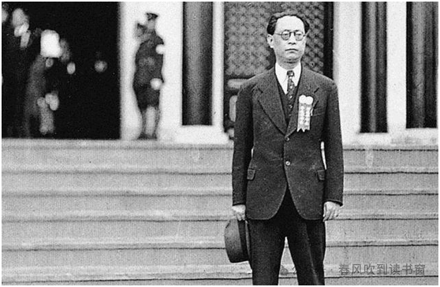

# 周佛海狱中诗作

周佛海狱中诗作

周佛海（1897-1948），湖南沅陵人，早年留学日本鹿儿岛第七高等学校。1920年，上海共产主义小组成立时即为成员。1921年7月参加中国共产党第一次全国代表大会。会后回日本求学，毕业于京都大学经济系。1924年，周佛海回国任中国国民党中央宣传部秘书。同年，退出共产党，加入国民党。
1926年北伐军攻占武汉后，周佛海任中央军事政治学校秘书长兼政治部主任。1927年，任南京中央陆军军官学校总教官。1929年后，历任国民党政府训练总监部政治训练处处长兼总司令部训练主任、江苏省政府委员兼教育厅长、国民党中央党部民众训练部长、国民党中央宣传部长等职。1938年底，随汪精卫投敌。1940年后，历任汪伪国民党中央执行委员、汪伪政府警政部长、行政院副院长兼财政部长、中央储备银行总裁、上海市长、上海保安司令、物资统制委员会委员长等职。在汪伪政权内，实权仅次于汪精卫、陈公博。
日本投降后曾被蒋介石任为上海行动总队总队长。后在舆论压力下被捕。1946年被国民党南京高等法院以“通谋敌国、图谋反抗本国”罪判处死刑。次年，蒋介石因其在抗战中后期“有功”签署特赦，改判无期徒刑。1948年2月病死于南京老虎桥监狱。周佛海有写日记的习惯，1986年，中国社会科学出版社出版了《周佛海日记》收录了他1937、1938、1940—1945年的日记。1991年，中国文史出版社出版了《周佛海狱中日记》，为1947年1月至9月，其在国民党政治看守所和老虎桥监狱服刑期间所撰写的日记以及他在狱中写下的诗作。
周在日记中对1938年至1947年的重大事件进行了追记，尤其是汪伪政权建立、内部运作及垮台过程，以及周佛海与重庆方面的秘密联系。日记内容还包括周佛海对自身“曲线救国”行为的辩解、狱中生活细节、对国共内战局势的观察，以及对生死判决的心理挣扎。日记采用文言与白话夹杂的文体，也有一些他的即事感怀诗作，兹将部分诗作摘录如下：

题虎桥披襟集

其一

午窗读罢几徘徊，狱里生涯亦可哀。

往日情怀今日泪，一齐收入句中来。

其二

南冠无计遣烦忧，午夜吟哦不自休。

屈子骚篇工部句，流传端为写穷愁。

中秋偶成〈1947年9月29日》

其一

墙高窗小天如井，月缺月圆意不留。

况值云阴人卧病，儿忘今夕是中秋。

其三

幽系多闲感不禁，况逢佳节倍伤心。

无端更听潇湘曲，月满前山泪满襟。

狱中生日

惊心狱里逢初度，放眼江湖百事殊。

已分今生成隔世，竟于绝路转通途。

嶙峋傲骨非新我，慷慨襟情仍故吾。

更喜铁肩犹健在，留得负重度崎岖。

狱中即事

画角声中笑语哗，一行列阵似长蛇。

相逢即便询消息，接见无由剩怨嗟。

狱吏渐亲聊作友，独居己惯俨如家。

黄昏酷暑门深锁，夕照盈窗透铁纱。

忆西流湾故居

月明人静柳丝垂，彻耳蛙声仍旧时。

底事连宵鸣不住，伤心欲唤主人归。

虎牢接见

其一

见前欲语事偏多，对面却忘可奈何。

相视无言情脉脉，一窗人似隔天河。

其二

嘘寒问暖意温柔，话纵伤心泪忍流。

狱吏无情催客去，可怜一步一回头。

移居老虎桥监狱周年志感

乍入虎牢惊转喜，新交旧识竞相迎。

纵教踪迹分南北，何幸精神托死生。

深院无花惟月色，长空有雁和风声。

一年又见秋光老，久住成家亦慰情。

听到妻子在上海被软禁——

无题

异地同时作楚囚，云天雁断恨悠悠。

痴心欲化嘉陵水，流到春申好聚头。

无题

四月枇杷三月鲥，去年千里费相思。

系囚也是江南好，春水一篙翠满枝。

夜雨感怀

夜雨潺潺似急流，灯昏室小比孤舟。

尽教洒尽天河水，难洗人间万种愁。

九月三十日由沪赴渝二周年志感

转瞬青枫两度红，年来世变太匆匆。

悲欢弹指如秋露，衰盛循环悟疾风。

无意偷生偏卧病，有怀长系但书空。

幼时听说黄梁梦，今日才知在梦中。

狱中书怀

起卧由人命付天，群鱼濡沫亦堪怜。

室因窗小弥嫌热，吏为官卑更弄权。

忍气但凭心漠漠，宽怀莫负腹便便。

花开花落非吾事，只觉炎凉自变迁。

梦中

梦中忘却楚囚身，犹是当年碌碌人。

饥溺关怀伤力绌，簿书鞅掌叹才贫。

退戎未遂长惆怅，排难多艰剧苦辛。

一觉醒来如释重，残灯孤影倍相亲。

病中偶成

病床转侧几寻思，起坐中宵夜漏迟。

忧患童重生亦苦，疮痍处处死何悲。

寸心难了惟家国，半世饱经是别离。

永巷沉沉人尽寐，凄凉怀抱一灯知。

病榻感怀

那堪愁病久相萦，惭愧仁功两未成。

半世艰危缘果断，一身烦恼为多情。

率真本易招嫌怨，专信翻难托死生。

人事迷离浑莫解，敢云误我是聪明。

狱中卧病复逢奇热

偶成一律聊以自遣

盛衰从古最难知，哀乐全凭自主持。

病苦敢忘求药意，舟沉莫忆满帆时。

秋风有约来何晚，酷暑无情去太迟。

留得微躯长健在，关山万里任驱驰。
