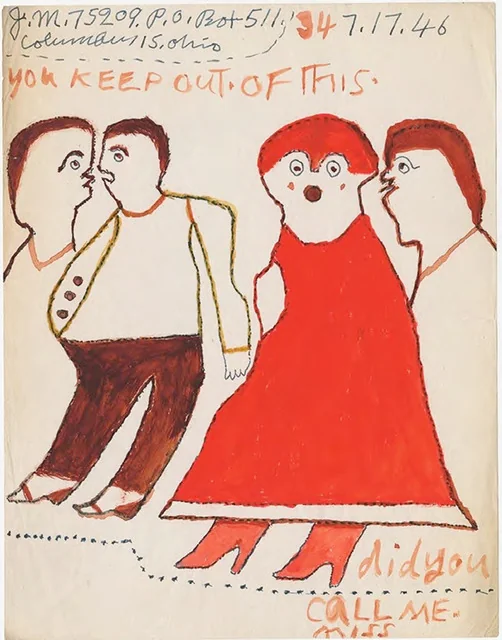
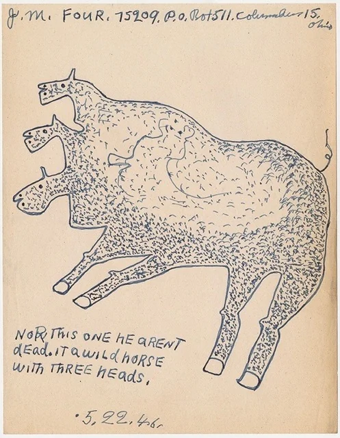
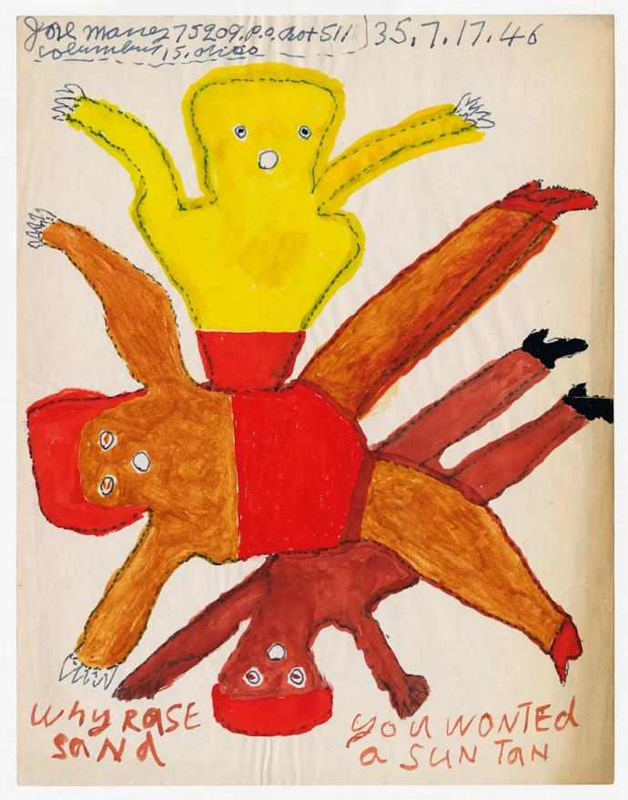
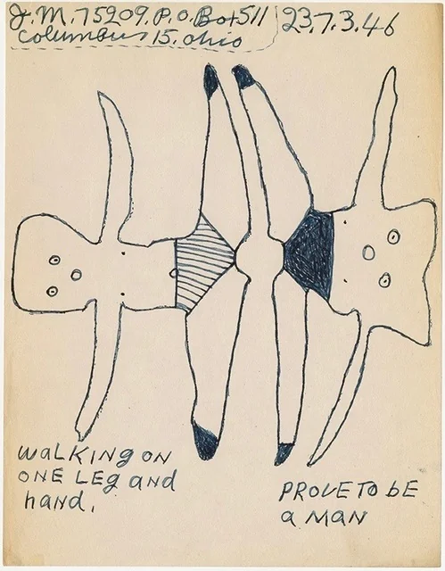

# 乔·梅西的原生艺术

​乔·梅西（Joe Massey），非裔美国人，1895年生于德克萨斯州。1918年，在阿肯色州小石城，梅西试图开枪杀死自己的妻子，却意外击中了另一个女人。乔·梅西因此以谋杀罪被判处10年监禁。但他只服了一年刑就越狱了。大萧条期间，他想办法在工程进度管理处（ Works Progress Administration) 找到了一份工作。

逍遥法外20年后，1938年，在俄亥俄州的托莱多，梅西开枪打死了他的第二任妻子杰西·贝茨，并伤害了她的男伴。他逃脱了死刑，但被判无期，在俄亥俄州立监狱服刑。俄亥俄州立监狱囚犯登记册上的记录显示，梅西的案件于1965年改判，之后他在马里恩惩戒所继续服刑5年，1959年被假释。此后，再没有关于他的记录，没有人知道梅西从监狱获释后做了什么，以及他于何时何地去世。

服刑期间，梅西开始画画，用金属笔蘸墨水在监狱能得到的纸张上创作，也有少数画作用蛋彩画颜料绘制。

1940年代初，梅西开始向曼哈顿东53街的超现实主义杂志《观点》（View）寄去自己的画作和诗歌，《观点》由查尔斯·亨利·福特（Charles Henri Ford，1908-2002）创办并负责主编。

福特欣赏梅西的画作，时常发表他的画，不时还会附上他的信件内文。

如 1943 年 12 月号的《观点》上刊载的这封信：

先生，关于这串数字（他总是在他的名字后面签上他的囚犯编号：

75209），关于我名字后面的这串数字，他昭示了一个事实：

我犯了一个大错误。

是的，我犯有二级谋杀罪。

但我正在努力变好，正在努力克服过去的错误，并通过学习和写作来救赎自己。

梅西还告诉福特，他一直在研究玛丽·贝克·埃迪 (Mary Baker Eddy) 的《基督教科学》(Christian Science) 的教义，他还透露他做过餐厅服务员。

另一封信中，梅西写了一首诗：

一张昭示真理的画

那么美好

它会成为人们的朋友

那将是永恒的友谊

几年前，纽约艺术品经销商基思·德·莱利斯 (Keith de Lellis) 发现了梅西的画作，并在曼哈顿的Ricco/Maresca画廊为他做了个展，展出了梅西目前已知存世的 42 幅画作。
