# 南非前总统曼德拉的狱中画作

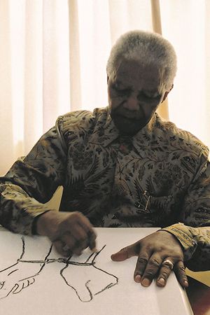

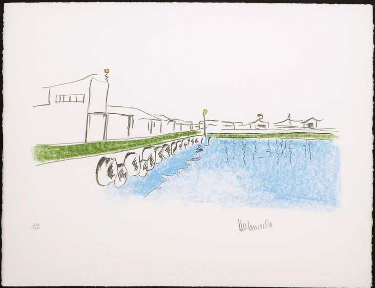

​南非前总统曼德拉（1918-2013年）

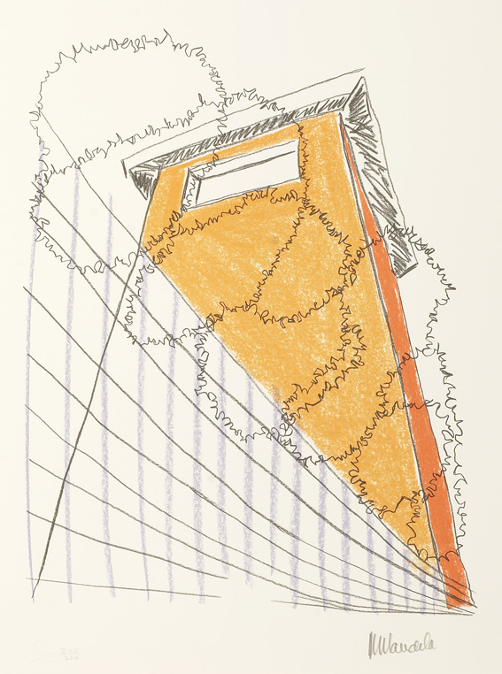

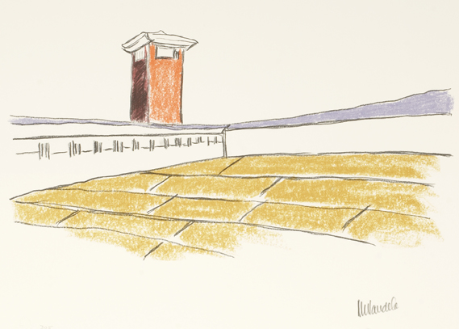

除了是享誉世界的政治领袖外，曼德拉还喜爱绘画。27年的铁窗生涯中，他用木炭和蜡笔创作了大批小尺幅的手绘作品，讲述自己的铁窗故事。

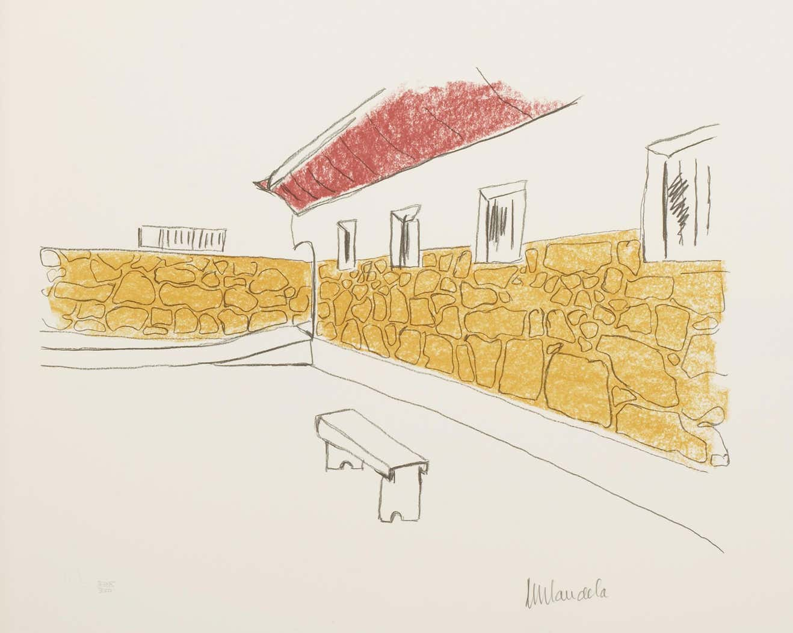

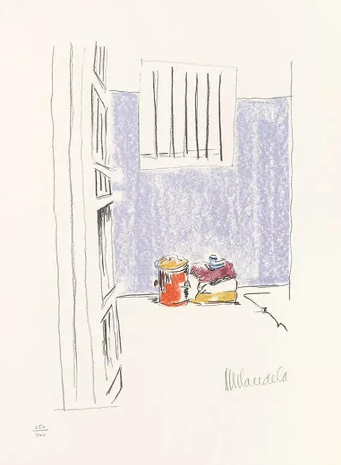

曼德拉用明亮轻快的色彩来表现自己乐观积极的心态。画面线条简单、色彩丰富。

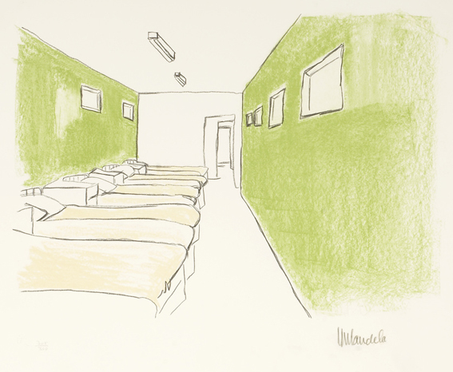

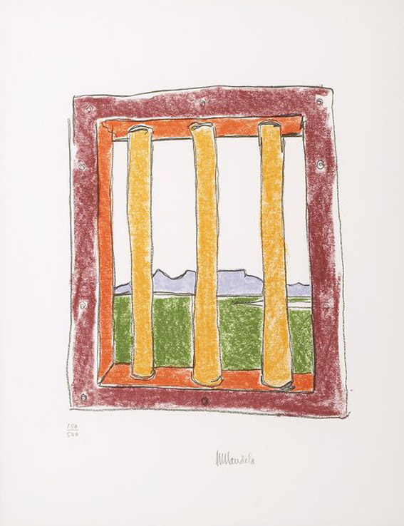

罗本岛的码头，是犯人被押往岛上监狱的第一站，曼德拉把它画成了让人感觉轻松的淡蓝色。

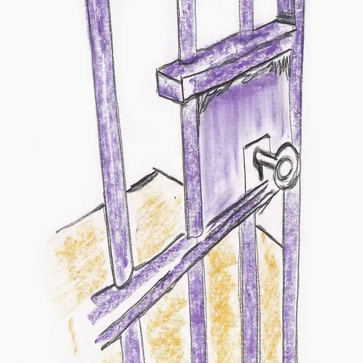

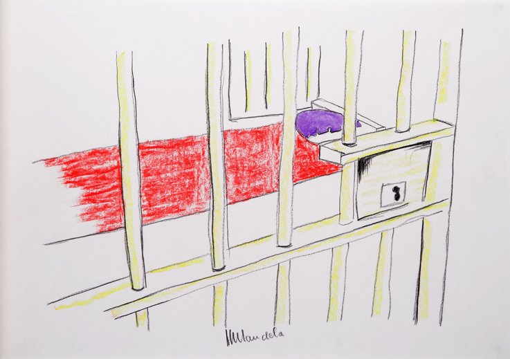

“我之所以用乐观的色彩画下罗本岛，是因为我想把那种感觉与人分享。我想告诉大家，只要我们能坦然接受生命中的挑战，那么任何奇异的梦想都可以实现！”

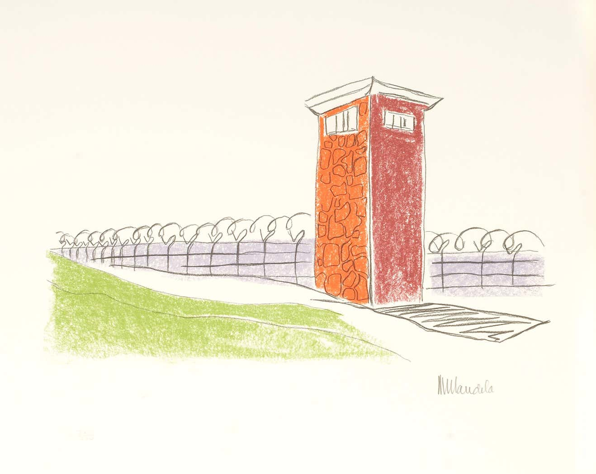

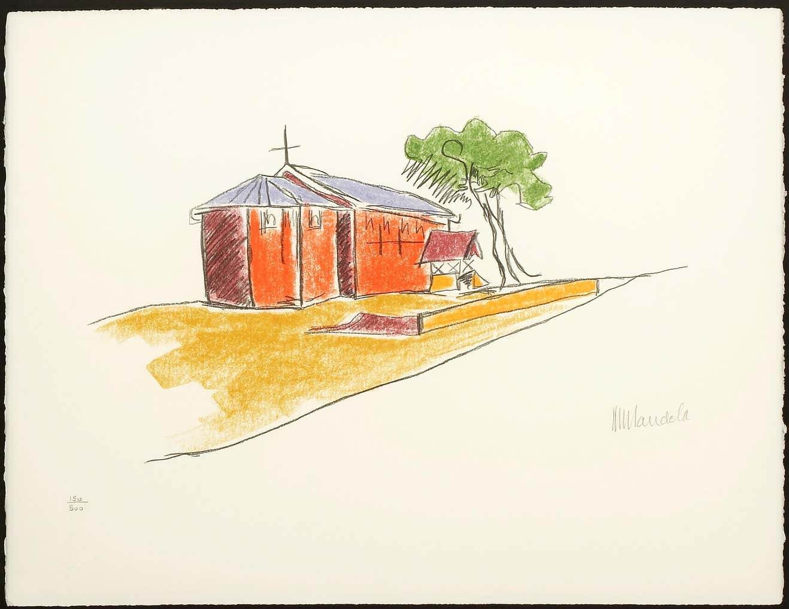

——曼德拉

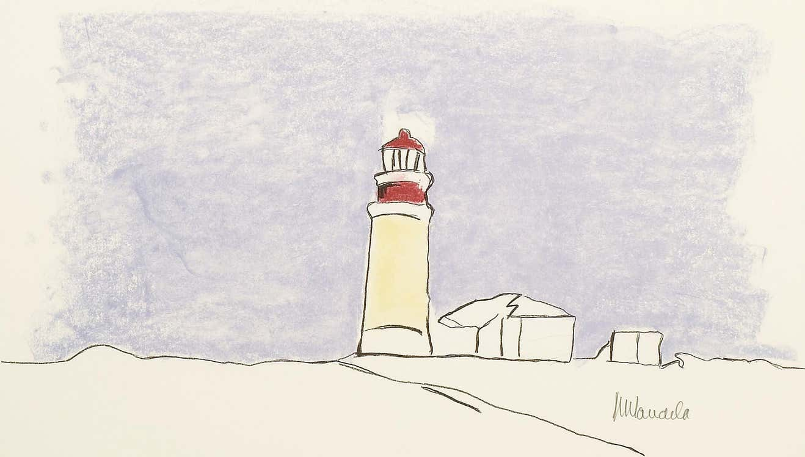

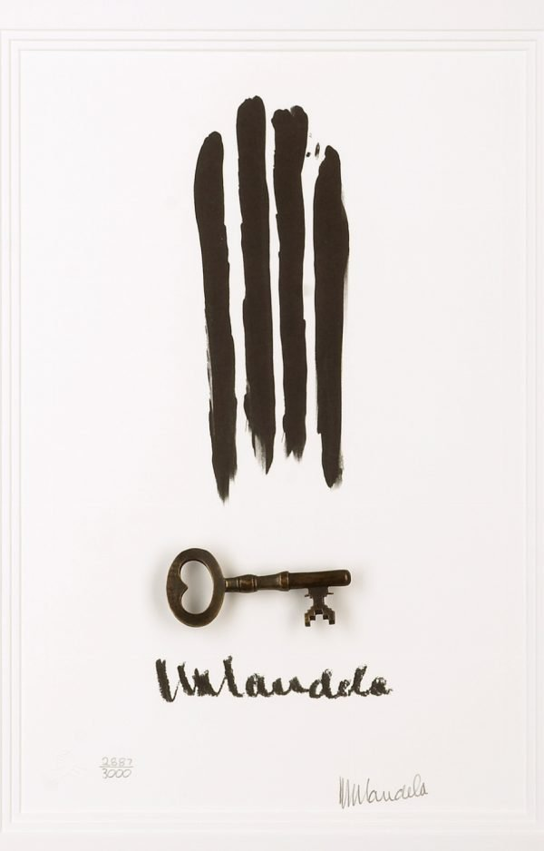

1990年获释后，曼德拉与“一名画家合作，创作由他签名的限量版画”。这些版画为线条简洁的素描，其中部分素描上了色：有紫色天空下的灯塔，有窗外绿色的景象，有罗本岛上的教堂，也有牢房……曼德拉的版画一经问世，海外名流竞相购买。拍卖所得的收入，大部分都捐赠给了南非的艾滋病治疗及用于儿童教育发展等的慈善机构和基金会。

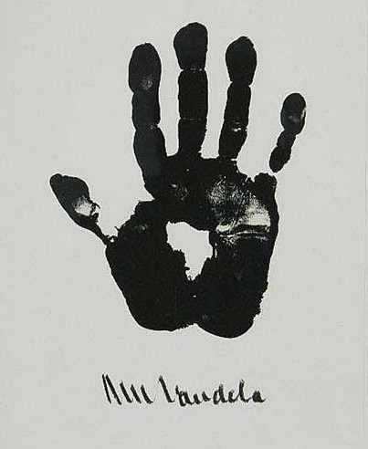

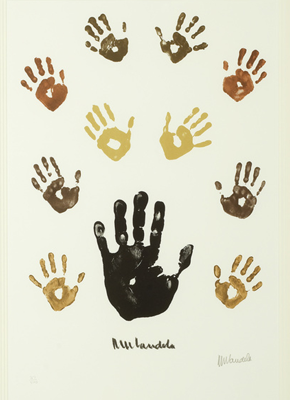

——作品欣赏——

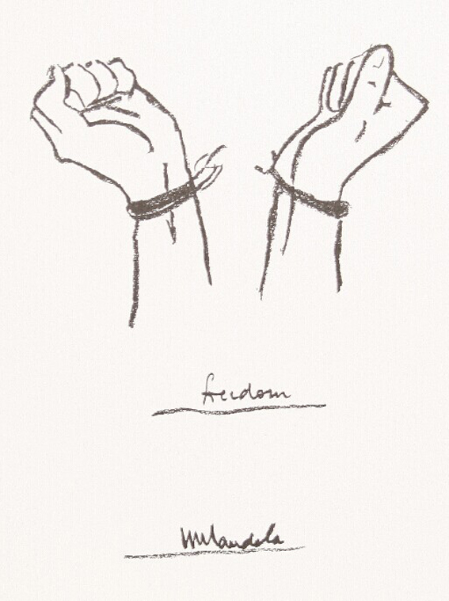

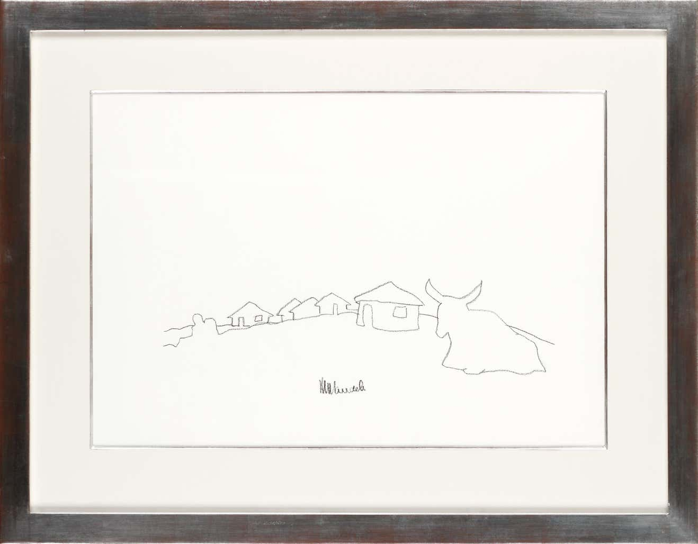

南非纳尔逊·曼德拉大都会艺术博物馆是南非最知名的艺术博物馆之一，位于东开普省伊丽莎白港，前身为英王乔治六世美术馆，1956年6月22日开业，2002年12月为了纪念曼德拉而更名，同年，84岁的曼德拉在这里举办了以监狱生活为主题的个人画展。

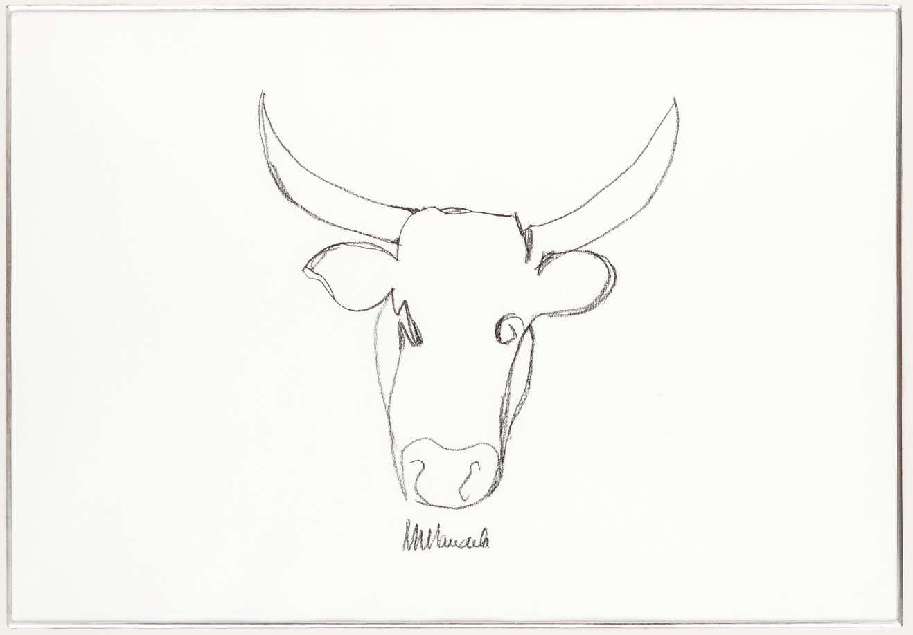

纪念曼德拉入狱50周年,在其当年被捕之地设计的纪念雕像

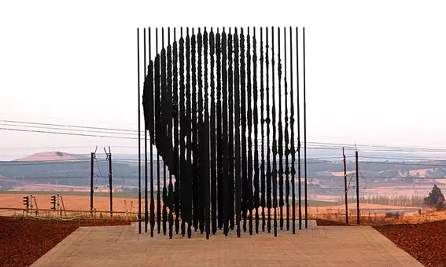

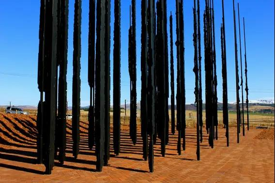
