# 达利画作的离奇经历

​       监狱失窃

2003年，美国纽约市的里克斯岛(Rikers)监狱中出了一桩奇案，监狱大厅上一直挂着的一幅画离奇失踪了。这幅画的作者是西班牙超现实主义绘画大师达利，它已经在狱中挂了38年，然而，2003年8月一位管理人员忽然发现，墙上的画“变”成了赝品。

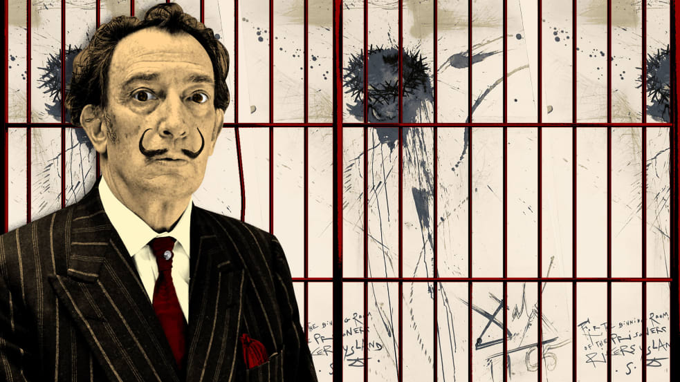

达利画作被掉包

里克斯岛监狱位于纽约市皇后区附近的小岛上，它的规模相当大，分十个监区，共关押上万名犯人。这所监狱的大厅里挂着一幅耶稣基督受难图，它是大名鼎鼎的画家达利送给这里的一份特别礼物。

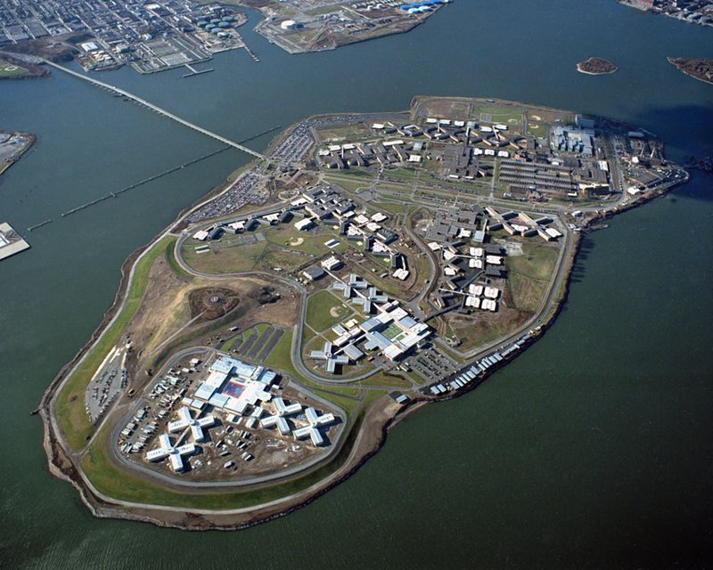

1965年达利到纽约观光时，曾经欣然接受了里克斯岛监狱的邀请，准备到狱中进行参观。达利原定乘船隆重抵达，带着他的妻子和宠物豹猫，画家将和犯人们一起作画，发表演讲，慰问犯人。这是纽约市惩教署“艺术矫正”计划的一部分，为此惩教署大张旗鼓发了宣传稿，请来各大报刊记者，等待达利的亮相。但关键时刻达利放了狱方鸽子，他宣称身体不适，不得不取消行程。在曼哈顿的酒店套房里，他画了一幅画，让经纪人送去监狱，以表歉意。

这幅无标题画作约有5×3英尺，以抽象笔法描绘了耶稣被钉在十字架上的场面。

纽约市惩教署专员安娜莫斯科维茨克罗斯接受尼科伊佩里法诺斯的达利画作。

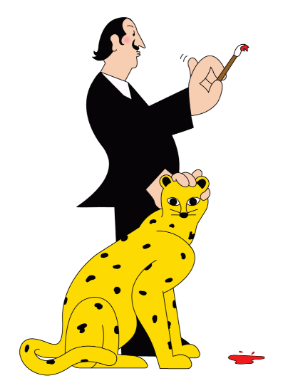

这幅画被挂在男监的犯人食堂里，一挂就是十六年。直到1981年，一个犯人朝“达利的耶稣基督”扔了个咖啡杯，打碎了玻璃框，并留下污渍，画作才被取下。管理员将其拿给画商进行鉴定和评估，之后，这幅画被送到弗吉尼亚画廊，在监狱艺术展中展览。返回后，这幅名作躺在一个储物箱中，再次被遗忘。后来，在一次仓库清理中，它被误扔到垃圾桶里，在那里，一名狱警把它救了出来，挂到典狱长的办公室里。

2000年后，这幅画找到了新位置，挂在里克斯岛“泰勒中心”监狱的大厅一角，旁边挨着盆栽，和一架嗡嗡作响的百事可乐贩售机。

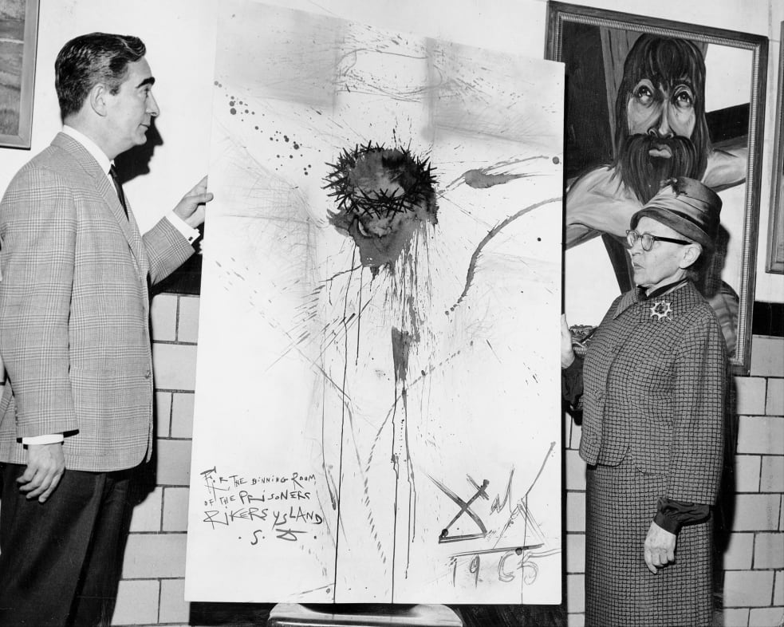

达利画作2001年在里克斯监狱的照片

38年过去了，这幅画不断增值，如今，它至少价值上百万美元。

然而，2003年8月的一个上午，一位监狱管理员像平常一样走到这幅画前准备进行祷告，但他突然发现，这幅画看起来不大对劲了。它的尺寸比以前小了很多，原先桃花心木贴金叶的画框也不见了，整张画看上去显得技巧拙劣，完全不是出自大师手笔。他急忙把自己的同事和监狱负责人找来，大家这才发现，原来画作已经被偷梁换柱了。

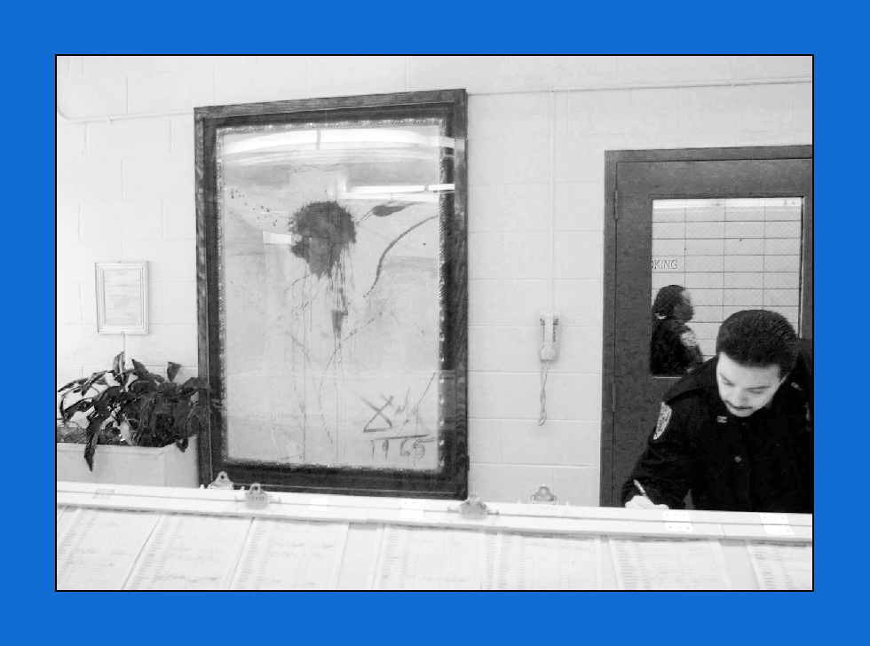

四保安串通偷画

插图作者：Igor Bastidas

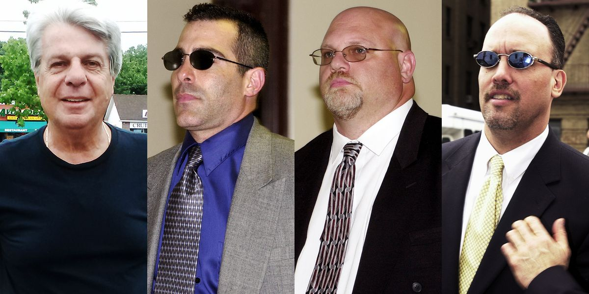

监狱方面随即报警，纽约警方对这起案子相当重视，他们派出一个经验丰富的侦破小组进驻岛上。经过几天的调查分析，警察们认为作案的应该是监狱中的4名保安人员，他们推测这4个人很可能是趁前不久监狱进行灭火演习时下手将达利的画偷出来，然后换上了一张他们临摹的假画。

于是，警方分别找这4个人进行审问，几轮审问下来，一个名叫格利高里·索科尔的保安表示愿意配合破案工作。他不但供出警方怀疑的4个人都参加了偷画行动，还把一盒录音带交给监狱管理人员，他指出里面录的正是窃画行动策划人班尼·拿佐的一段话：“你们听着，如果你们不想自寻死路的话，你们最好别再提这件事了。我们是一伙的……从现在起，我们谁也别再提起那件事了。”

格利高里·索科尔

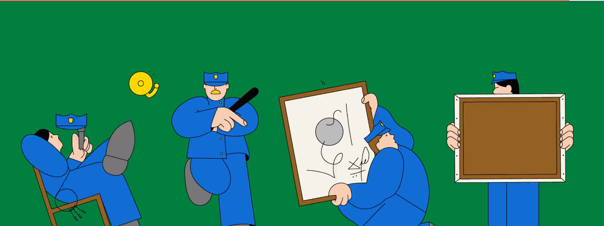

索科尔透露，在作案之前，拿佐先拍下了达利那幅画作的照片，精心绘制了假画，然后派他和另外两名保安提莫西·皮纳以及米切尔·豪克豪瑟去换画，他们把真画交到拿佐那里，拿佐马上把画藏了起来，准备过一段时间后将它卖给国外富豪。

主犯最终逍遥法外

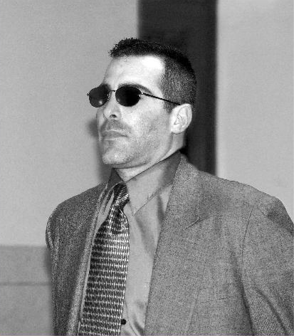

根据索科尔提供的线索，警察很快逮捕了拿佐等3名案犯，并将他们和索科尔一起送上法庭。

经过一个月的审判，法官判皮纳、豪克豪瑟和索科尔分别入狱13年，由于索科尔协助破案立了功，所以他得到缓刑3年的宽大处理。

然而，令人困惑的是此案的主犯拿佐竟然被当庭释放。

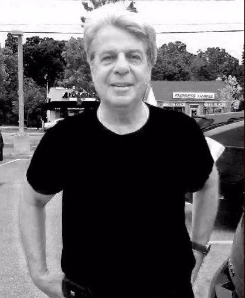

班尼·拿佐

豪克豪瑟等3名案犯自然对这个判决非常不满，豪克豪瑟表示，虽然拿佐没有参与换画行动，但是他带头想出了偷梁换柱的点子，而且真画就保存在拿佐母亲家里，后来，拿佐担心事情暴露，索性将真画毁掉了。

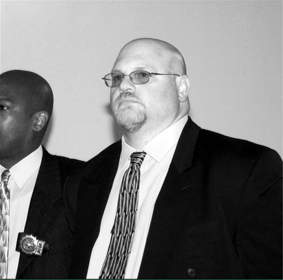

豪克豪瑟

提莫西·皮纳

对此，法院做出回应称，既然拿佐没有参与换画行动，而他们又无法找到足够的证据证明拿佐策划了偷画事件并毁掉了真迹，所以他们不能给拿佐定罪。

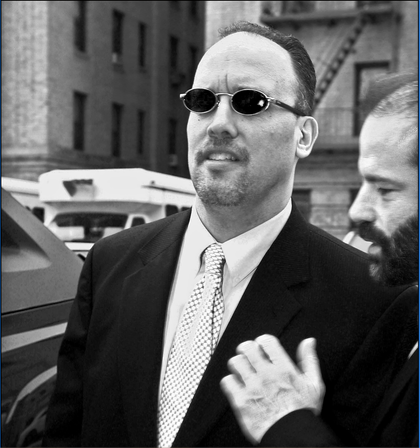

不过，法院表示，这个案件并不算完全终结。

截至目前，该画作仍然下落不明。
