# 监狱绘画  新几何观念主义画家彼得·哈雷

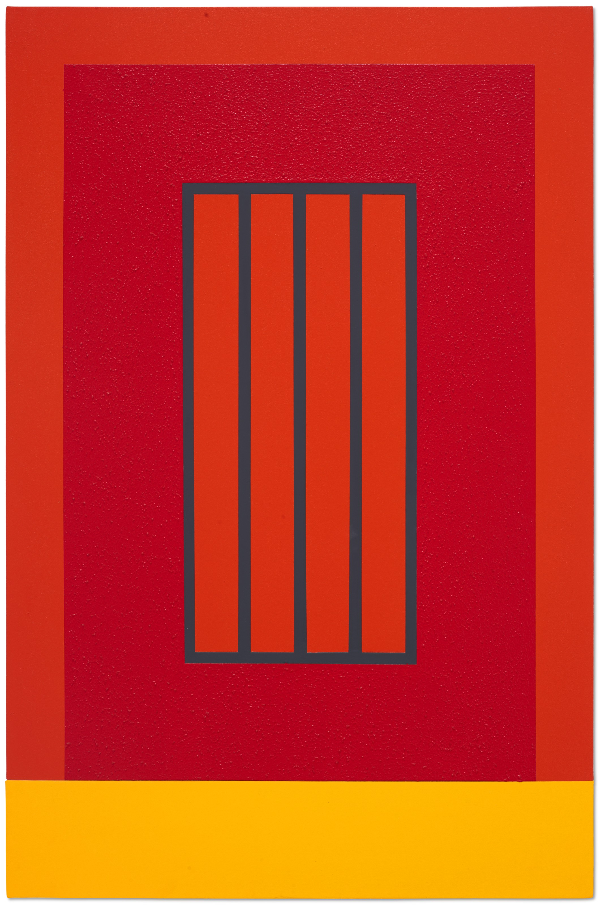

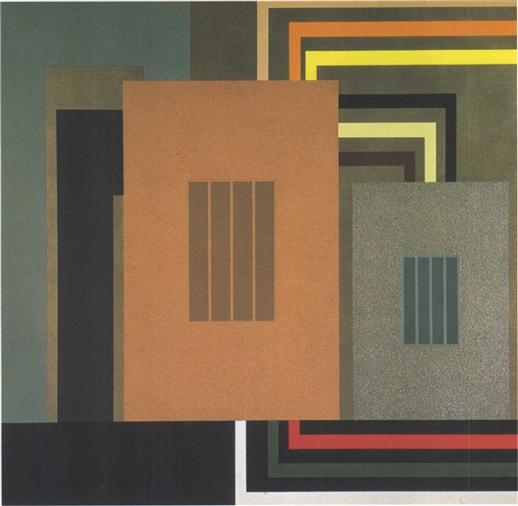

监狱绘画 | 新几何观念主义画家彼得·哈雷

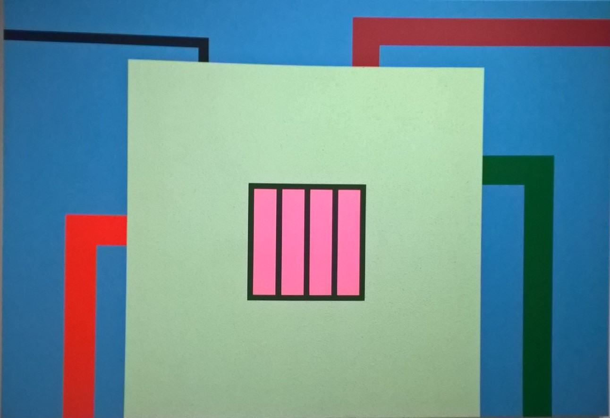

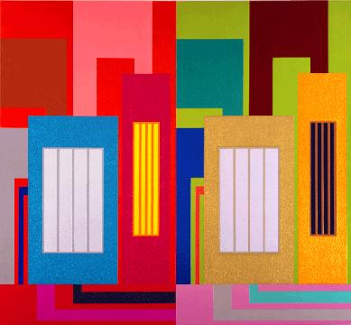

“理想主义者的广场变成了监狱，几何学被揭示为禁闭。”——彼得·哈雷

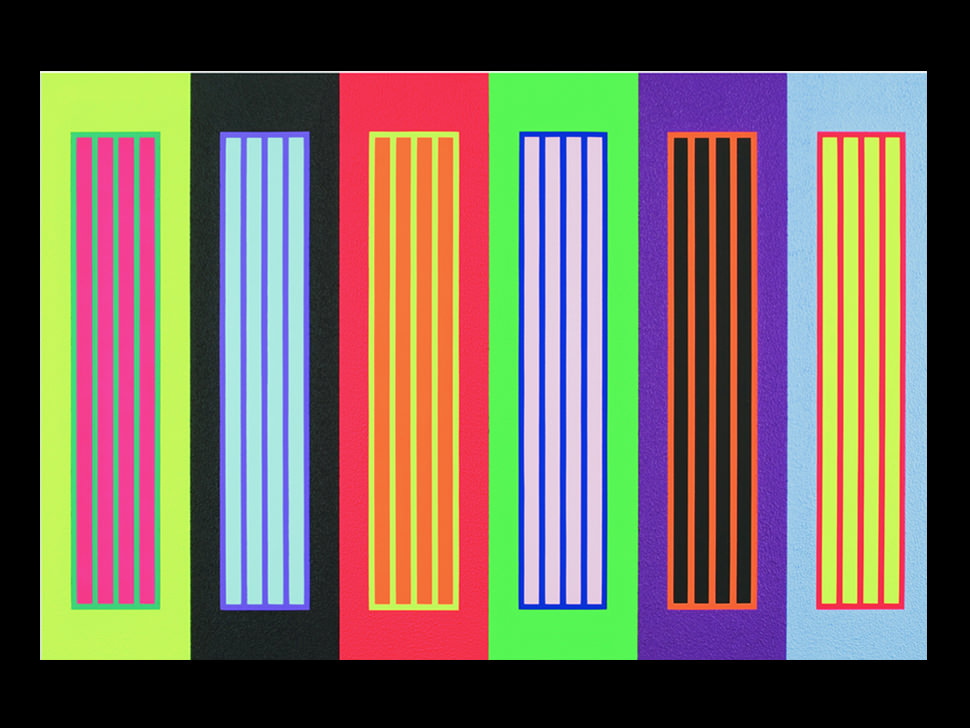

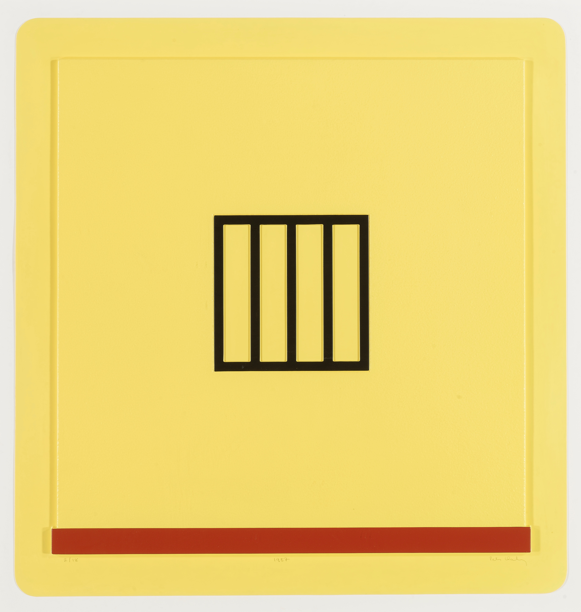

彼得·哈雷（peter halley 1953年出生于纽约）美国艺术家，以“格洛几何”绘画闻名于世，他也是一位作家、评论家、出版商和教师，2002年至2011年在耶鲁大学艺术学院担任绘画和版画研究生课程主任。

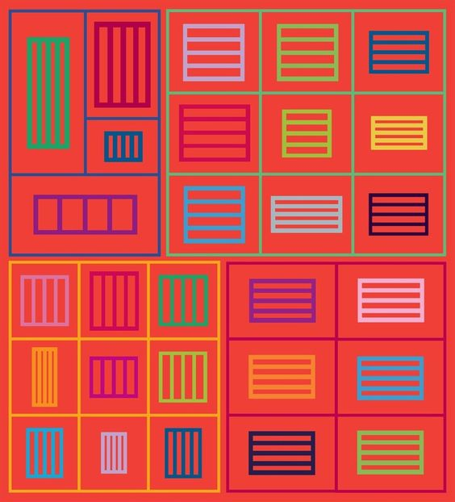

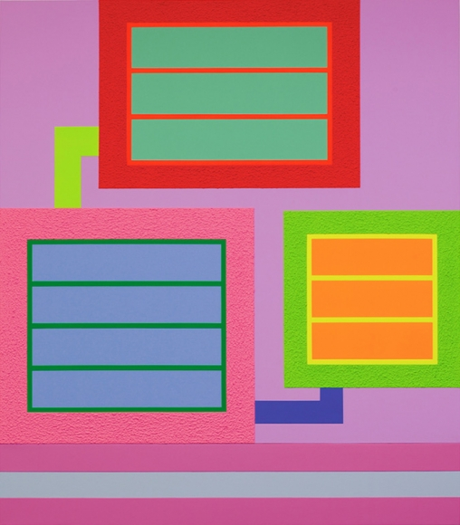

他在20多岁的时候开始创作标志性的绘画作品，横平竖直的线条、长方形、正方形在他的作品中组成了栅栏、窗户的图案，以监狱、看守所或地下管道的建筑为主题。画面中，每个几何单元都由Roll-A-Tex的边界包围，使绘画在光滑和沙质的表面之间形成对比。Roll-A-Tex流行于1970年代和1980年代，为建筑物提供装饰效果，也供给了哈雷30年来对“格子间，导管和系统”的视觉探索，这些格子间在日益孤立的时代定义了当代社会。

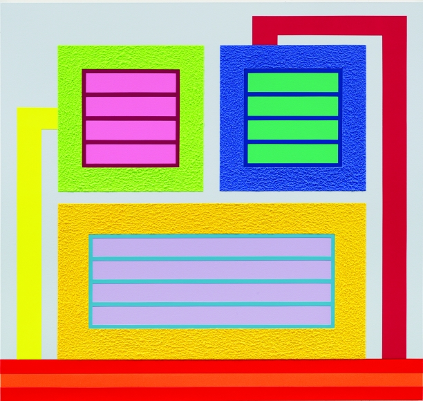

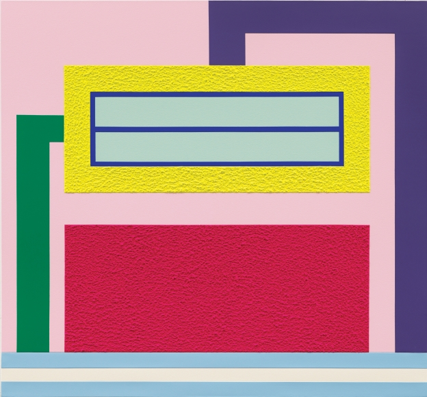

哈雷的作品通过具有控制论的窗格结构探索孤立及其对人类行为的影响，这些作品在当下变得更加切实。

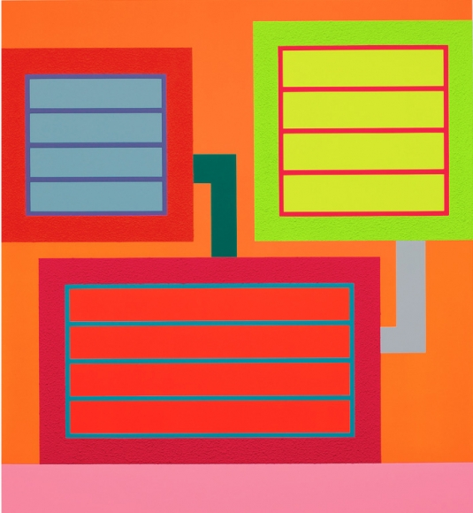

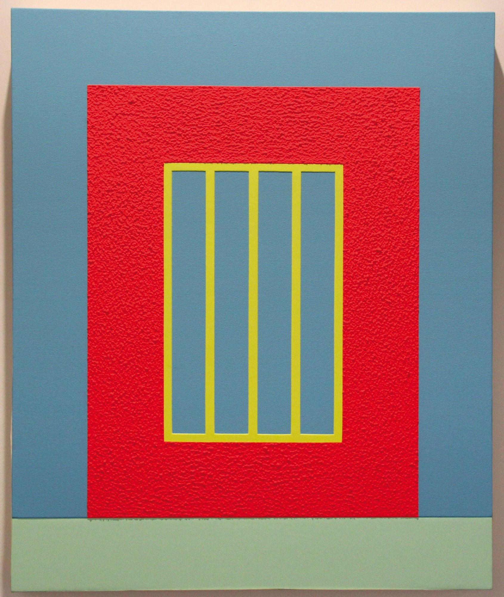

哈雷将现代主义高层公寓楼的方形建筑与监狱进行了比较。在更理论的层面上，他唤起了现代主义建筑，甚至现代主义本身，可能是监狱般的想法。

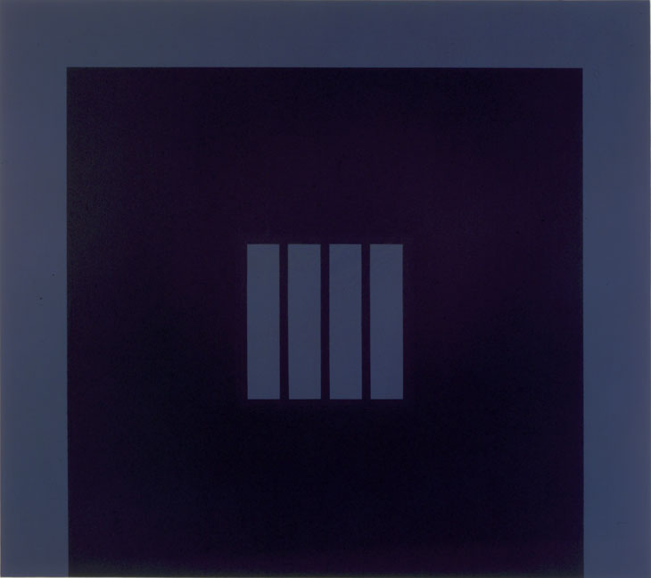

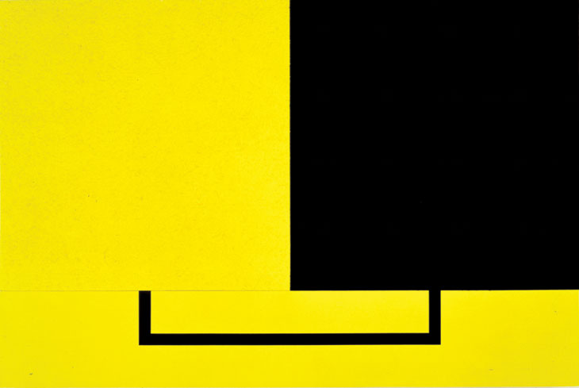

彼得·哈雷

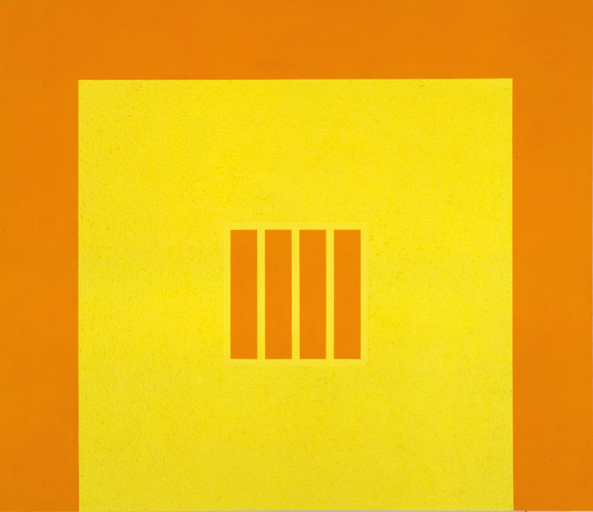

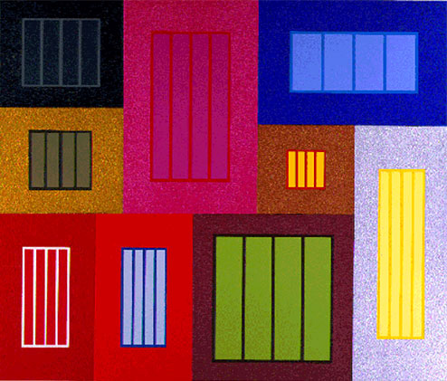

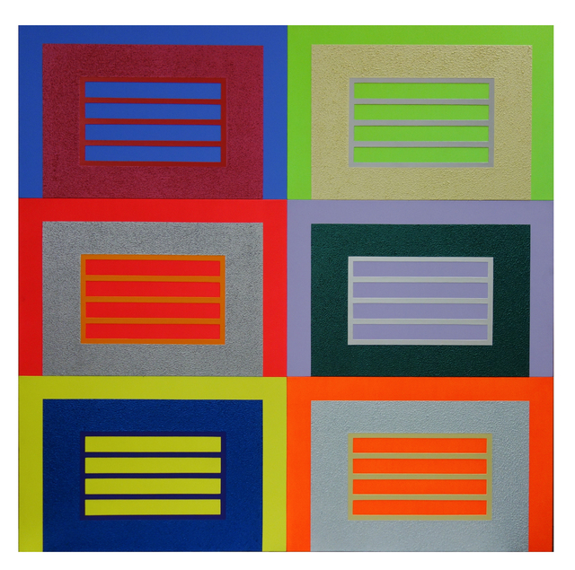

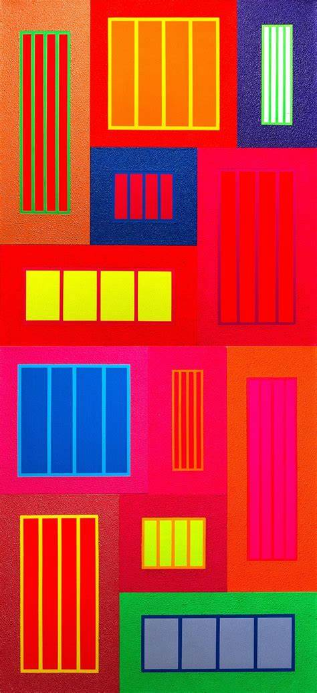

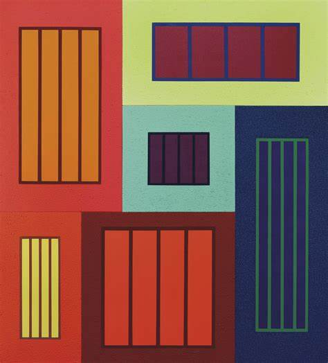

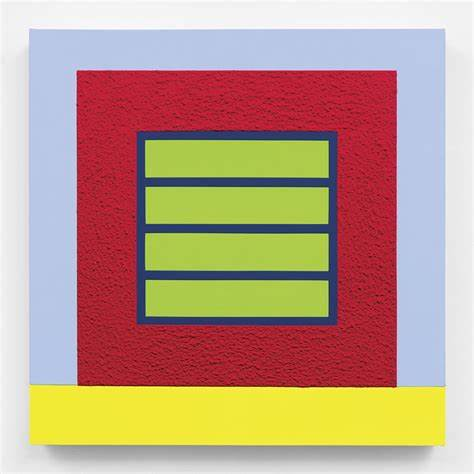

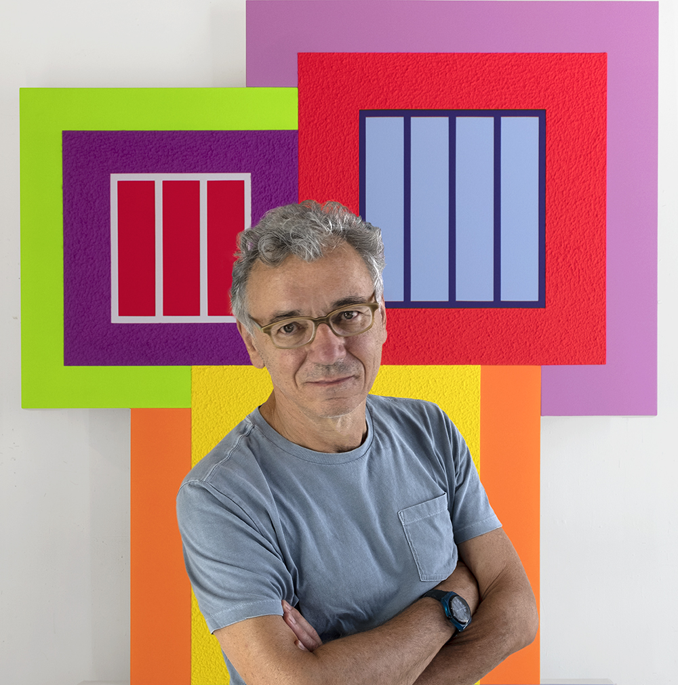
