# 第一顿饭

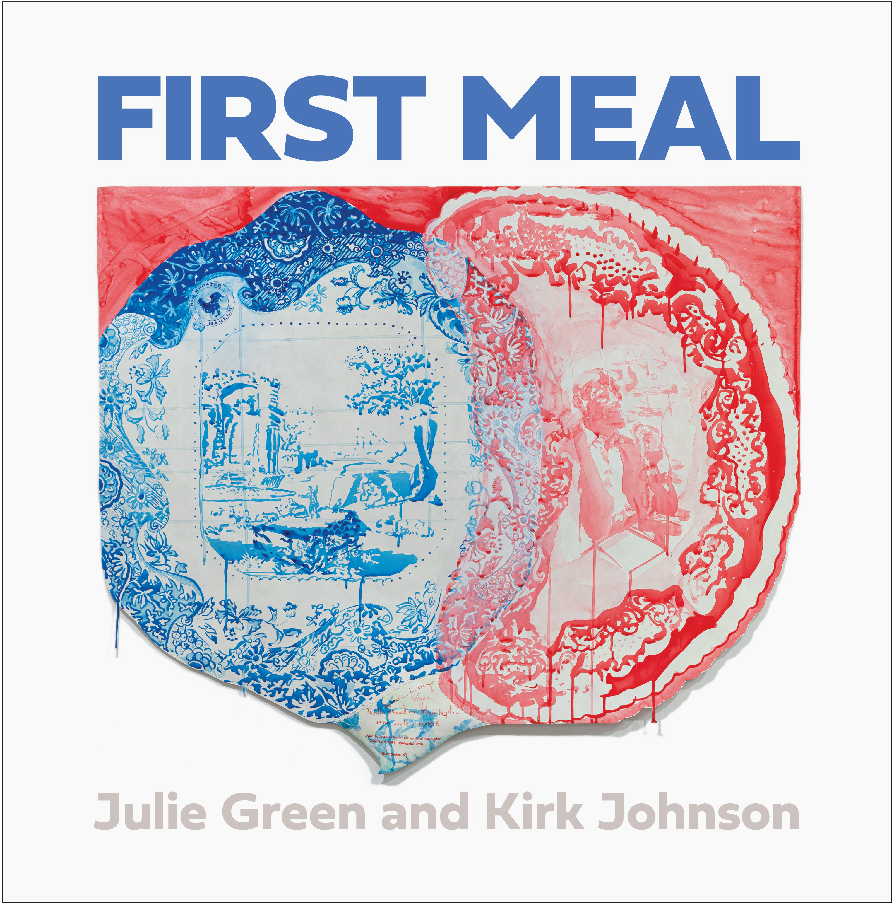

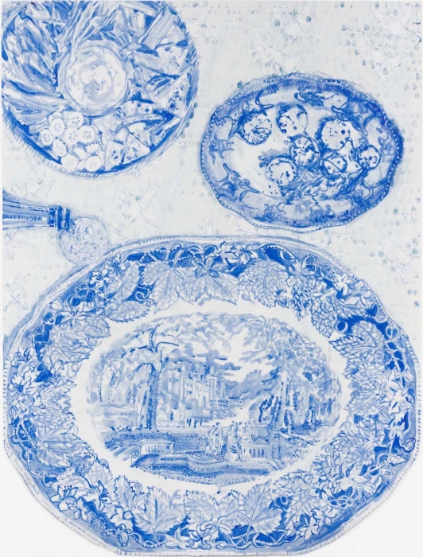

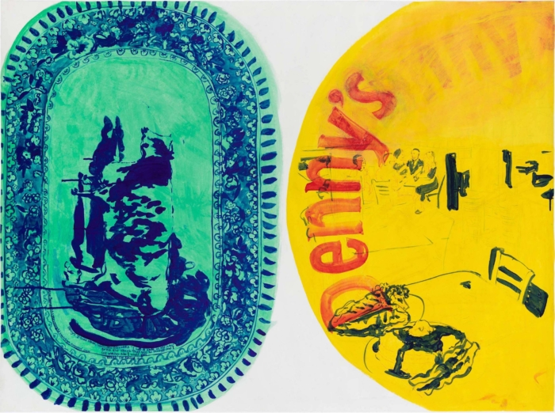

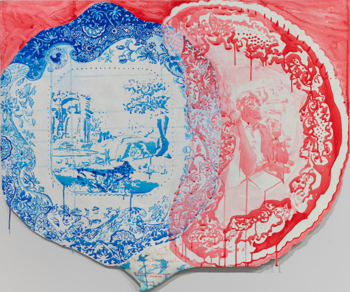

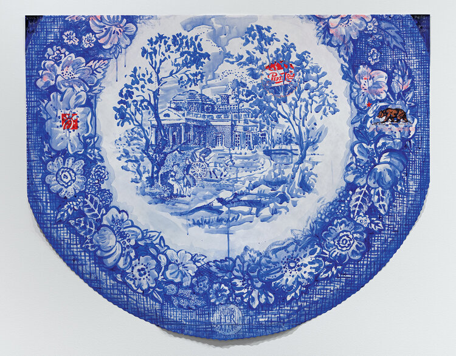

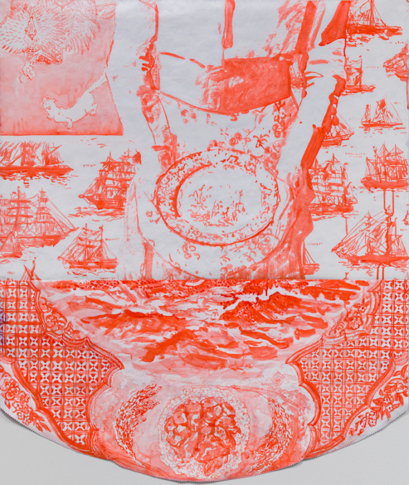

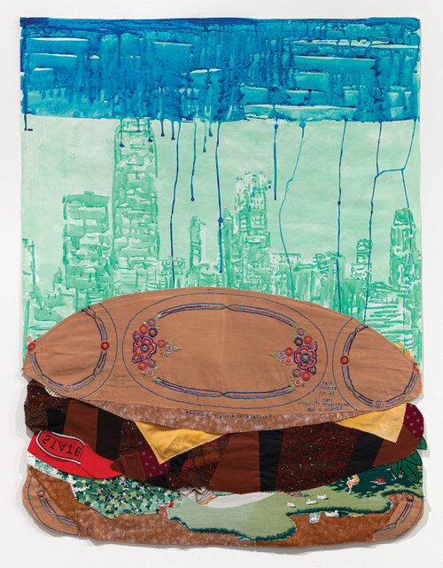

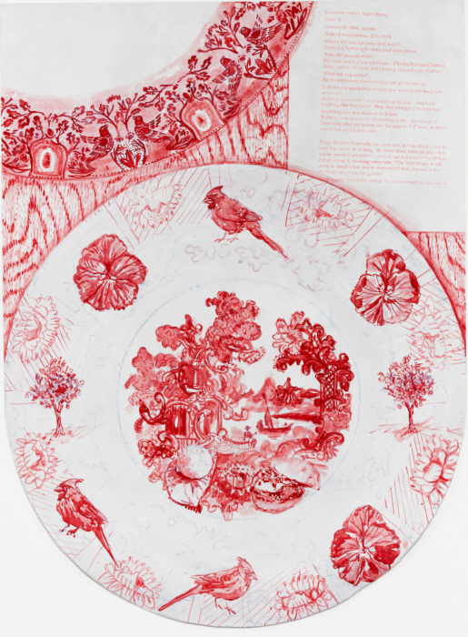

《第一顿饭》是《最后一餐》派生出来的项目，2015 年，朱莉·格林 (Julie Green) 在《最后一餐》的一场展览中认识了克里斯汀·邦奇 (Kristine Bunch)。邦奇因与她 3 岁儿子的死亡有关的谋杀和纵火罪入狱，17 年后她被判无罪。聊天中，关于最后一餐的话题转向了获释后的第一顿饭。于是有了格林接下来的系列作品。获释后的第一顿饭邦奇吃了扇贝、奶酪粉、鹰嘴豆泥、蔬菜和香槟。“兴奋，同时战战兢兢。充满了不真实感，像一场随时可能被扭转的梦。”在新的创作中，格林着眼于蒙冤者重获自由后的第一餐。画面不再是单一的蓝色，材料也更为丰富。2018年接受采访时，这位获释者十年前在丹尼餐厅吃的第一顿饭仍然历历在目：“T骨牛排、培根和煎饼。我手里拿着餐刀吃牛排。非常别扭，我感到不安，好像吃下去会有麻烦。”这顿饭包括早餐和晚餐，与父母、阿姨和叔叔一起享用。《第一餐饭》是格林与西北大学普利兹克法学院冤假错案中心（the Center on Wrongful Convictions）以及加州无罪项目（the California Innocence Project)等机构合作。据统计，过去的三十年里，美国有近2400起冤案得到平反。“真相解放了我，音乐让我在等待时保持理智。”Huwe Burton描述了他在哈莱姆区Red Rooter餐厅的第一顿南瓜千层面。警方强迫伯顿承认强奸和谋杀其母亲时，伯顿16岁。格林向受访者发送一份简短的调查问卷，问题包括：您在哪里吃的第一顿饭？和谁一起？点了什么？您点的食物有什么特别的原因吗？获释后，霍勒斯·罗伯茨先来了一大杯百事可乐，然后顺路在Chick-fil-a（连锁快餐店）机场店吃了饭。罗伯茨因一桩他没有犯下的谋杀案在监狱服刑20多年。这位在母亲家吃了鹅肝和洋葱。“一份虚假的证词，导致一个无辜的人入狱。为什么会这样？”马克·克莱门茨（Mark Clements）与母亲、女儿和律师一起在市中心吃了汉堡。画中包含了前警察指挥官Jon Burge的黑暗文本，他最终因作伪证和严刑逼供在联邦监狱服刑四年。克莱门茨于1982年被定罪，当时他只有十六岁，被屈打成招。2009年，法庭文件显示克莱门茨供词中的细节与犯罪事实不符，克莱门茨的刑期被撤销。如今，克莱门茨是一位致力于监狱改革的社会活动家。一位因谋杀罪被错判入狱15年的获释者的第一顿饭，席间，服务员递给他一个橙子，他久久端详，沉醉在一颗橙子的色泽和气味中，40分钟后才开始剥来吃。格林说“他七年没有吃过橙子，如何表现这缺失的七年？如何表现这40分钟？”

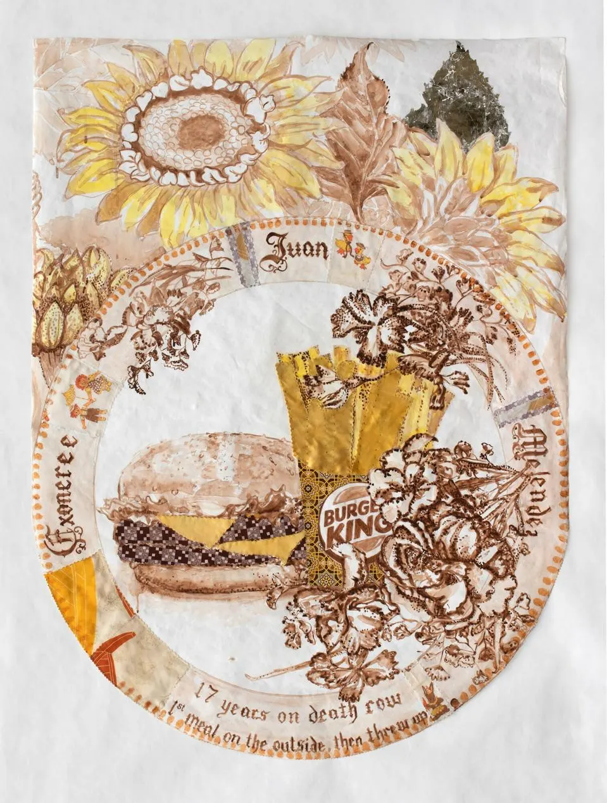

在汉堡王点的汉堡、薯条等。“17年的死囚生涯，在外面的第一顿饭，吃完吐了。”Julie Rea获释后的第一顿饭是在朋友家里吃的便饭，有很多新鲜水果。蓝莓是Rea最喜欢的水果，由一位密友亲手采摘给她。这位无罪获释者在以谋杀罪被错判入狱22年后，与家人和朋友一起吃了第一顿披萨。由于太兴奋，无法进食。5年的死刑牢狱之灾，第一顿饭吃的牛排。胡安·里维拉和律师在埃文斯顿的一家素食餐厅Blind Faith用餐。里维拉谈到这顿饭时说：“我真的不记得了，但很好吃，味道饱满。我要这种感觉，里面的饭没有任何味道。”马塞尔·布朗在母亲家享用咸牛肉三明治。“感谢上帝，我回家了。”在被监禁27年后，Dixon得到无罪释放，出来之后他选择在海鲜餐厅Red Lobster享用第一顿饭。Dairy Queen餐厅的汉堡、薯条和冰淇淋。“监狱里没有快餐店。”因谋杀罪入狱17年后，Randy Steidl在印第安纳州农村的一家家族牛排馆吃了他作为自由人的第一顿饭，距离他的监狱大约10分钟车程。

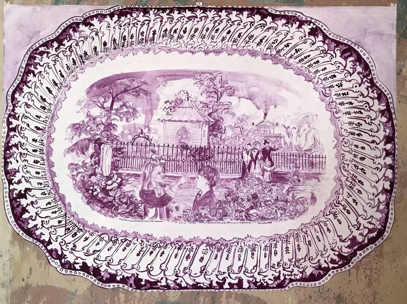

这一系列作品已结集出版

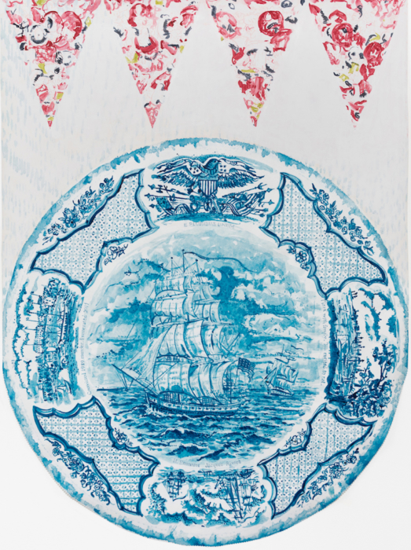

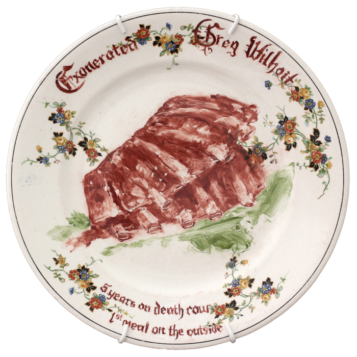

朱莉·格林 (Julie Green 1961-2021)

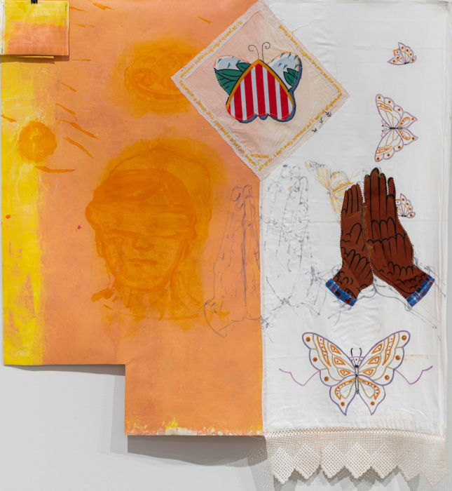

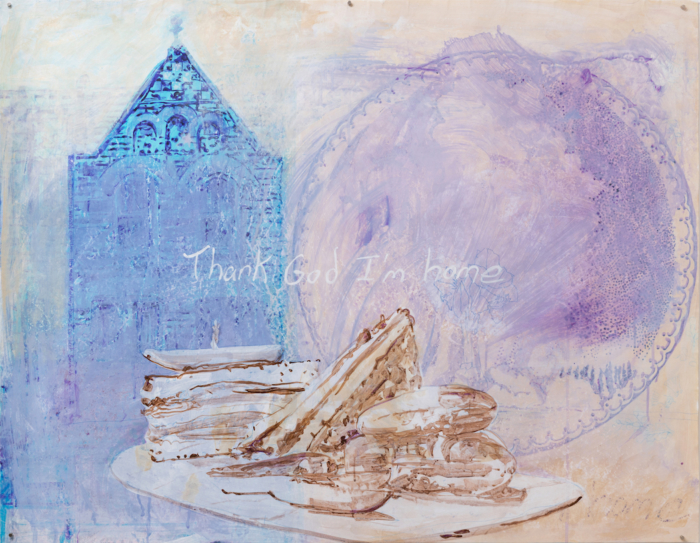

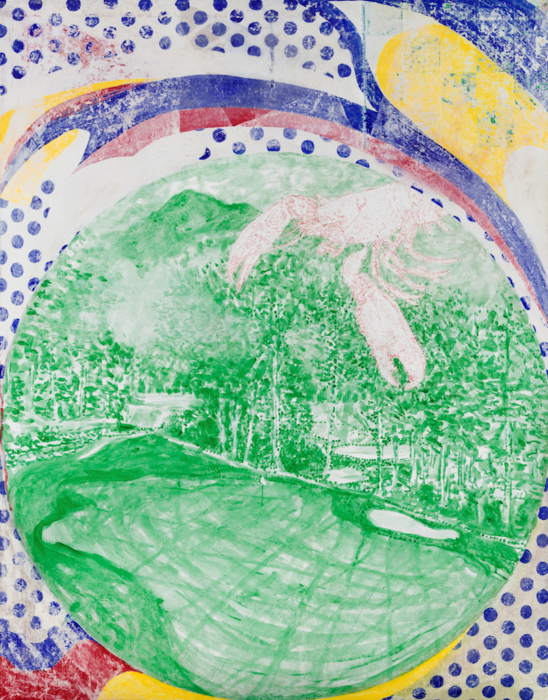

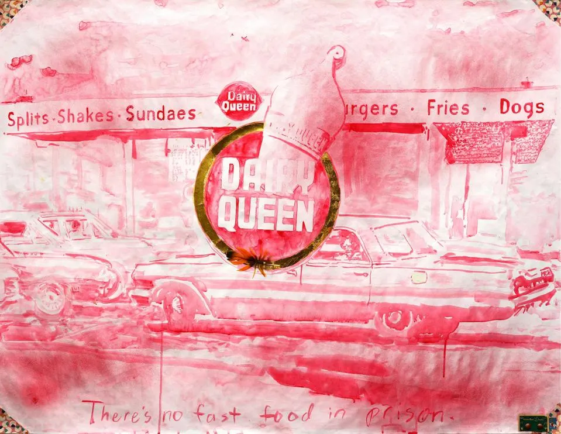

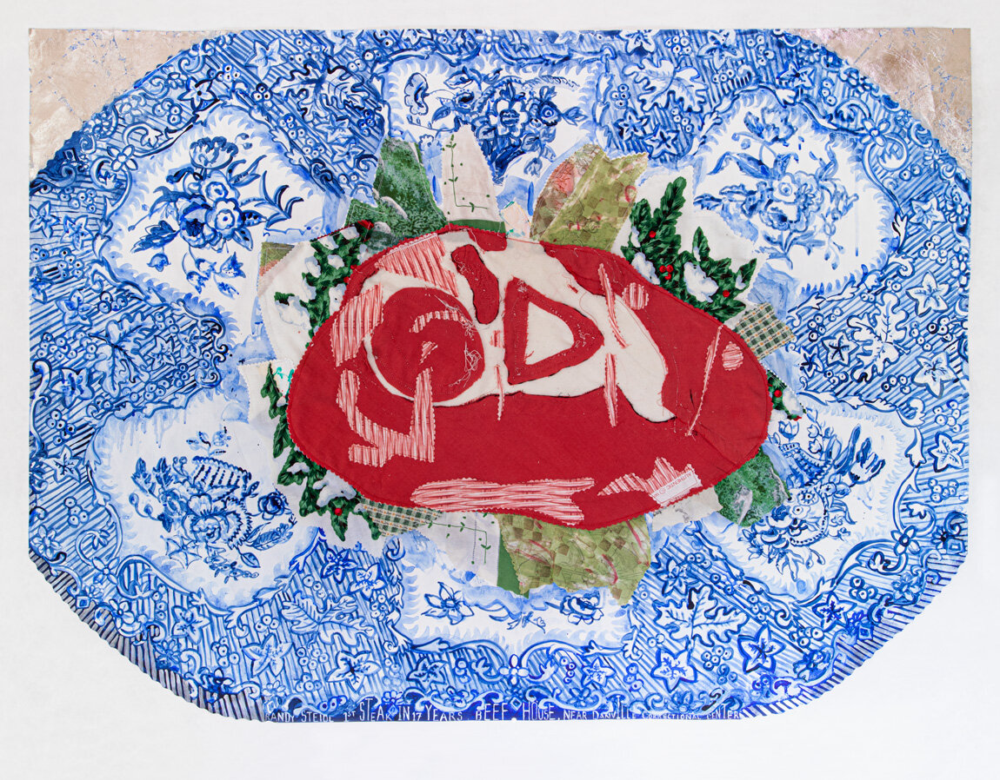

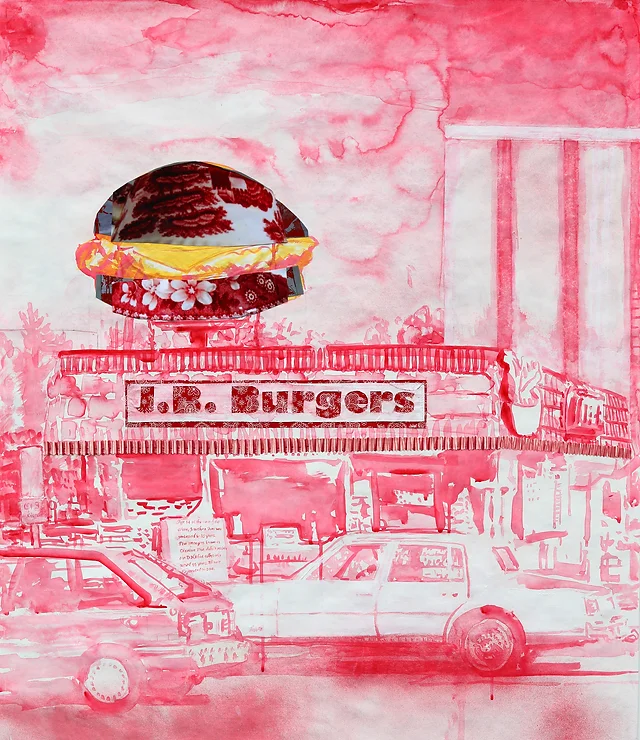

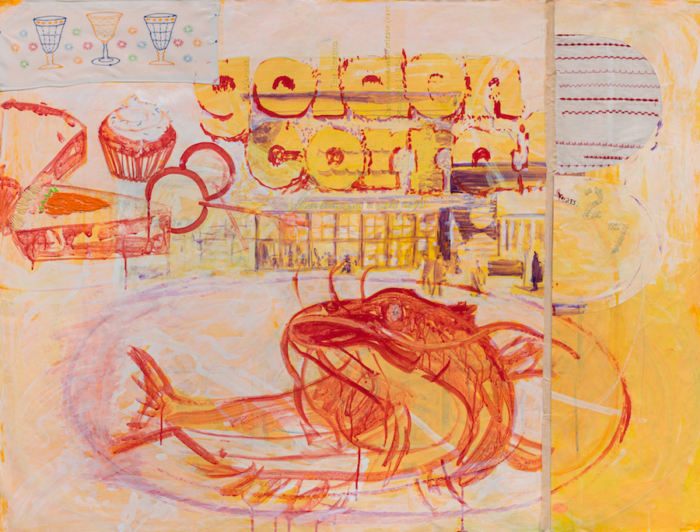

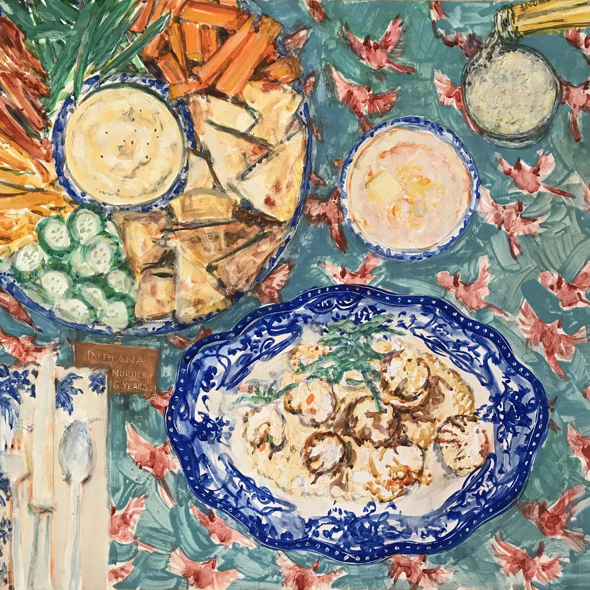

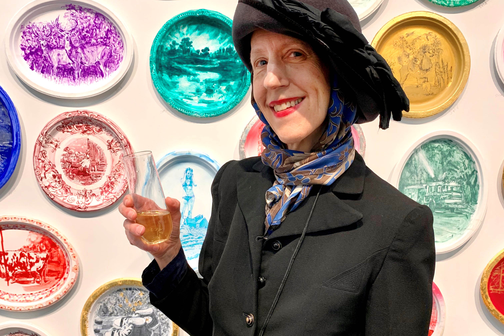
