# 监狱绘画  约翰·雷斯科

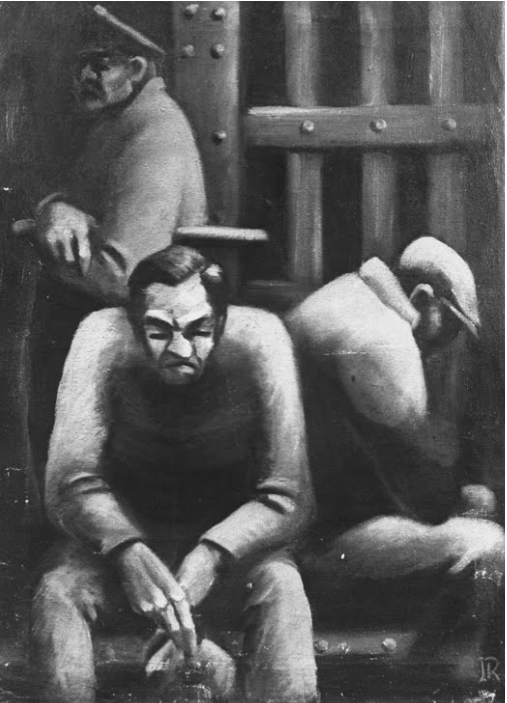

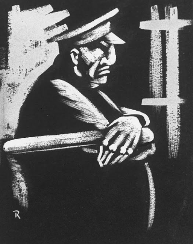

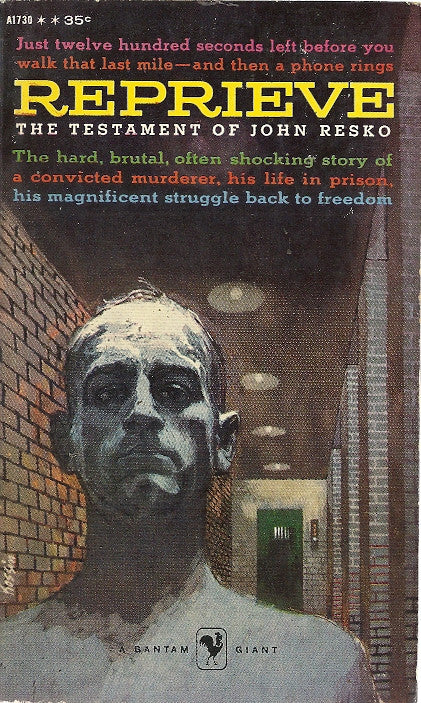

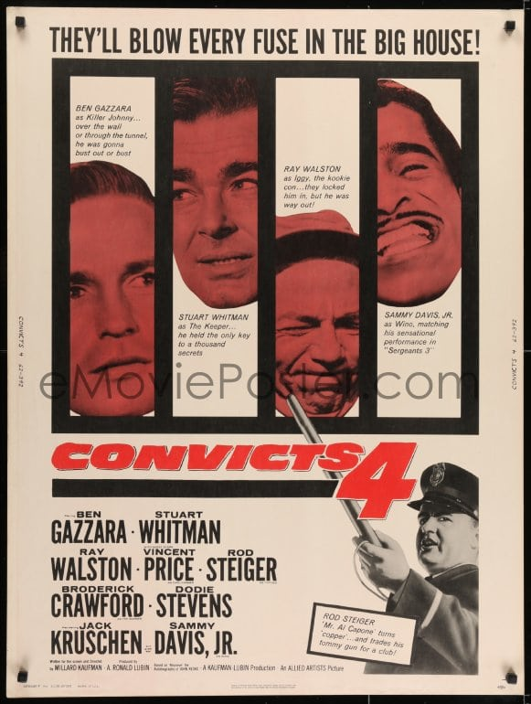

约翰·雷斯科（John Resko，1911-1991），美国作家，画家。

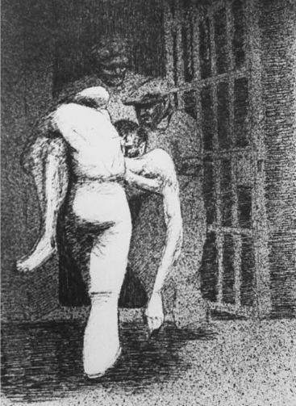

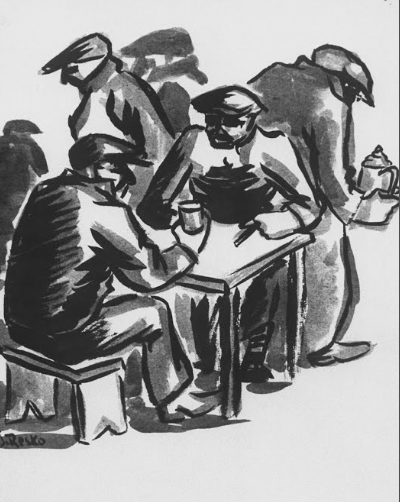

约翰·雷斯科1911年生于纽约，17岁结婚，育有一女，那段时期美国大萧条，他无力支撑家庭，到小卖店讨要东西未果，争抢之下，开枪杀了店主。随后，他被捕并被判处死刑。在上电椅之前的四十分钟，他被时任纽约州州长的富兰克林·罗斯福特赦为无期徒刑。

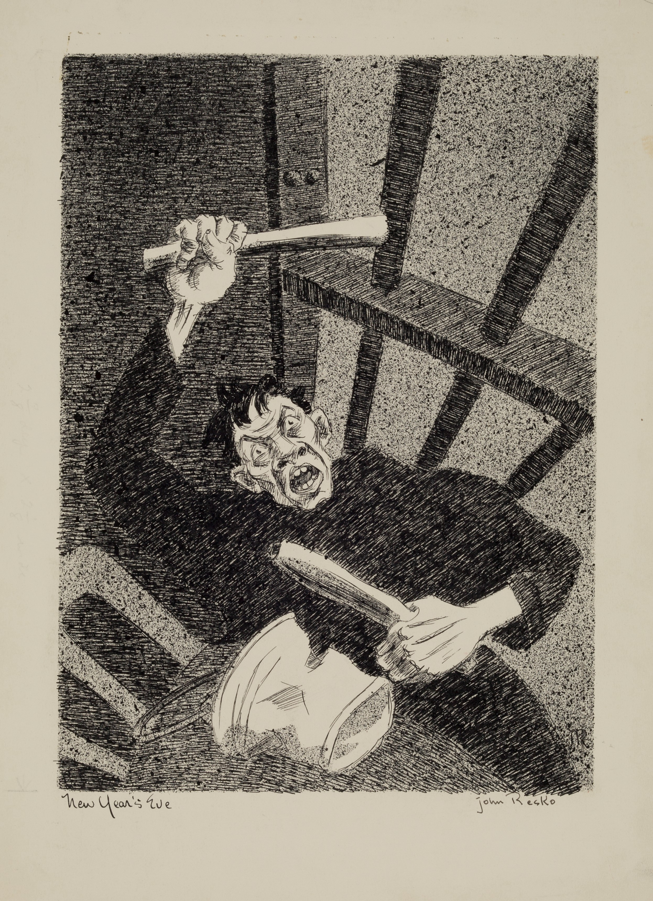

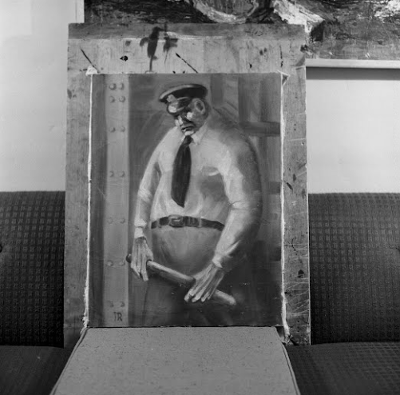

雷斯科在监狱里呆了20年，期间他学会了画画，作品为他带来关注，其中不乏纳尔逊·洛克菲勒、作家卡尔·卡默等知名人士。他们到监狱看望了雷斯科，认为他的谋杀罪判决太重了，应该被视为过失杀人，并且他已经改过自新。之后，在众人的努力下，雷斯科在监狱度过20年后获释。1956年他出版了自传《缓刑》（Reprieve），1962年该书被改编为好莱坞电影《四大煞星》（convicts 4），他的画作也被各地的博物馆收藏。

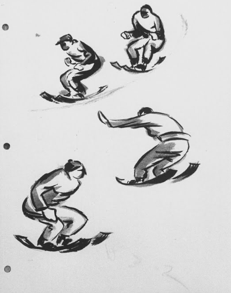

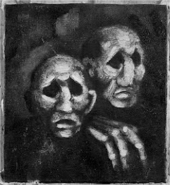

自传

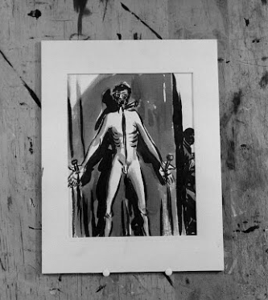

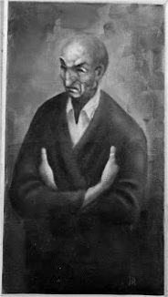

电影海报

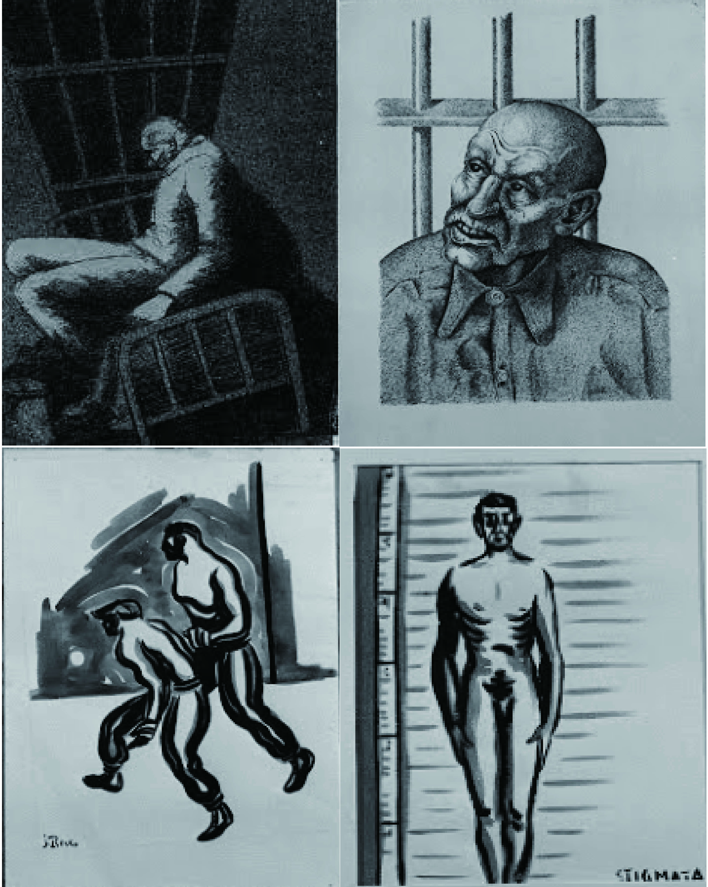

与雷斯科相关的节目还有《希区柯克长篇故事集》（1962）和《这里是好莱坞》（1960）。他于1991年在洛杉矶去世。
