# 舌尖上的监狱之伦敦篇

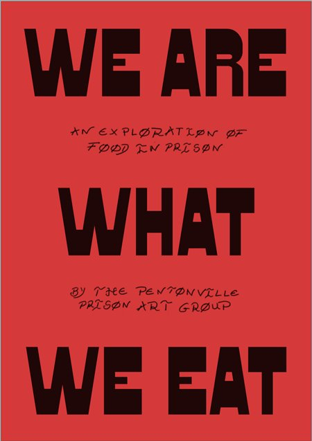

舌尖上的监狱之伦敦篇

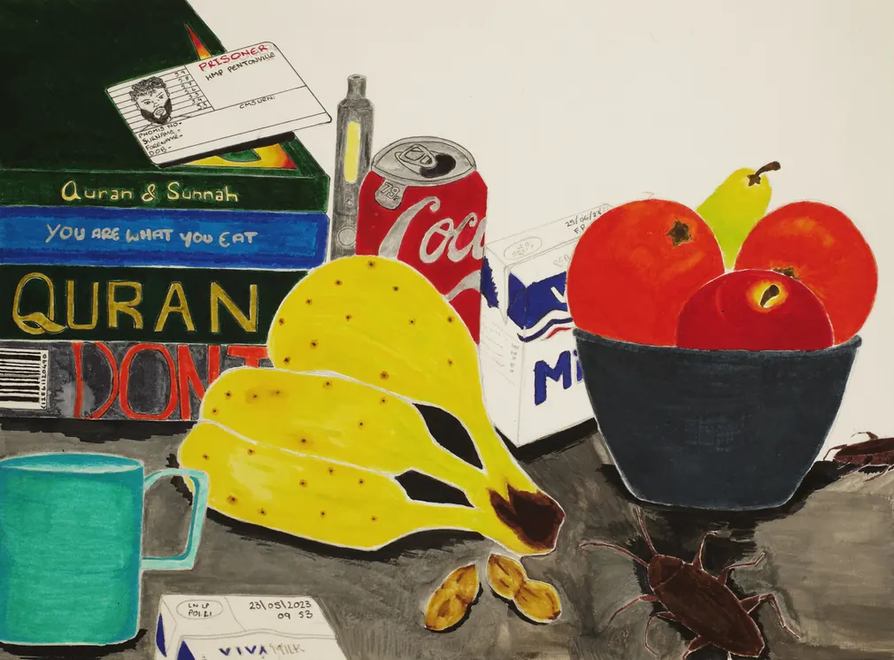

原创 看麦田的9527 狱望 2023-10-28 09:36 发表于陕西

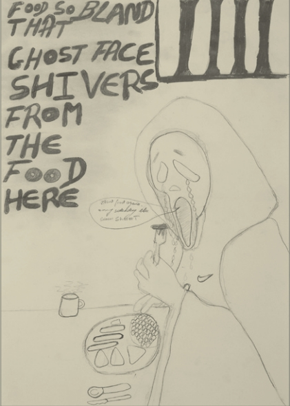

“他们说一图胜千言，要是我的味蕾能画画就好了。作为一名美食家，在本顿维尔，饮食对我来说是个问题。二进宫之前，我就为马上面临的掉膘而发愁。”—— 艾哈迈德 M.，监狱艺术小组成员
2021年底，伦敦博物馆联系本顿维尔监狱（HMP Pentonville），询问服刑人员是否有兴趣参与“舌尖上的伦敦”(London Eats)项目，“舌尖上的伦敦”是一个收集和记录伦敦人与食物的关系的项目。该博物馆希望触达所有伦敦人，自然也包括监狱这种特殊的机构。本顿维尔监狱艺术小组同意参与该项目，但有一个条件：他们要求不受干扰地如实描述。

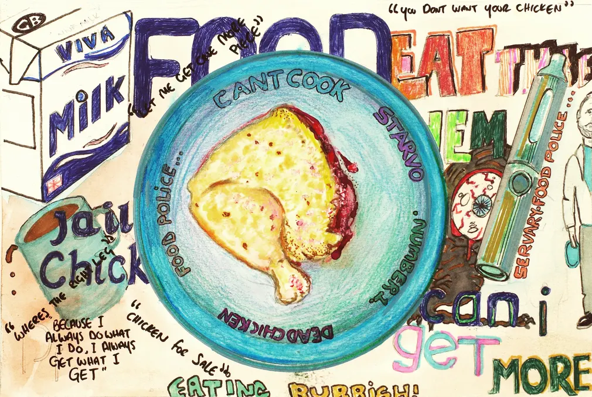

鬼都不想吃

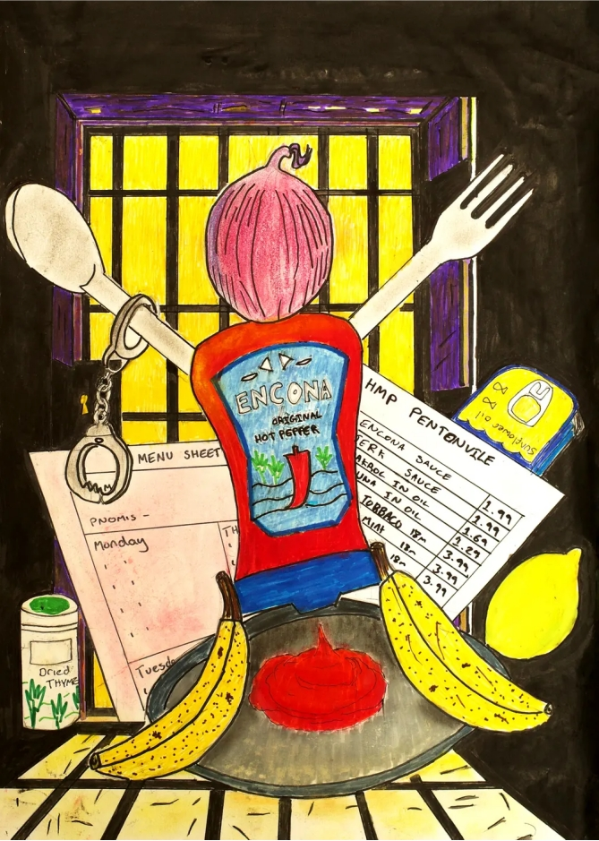

在接下来的六个月里，该小组制作了一本名为《民以食为天》（We Are What We Eat）的小册子，该册子包含 40 多张以监狱食物为主题的作品。

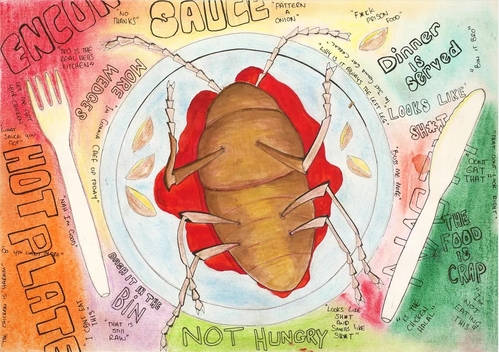

“菜单是个误会，上面的一切看起来都很棒，而现实是另一回事。”

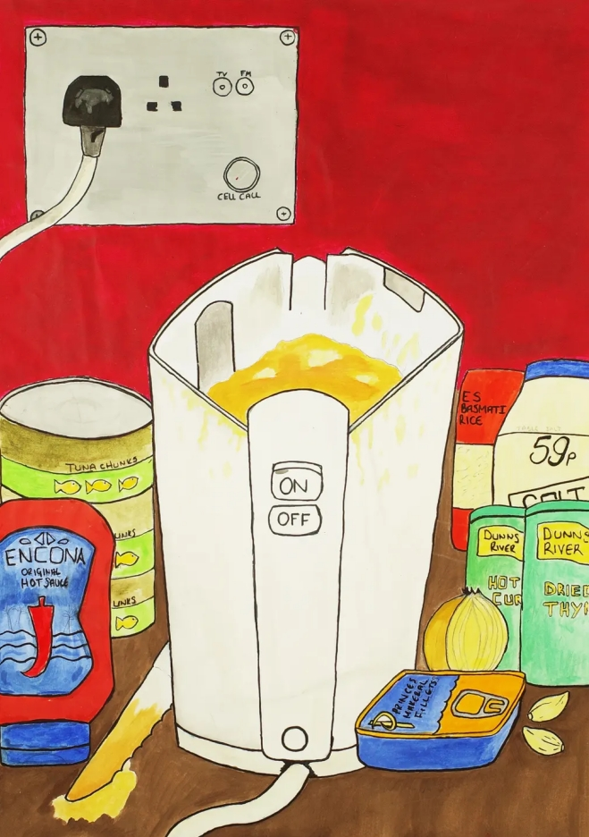

水壶是一件圣物，从电饭锅到煎锅，它有多重意义，是服刑人员拒绝监狱食品的象征。

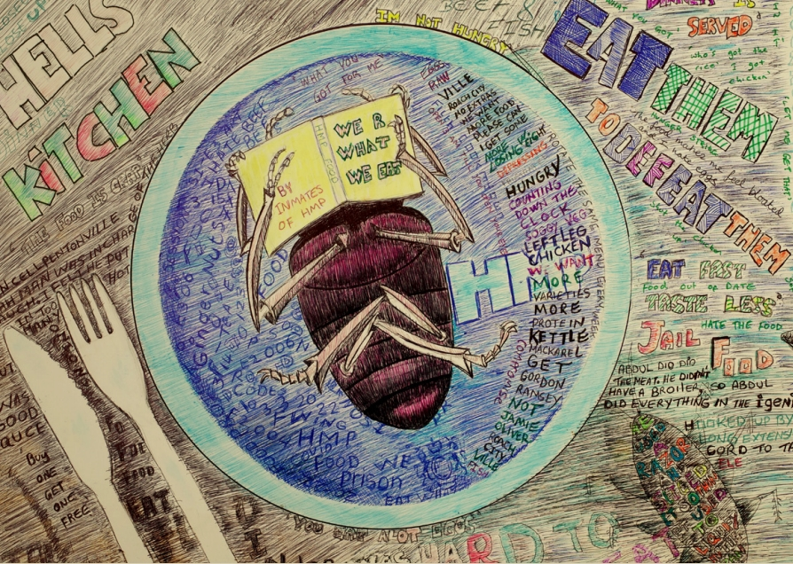

本顿维尔监狱艺术小组成员包括 Ahmed G.（项目负责人）、MIA、Damien、Ahmed M.、Paul、Miah、Ahmad、JK、Francisco、Human、Tommy、Robert、Frank、Elvin、Alexander、Dean和Bouakai。2022年5月，该画册在监狱图书馆发布，包含印刷版和电子版。

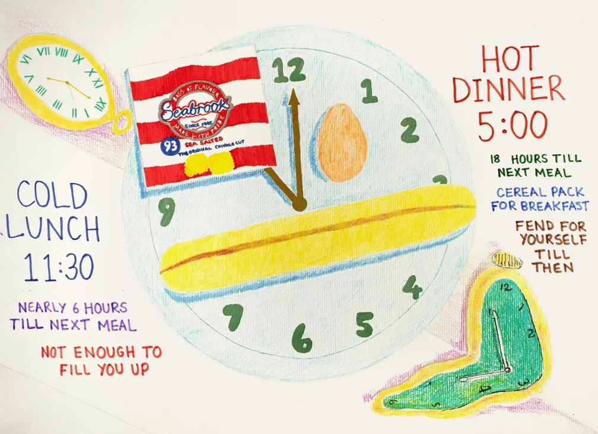

吃的没有蟑螂好

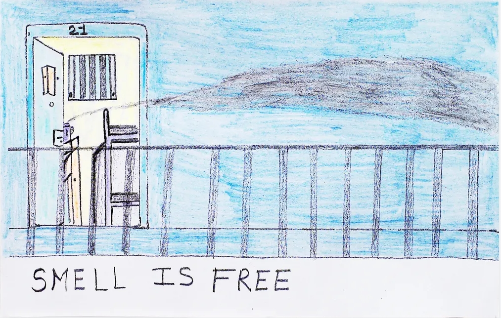

一天两餐，吃不饱

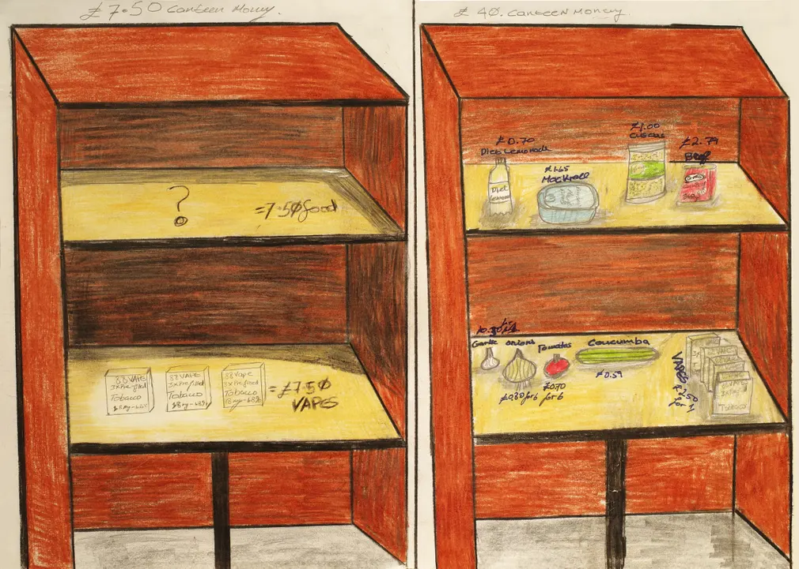

气味是免费的美味

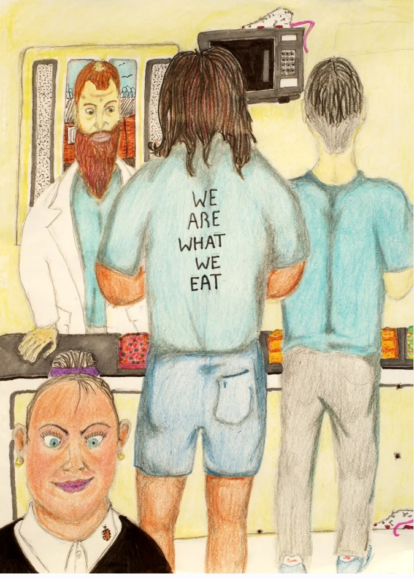

那些没人探视的人不够钱为自己补充营养

“本顿维尔没有公共区域供吃饭。当你走回牢房时，腿都酸了，饭自然也凉了。”

制作册子时，他们借鉴了博物馆收藏的历史画册（如百年前女性宣传争取投票权的画册）以及乔治·奥威尔收集的政治画册。服刑人员同时以这本册子为契机呼吁改善监狱的餐食。

该画册中的五幅作品（由 Tommy、Paul、Ahmed M.、Dean 和 Damien 创作）被选中在 2022 年伦敦Koestler 监狱艺术展上展出，该展览由艾未未策划。

该项目在伦敦博物馆官网上的链接（文内可下载该册子的电子版）：

https://www.museumoflondon.org.uk/discover/we-are-what-we-eat-food-prison
