# 扎哈尔·朵安的漫画日记《5号囚室》

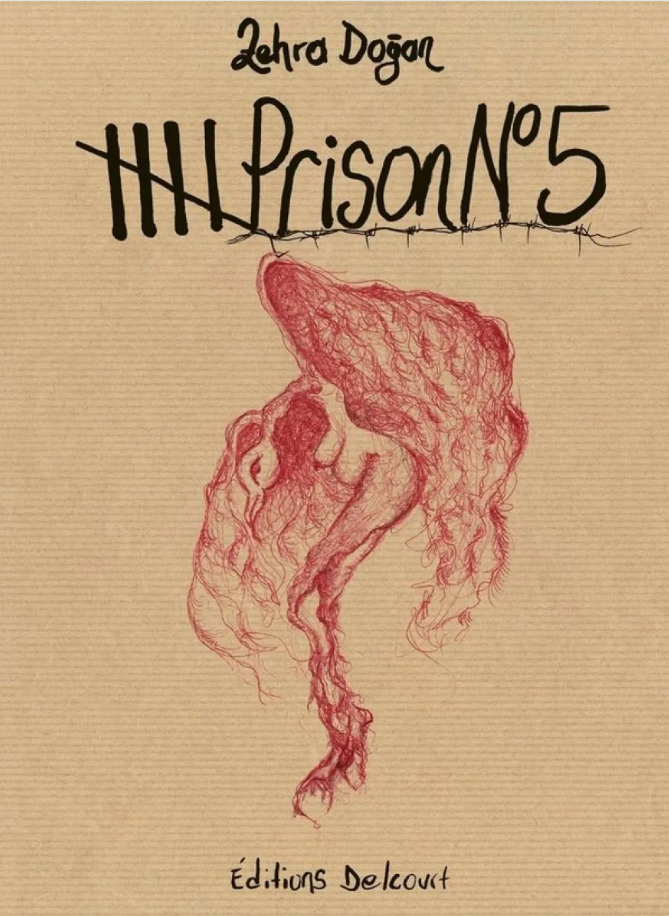

扎哈尔·朵安的图画书《5号囚室》

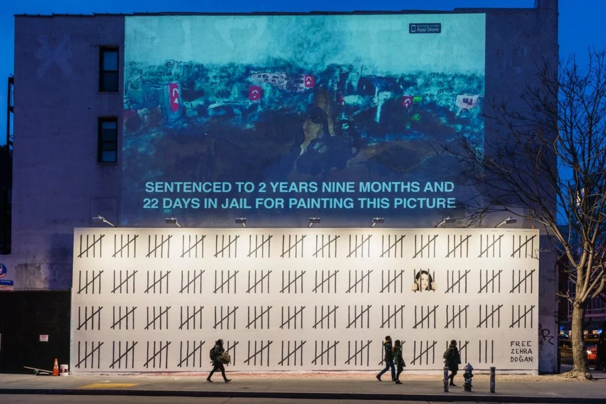

近7年前（2019年3月），狱望介绍了土耳其记者、画家扎哈尔·朵安和她在监狱里的抗争与创作。扎哈尔·朵安（Zehra Doğan）1989年生于土耳其迪亚巴克尔（Diyarbakır），是一位库尔德族艺术家、记者和作家。以大胆的新闻报道和政治艺术闻名。

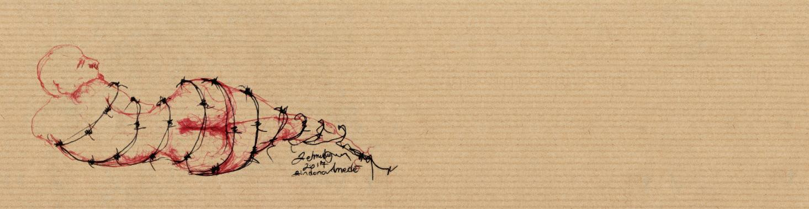

2015–2016年间，她在库尔德地区冲突高发地努赛宾（Nusaybin）和杰兹雷（Cizre）报道，那里实施宵禁、记者被禁止进入。她坚持从现场发回新闻和照片。

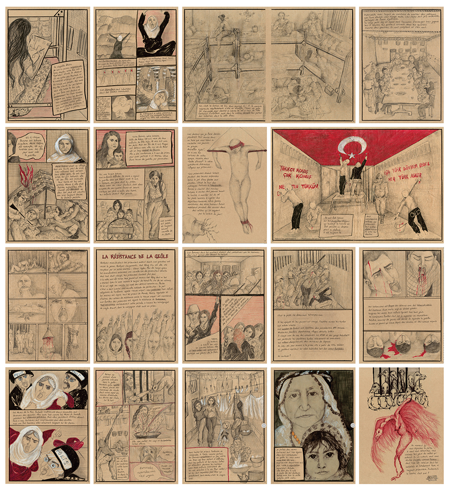

2016年7月，刚离开努赛宾的扎哈尔·朵安被逮捕。2017年3月，马尔丁第二重刑法庭以“恐怖主义宣传”（因报道、社交媒体帖子和一幅画）判她2年9个月22天监禁。

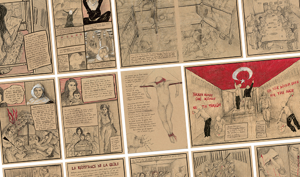

在狱中，她被禁止使用绘画材料，但她想方设法坚持创作：

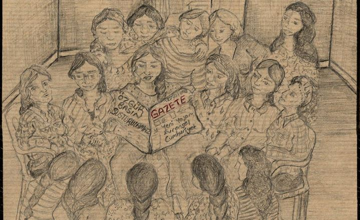

用头发、经血、水果汁、咖啡渣、纸盒、废报纸等做画材和画布，其中一组名为The red army in my pants（我内裤里的红色军队）。

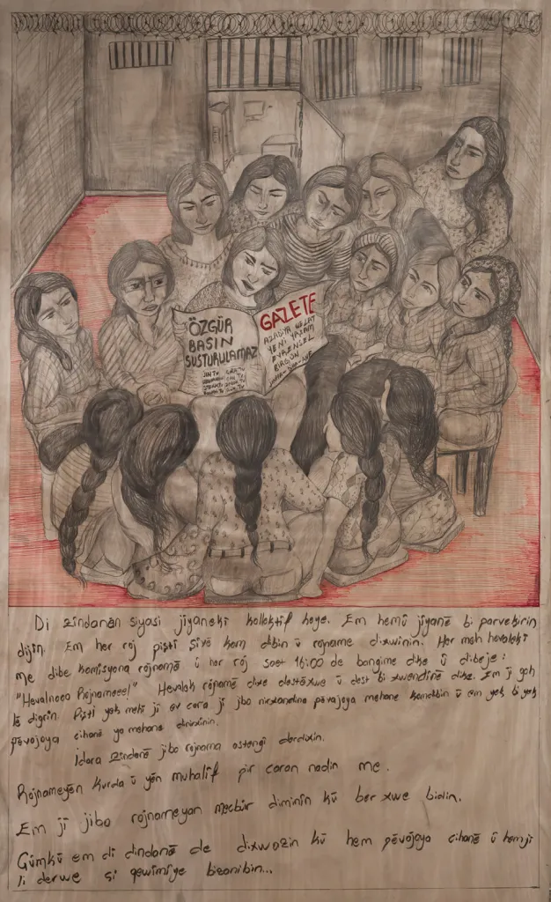

与其他女囚创办狱中报纸《Özgür Gündem Zindan》（监狱版《自由议程》）。

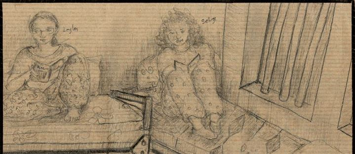

偷偷将作品通过信纸带出监狱。

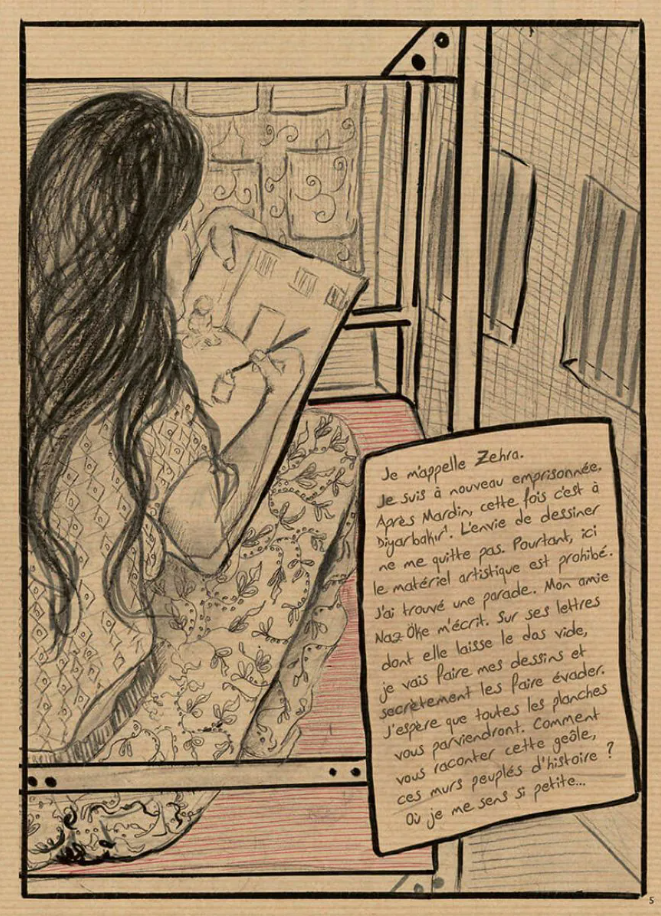

2018年3月，涂鸦大神班克斯（Banksy）与曾因街头艺术入狱的涂鸦艺术家Borf合作，在纽约曼哈顿下城的的街头艺术墙（曾被Keith Haring等大师画过）创作了一幅21米长的壁画，标题为“Free Zehra Doğan”。

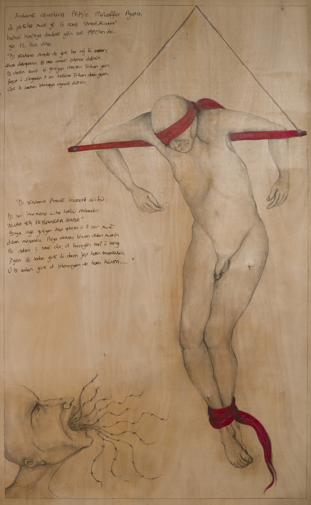

墙面用黑色粗线条画满计数划痕，代表朵安入狱的273天。

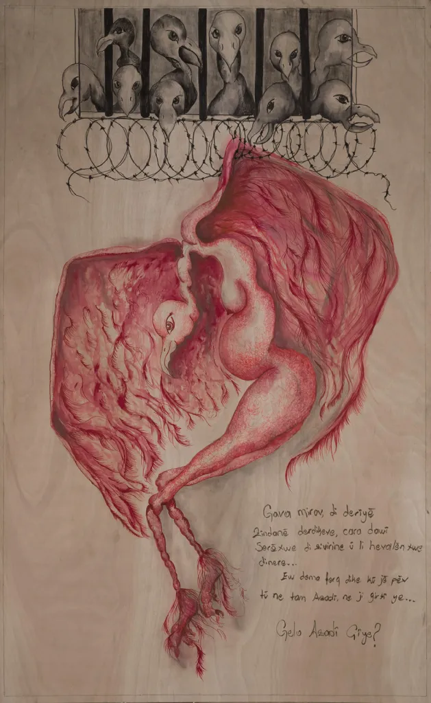

晚上，Banksy会在壁画上方投影多安那幅引发牢狱之灾的水彩画（被炮火摧毁的努赛宾废墟）。

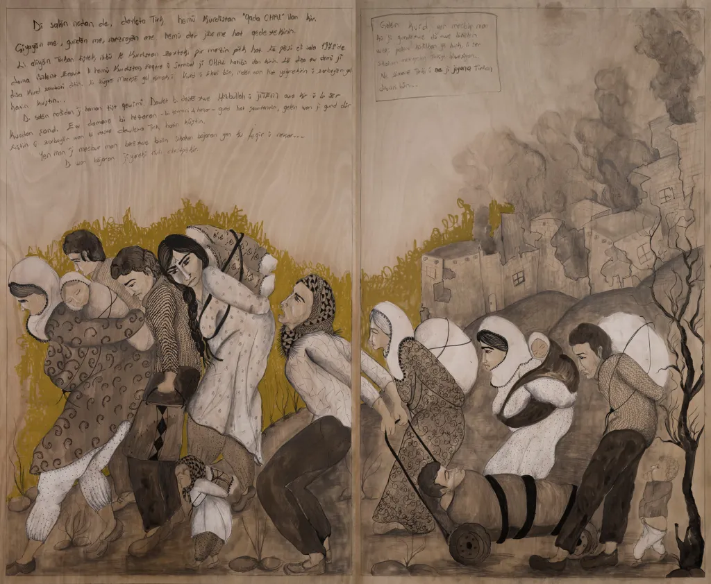

同时，Banksy在Ins上发帖，配文说：“一年前，Zehra Doğan因为画了这张新闻照片的水彩画被判刑。请转发她的画作。”同时@了土耳其总统埃尔多安表达抗议。接受《纽约时报》采访时，Banksy说：“我真的很同情她。我画过的东西比这更值得坐牢。” Zehra Doğan偷偷写了一封两页长的感谢信给Banksy，描述了狱中恐怖条件，并向Banksy和Borf致谢。

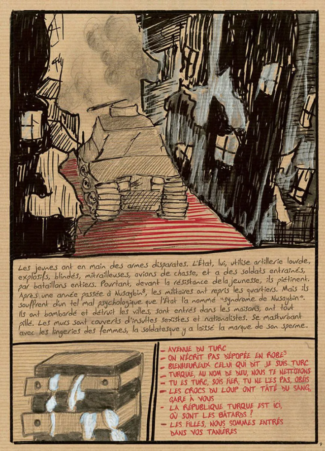

2019年2月，在马尔丁和塔尔苏斯女子监狱服刑近600天后，Zehra Doğan提前获释。

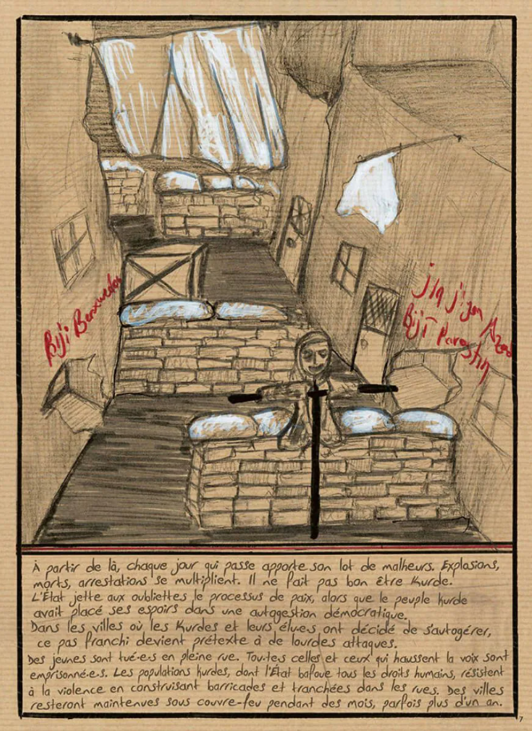

获释后，Zehra 继续艺术创作。2019年11月，她的狱中信件结集出版，书名为《Nous aurons aussi de beaux jours》（我们也会拥有美好的日子）。

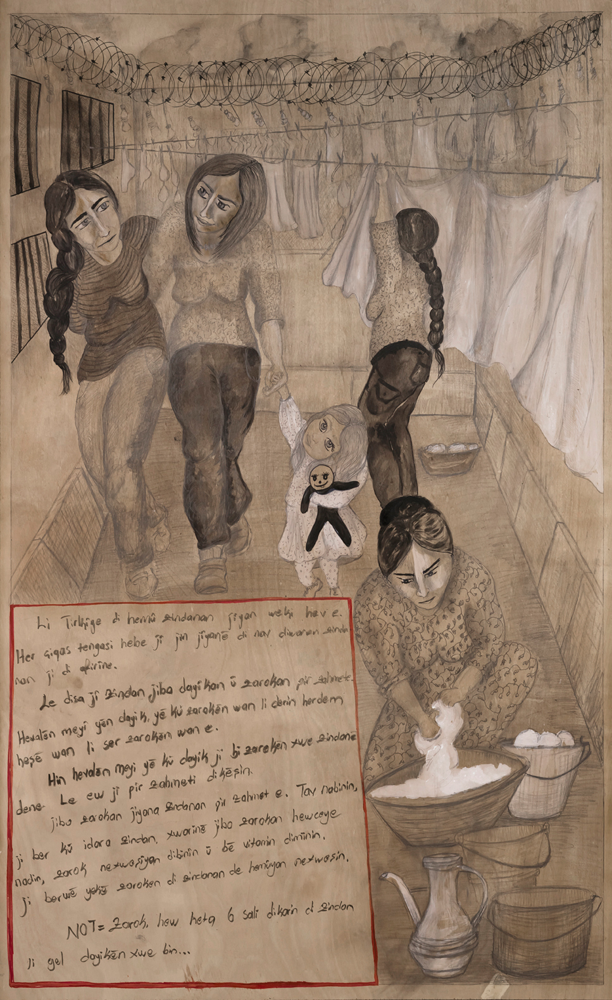

2020年，由于当局的不断骚扰，她不得不离开土耳其。“一百年前，库尔德斯坦被分割成四个部分。我无法回到我曾经居住的、后来被划归土耳其的那部分。”她去了伊拉克北部的库尔德人聚集区，“那里也是我的祖国。所以，尽管属于土耳其的那部分故土对我来说是禁区，但至少目前我可以沿着它的边界漫步，呼吸着我出生之地的气息，即使那里遍布铁丝网和雷区。于是我去了苏莱曼尼亚，一个位于分裂的库尔德斯坦的城市。尽管它已被划归伊拉克，但这片土地依然属于我。”

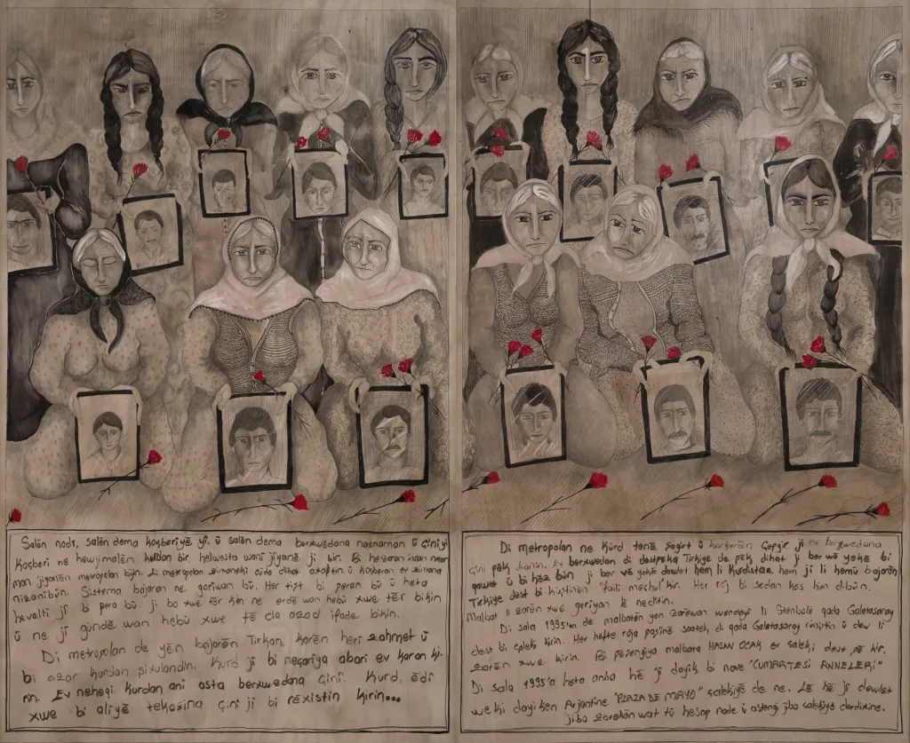

在苏莱曼尼亚，她还在阿姆纳·索拉卡博物馆（Amna Suraka Museum）做了行为作品（见个人网站：zehradogan.net，阿姆纳·索拉卡博物馆曾经是萨达姆政权时期的监狱。）

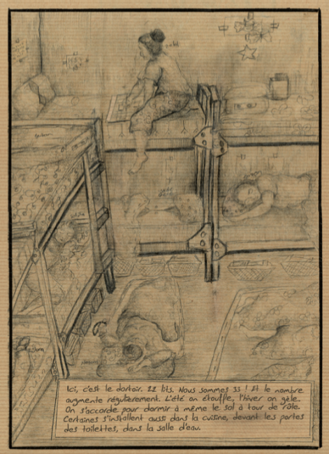

“在苏莱曼尼亚，我们遇到了革命同志，他们也来自土耳其的库尔德斯坦地区，一样无法返回家园。我们一起建造了一个家。

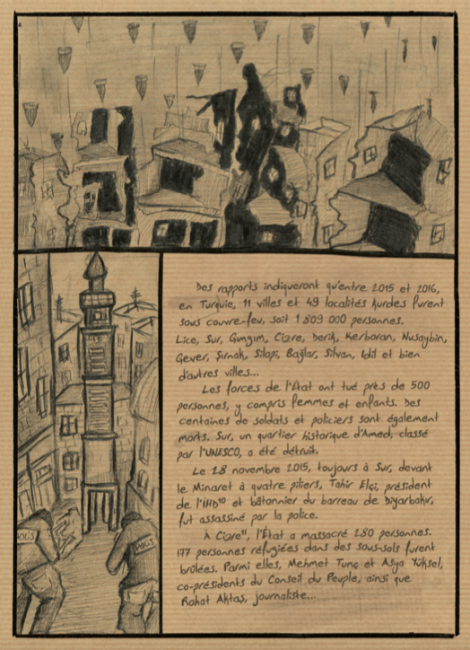

在这个家里，我们继续开展库尔德女性科学学院的工作，这是库尔德女性多年来一直在学习的学科。我们在那里研究女性科学和历史，这段历史已被遗忘和忽视了数千年。我们还成立了由库尔德女性艺术家组成的Xwebun艺术团体。在艺术团体的办公场所，我们开始创建库尔德斯坦女性图书馆，开创性的开始收藏库尔德女性艺术家的作品。

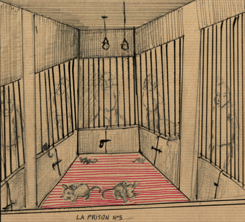

然而，不到一年，我们的家就因可怕的变故而解体了。

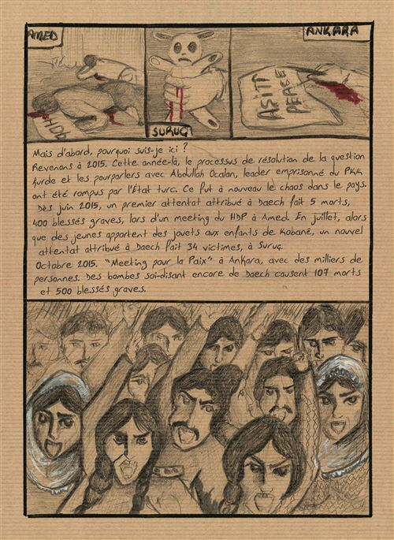

土耳其国家情报部门开始监视我们的学院，2022年10月4日，我们的朋友纳吉汉·阿卡塞尔（Nagihan Akarsel）在去往新建的图书馆的路上，被一名土耳其政府雇员连开11枪，当场身亡。随后，数十位朋友在苏莱曼尼亚的街头被土耳其特工杀害。就在上个月，我的两位记者朋友，居丽斯坦·塔拉（Gülistan Tara）和赫罗·巴哈丁（Hêro Bahadin）也惨遭杀害。”

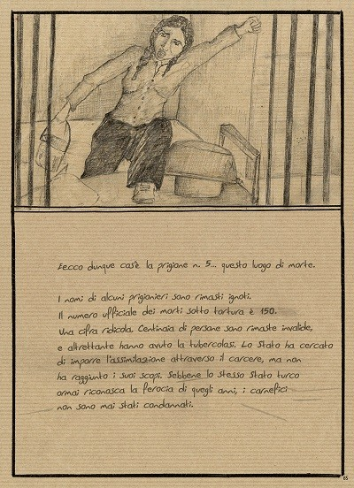

之后，Zehra Doğan去往欧洲，在德国落脚。

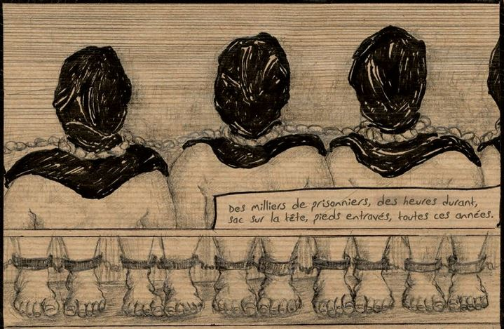

“土耳其政府吊销了我的护照，我成了欧洲的难民。我像一个非法越境者，在柏林滞留一年了。我的每一步都被这颗破碎星球上缠绕的铁丝网所束缚。尽管如此，我必须坚强，我不能向任何人，哪怕是对自己，暴露我的弱点，否则我会崩溃。无论走到哪里，我都无法摆脱那种来自另一个星球的感觉，仿佛我被瞬间传送到了这里。但又仿佛我的根，我出生之地留下的痕迹和印记，不断地召唤着我的神经末梢，将我拉向它们。”

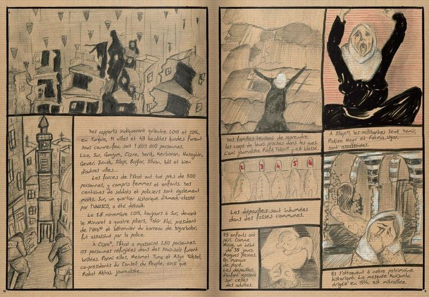

2021年春季，她的图像作品集《Prison n°5》在法国和意大利出版。

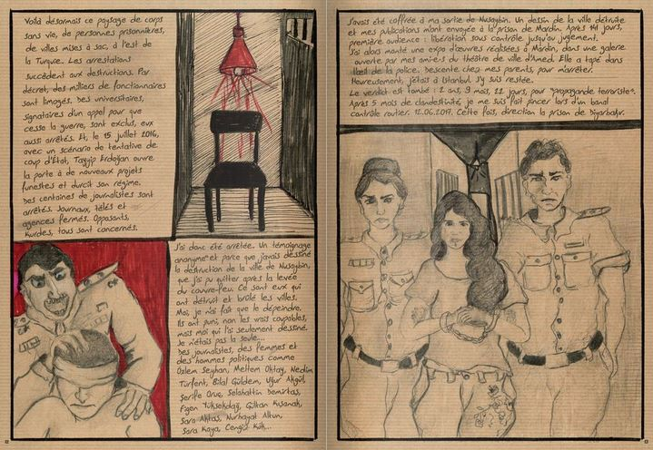

2023年10月，土耳其最高法院对Zehra Doğan的上诉作出裁决，认为法院在评估证据时犯了“错误”，推翻了2017年判决，认为应“无罪释放”。

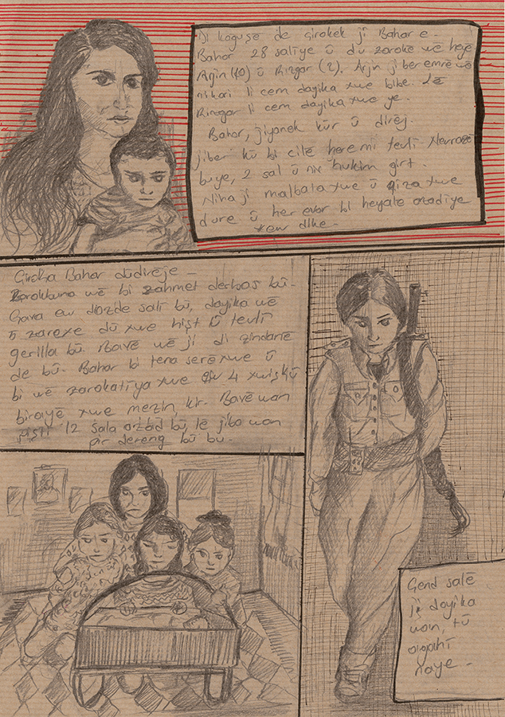

2024年5月9日，重审在马尔丁第二重刑法庭举行。法院宣布她“所有恐怖宣传指控，因缺乏法律依据而撤销”，完全无罪。但同一天，努赛宾检察官提起新的诉讼，还是针对她的“新闻和艺术工作”，又对她发出逮捕令。

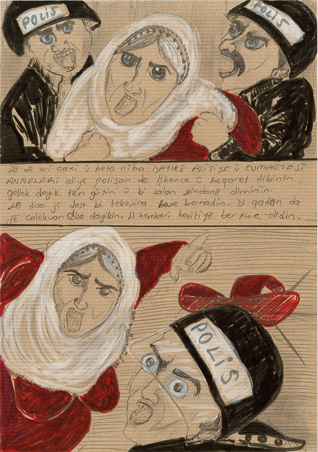

Zehra Doğan目前居住在柏林，以“游牧”的方式在欧洲各地工作。

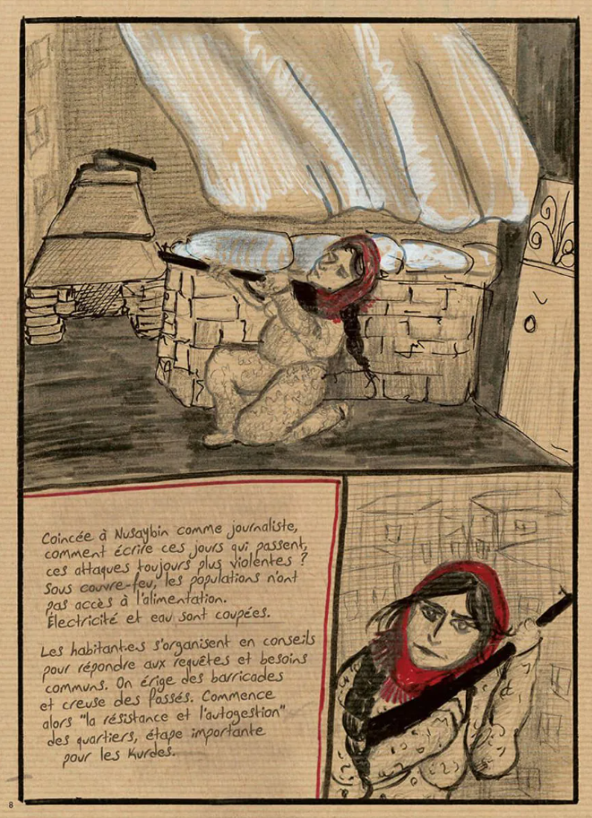

她在个人网站上阐述作品时也表达了自己的痛苦：我常说，我真正的囚禁始于出狱之后……始于人们开始只透过我在监狱里的新闻和艺术作品来看待我，用艺术来定义我的抵抗。我变成了一种公众人物，有人欣赏我，有人喝彩我，有人崇拜我，有人奖励我……

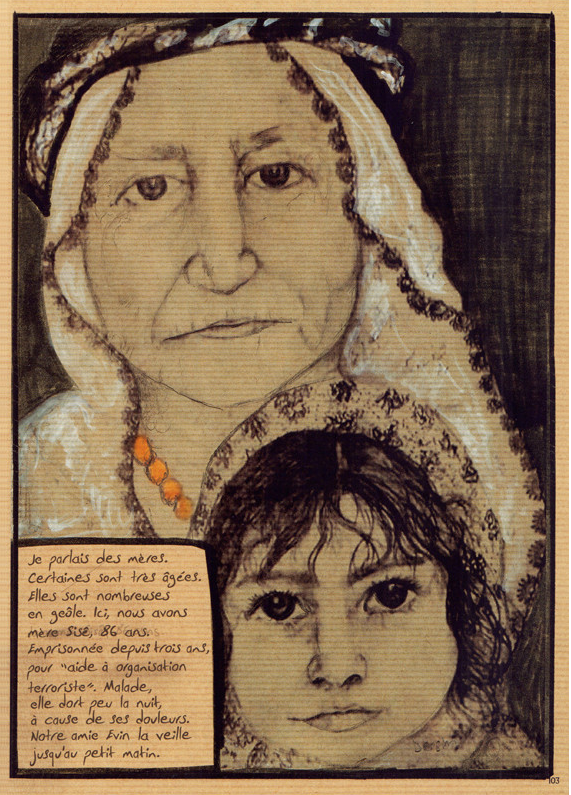

没有人意识到，我的所有器官早已伤痕累累。我的五脏六腑，被亲戚们的话语深深刺痛。

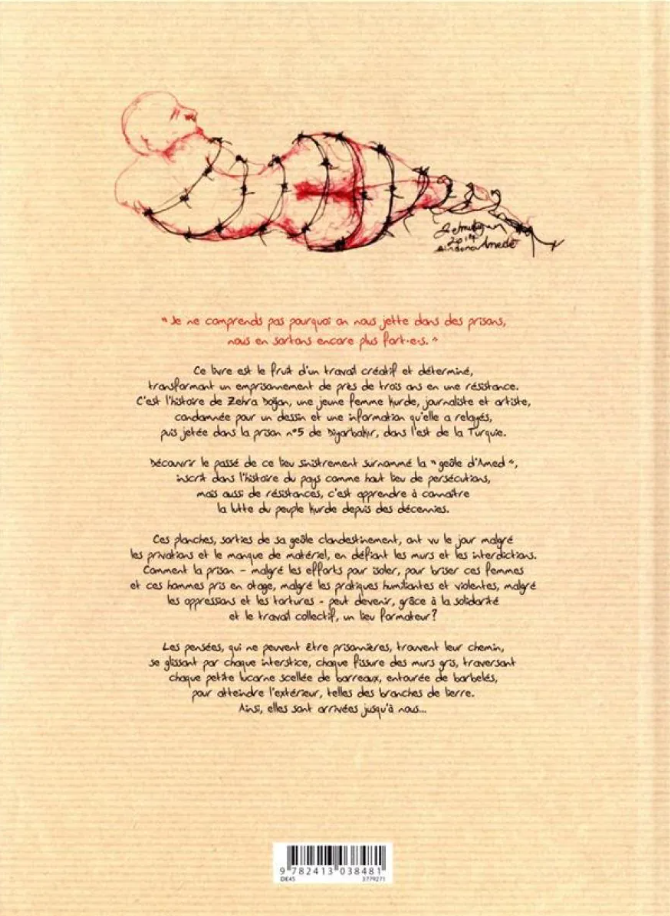

我感到自己无论去哪里都不属于这里，在这流放般的生活中，我感觉自己像个囚徒。我的身体像个牢笼，不断变换形状，扭曲着，折磨着我……

图形小说《Prison n°5》 是Zehra Doğan狱中经历的真实记录。这本书于2021年春季以法文版和意大利文版出版，后来入选了多家媒体的“21世纪最具代表性图形小说”榜单。

全书约120页。原作在迪亚巴克尔监狱（Diyarbakır Prison，她在这里关押了15个月）5号囚室服刑期间偷偷完成的，每一页都画在朋友寄来的信纸背面。这些信纸一张张被偷偷带出监狱，积累成书。

该书以以监狱日记+漫画的形式，混合了自传式叙述、肖像、场景速写和文字反思，内容包括：

作者入狱经过

监狱日常：逼仄的牢房、搜身羞辱、食物短缺、医疗忽视、狱警的心理折磨。特别是女囚的集体生活——互相支持，分享故事，偷偷办小型“报纸”（Özgür Gündem Zindan，监狱版自由议程报）。

女性肖像：着墨身边女囚，比如年长的萨基内（Sakine），脸上的皱纹像智慧与苦难的地图；年轻女孩的恐惧与坚强。Doğan用炭笔、彩铅等简单工具，画出她们被压抑却不屈的表情。

抵抗方式：描述如何搜寻有限材料，“监狱想剥夺我的艺术，但我把身体变成了工具”。

情感描写：对身体痛苦、精神折磨的细腻记录，比如单独监禁的孤独、被转移到塔尔苏斯监狱的恐惧，以及对库尔德女性命运的思考。

更多Zehra Doğan的作品，请关注她的个人网站：zehradogan.net

PS：Doğan 是土耳其的大姓，该国有40多万姓Doğan。Doğan 的意思是猎鹰或隼。土耳其在1934年实施《姓氏法》，规定国民必须选一个土耳其语姓氏，很多家庭选择了代表积极品质、自然元素或动物的词，比如鸟类（Şahin、Doğan）、猛兽（Aslan、Kurt）、金属（Demir、Çelik）等。土耳其语里，Doğan 中的 ğ 是不发音的，只是让前面的元音 o 稍微拉长一点。
