# 伊朗女艺术家维达·拉巴尼的狱中画作

伊朗女艺术家维达·拉巴尼的狱中画作

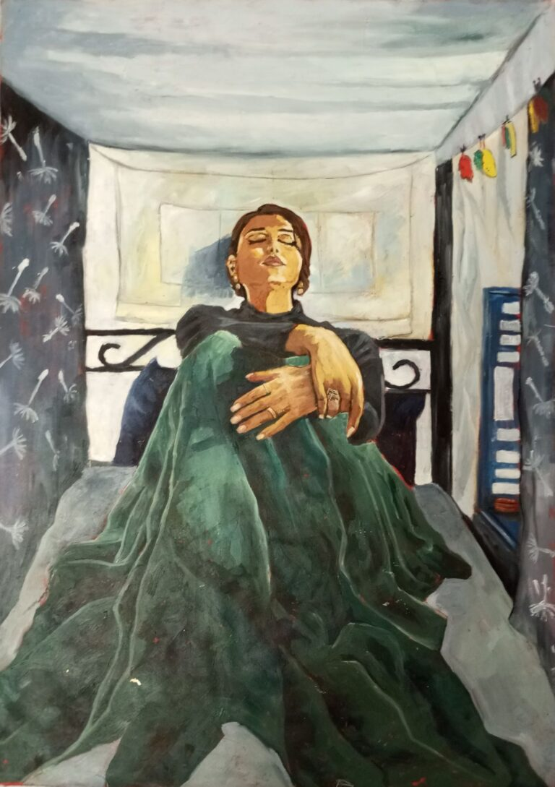

由于摄影被禁止，绘画成了记录监狱中人和空间的唯一视觉方式。

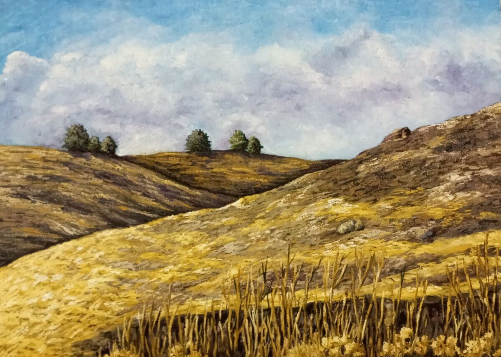

《维达，唯一可以消失的地方》，2024年  床单布上丙烯颜料，50 x 70cm

Vida Rabbani（全名Vahideh Rabbani），1989年生于伊朗南部布什尔省。是一位记者、人权活动家和艺术家，以大胆的报道和对女性权利、改革派议题的倡导而闻名。

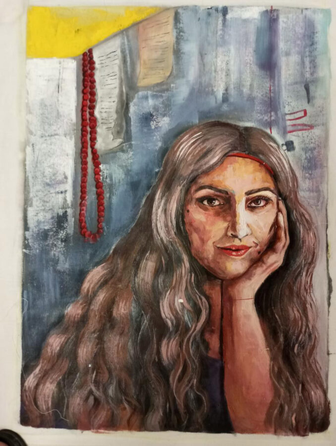

近年，Rabbani数度被捕。2020年，她因参与抗议伊朗伊斯兰革命卫队击落乌克兰国际航空PS752航班的事件被捕，2022年，因在Clubhouse讨论政治议题被短期监禁，2022年9月，参与头巾革命被捕。罪名包括“反国家宣传”、“集会和勾结危害国家安全”、“侮辱圣物”、“扰乱公共秩序”和“煽动暴力行为”。

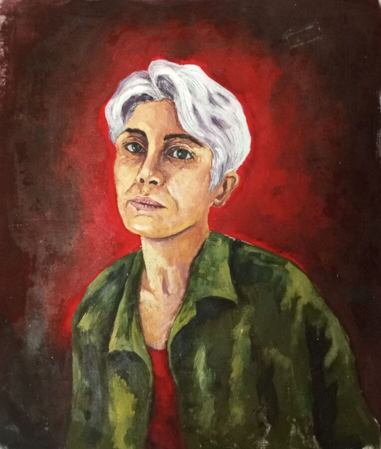

2022年，因参与抗议活动，Rabbani再次被捕，被指控数项罪名，合并判处11年监禁，被关押在德黑兰臭名昭著的Evin监狱。

服刑期间，Rabbani开始用绘画作为生存和抵抗的方法。2025年8月，她接受Global Voices采访时说：“在监狱里，绘画给了我新的能量和目的感……我画画是为了不让监狱吞噬我们。”

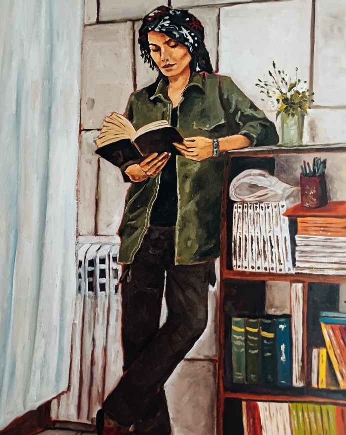

这是Rabbani在狱中的第一张画，画的是从牢房望出去的埃文山。

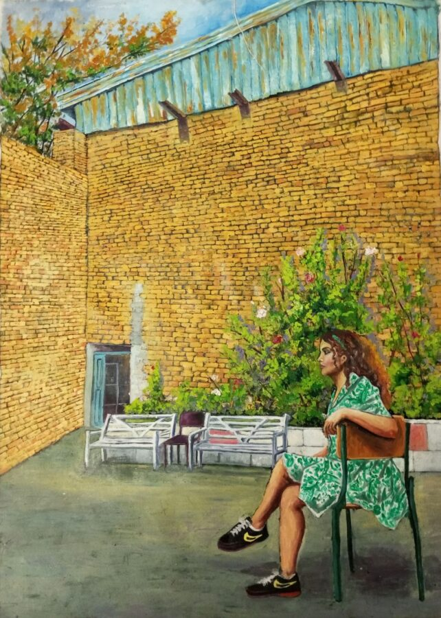

Rabbani画的第一幅肖像画。画中人是狱友戈尔罗赫·伊拉伊（Golrokh Iraee），她被判处死刑。在她被处决前夜，我在床上点着灯光完成了这幅画。

“我最想念的还是戈尔罗赫。每次提起她的名字，我都会哽咽。这两年里，我从未像凝视这张脸那样凝视过任何人。每天早上醒来，我都会看到她；夜深人静时，我走向床边，轻声对她说晚安。”

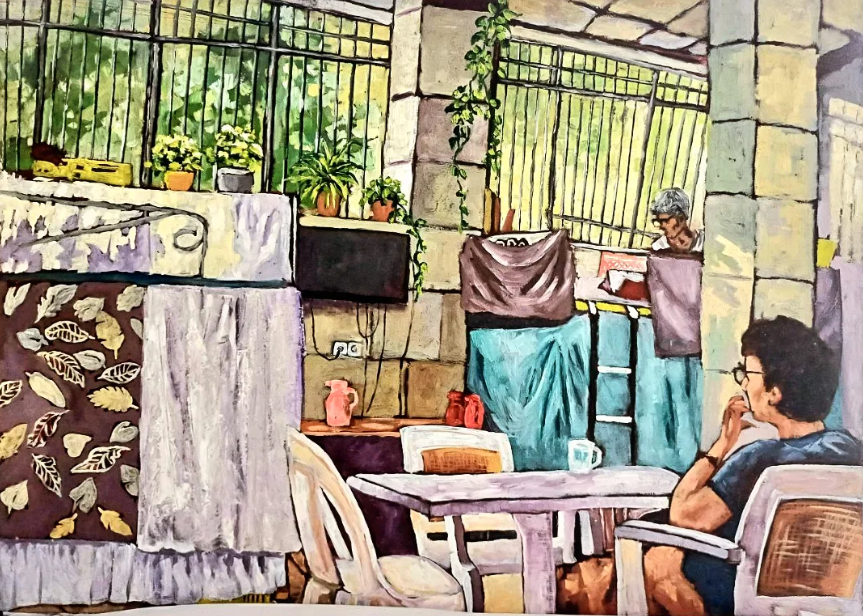

帕赫珊·阿齐兹（Pakhshan Azizi），另一位被判处死刑的狱友。

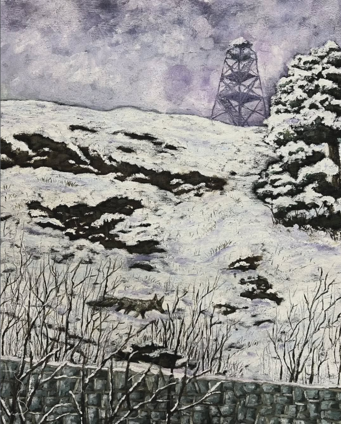

瓦里舍·莫拉迪（Varishe Moradi），也被判处死刑。

纳西姆（Nasim），死刑判决的阴影笼罩着大地，但鲜花依然盛开。

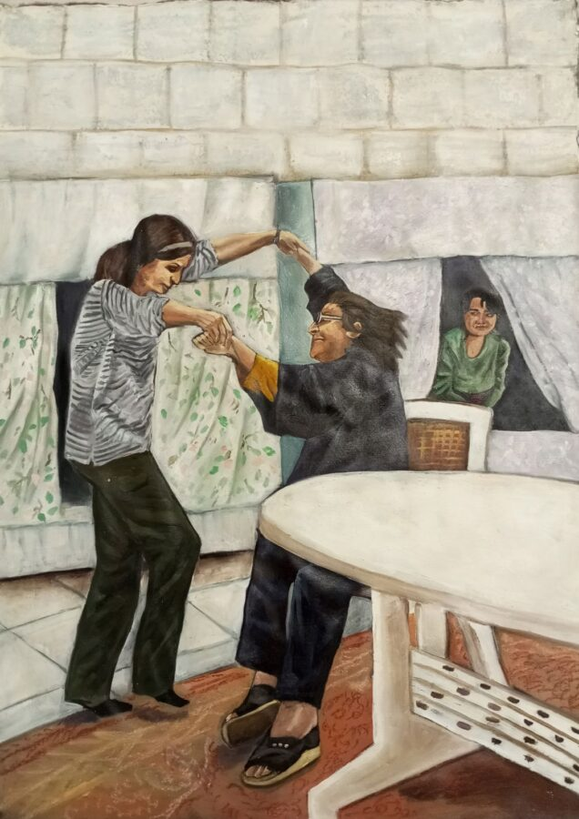

监狱一度禁止Rabbani拥有画材，她请狱友们帮忙，探监时，大家把油画颜料和画笔藏在衣服里带进来，花了几个月才收集到足够的材料。

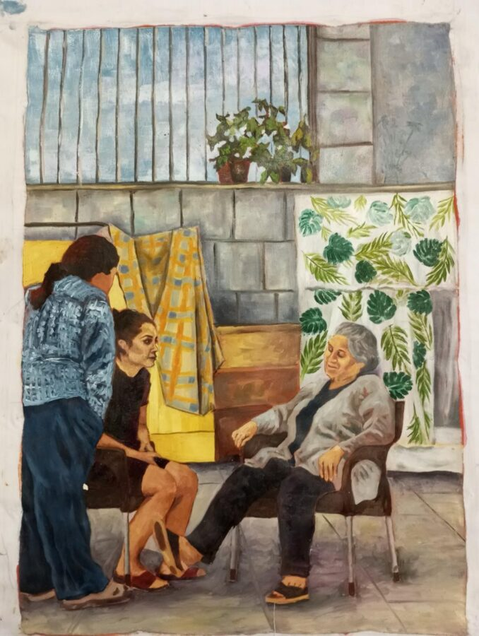

过年期间，纳尔吉斯·穆罕默迪（2023年诺贝尔和平奖得主）说服狱方允许带入更多材料。Rabbani利用这个机会，把颜料混在墙漆里带了进来。

《墙后的夏日》，2024年  床单布料上的丙烯颜料，50 x 70cm

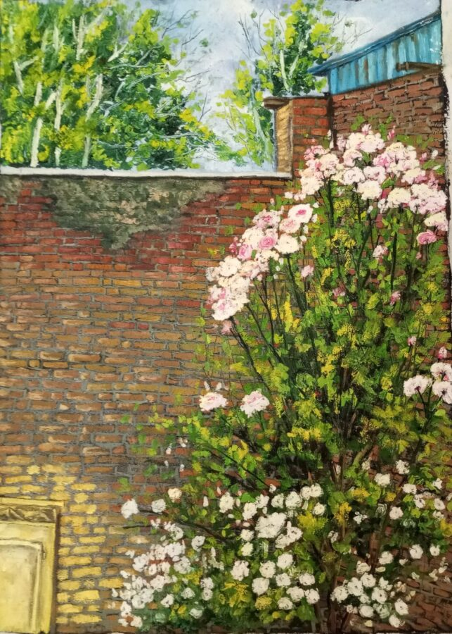

“这是我画的埃文女子监狱二号牢房。据说爆炸震碎了所有窗户，三号和四号牢房之间的墙壁也被炸毁了，据说吊顶也被炸毁了，所幸没人伤亡。我亲眼目睹了办公楼被拆除，那栋楼里是埃文监狱安保办公室。安保人员从我这里拿走了几幅画，放在那栋楼里……我想它们再也找不回来了……”

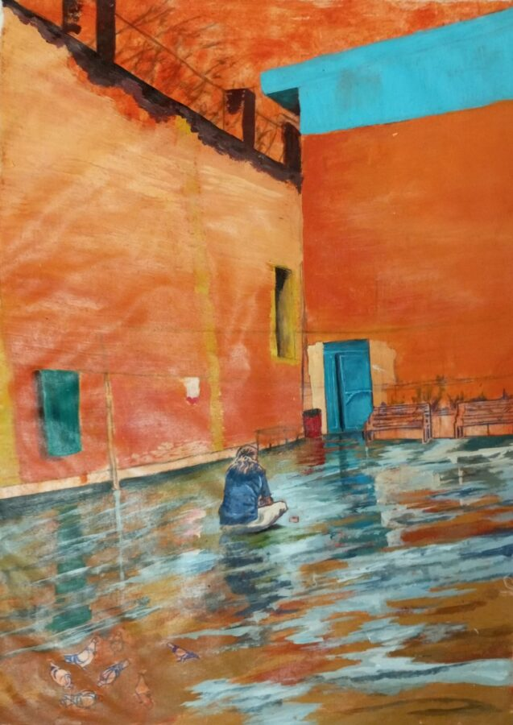

冬日窗外，埃文山，执行死刑的地方。

《禁忌华尔兹：光之瞬间》，2024年  丙烯颜料绘于床单布上，50 x 70cm

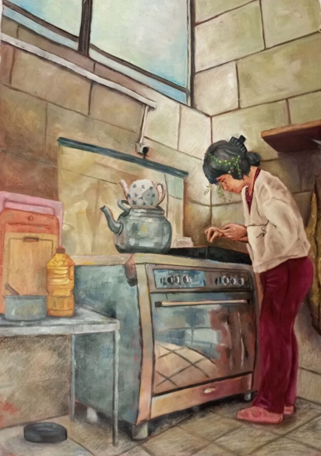

《开放性伤口》，2024年  床单布料上的丙烯颜料，50 x 70cm

《尼卢法尔的花园》，2024年  床单布料上的丙烯颜料，50 x 70cm

《雨中静坐》，2024 年  床单布料上的丙烯酸颜料，50 x 70 cm

《蒸汽与寂静》，2024年  丙烯颜料绘于床单布上，50 x 70cm

2023年Rabbani获得减刑，被关押32个月后，于2025年4月10日获条件假释出狱。
