# 安哥拉监狱的临终恩典

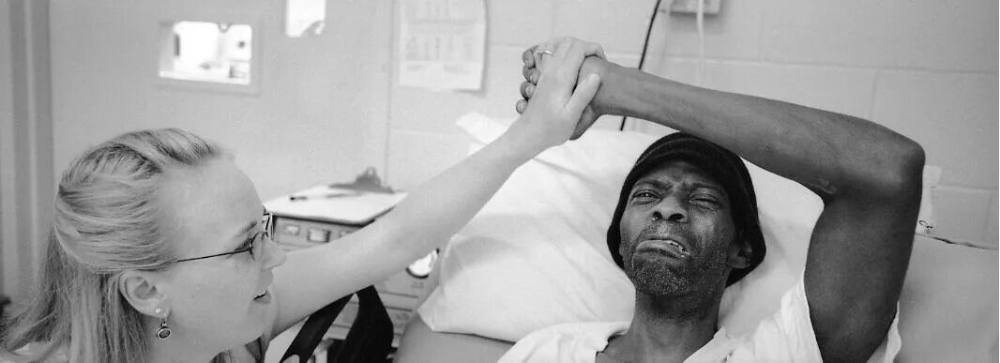

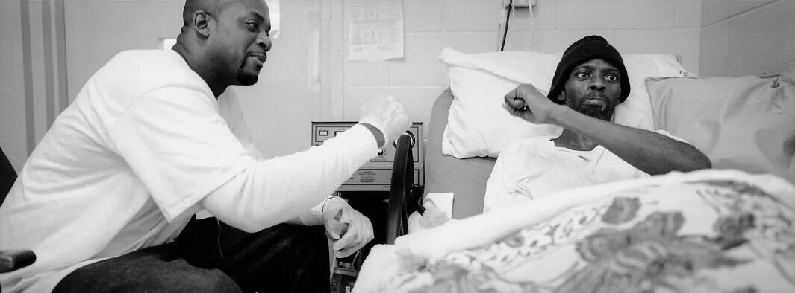

安哥拉监狱的临终恩典

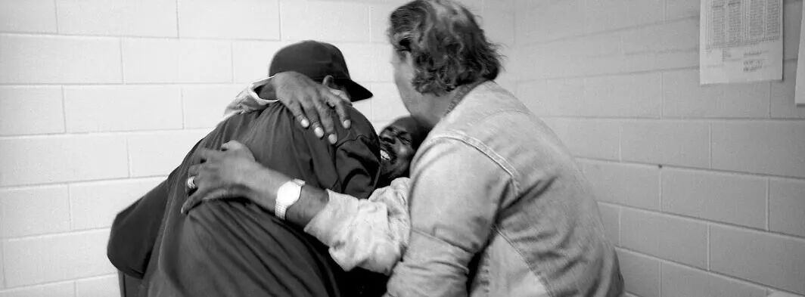

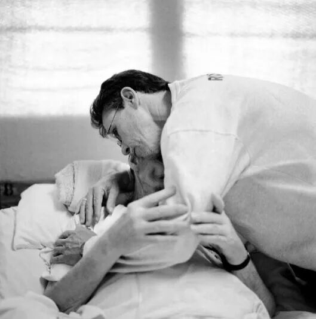

临终恩典(Grace Before Dying)是美国摄影师洛里·瓦塞尔楚克（Lori Waselchuk）历时三年在安哥拉监狱拍摄的临终关怀项目。

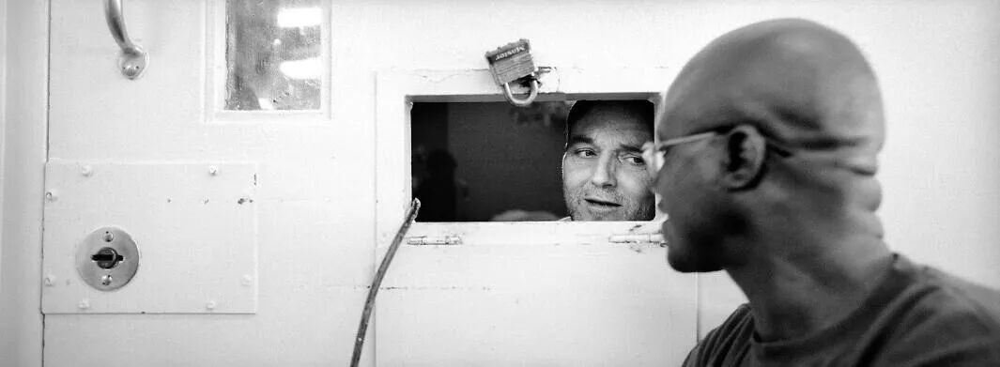

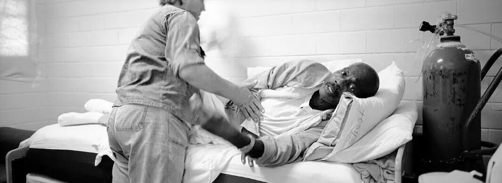

路易斯安那州是美国最为严刑峻法的几个州之一，该州州立监狱安哥拉也是著名的重刑犯监狱，号称“南方的恶魔岛”。安哥拉监狱关押着5000余名囚犯，其中80%以上都将在狱中终老。过去，囚犯们都是在监狱医院里独自死去。1998年，一个临终关怀项目改变了这一状况。该项目招募了一些同样被监禁的人为不久于人世的囚犯做一些临终关怀方面的照顾，在监狱内营造了一个颇为人性的氛围。藉此，囚犯们从志愿者的同理心和善良中得到安慰。安哥拉监狱的官员称，临终关怀计划帮助安哥拉成为该国暴力最少、安全程度最高的机构之一。

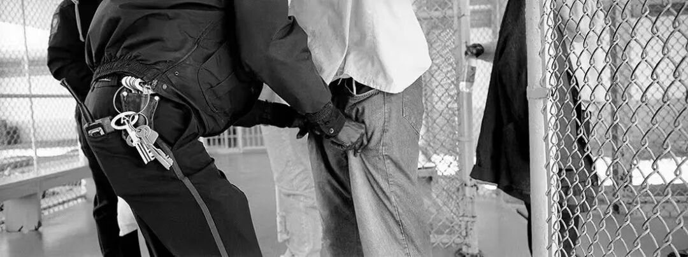

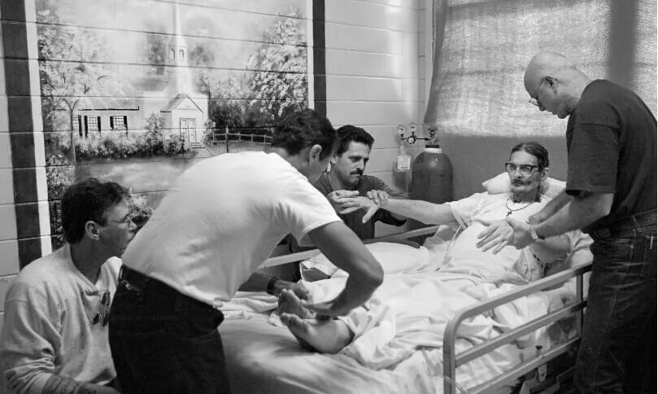

“做这项工作时，我把重点放在护理者和患者的联结上，这个联结展现着爱和脆弱。临终关怀志愿者勇敢地面对自己的遗憾和恐惧，给出自己的爱，这让我深受感动。他们让我认识到解决社会问题的核心——承认我们共同的人性。”

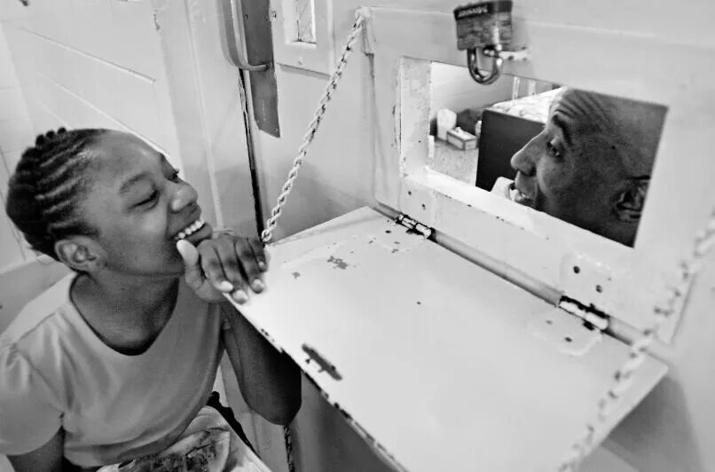

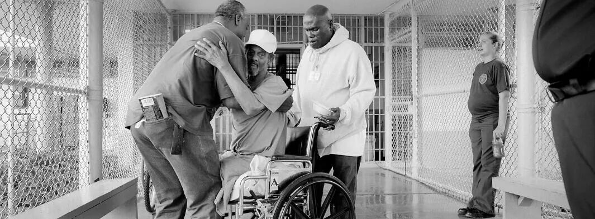

——洛里·瓦塞尔楚克

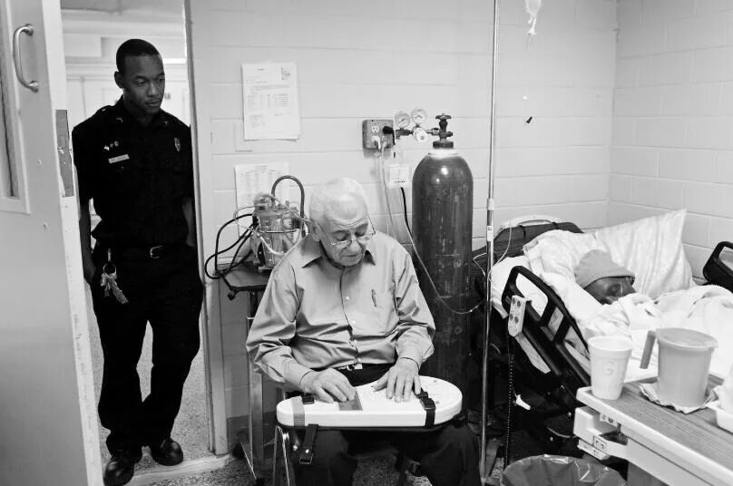

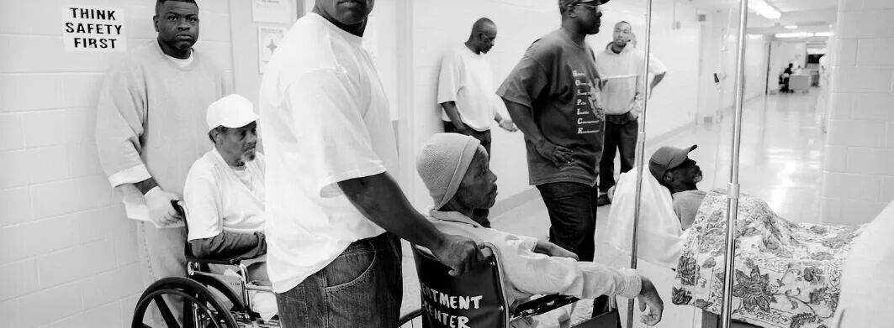

梅洛迪·埃舍特（Melody Eschete，左）握着蒂莫西·米诺（Timothy Minor）的手，他刚刚得知自己无法得到进一步治疗的消息。埃舍特是一名执业护士，也是安哥拉监狱临终关怀项目的协调员。协调志愿者的工作，并为患者和志愿者提供咨询。

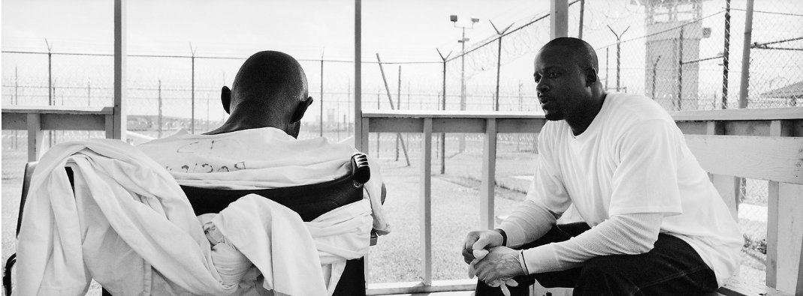

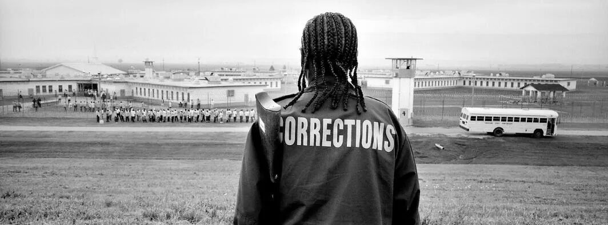

志愿者哈伦·阿卜杜勒·谢里夫·艾尔（左）和囚犯卡尔文·杜马（右）将乔治·亚历山大抬下床。亚历山大被诊断患有晚期肺癌和脑癌。谢里夫·艾尔和杜马帮助他前往洛杉矶巴吞鲁日的一家医院。梅洛迪·埃舍特解释说：“这里有一种团队氛围。”“每个人有各自的角色，都很重要。”

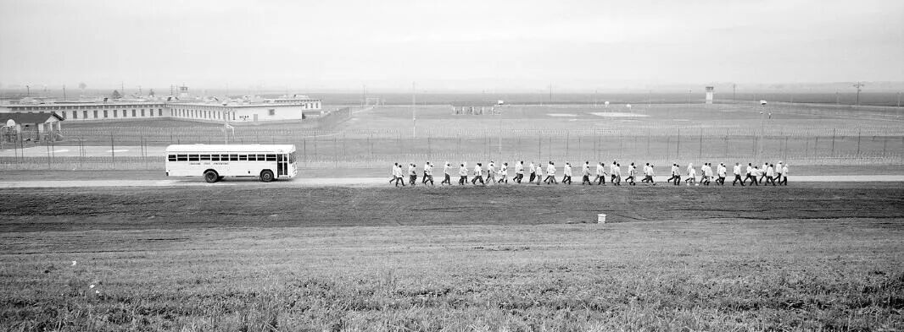

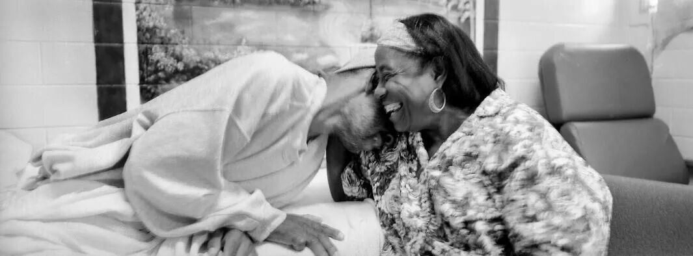

保罗·克罗洛维茨向他的老朋友理查德·利格特告别，利格特正在与晚期肝癌和肺癌作斗争。克罗洛维茨和利格特曾在安哥拉的木工车间并肩工作多年。那天，克罗洛维茨和其他囚犯站在利格特的床旁，几乎没有说话。几天前，克罗洛维茨收到了他即将获释的通知。几个小时后，克罗洛维茨将离开安哥拉。最后，利格特让克罗洛维茨俯下身，他小声说：“你是我最好的朋友，我爱你。”“我也爱你，”克罗洛维茨说，并最后一次拥抱了他的朋友。

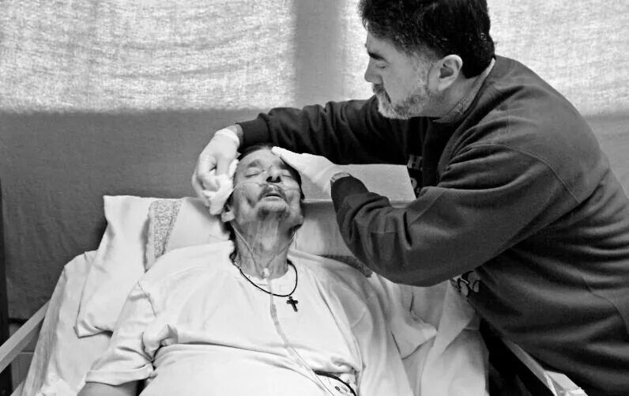

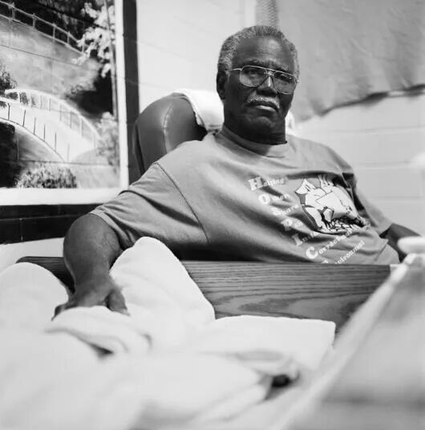

46岁的临终关怀对象特里·肯德里克（Terry Kendrick）在禁闭中接受志愿者沃伦·约瑟夫（Warren Joseph）的探视。

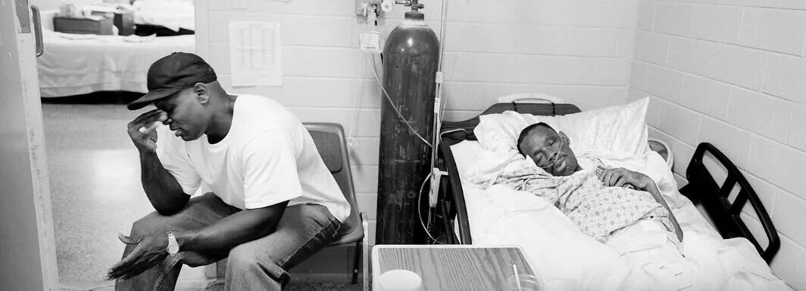

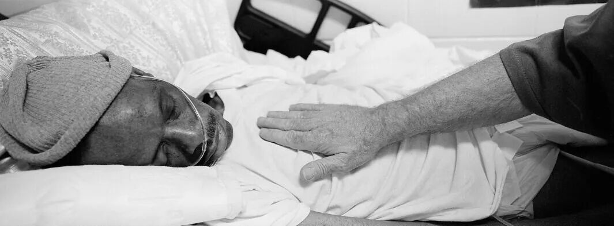

卡尔文·杜马帮助乔治·亚历山大在床上翻身。30多年来，杜马和亚历山大在安哥拉一直是非常亲密的朋友。在安全部门的许可和监狱同事的支持下，杜马得以连续几天与亚历山大在一起。“我在身边时，他看起来越来越好。我不在时，他看起来就要倒下了，”杜马说。

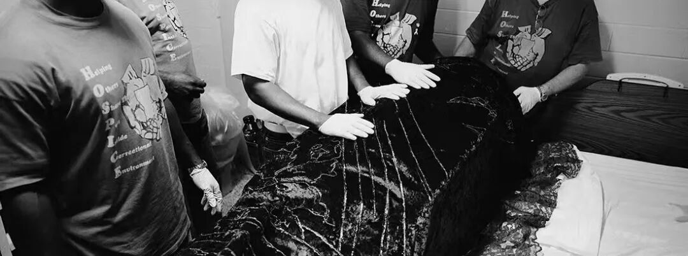

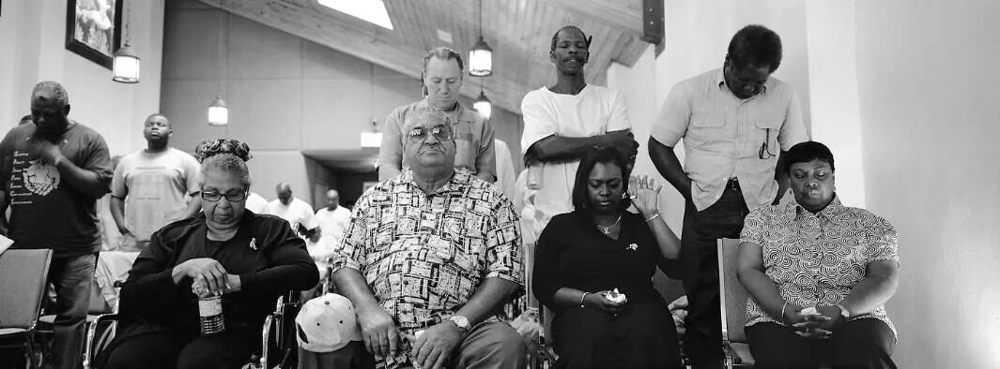

由于志愿者也是囚犯，他们要接受严格的安全检查。

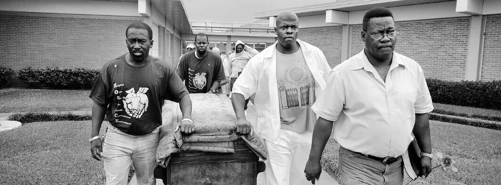

志愿者伦道夫·马蒂厄（Randolph Matthieu，最右）向保罗·克罗维茨（Paul Krolowitz）、卡洛·德萨沃（Carlo DeSalvo）、约瑟夫·格雷科（Joseph Greco）展示了如何减轻朋友理查德·利格特（Richard Liggett）的肿胀。利格特患有肺癌和肝癌。他是一名木匠，曾在木工店培训过克罗洛维茨、德萨沃和格雷科。

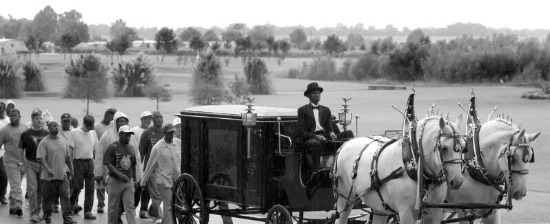

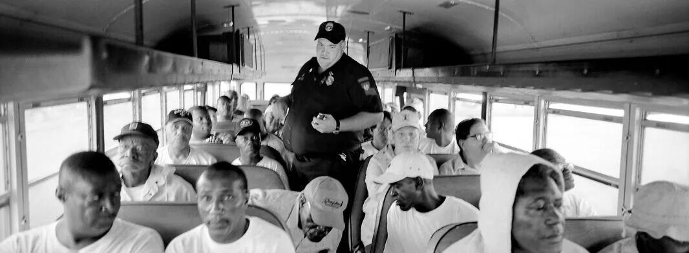

志愿者诺兰·詹姆斯（左）和病人肯尼·明戈（右）将阿尔伯特·图特·索布莱特从轮椅上抬起来，帮助他通过安检站。·索布莱特住在主监区。志愿者每天拜访他。

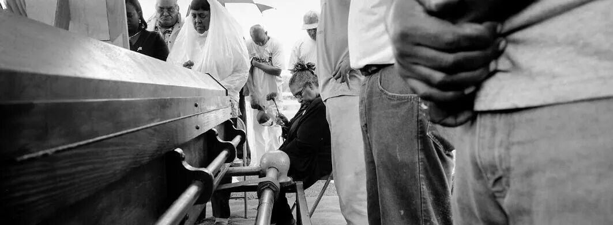

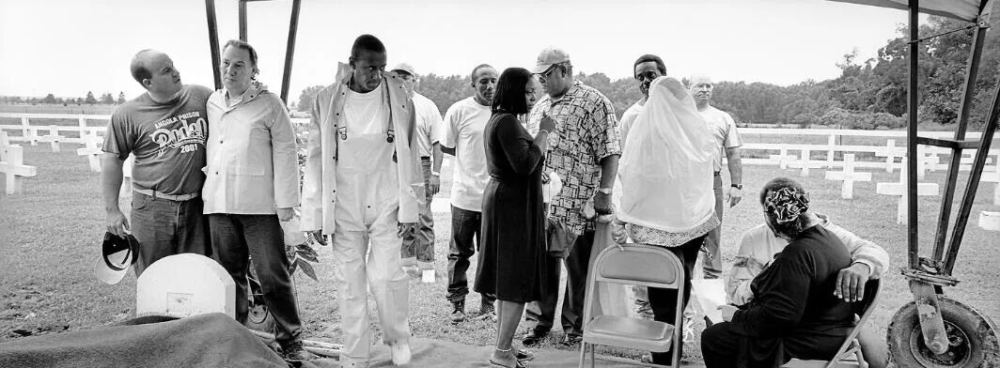

费尔顿·洛夫（右）在安哥拉监狱医院的院子里照顾有脑瘤的蒂莫西，蒂莫西失去了对肌肉的控制。为了让蒂莫西坐在轮椅上，洛夫用床单把他包裹了起来。

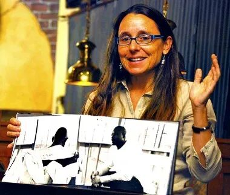

玛丽·布卢默是一名监狱保安，安哥拉是一座庞大的最高警戒级别监狱，占据着与曼哈顿面积相当的平坦三角洲。囚犯每天步行或乘坐公共汽车往返于工作地点。

伯内特（Jimmie Burnett（左））和他的母亲科尔曼（Buerat Coleman）一起笑着，后者来到临终关怀室看望他。75岁的科尔曼必须从洛杉矶的什里夫波特出发经过五个小时的车程才能看到儿子，旅途对她来说很艰难。但她的来访提振了伯内特的精气神。

志愿者迭戈·萨帕塔为理查德·利格特洗脸。55岁的利格特正在被晚期肝癌和肺癌折磨。

67岁的志愿者莫里斯·奥塞伦（Morris Oselen）把手轻轻地放在吉米·伯内特（Jimmie Burnett）的腿上，这样吉米就知道他在那里。伯内特已被安排24小时守夜，他已进入弥留阶段，时而昏迷时而清醒。

志愿者乔治·布朗将手轻轻放在吉米·伯内特的胸前。伯内特的呼吸渐渐变慢更浅。

六名志愿者清洗了吉米·伯内特的尸体，盖上裹尸布，为他做了祷告。

志愿者将乔治·亚历山大的棺材从监狱医院推到救护车上，救护车将与灵车和送葬队伍会合。志愿者对死者的肃穆缅怀感动了监狱。从左到右：杰弗里·刘易斯、罗伯特·马修斯、埃里克·伯纳德、西德尼·德尔科。

囚犯劳埃德·博恩驾驶一辆由马拉的灵车，车上载着同为囚犯的乔治·亚历山大的尸体，亚历山大享年56岁。灵车是监狱木匠手工打造。在典狱长布尔·凯恩（Bull Cain）的支持下，志愿者为被埋在该监狱墓地的囚犯精心安排了葬礼。

在监狱公墓举行的葬礼上，囚犯乔治·亚历山大的姑姑罗莎·玛丽·怀特坐在亚历山大棺材旁。临终关怀项目负责为病人规划葬礼和纪念服务。这些服务允许家属与囚犯的狱友一起哀悼逝者。

葬礼之后，卡尔文·杜马（右二）接受一位朋友的安慰。

该项目为NGO机构“路易斯安那州-密西西比州临终关怀和康复护理组织”（Louisiana - Mississippi Hospice & Paliative Care Organization）的一个板块。

该NGO机构官网为：www.lmhpco.org

摄影师洛里·瓦塞尔楚克（Lori Waselchuk）
