# 罗马尼亚摄影师科斯明·布姆布特作品

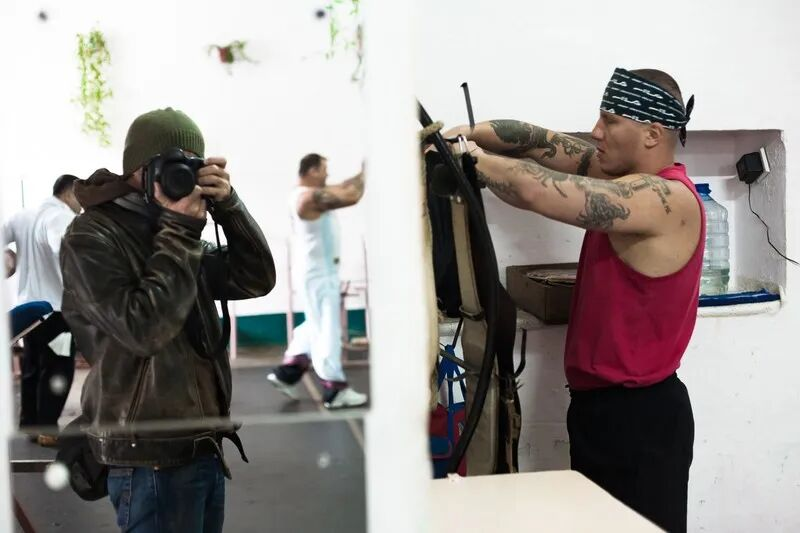

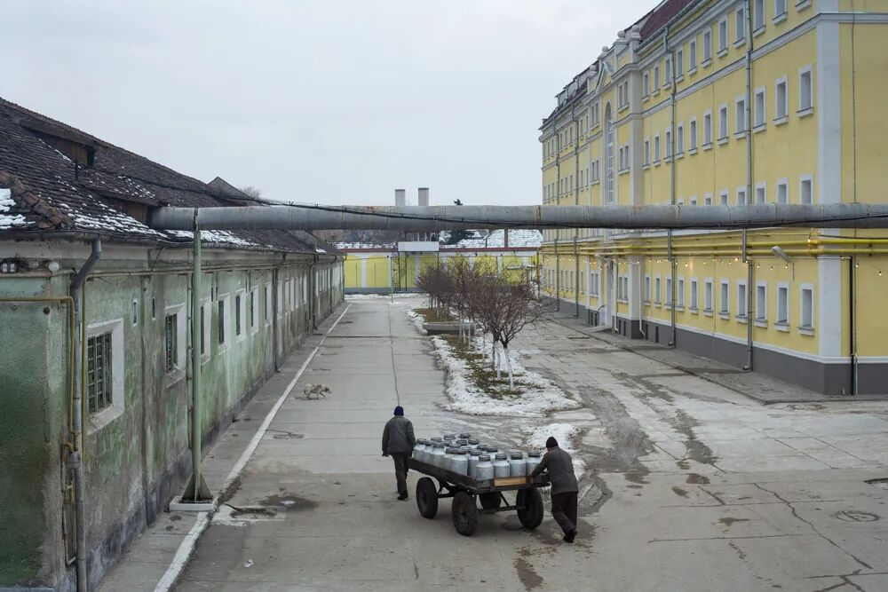

罗马尼亚摄影师科斯明·布姆布特作品

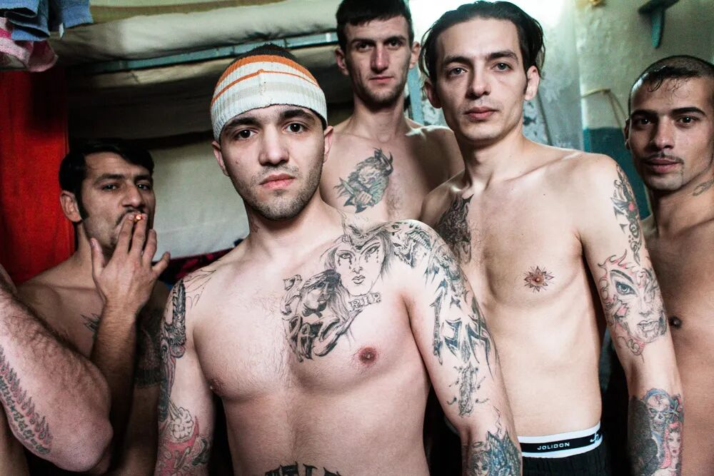

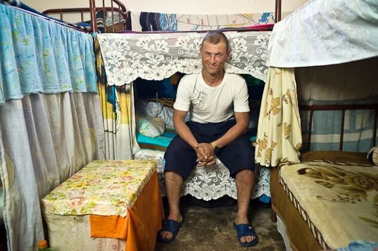

2005年至2008年期间，罗马尼亚摄影师科斯明·布姆布特（Cosmin Bumbut）多次访问罗马尼亚艾乌德（Aiud）监狱，拍摄囚犯的日常生活。

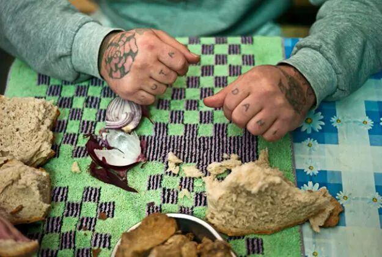

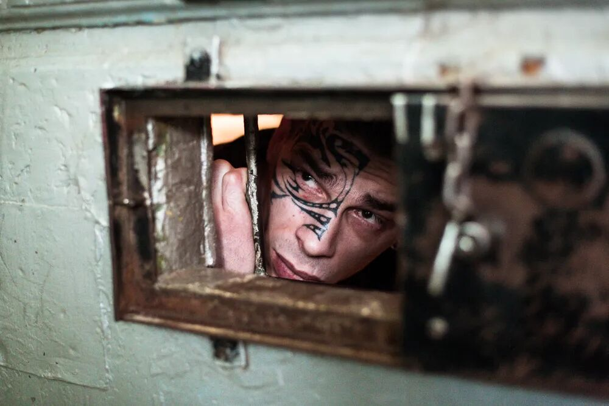

2005年，罗马尼亚囚犯援助协会的发言人联系科斯明，询问他是否有兴趣进入罗马尼亚各地的监狱（大约30个）拍摄。科斯明对这个题材很感兴趣，但是他不打算去那么多，他决定只选一个。为此，他走访了三四所，最后选择了艾乌德监狱。

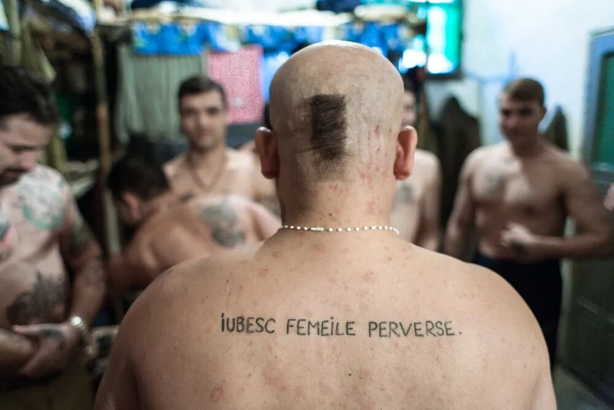

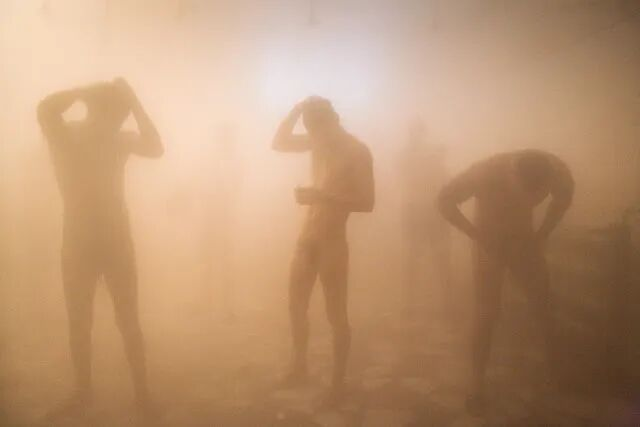

“艾乌德监狱看起来很复古，我特别喜欢。”

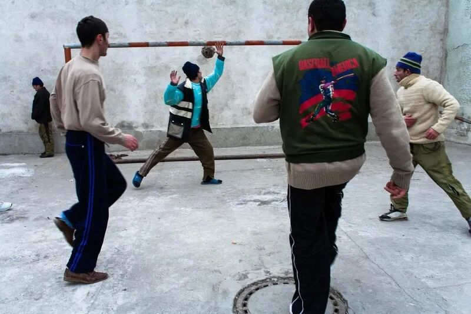

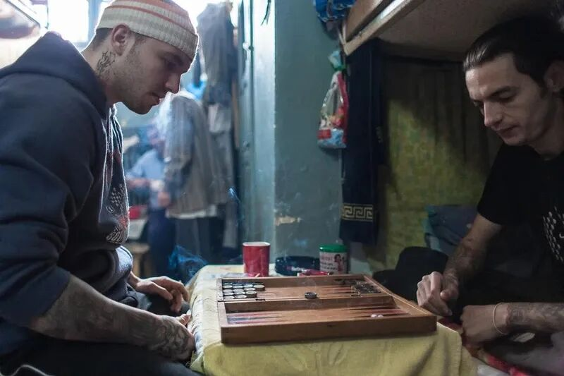

“两周后，我开始了解囚犯。一点一点地，慢慢接近他们，他们对我保持着相当中立的态度——无论是在工作时，还是在图书馆里看书，或者参观监狱的小教堂。”

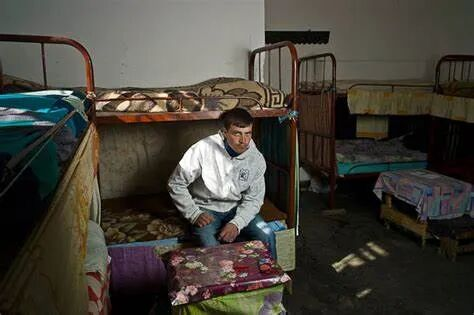

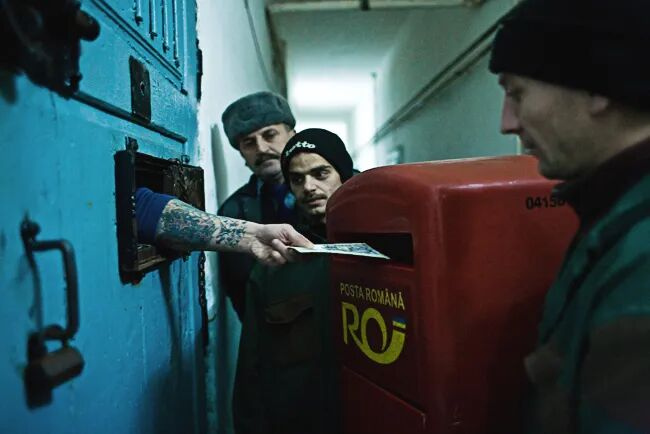

布姆布特花了三年时间在艾乌德拍照。一共去了十次，每次待五天。

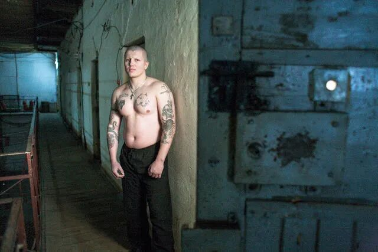

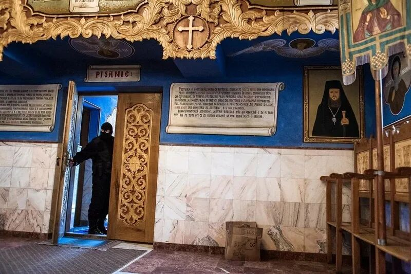

在这个项目中，我目睹了各种快乐、悲伤甚至荒谬的事件。

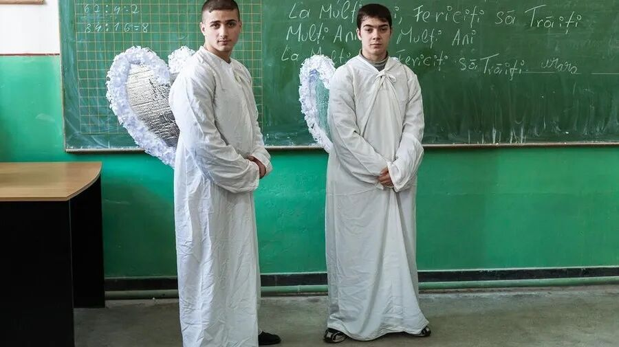

“2005年，当我第一次来到艾乌德时，囚犯们穿着卡其色的制服——除了那些被判无期徒刑的人，他们穿着橙色的制服。罗马尼亚加入欧盟后，囚犯们都脱掉了制服，他们可以穿上自己的衣服。”

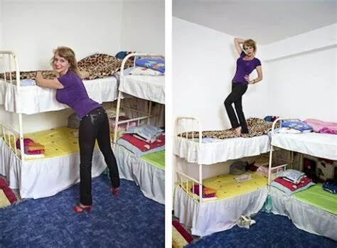

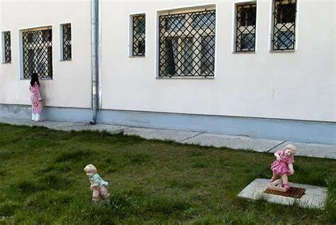

在加入欧盟之前，罗马尼亚没有夫妻探视的概念；没有为囚犯及其配偶提供私人空间。加入欧盟后，这些都变了。

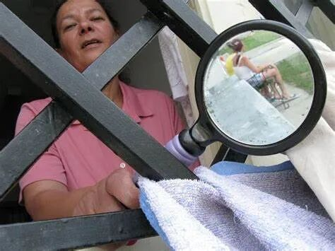

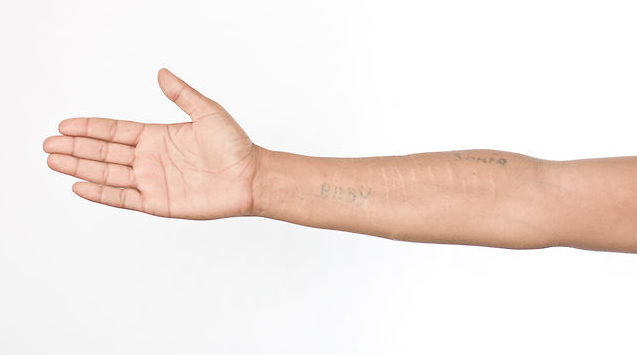

“最后一次访问艾乌德时，我在负责出监人员的办公室里发现了一个文件，上面写着“囚犯的文学作品”。我读了其中几篇文章，其余的都拍了下来。”

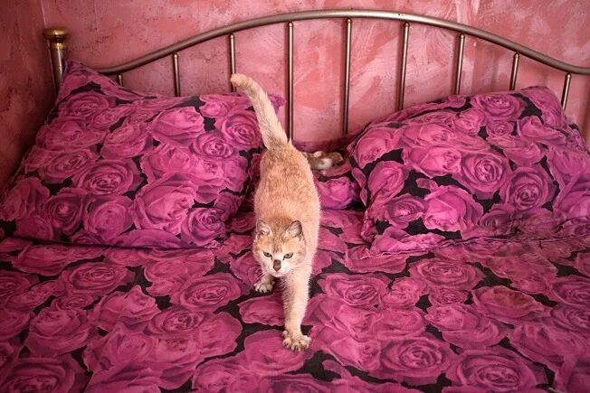

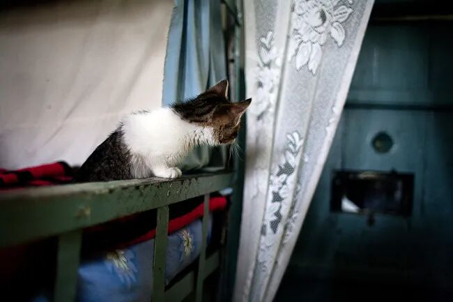

“我还拍摄了一本名为《黑暗之光》的监狱杂志，当时是手写的。一名囚犯做编辑，另一名囚犯则担负艺术总监的角色，负责画画。“

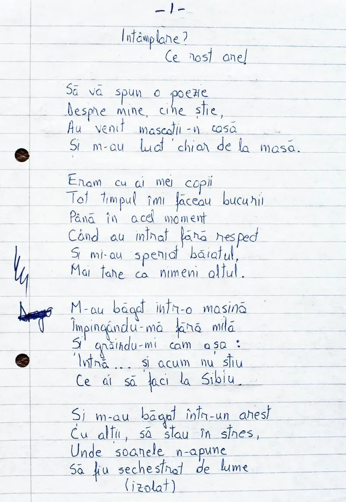

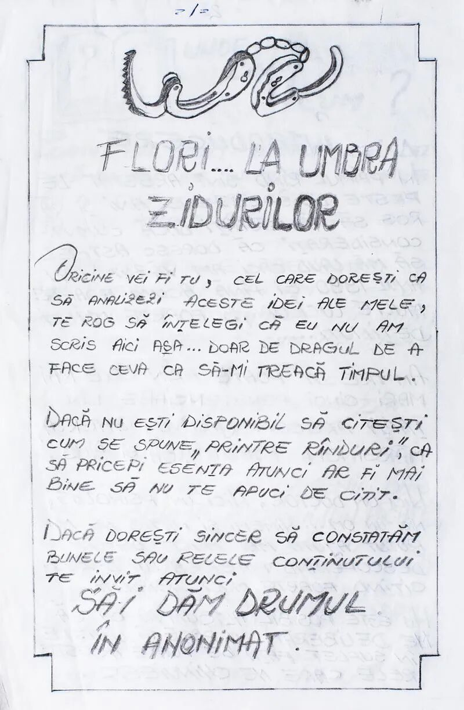

科斯明·布姆布特（左）和Iulian Lopazan（教师）在一个名叫Pricu的囚犯的牢房里。

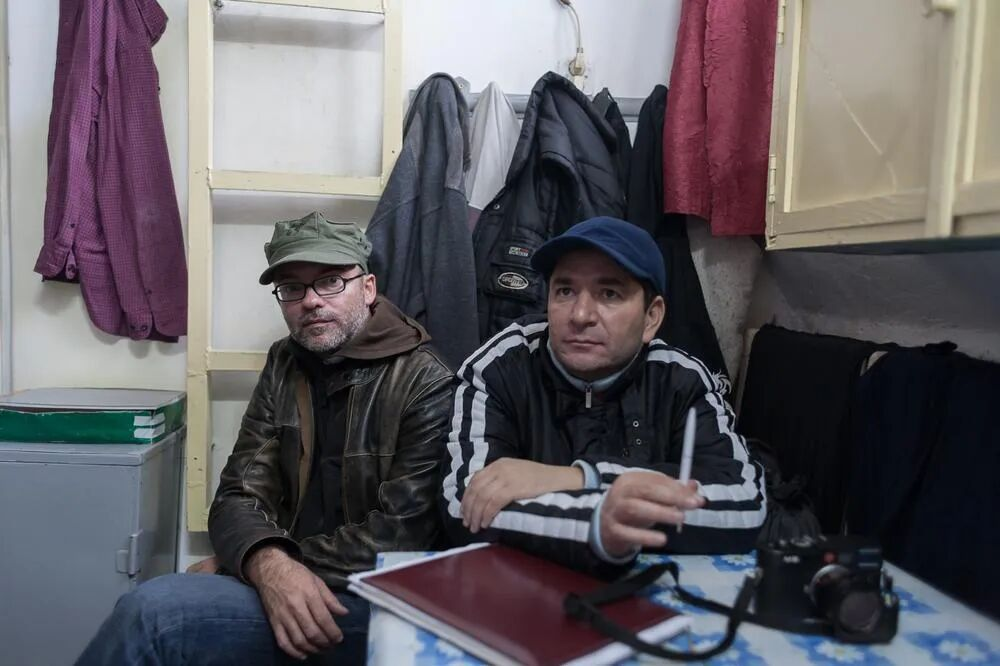

之后，这组作品结集为《棉》（bumbata）的摄影集出版。

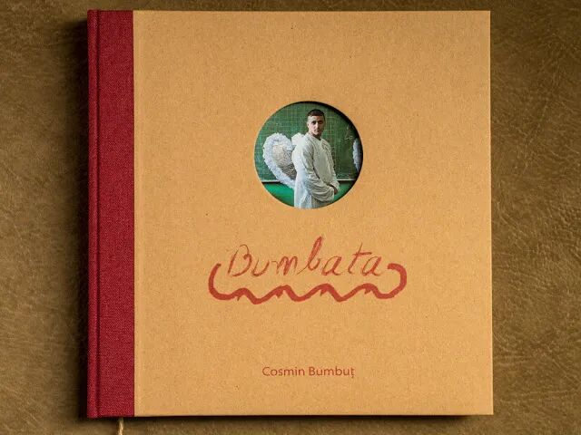

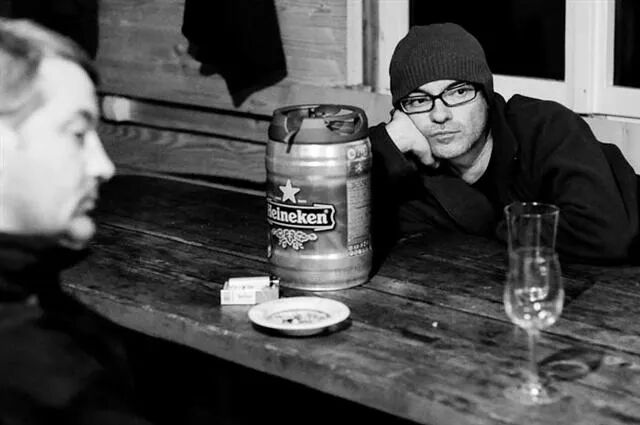

科斯明是罗马尼亚最著名的摄影师之一。他在布加勒斯特戏剧与电影学院正式学习摄影，并在那里教授摄影。是摄影团体“7天”的联合创始人，并组织了研讨会和摄影营。2009年，他创办了致力于艺术摄影的《点点》杂志。他的作品获得了许多国际奖项。作品在纽约、阿姆斯特丹、马德里和罗马等地展出过。他曾做过近20年自由商业摄影师。作品已在《Elle》、《Esquire》、《Marie Claire》、《Lens Work》等杂志上发表，并参与过许多企业广告活动。
