# 劳埃德·德格恩作品

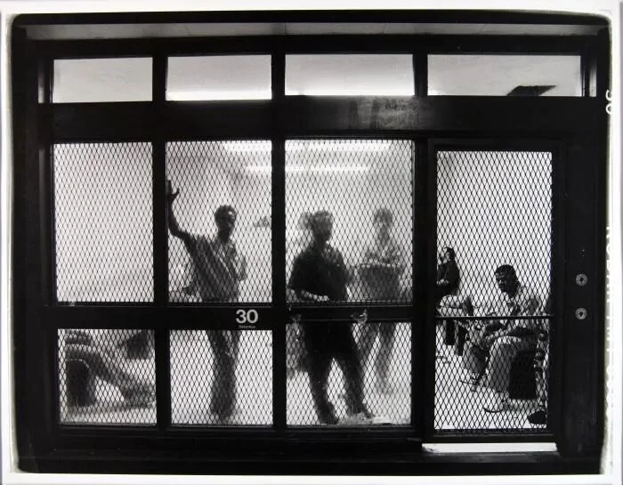

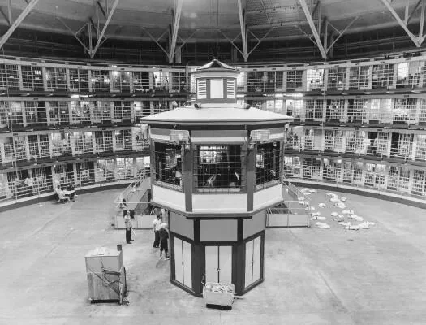

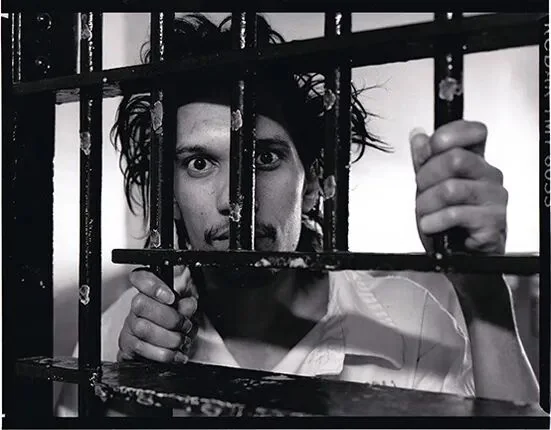

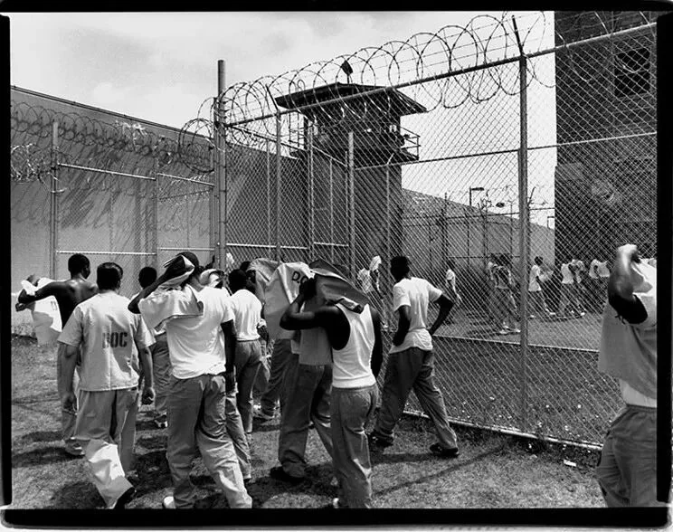

从1990年到2000年，芝加哥自由摄影师劳埃德·德格伦（Lloyd DeGrane）记录了伊利诺伊州惩教系统内囚犯的生活。他的许多照片都拍自伊利诺伊州立监狱斯塔特维尔惩教中心(Stateville Correctional Center)。

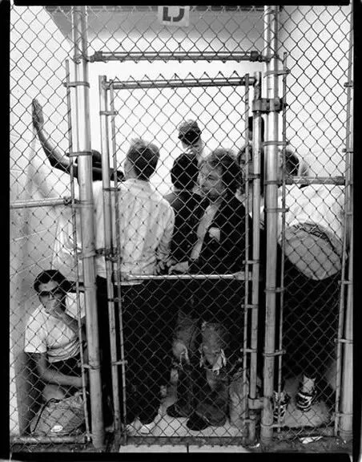

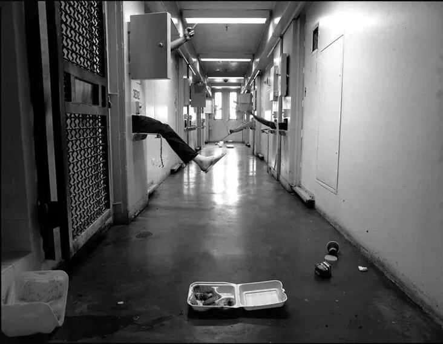

斯塔特维尔惩教中心是一座臭名昭著的最高警戒级别监狱，也是比较典型的圆型监狱建筑。关押过不少美国著名凶犯，强奸犯、连环杀手约翰·韦恩·盖西在被处决前就曾短暂关在这里。

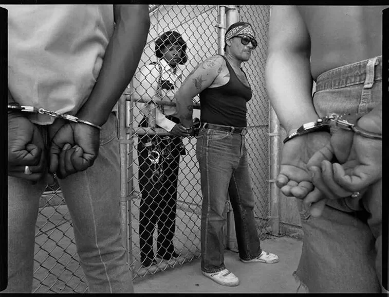

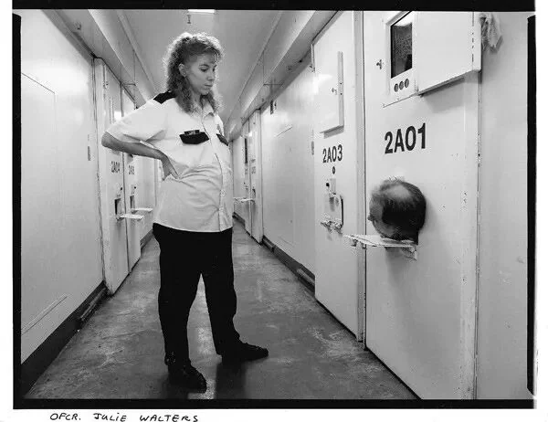

“有时，当我翻阅我在监狱项目中拍摄的照片时，我会想，‘我为什么要这样做？’。

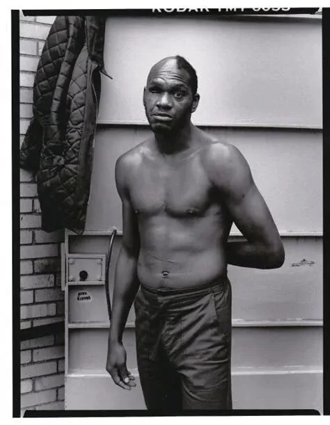

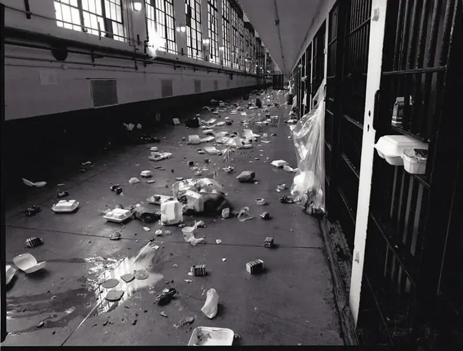

那时我更喜欢冒险，探索那些陌生的、有时令我恐惧的世界。我对高墙后生活或工作的人一无所知。但是，回顾过去，我意识到自己生活很不自由的地方，我有一种强烈的愿望，想以某种方式翻越这些墙，体验其中的世界。”

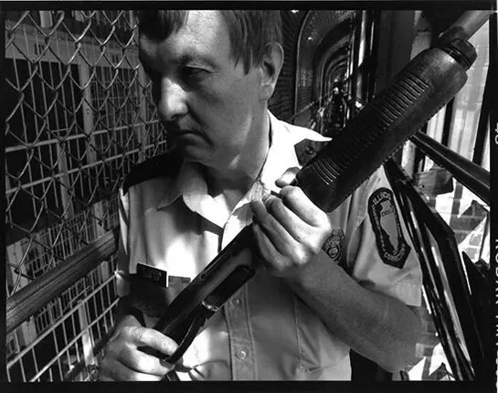

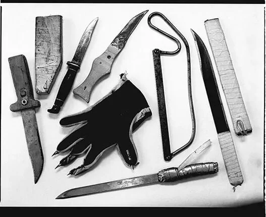

我的这个选择从头到尾都是灾难。有时也会有一线希望，但不幸的是，更多的是弥漫的绝望。

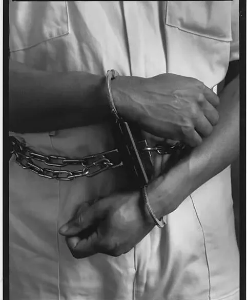

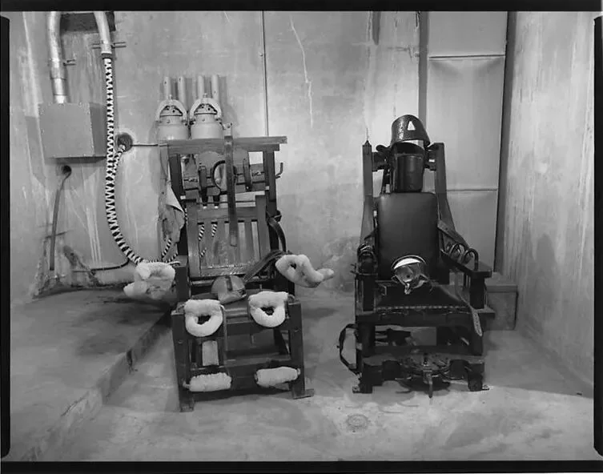

有一次我经历了一场暴乱，走的时候鞋子上沾满了鲜血。

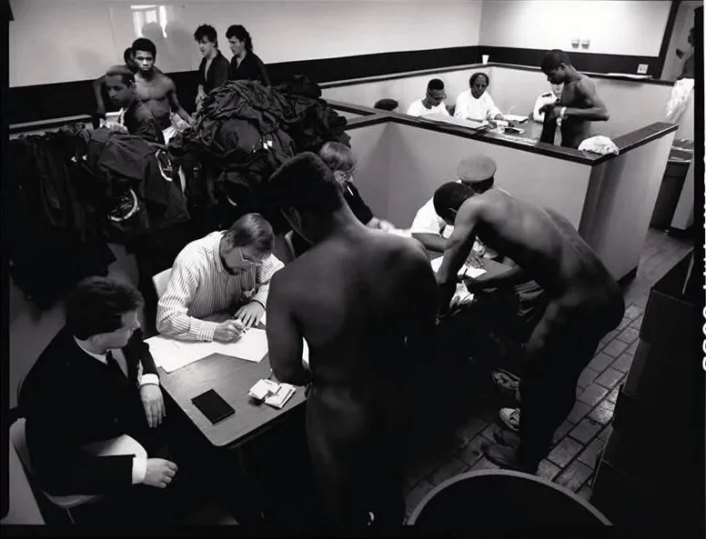

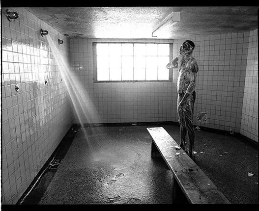

劳埃德·德格恩是芝加哥的自由摄影师，他的作品曾出现在《纽约时报》、《芝加哥论坛报》、《芝加哥读者》等国际出版物上。

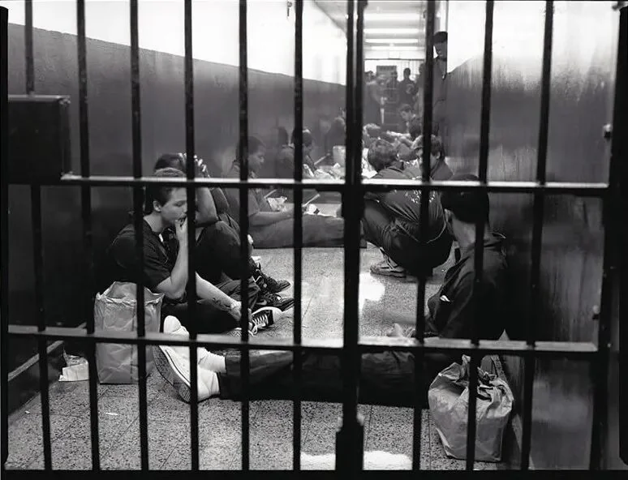

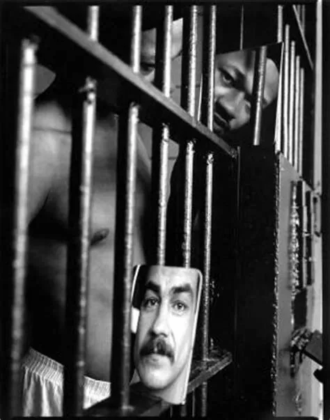

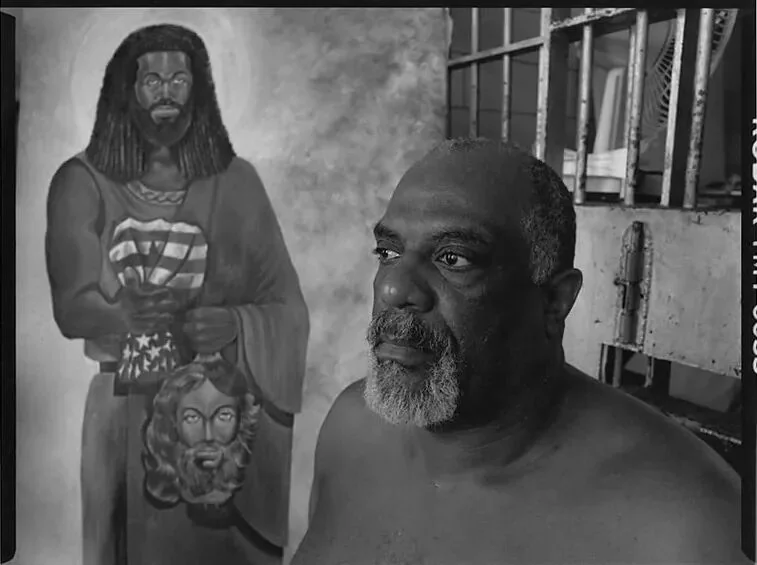

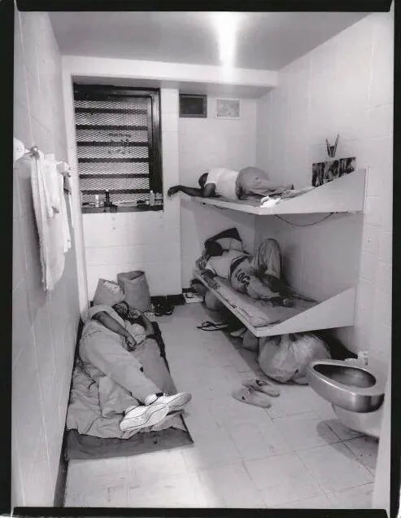

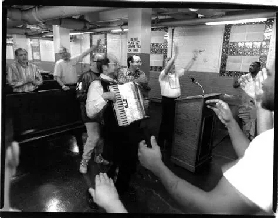

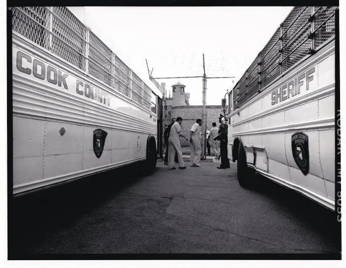

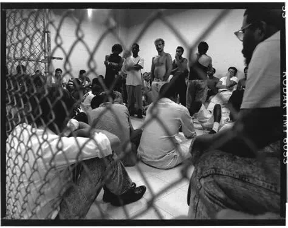

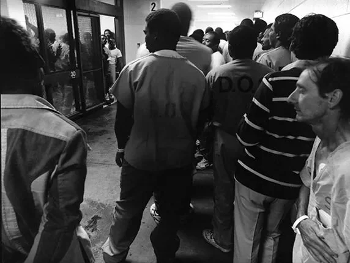

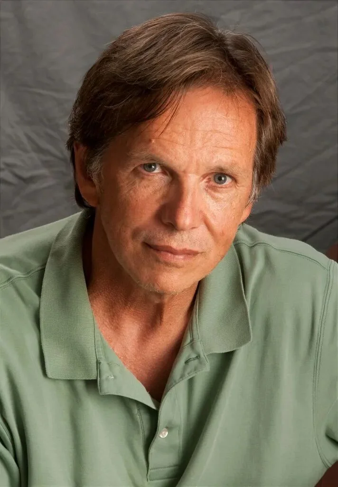
