# 监狱摄影  高安渡埠农场

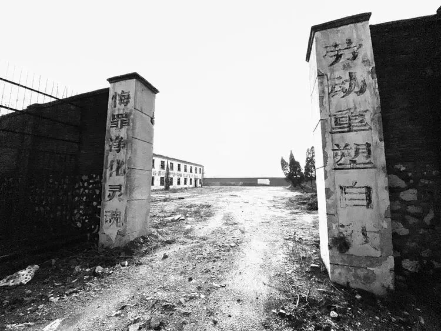

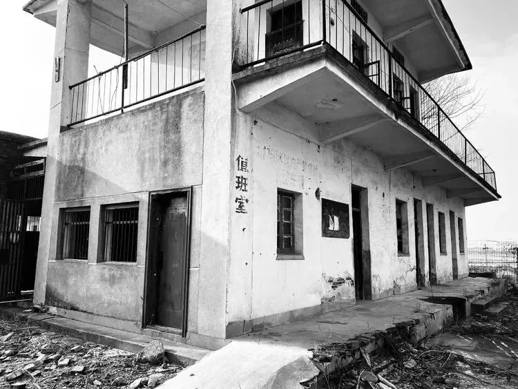

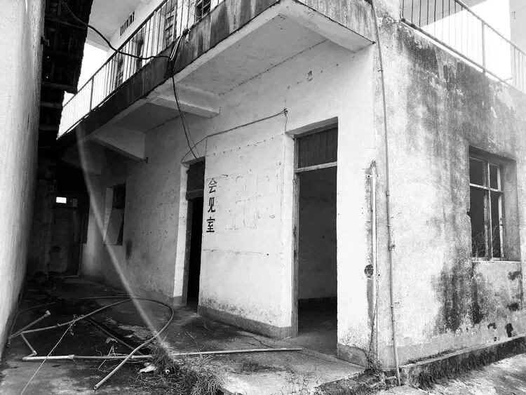

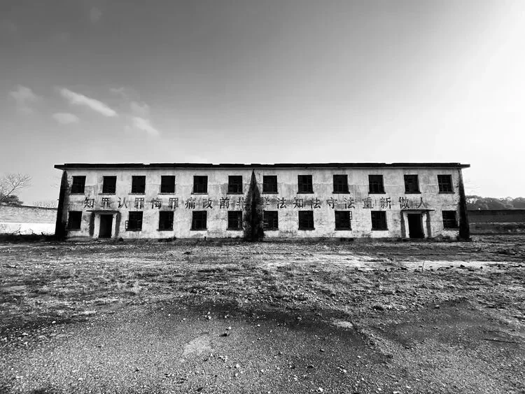

摄影：相城三鑫

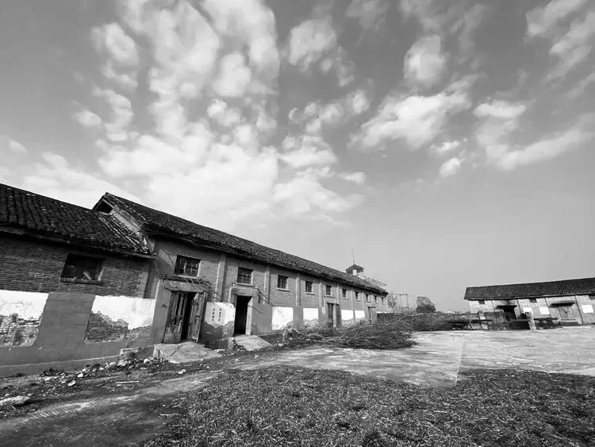

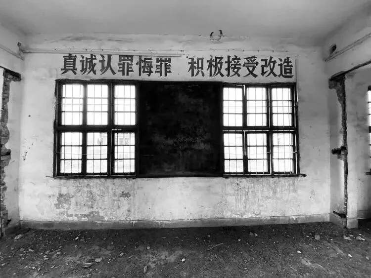

江西省渡埠农场距离高安县城约45公里的相城镇华阳行政村境内，1955年江西省劳改局在此开办劳改农场，取名为“江西省渡埠农场”。农场占地面积7000亩，其中耕地3200亩。

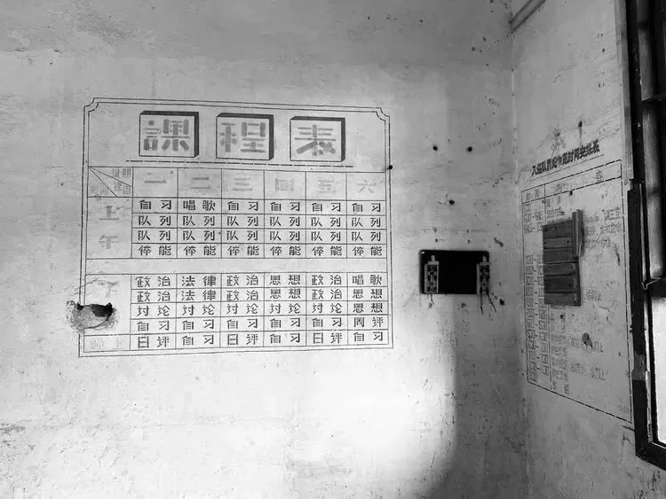

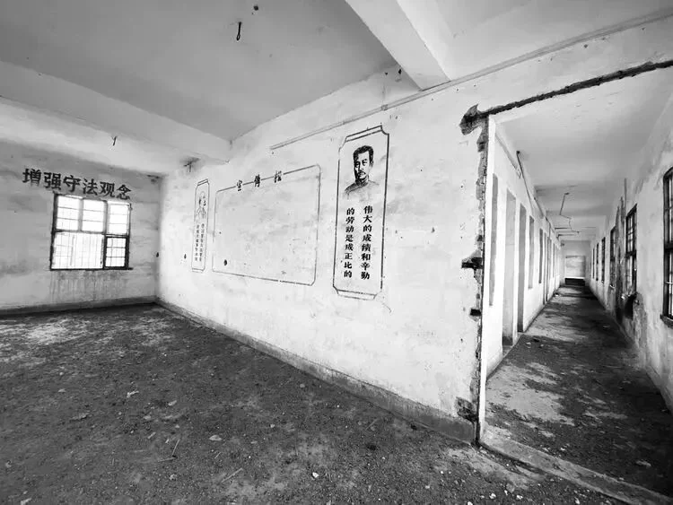

1968年为贯彻毛泽东的“五七”指示，中国人民解放军驻江西124部队接管了渡埠农场，更名为“江西渡埠五七农场”。农场共设5个中队，还开办了医院、学校、农机厂、加工厂、造纸厂、农业科学研究所等单位。

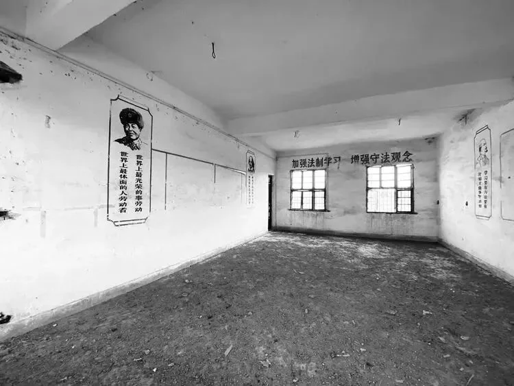

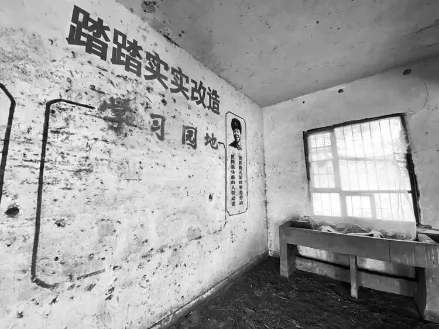

十年后的1978年，江西渡埠五七农场又回归江西劳改局，更名为“江西省劳改局农科所”，1981年复名为“江西省渡埠农场”。

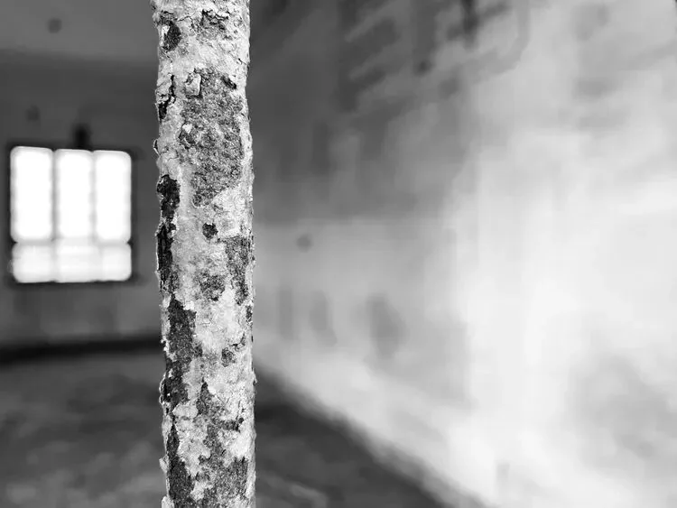

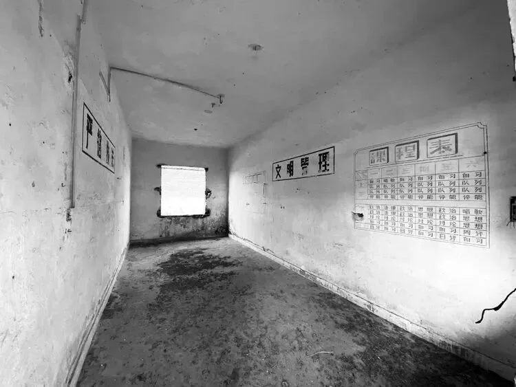

渡埠农场后改名为瑞州监狱，主要从事水稻种植、茶叶生产和二极管加工，由于监狱地处偏僻、交通闭塞、自然环境艰苦、基础设施落后，历来存在诸多不便。进出农场有一条长三公里处于交通盲区的山路，始终没有交通车通行，途中有一个高坡，左右邻山，原名“跃进门”，人们戏称“鬼门关”，农场流传着“走进跃进门，踏入鬼门关”、“稍有风吹雨打，就要停水断电”、“高墙不高、电网不电”等顺口溜。

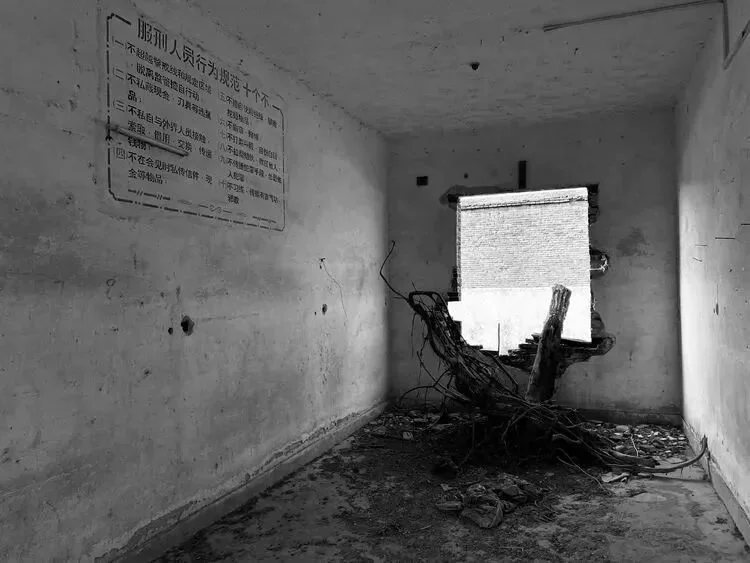

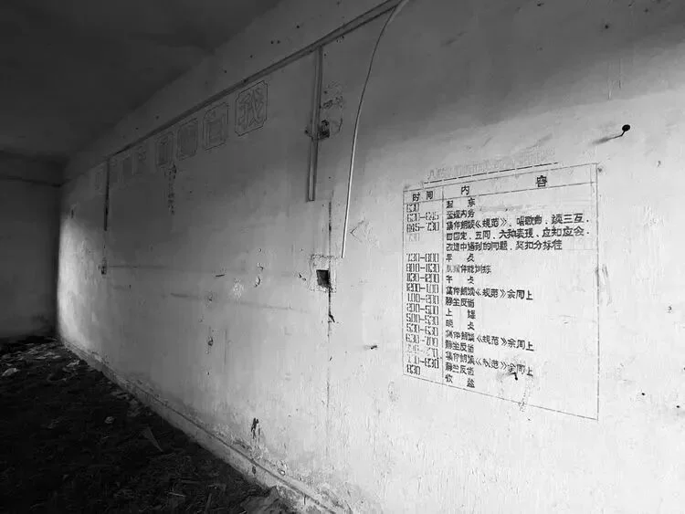

2008年11月，瑞州监狱600余名罪犯搬迁至新址江西省吉安监狱。

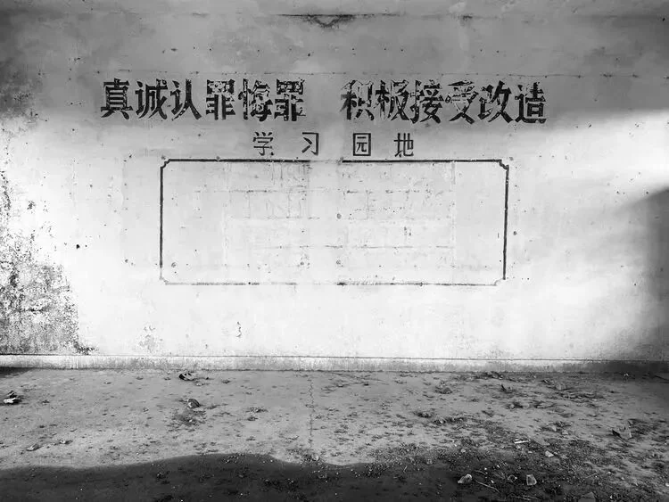

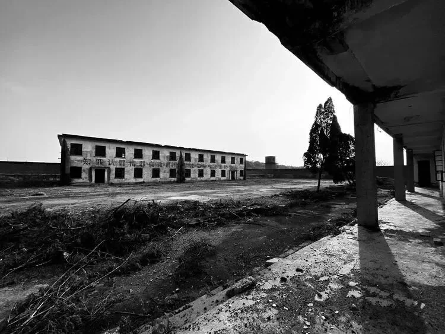

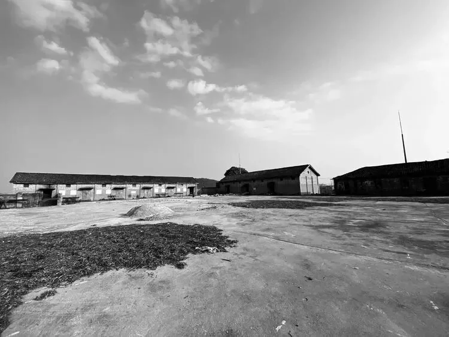

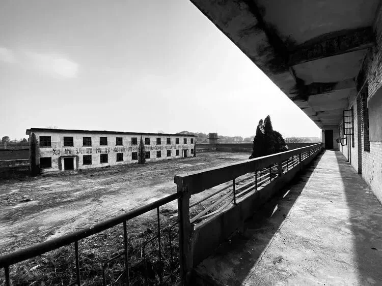

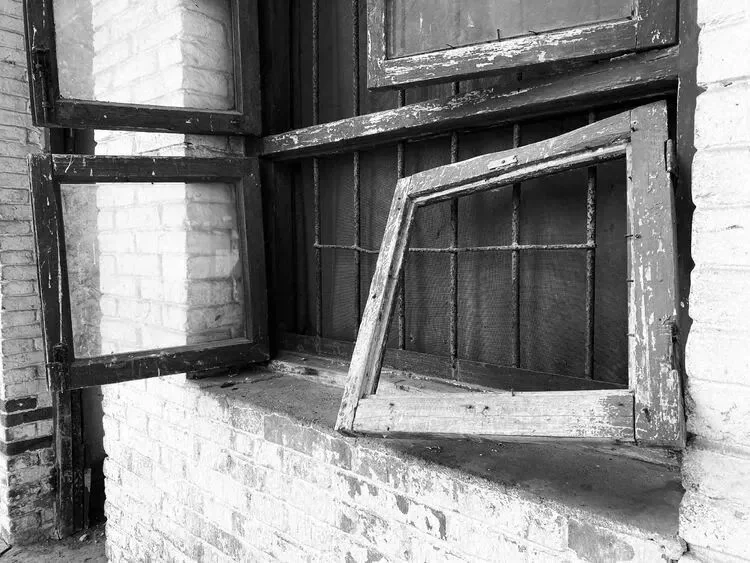

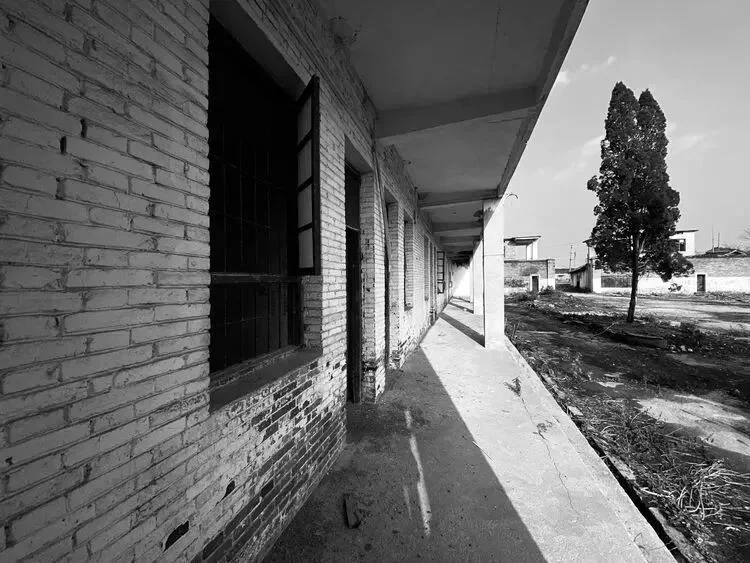

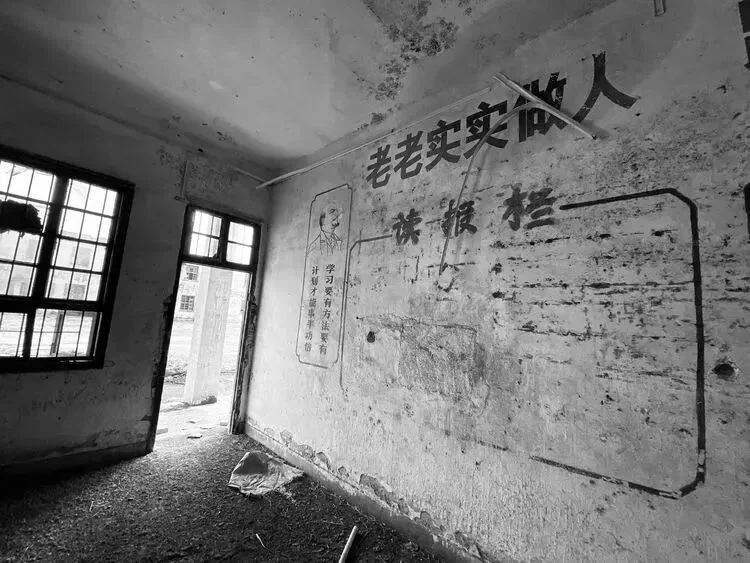

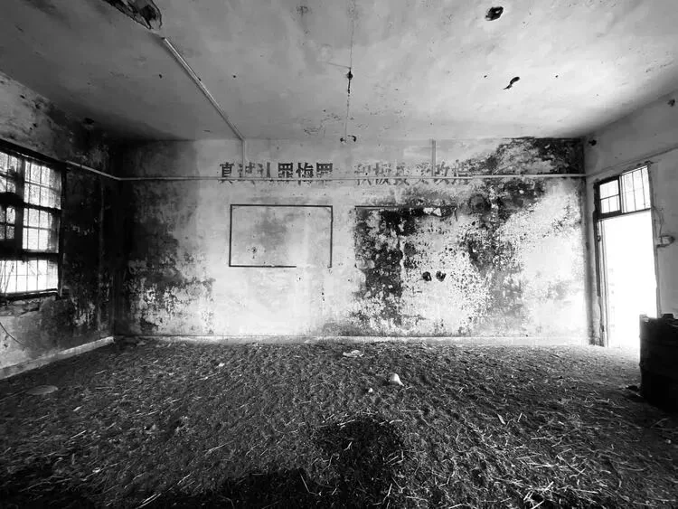

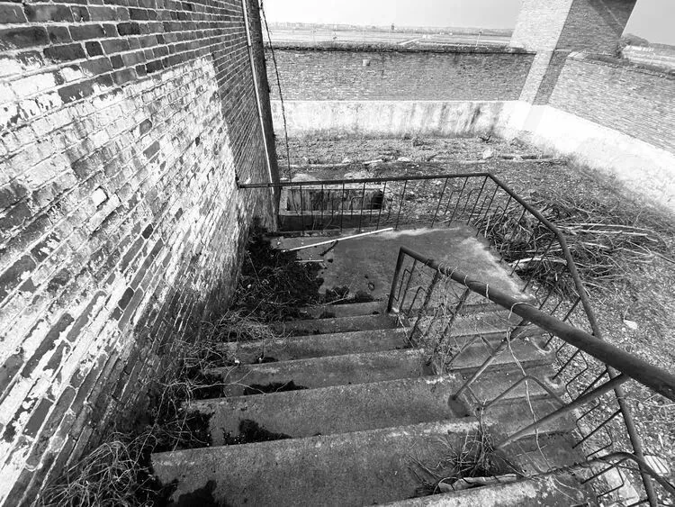

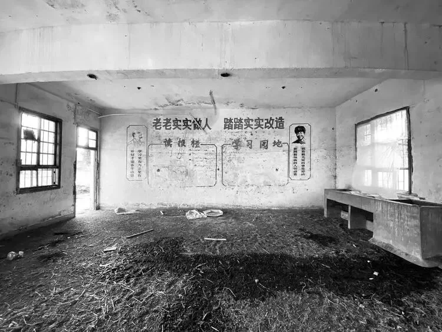
