# 等待审判的少年们

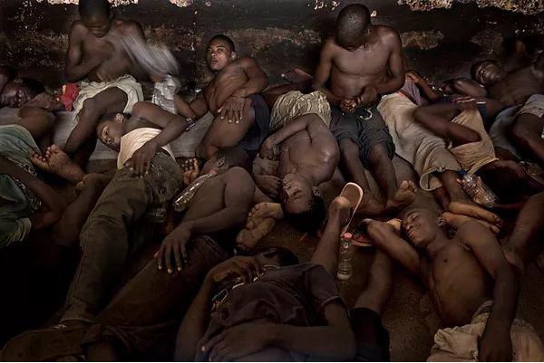

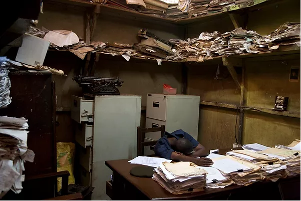

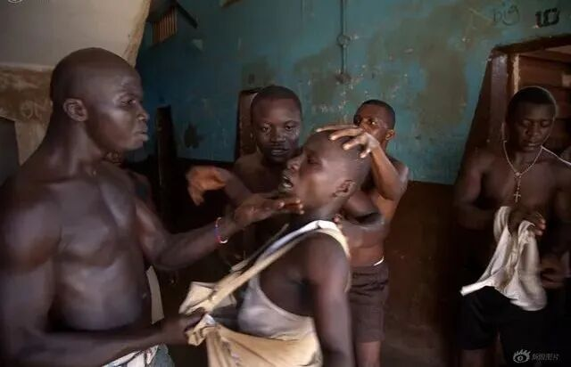

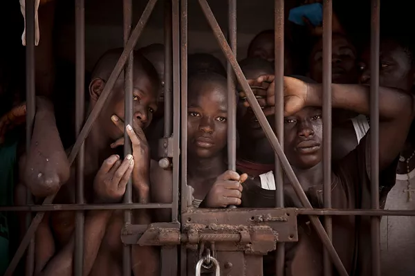

在西非塞拉利昂的弗里敦市，有一所名为 Pademba 的特殊监狱，这里关押了1300多名嫌犯。因为得不到及时的法律援助，他们中的很多人不得不在监狱里呆上数年以等待审判。

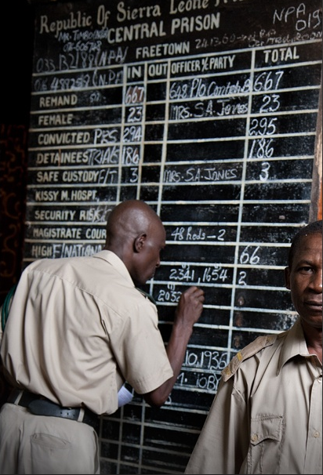

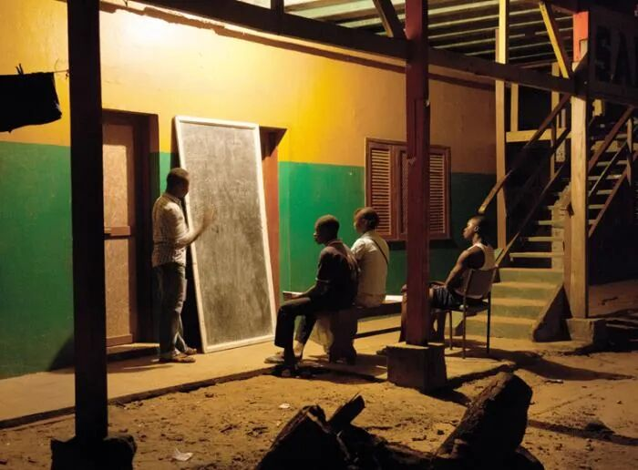

2010年开始，摄影师 Fernando Moleres 把相机对准 Pademba 监狱里的32名青少年。

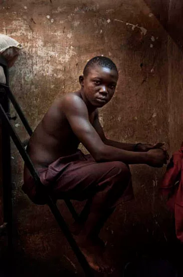

彼得是押送嫌犯上法庭的一名警官，每天早上都有数十人被带上法庭，在被判刑之前的漫长羁押期中，他们要反复经历这一过程。其中一个男孩说他上过50多次法庭。

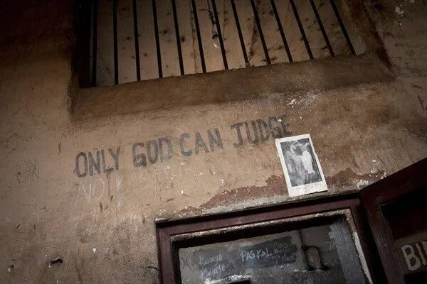

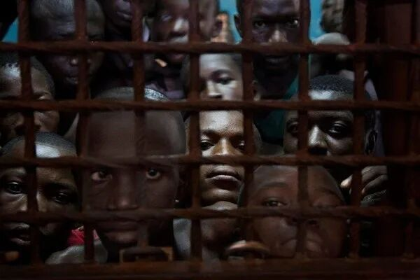

这间30平米的囚室住着60名在囚者，每天有16个小时被关在里面，共用一个厕所，每八个月才能领到一块肥皂，人群中蔓延着各种疾病。

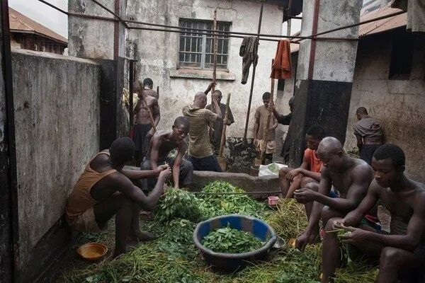

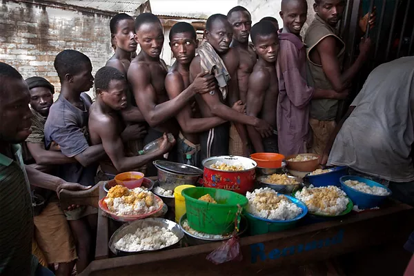

混乱的档案室

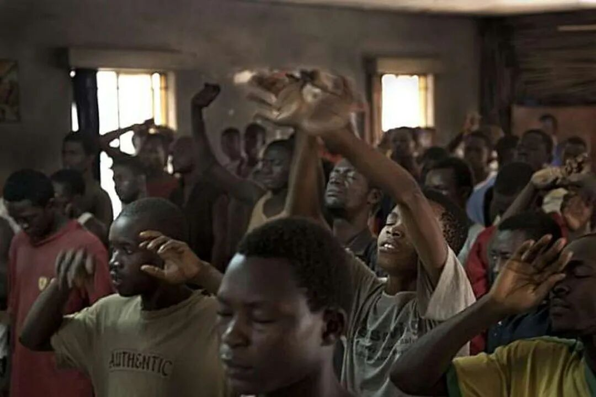

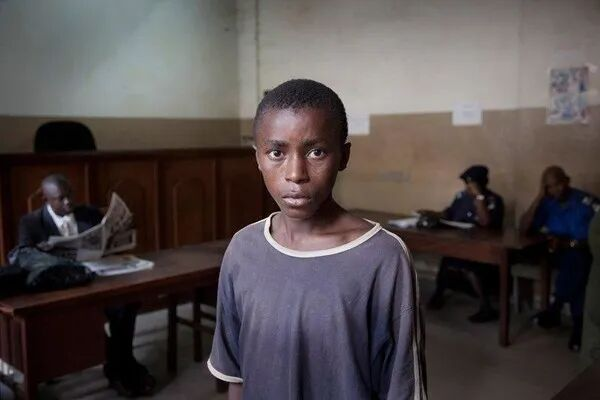

年轻的在囚者经常遭受成年囚犯的暴力对待。

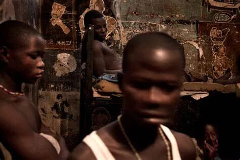

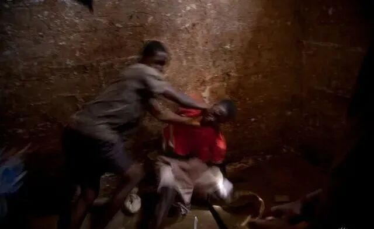

Fernando Moleres 关于Pademba监狱的摄影作品和文字被欧洲各大媒体发表，之后他创建了“非洲未成年人自由计划”（FREE MINOR AFRICA）这一项目，向因轻罪而被监禁的人提供法律援助和保释金，帮助他们重返社会。为刚获释但无家可归的年轻人提供庇护所。

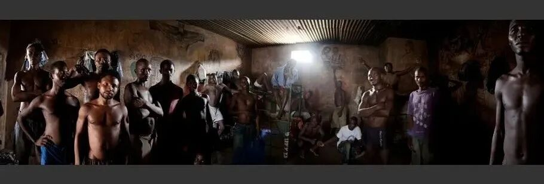

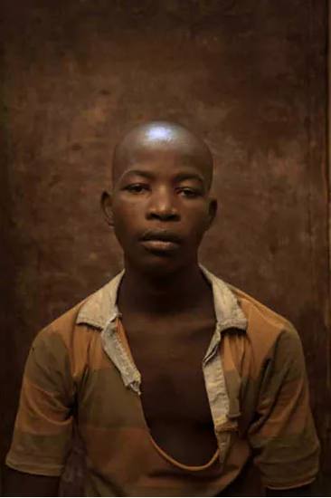

2013年，Fernando Moleres 和两名当地教师为监狱中的年轻囚犯创建了一所狱内学校。

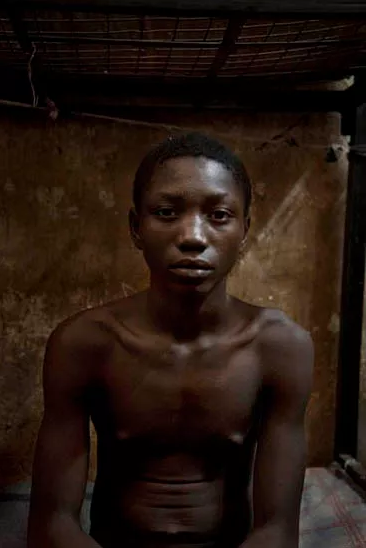

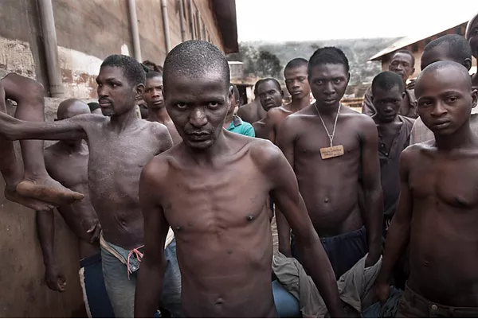

街头小子阿布·塞斯因盗窃入狱

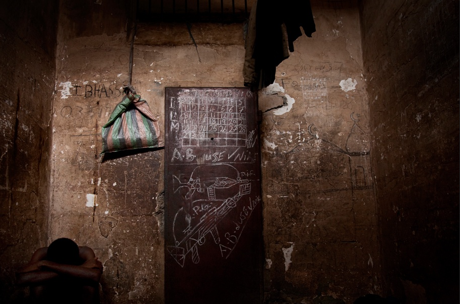

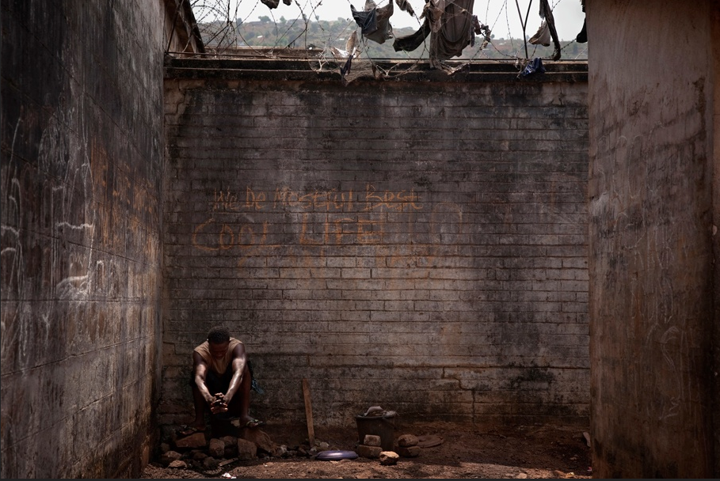

在囚者们在处理木薯叶和捣碎土豆，将这两者混合在一起，再加上米饭，就是他们的标准午餐。早餐是一片面包和一杯茶。

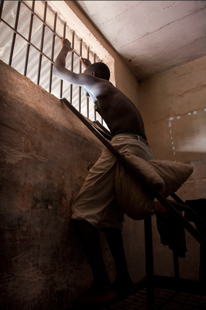

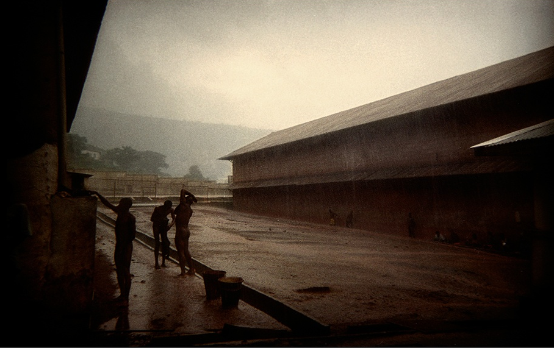

有限的饮食导致在囚者缺乏维生素，身体虚弱，抵抗力低。

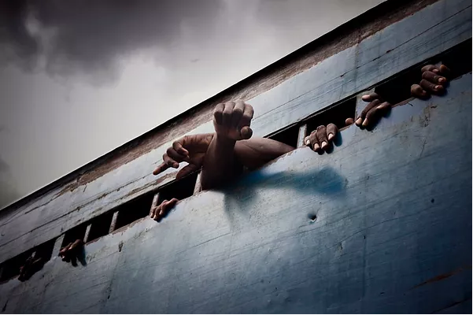

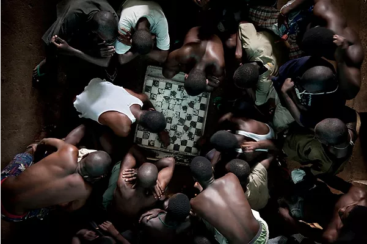

14岁的阿卜杜勒·塞赛在第二法庭。2010年7月26日，一名男子声称阿卜杜勒盗取了他的便携式收音机。这名男子狠狠地打了他，导致阿卜杜勒呼吸困难。阿卜杜勒被带到警察局并被关押了八天。2010年10月29日， Moleres 和自由记者约翰·卡林支付了32万列昂斯（60欧元）的保释金后，阿卜杜勒才获释。2012年11月以来，阿卜杜勒在圣米歇尔中心参加了非洲未成年人自由计划，一直上学。

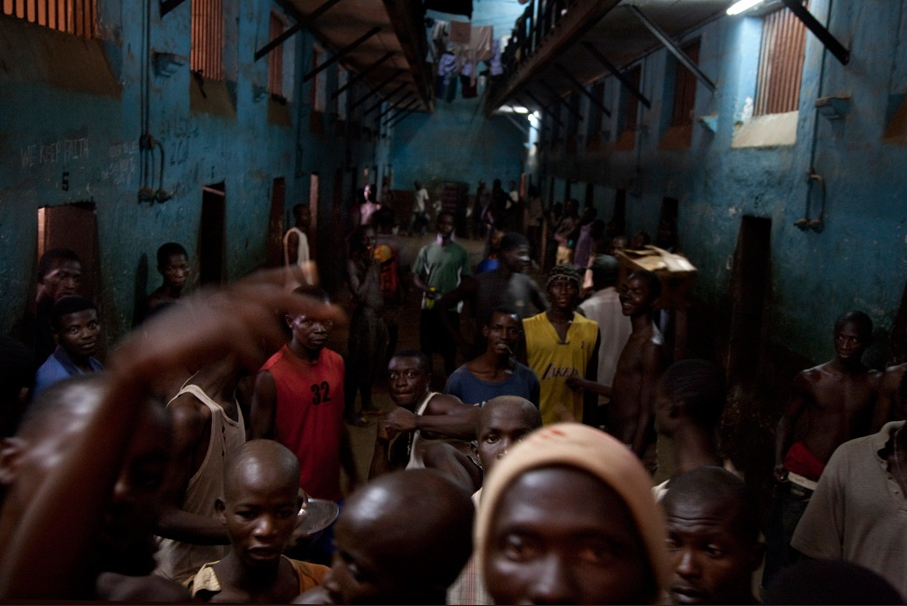

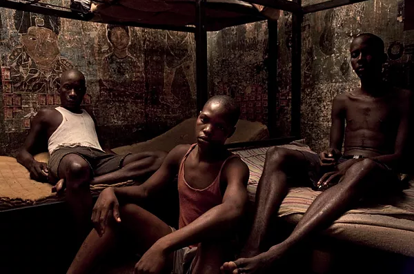

这间囚室住着34个人。

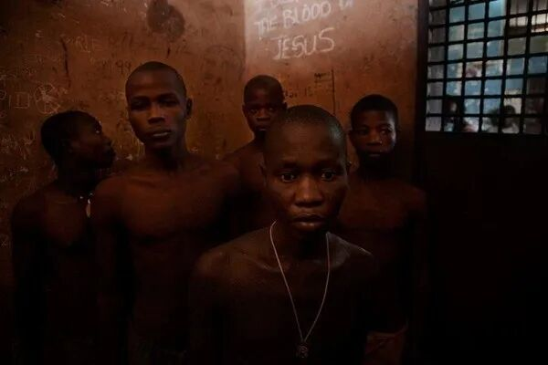

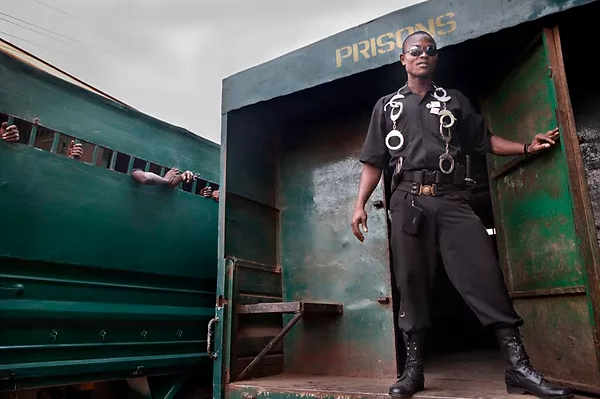

穆罕默德·穆萨是一名战争孤儿，他不知道自己的年龄和出生日期。他跟叔叔住在一起，他的叔叔指控他偷了10加仑棕榈油，于是他被判处两年监禁。由于没有钱，穆罕默德在狱中无法买到肥皂和水来适当地洗澡。

14岁的孤儿穆罕默德·孔戴因持有大麻于2009年12月2日被捕，被判处18个月监禁。穆罕默德获释后，加入了非洲未成年人自由康复计划，学习驾驶技术。

非洲缺水，监狱尤甚，在雨中洗澡为一乐事。

跳棋很受欢迎
