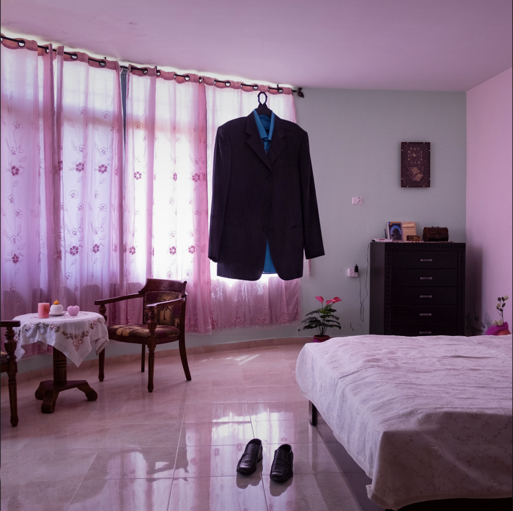
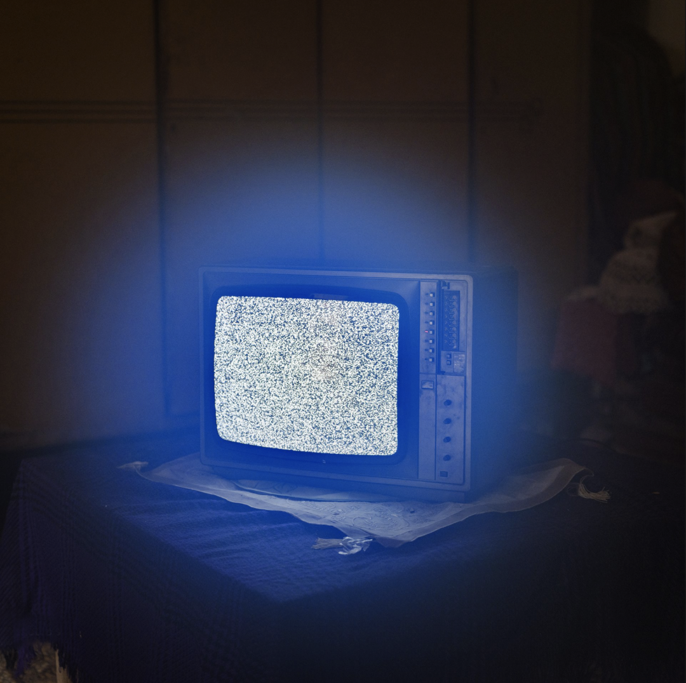

# 安东尼奥·法西隆戈

监狱摄影 | 我的爱

这是2021年度荷赛奖的最佳照片故事和长期项目一等奖作品，意大利艺术家Antonio Faccilongo （安东尼奥·法西隆戈）创作的摄影系列作品Habibi。

Habibi在阿拉伯语中的意思是“我的爱”。

这组图片故事以现代历史上持续时间最长、最复杂的巴以冲突为背景，记载了在此期间发生的关于爱的故事。

Antonio Faccilongo 想要通过这些照片展现出巴以冲突对巴勒斯坦家庭的影响，以及他们在维护自己生育的权利和生而为人的尊严时所面临的的困难。

摄影师没有将镜头对准战争、军事行动和武器，而是放在了人们拒绝被监禁的勇气和在冲突频发之地生存下去的毅力。

大约有7000名巴勒斯坦人被以色列监禁，其中近1000人面临20年以上的刑期。巴勒斯坦囚犯的妻子为了怀上在以色列监狱中长期服刑的丈夫的孩子，在接见的时候偷偷的将丈夫的精子带出来。

根据纳布卢斯的拉赞医院（该医院在西岸提供体外受精服务），在过去的7年中，大约有100名通过体外受精孕育的婴儿出生。拉赞医院免费为这些妇女提供医疗服务，因为巴基斯坦人认为他们的丈夫是为祖国战斗而失去自由的英雄。

巴勒斯坦囚犯可以接受直系亲属的探视，但隔着玻璃窗，无法进行肢体接触。但囚犯们6岁以下的孩子除外，每次探视结束时孩子可以有10分钟时间与父亲拥抱。于是，囚犯事先将精子装入空笔管，藏在巧克力棒内，以给孩子礼物为借口，将精子带出来。

Antonio Faccilongo选择了一个巴基斯坦的传统家庭，以纪实的视角将这个家庭所遭遇的事件，以及事件在他们身上留下的痕迹通过不同方面呈现出来。

我们或许不了解这样一个巴基斯坦家庭背后的伤痛，或许同样也无法感知到不同文化背景下的传统。但通过这一组冷静而充满了淡淡哀伤的画面，我们能触碰的是，照片凝固下的瞬间带来的些许共情。

2015 年 8 月 17 日，Nael Al-Barghouthi 的西装仍挂在他位于巴勒斯坦拉马拉附近的家中。

1978 年，Al-Barghouthi 在一次反以色列突击队行动中被逮捕，并于 2011 年获得释放，然后他娶了自己的妻子 Iman Nafi。

2014 年，Al-Barghouthi 再次被捕并被判处终身监禁。他在监狱中度过了 40 多年，是以色列监狱中服刑时间最长的巴勒斯坦囚犯。Al-Barghouthi 的妻子一直将他的衣物妥当放置着。
