# 德国女摄影师贝蒂娜·冯·卡梅克作品

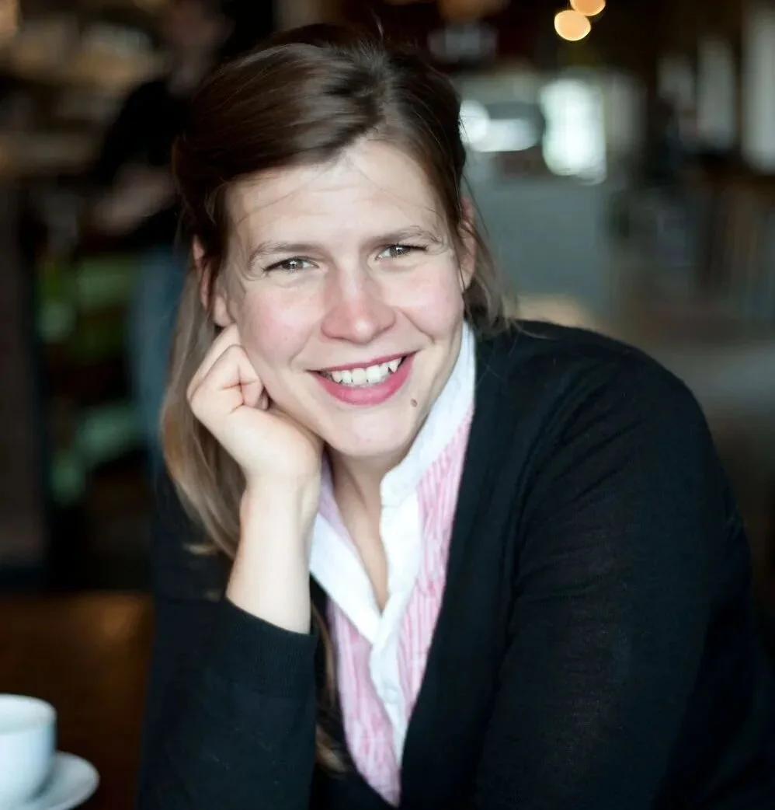

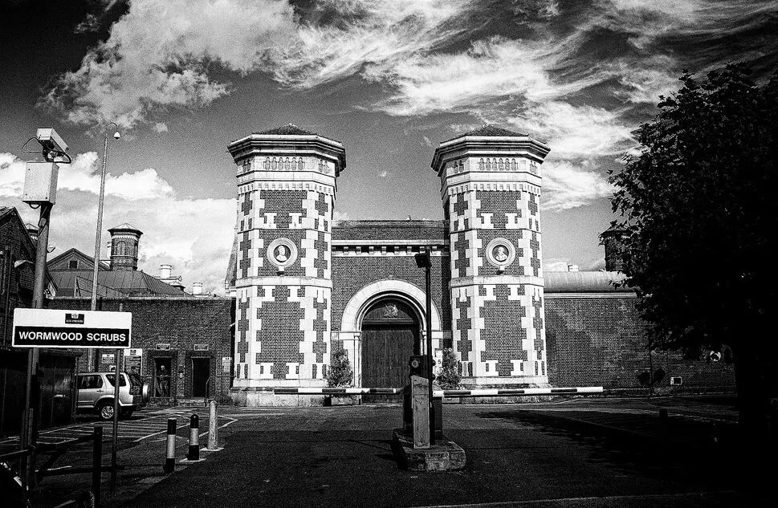

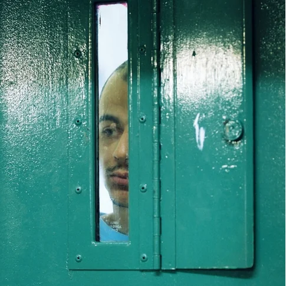

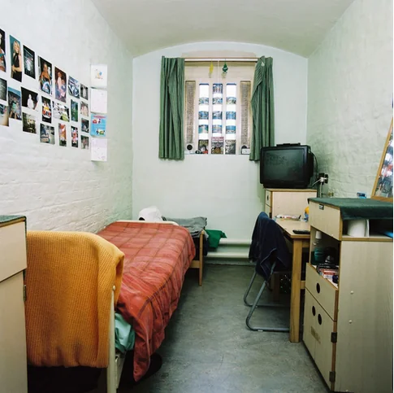

贝蒂娜·冯·卡梅克（Bettina von Kameke），德国肖像和纪实摄影师，曾在英国学习和创作。2010年左右，她耗时六个月在英国最大的监狱之一Wormwood Scrubs进行拍摄。Wormwood Scrubs皇家监狱位于伦敦西部，成型于19世纪后半页。图片via.网络贝蒂娜·冯·卡梅克在Wormwood Scrubs拍摄的照片看起来像是宣传片。配有电视、书桌的整洁牢房，墙上贴着服刑人员喜欢的照片；服刑人员放松地坐在公共区舒适的黑色沙发上，服刑人员可以打台球，健身，还有人在玩棋盘游戏。囚人心声

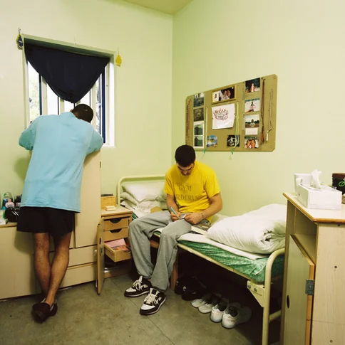

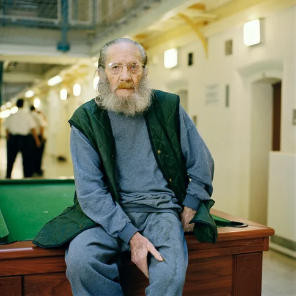

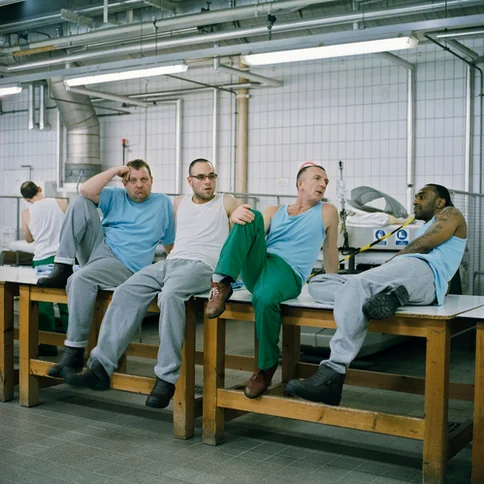

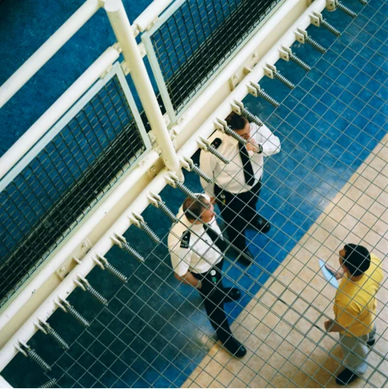

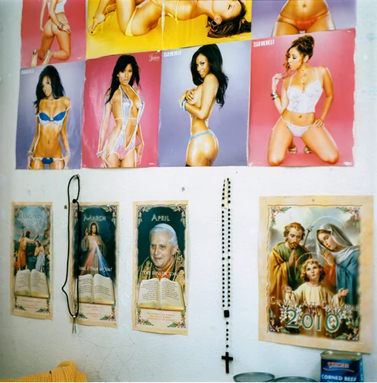

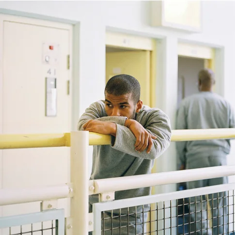

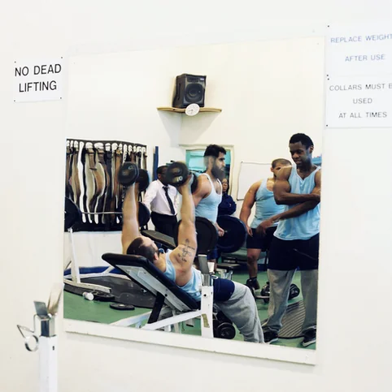

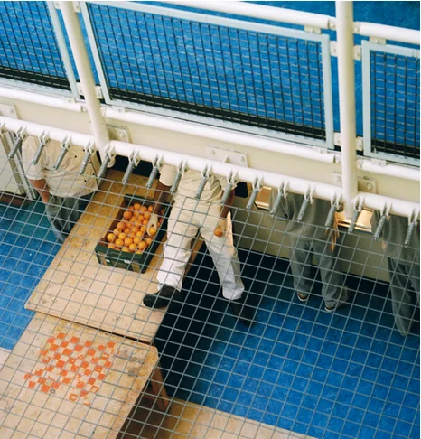

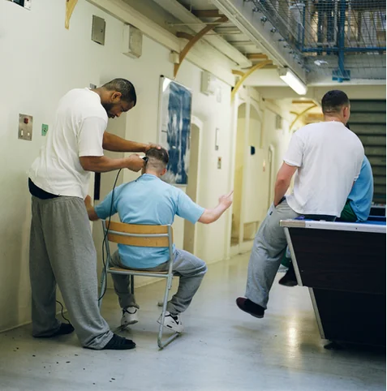

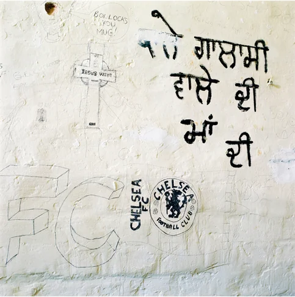

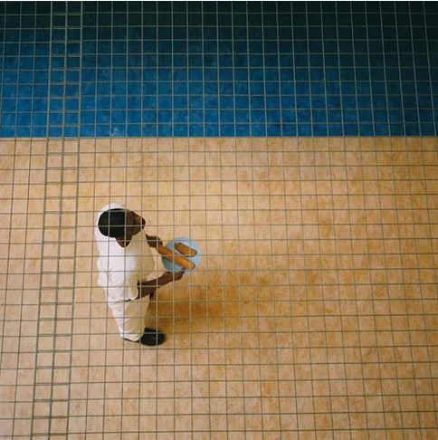

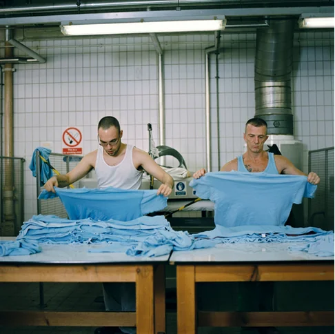

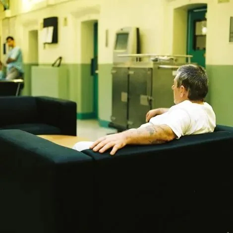

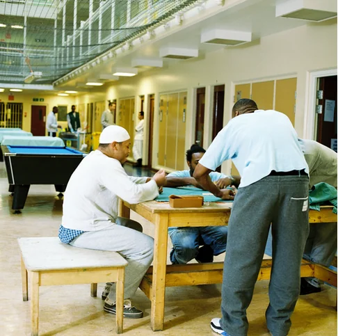

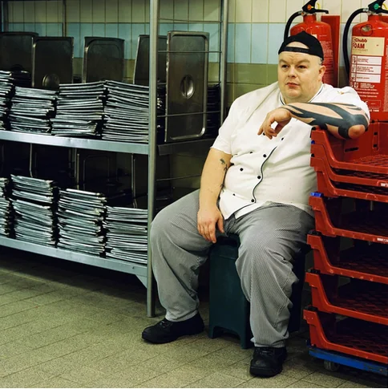

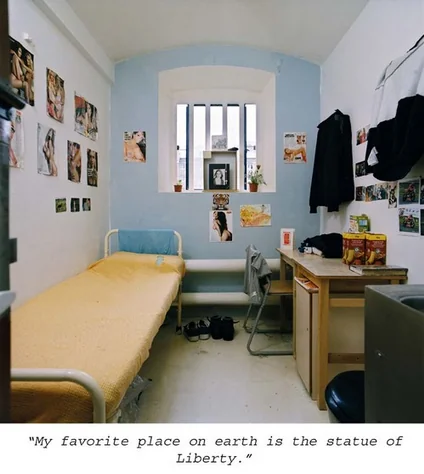

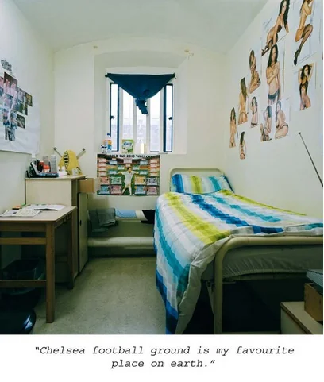

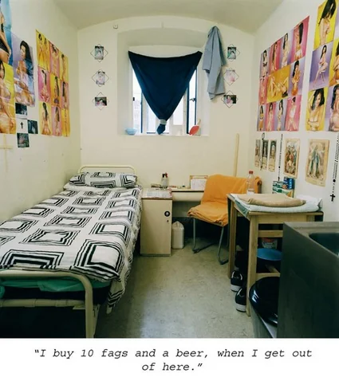

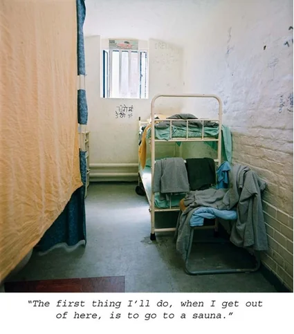

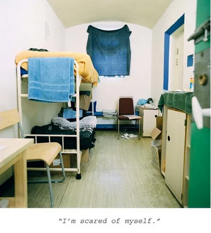

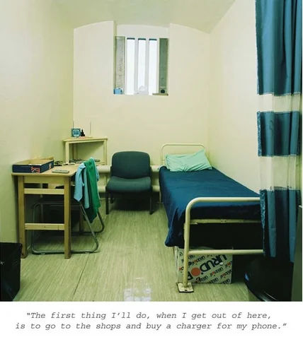

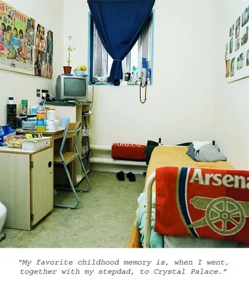

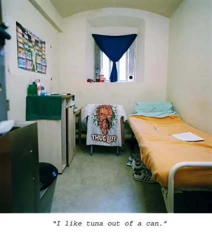

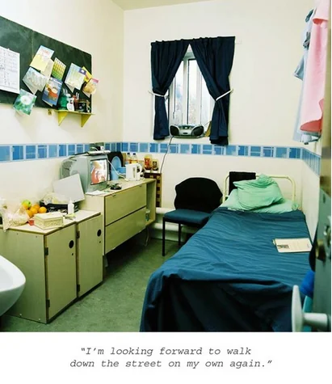

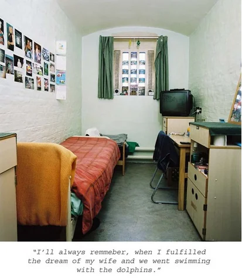

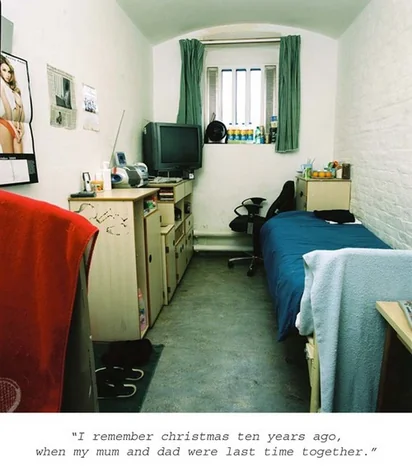

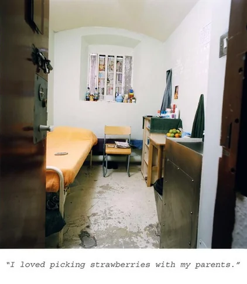

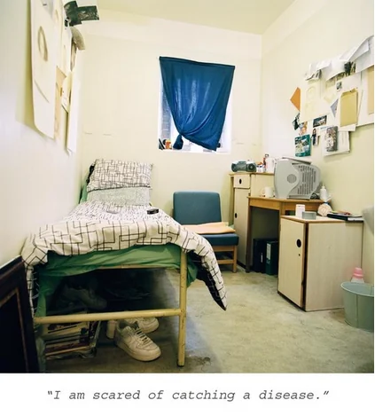

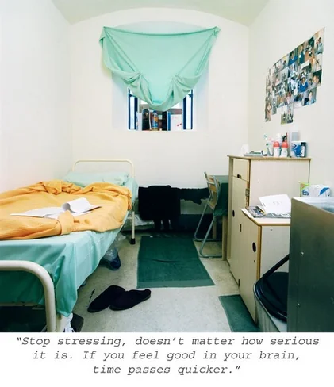

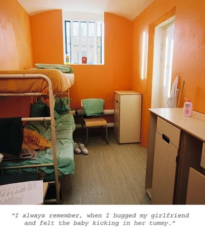

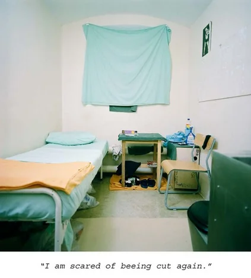
