# 摄影师塔里克·扎伊迪镜头下的萨尔瓦多监狱

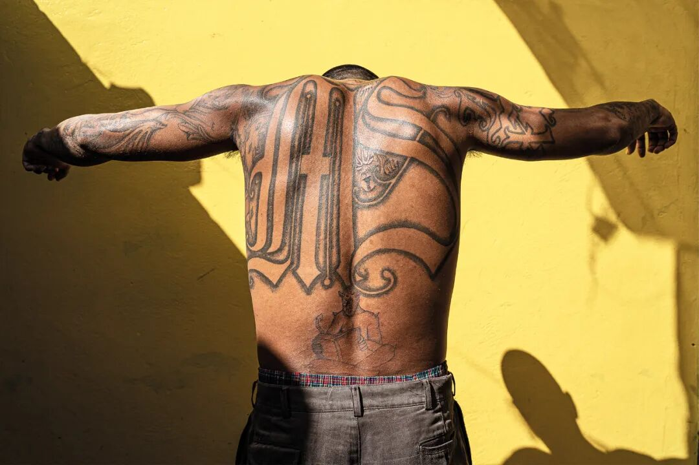

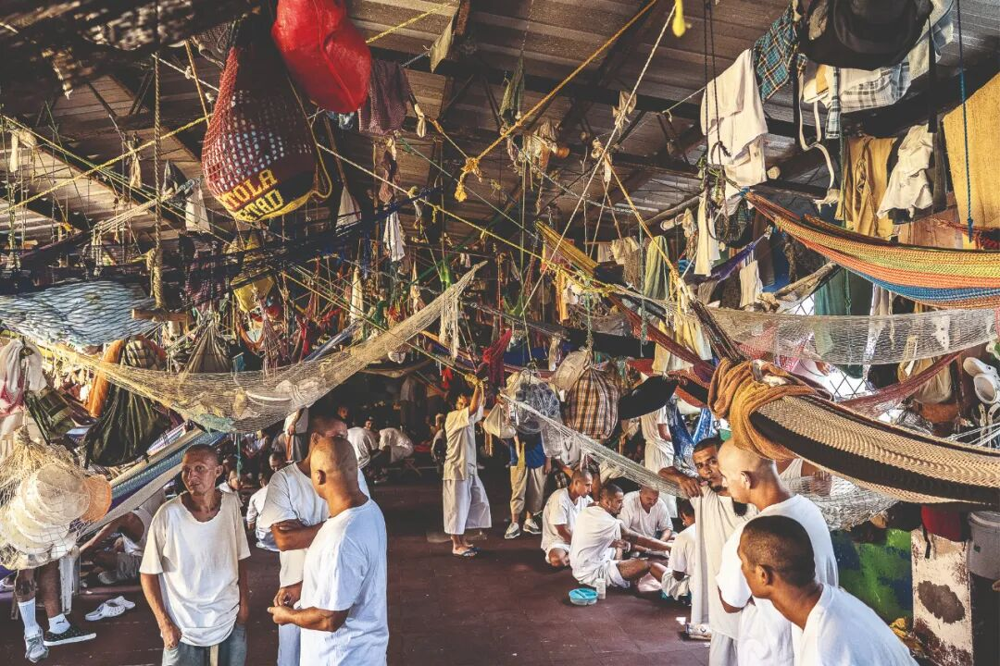

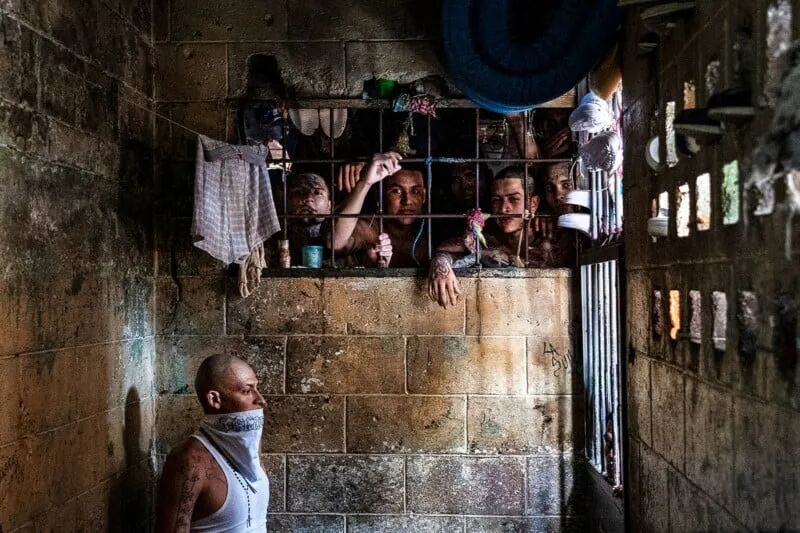

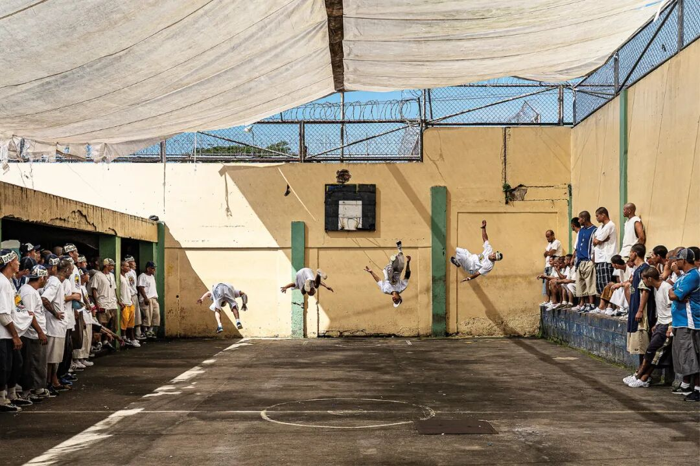

萨尔瓦多，这个以“救世主”命名的中美洲国家，如今却因黑帮暴力沦为“人间地狱”。1992年，长达12年的内战结束后，帮派在这里野蛮生长，形成了盘根错节的两大帮派——“Mara Salvatrucha”（MS-13）和“Barrio 18”（巴里奥18）。

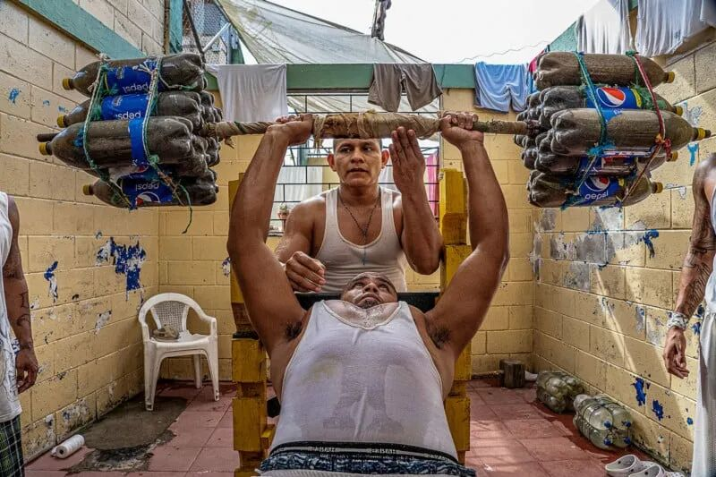

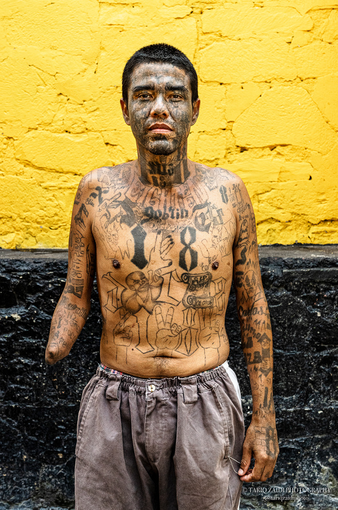

据萨尔瓦多国防部估计，在这个人口仅650万的国家，有多达50万人直接或间接参与帮派活动，占总人口的8%。在1995年至2017年的22年间，萨尔瓦多有13年是非战区国家中谋杀率最高的国家。2015年和2016年，该国的凶杀率飙升至每10万人103起，远高于排名第二和第三的国家委内瑞拉和洪都拉斯（分别为90起和57起），成为全球最致命的国家之一。

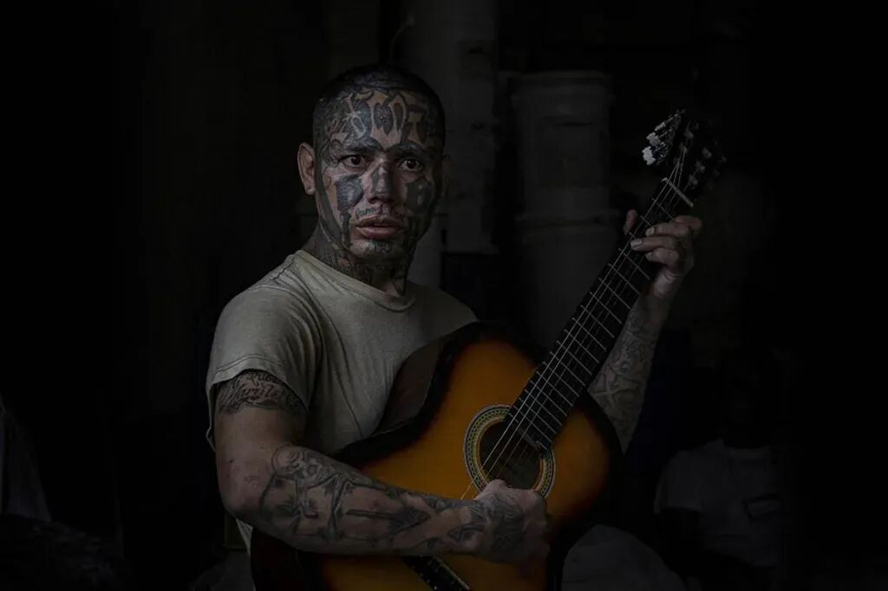

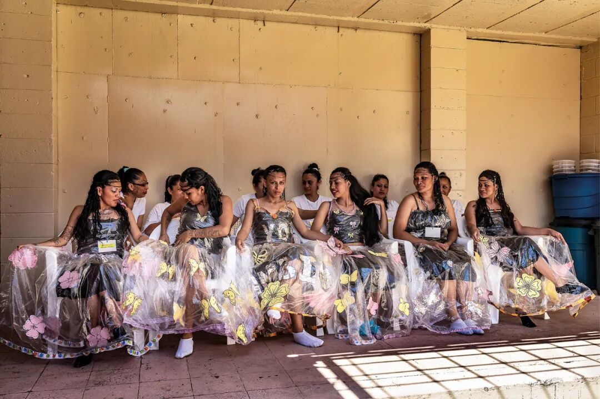

2018年，英国摄影师塔里克·扎伊迪（Tariq Zaidi）首次踏上这片土地，开始记录帮派暴力对社会的影响。他的镜头对准了监狱、犯罪现场、葬礼、警察行动，以及那些被暴力摧毁的家庭。

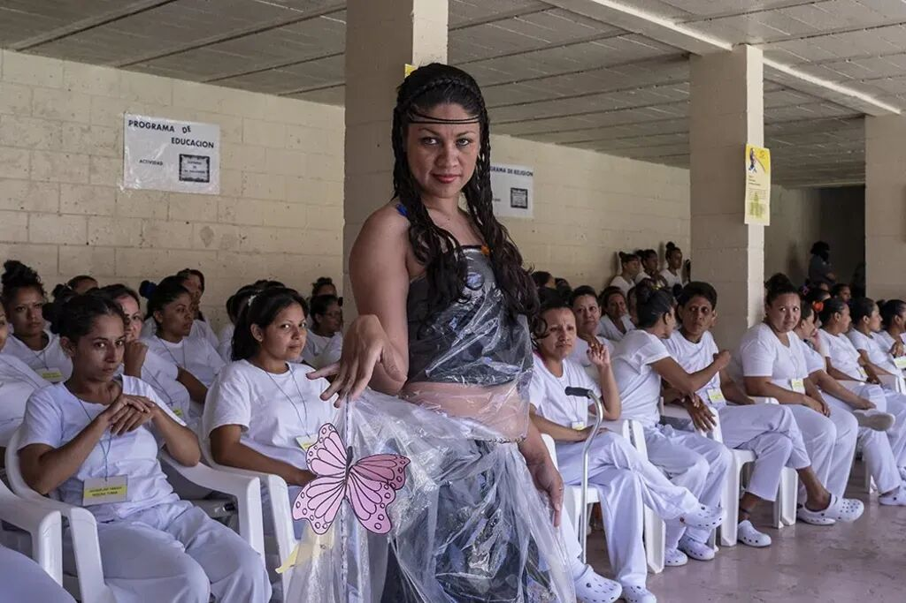

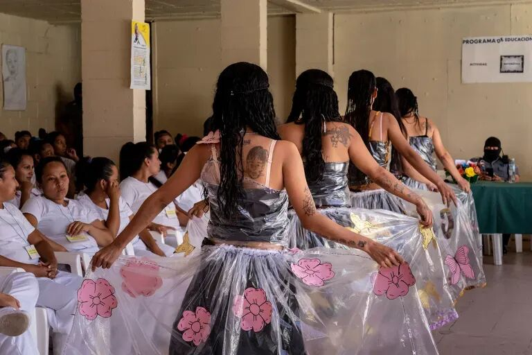

“当时的特朗普总统称中美洲移民为‘罪犯’，我想知道，这些人究竟逃离了怎样的生活。”扎伊迪在接受采访时说道，“我想向世界展示，萨尔瓦多已经变成了一个怎样的反乌托邦世界。”

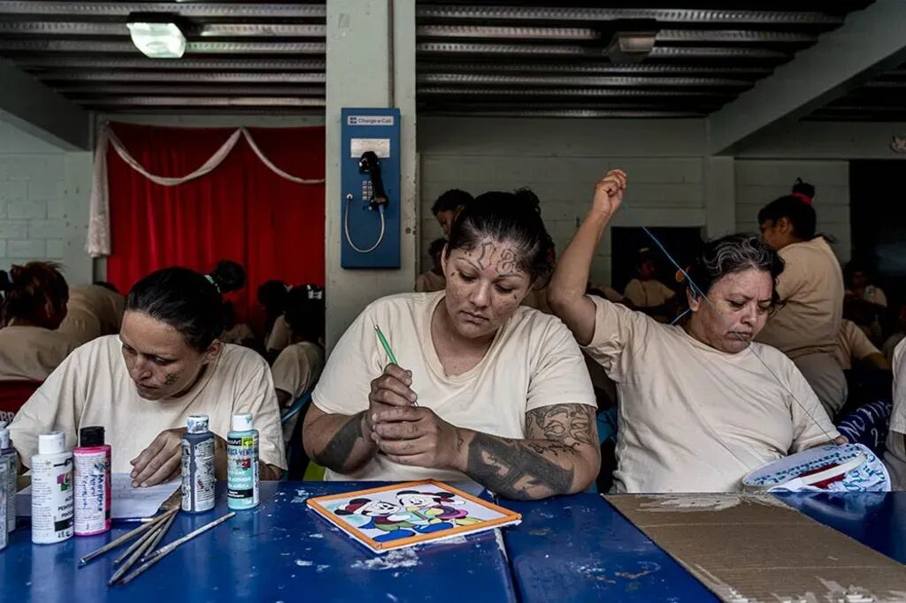

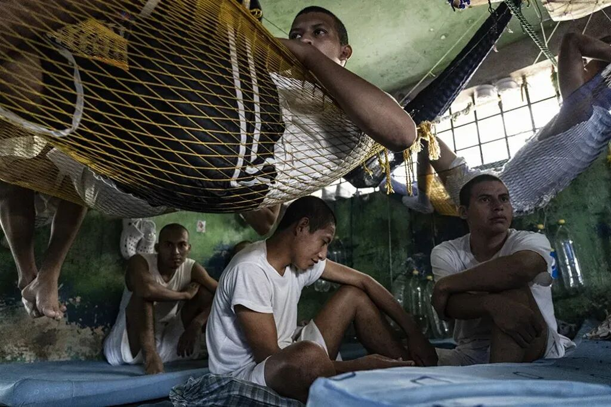

为了拍摄监狱内部，扎伊迪花了8个月的时间与当地政府沟通，最终获准进入六所最高安全级别的监狱。在最初的经历中，他主要记录了守灵仪式、殡仪馆和监狱。2019年，他再次回到萨尔瓦多，并最终在2020年获得了更多进入犯罪现场和参与警务工作的机会。

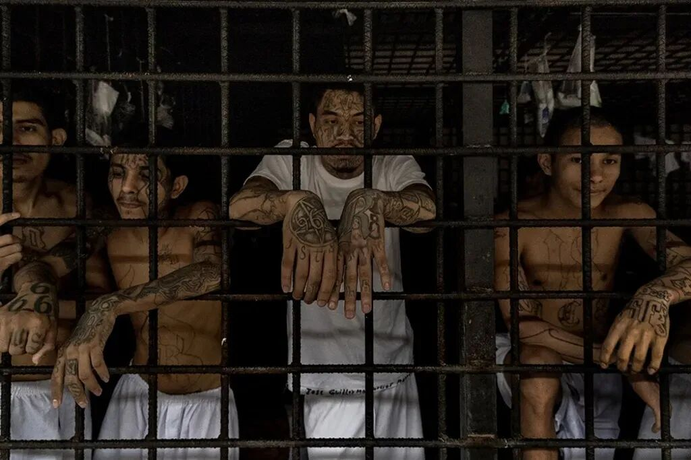

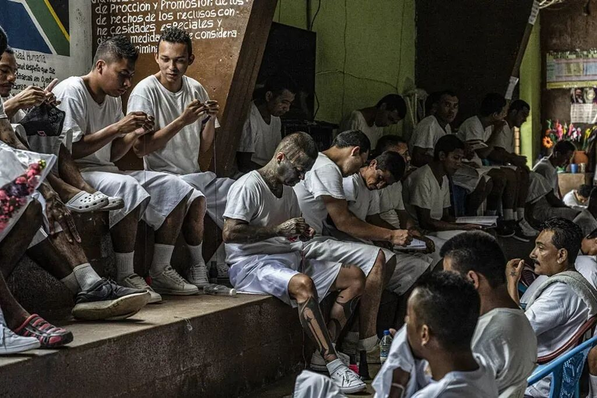

“这不是美化暴力，而是关于展示它如何摧毁整个社会。”扎伊迪说。

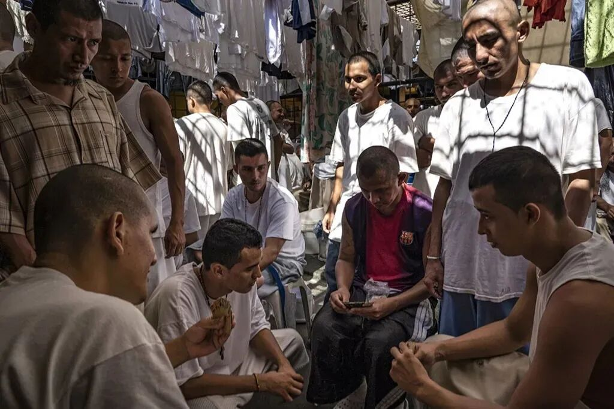

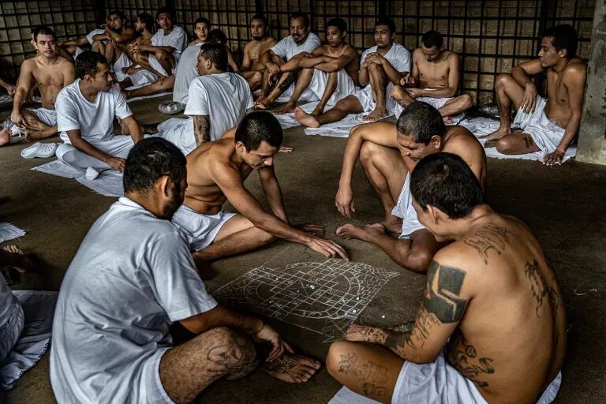

或许，只有当更多人关注这片土地上的苦难时，改变才有可能发生。

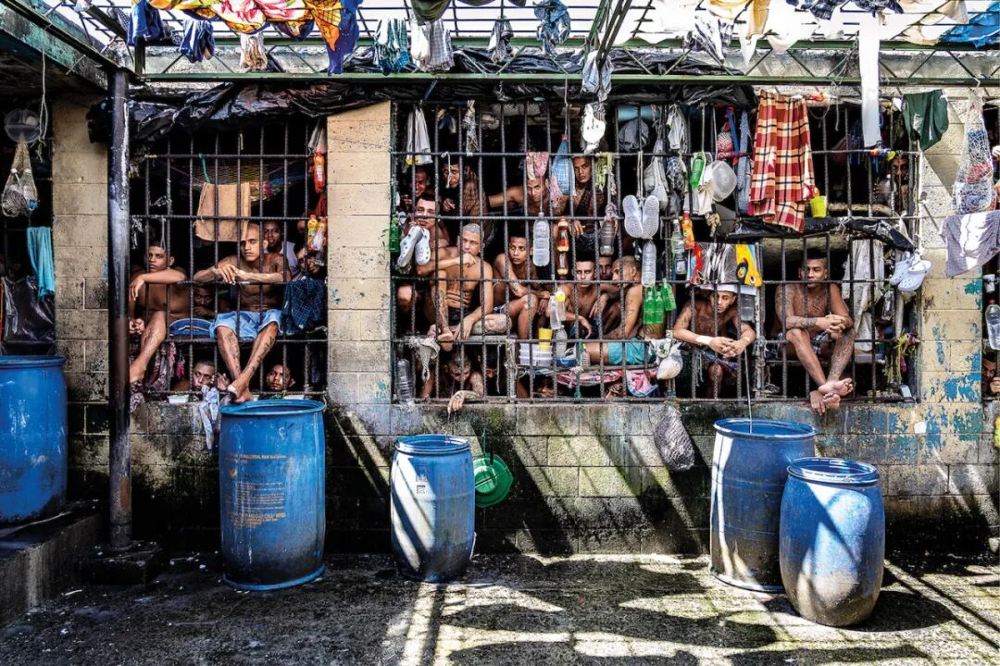

囚犯们展示她们的时尚作品，这是“我改变”（Yo Cambio）项目的一部分，该项目旨在帮助克萨尔特佩克监狱的囚犯改过自新。

除了监狱，扎伊迪还记录了谋杀现场、守灵仪式、殡仪馆，以及那些失去亲人的家庭。他的照片不仅呈现了暴力的残酷，更捕捉到了悲伤、恐惧和无助的情绪。

该项目于2021年11月由GOST出版社出版，书名为《Sin Salida》（“无路可逃”）。

萨尔瓦多的暴力问题根深蒂固，扎伊迪希望通过他的作品，让世界看到这个国家的真实面貌。《Sin Salida》不仅是一组摄影作品，更是一份关于人性、生存与绝望的深刻记录。

塔里克·扎伊迪曾是一家活动公司的高管，在南美从事活动管理或教学工作。2014年，他放弃高薪工作，投身纪实摄影。他的足迹遍布全球21个国家，致力于记录边缘群体的生存状态。
