# 以“囚禁”为主题的2025年拉各斯摄影双年展

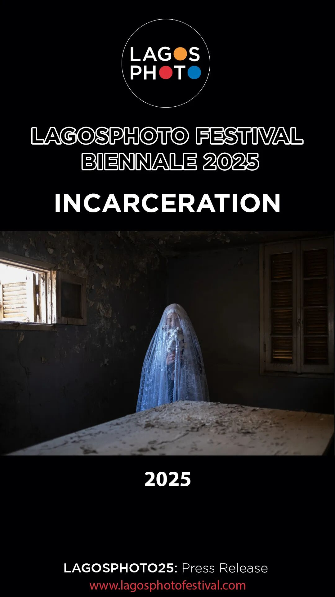

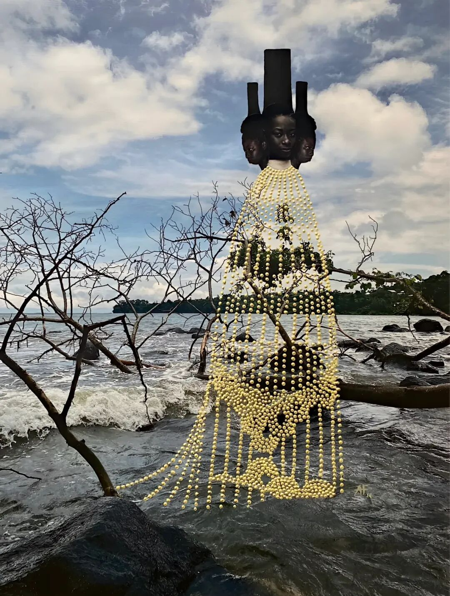

拉各斯摄影双年展（Lagos Photo Biennial）

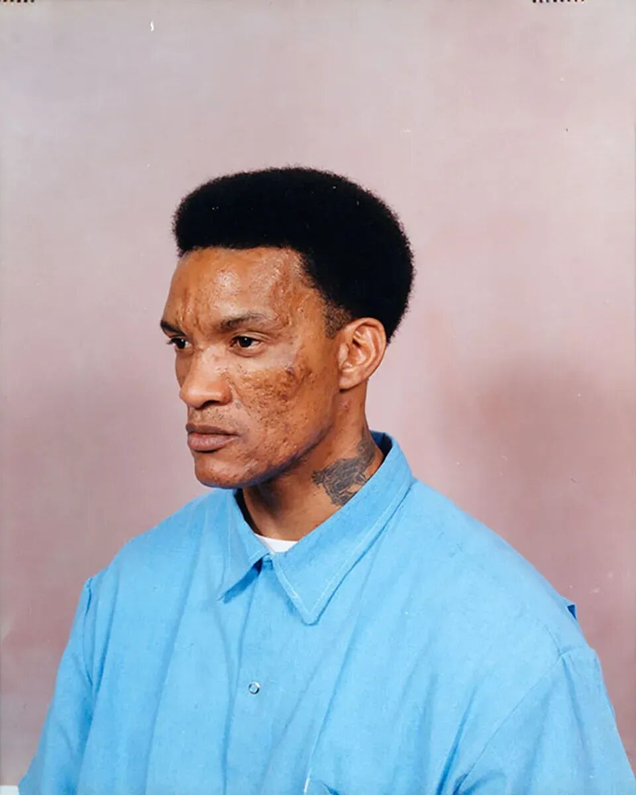

主题：“囚禁”（Incarceration）

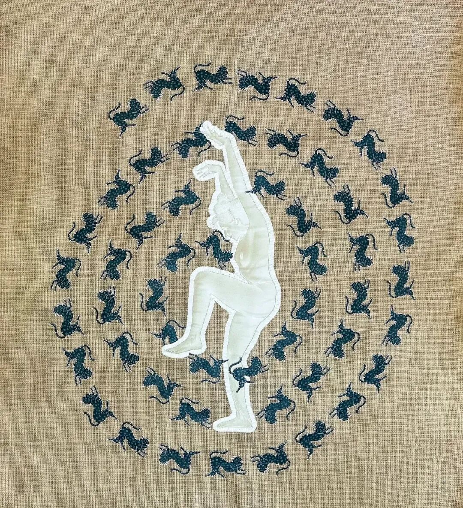

时间：2025年10月25日 – 11月29日

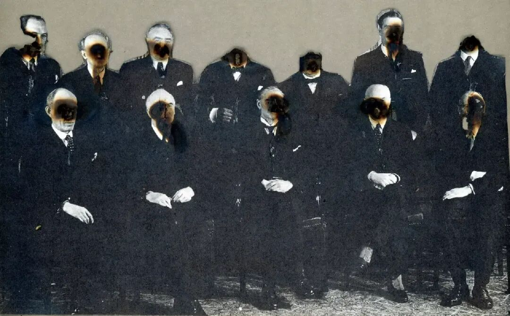

地点：尼日利亚前首都拉各斯

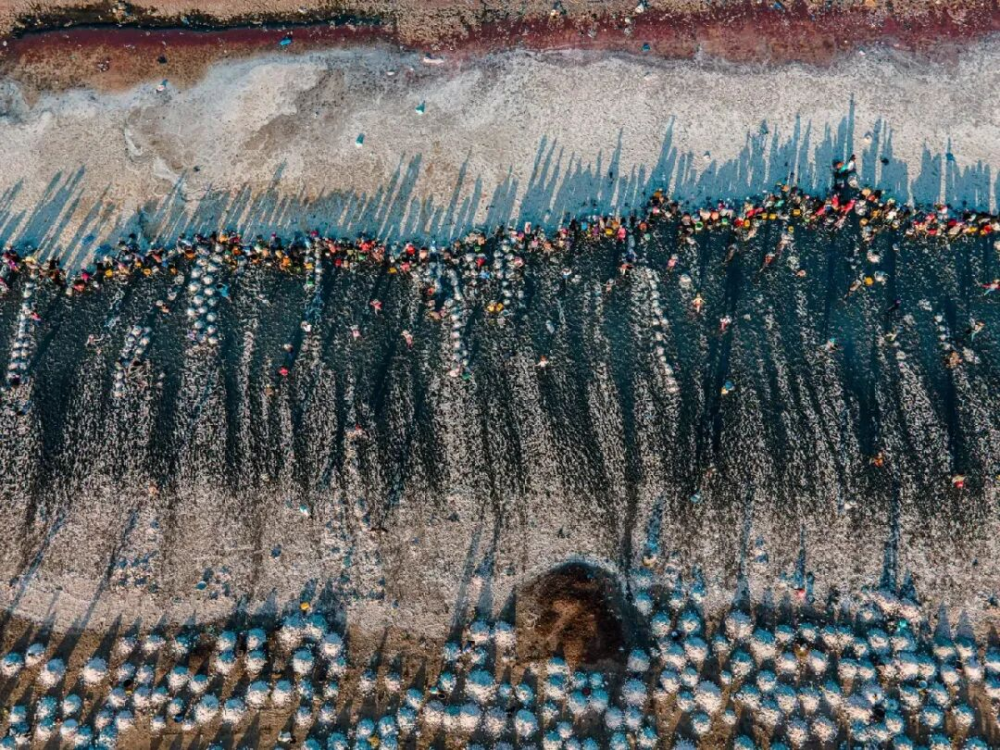

主办机构：非洲艺术家基金会（African Artists’Foundation，AAF）

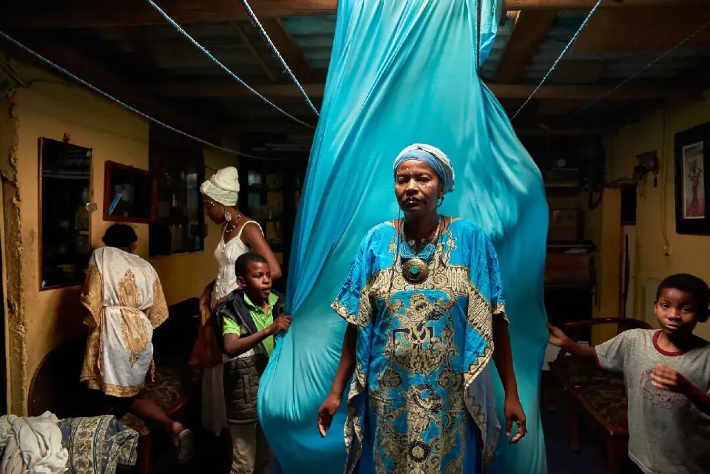

官网：www.lagosphotofestival.com

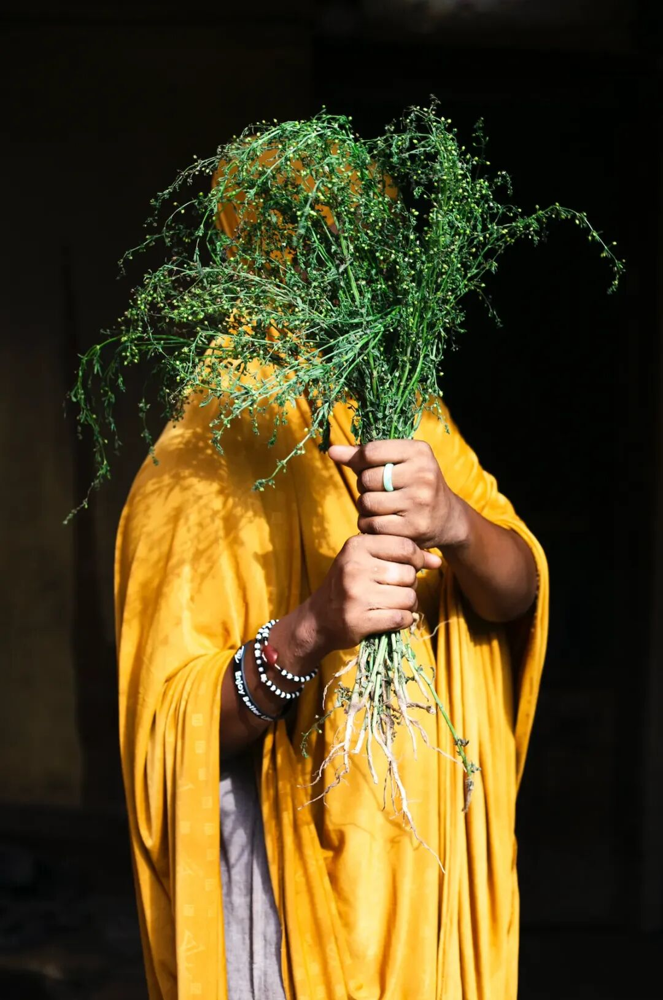

拉各斯摄影节（lagos photo festival）创办于2010年，2025年转型为双年展，2025年双年展活动还扩展到尼日利亚另一大城市伊巴丹（Ibadan）。

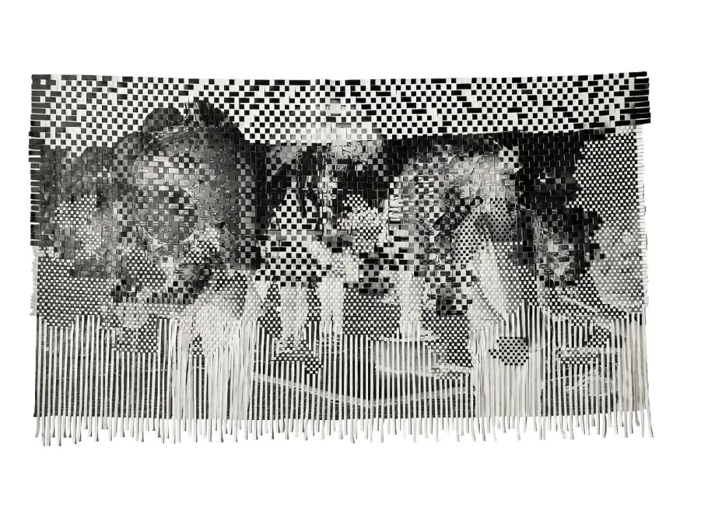

汇集了来自非洲大陆、非洲侨民以及全球其他国家的约50位艺术家与项目，涵盖摄影、录像、装置、表演与混合媒介等多种表现形式。

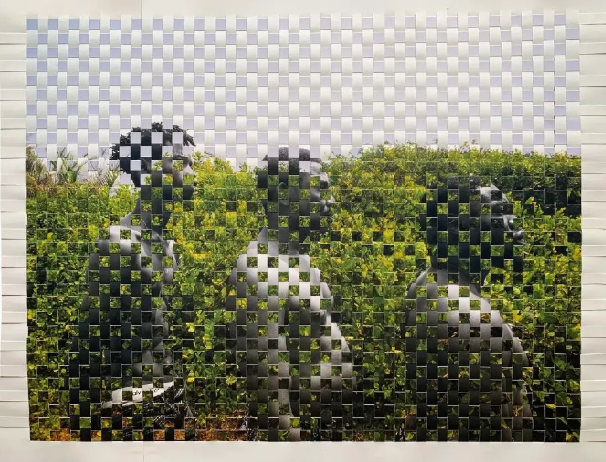

The rise of Jobalè, 2025. From the series les Réenchanteresses. Courtesy of the artist and AAFArnold Tagne Fokam

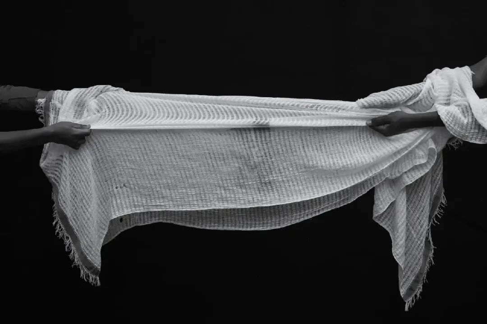

San Quentin State Prison, 2004. Courtesy of the artist and AAFStefan Ruiz

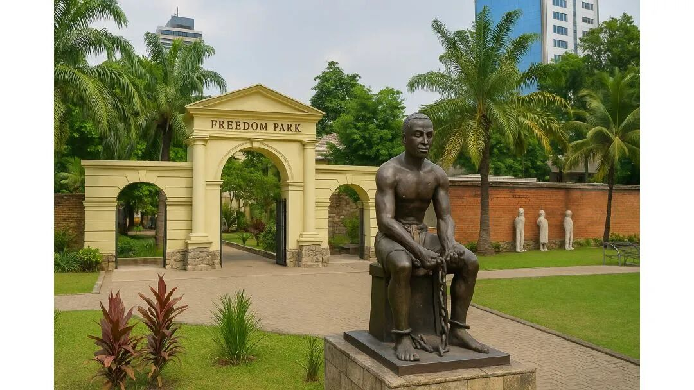

不过，本次双年展入选作品并不局限于传统意义的监禁、监狱和囚室。策展人指出，此主题旨在借图像语言挑战“被禁锢的叙事”，并以摄影作为重新构想自由、揭示社会结构限制的一种批判性视觉实践。

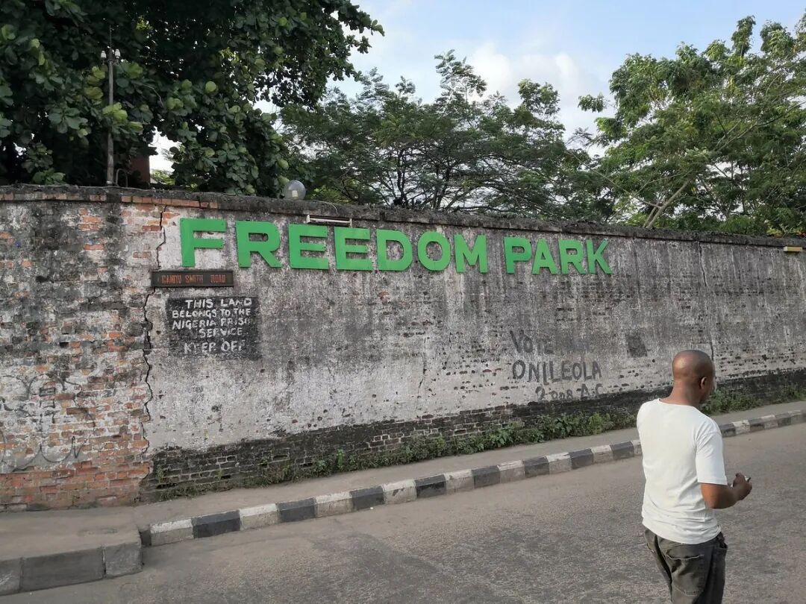

Breathwork, 2025. From I Keep My Visions To Myself. Embroidered canvas print on hemp fabric, 114 x 140 cm.. Courtesy of the artist and AAFYagazie EmeziGood People, 2024. Courtesy of the artist and AAFKhanya ZibayaUntitled, from Or Blanc, 2023. Courtesy of the artist and AAFMassow KaUntitled. 2019. From the series Cimarrona, 2018-2025. Courtesy of the artist and AAFJohis AlarconKayanmata, 2025. Courtesy of the artist and AAFFibi AfloeFor The Love of God, 2025. Woven photographic print on canvas, 152.4 × 91.4 cm. Courtesy of the artist and AAFAyobami OgungbeBrother's keeper, 2021. From Point of Return. 36 x 26 inches. Courtesy of the artist and AAFOgungbe Ayobami

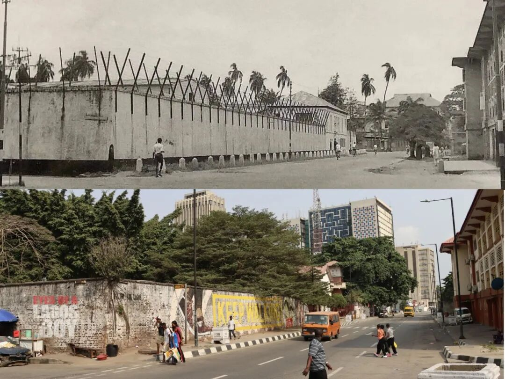

Untitled, 2021. From the series Eye of the Storm, 2023. Courtesy of the artist and AAFGeremew Tigabu

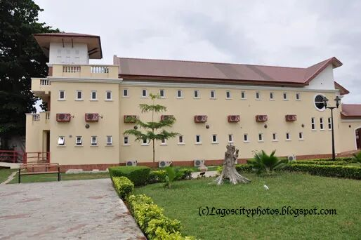

另，本次双年展的展览场地之一为自由公园（Freedom Park），其前身为英殖民政府建造的皇家布罗德街监狱（Her Majesty's Broad Street Prison）。初建于1882年，1979年废弃，上世纪末改造为公园，保留了原监狱的52间囚室，集纪念馆、历史地标（纪念碑）、遗址、艺术和休闲中心于一体。
