# 从律师到摄影师：萨拉·班尼特为终身监禁的女性拍下肖像

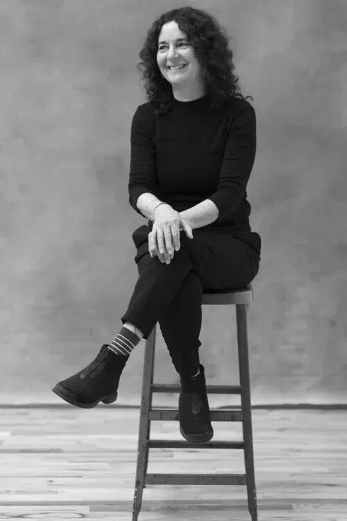

萨拉·班尼特（Sara Bennett）是一位美国摄影师，做摄影师之前，她做了18年辩护律师。如今她聚焦终身监禁/长刑期女性的生活与再社会化议题，通过摄影关注美国监禁制度中的权力机制与个体生命经验，表达对司法制度的思考与批判。

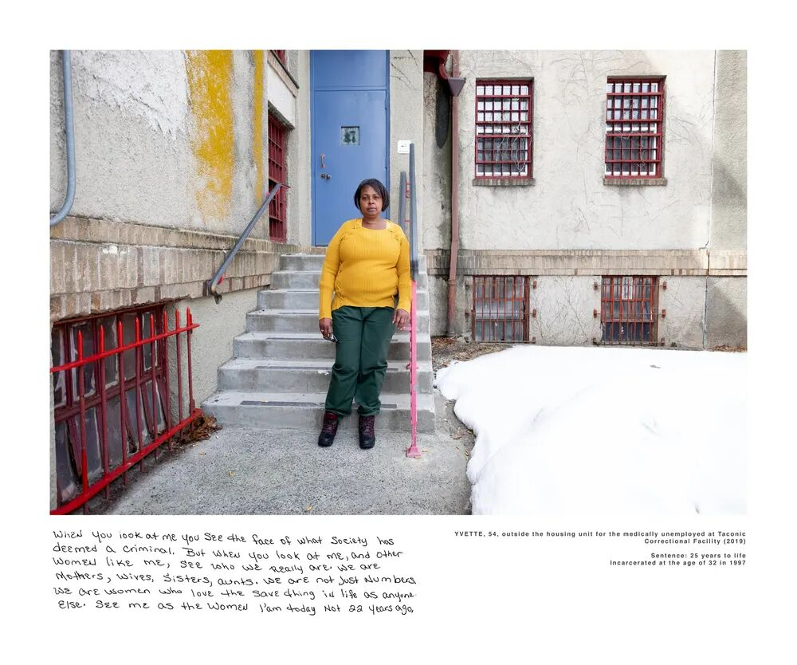

萨拉·班尼特最为人所知的摄影项目为：狱望--终身监禁女性的肖像（Looking Inside: Portraits of Women Serving Life Sentences）

2019年，她进入纽约州 Bedford Hills 和 Taconic 两座监狱为正在服终身刑的女性拍摄肖像，照片下方配以当事人手写的文字。

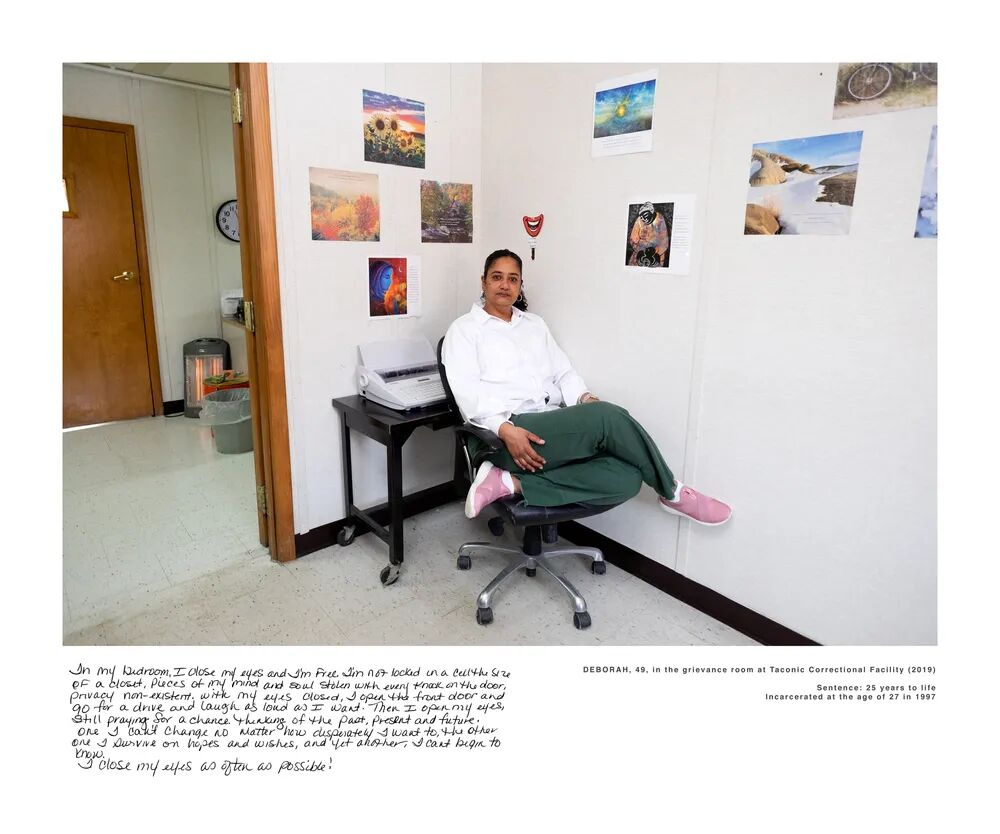

这位女士名叫黛博拉，27岁入狱，如今49岁了。她写到：“在我的卧室里，我闭上双眼，便获得了自由。我不再被囚禁在衣橱般大小的牢笼里，不再被每一次敲门声夺走一部分思想和灵魂，不再拥有丝毫隐私。闭上双眼，我打开前门，开车兜风，尽情地开怀大笑。然后我睁开双眼，依然祈祷机会的到来。思绪飘向过去、现在和未来。过去，无论我多么渴望，都无法改变；现在，我依靠希望和愿望支撑；而未来，我根本无从知晓。我尽可能地闭上双眼！”

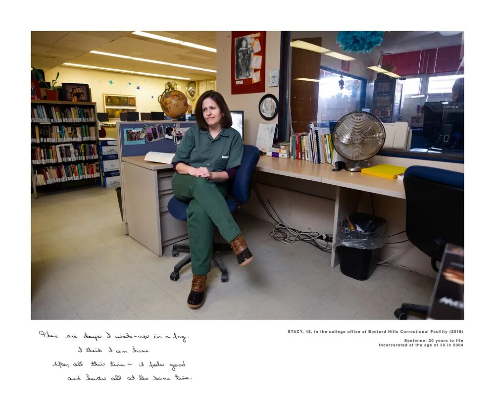

“当你看着我的时候，你看到的是社会眼中的罪犯。但当你把我当作一个普通女性时，你会看到我们真正的模样。我们是母亲、妻子、姐妹、阿姨。我们不是冷冰冰的数字。我们和其他人一样，热爱着生活中的一切。请看到现在的我，而不是22年前的我。”--伊薇特，54岁

2012年，身为律师的班尼特为当事人Judith Clark（被判 75 年到终身监禁的案件）提供法律援助，争取减刑，她希望说服重返社会委员会。于是她拍摄了几位曾经和Judith Clark一起服刑的女性。并让她们写下 Clark 对其生活的影响，制作了一本小册子，寄给了新成立的重返社会委员会的50名成员。这次经历让她感觉到了摄影的力量。

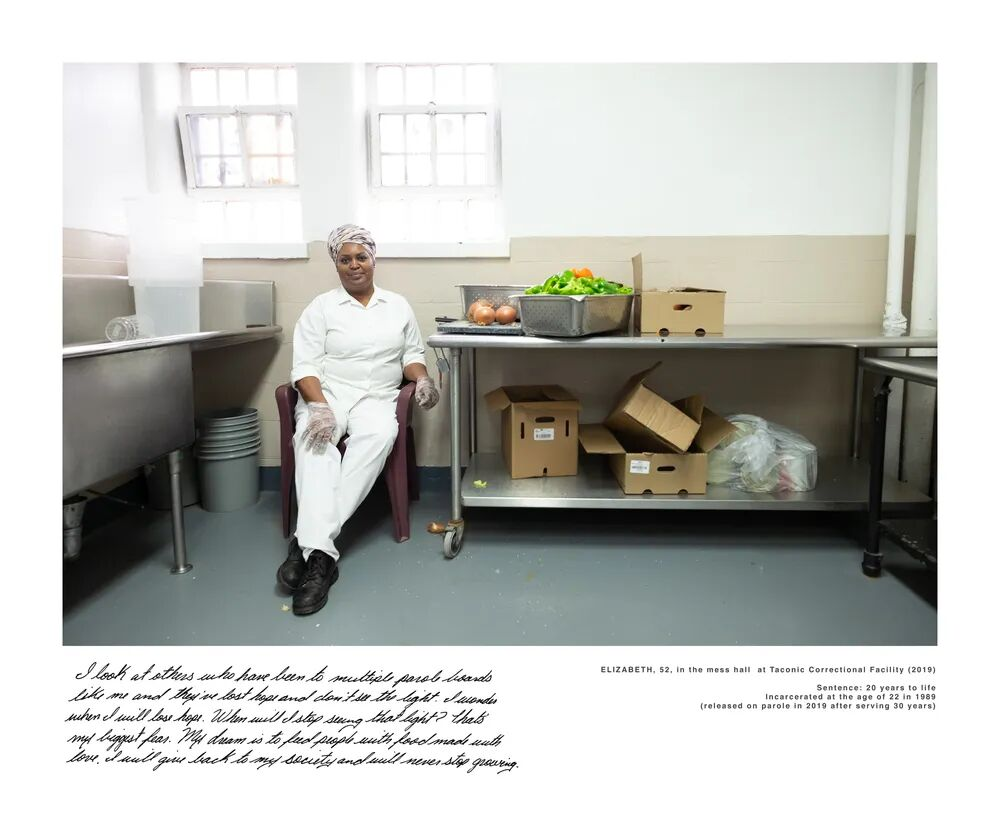

“有时候我醒来时感觉像在梦里。我觉得自己回家了。这么多年过去了——这种感觉既美好又痛苦。”--斯泰西，45岁

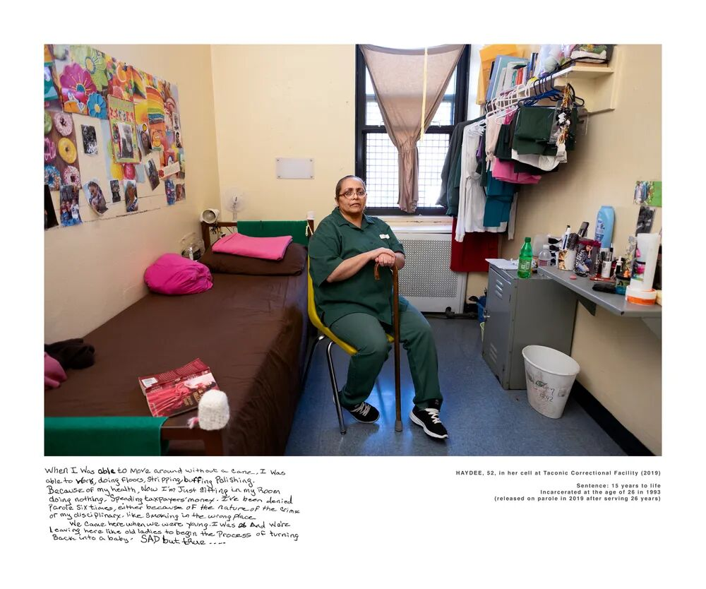

“美国有超过 20 万人被判处终身监禁，这种刑罚在大多数其他西方国家几乎不存在。担任公设辩护人以来，我一直认为，如果法官、检察官和立法者能够把被判定犯有严重罪行的人视为人类，他们就会重新思考那些将他们永远监禁下去的政策。

“我看着那些像我一样多次参加假释听证会的人，他们已经失去了希望，看不到希望的曙光。我不知道自己什么时候也会失去希望，什么时候也会看不到希望的曙光？这是我最大的恐惧。我的梦想是用爱烹制食物，让人们吃饱。我会回馈社会，并且永不停歇地成长。”--伊丽莎白，52岁

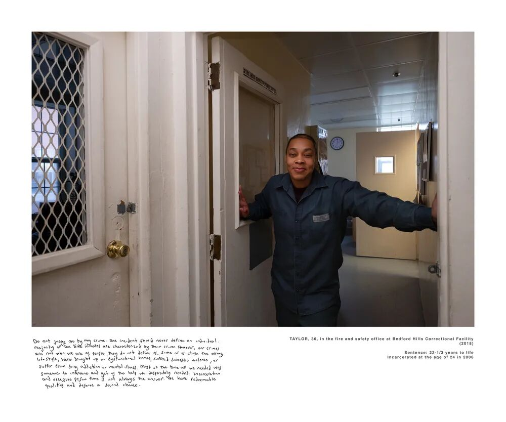

在拍摄每一位——均被判犯有杀人罪——的女性之前，我都会前去拜访她们，了解她们的生活情况。与一位年仅 15 岁便被判处终身监禁的年轻女性聊她是否会在牢狱之中终老，与年届 70 岁的女性谈论生死，以及其他所有年龄段的女性，这一切深深触动着我。每个人都远不止是导致其被判处终身监禁的那一次行为。她们都勤劳坚韧、自尊自重、善于内省且心怀悔意。她们努力追求有意义的人生，渴望得到世人的同情与关怀。

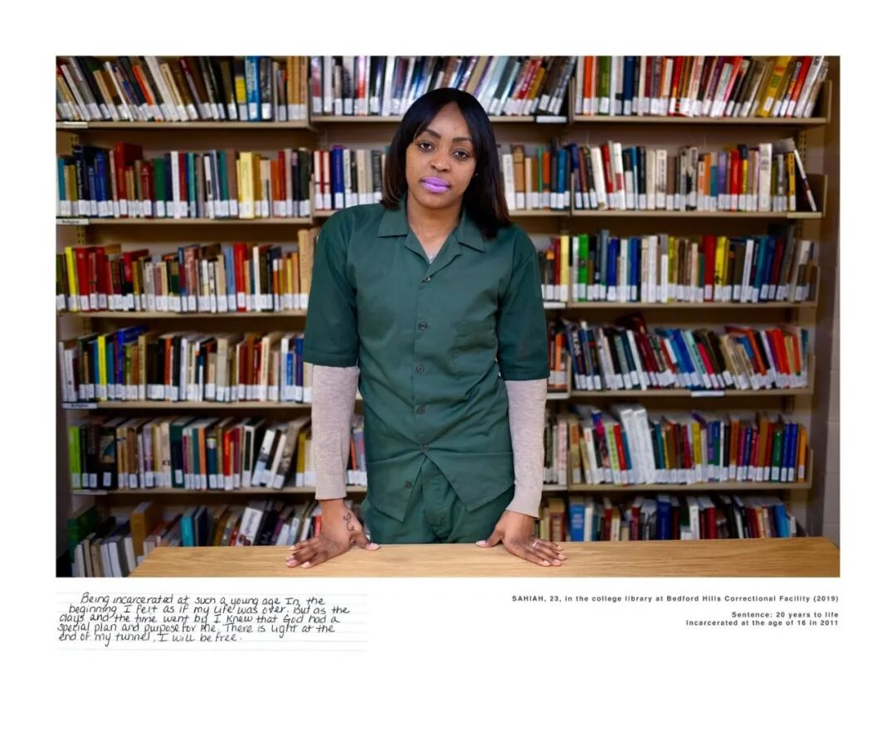

这也就把一个问题留给整个社会：我们该如何安置一个完成了自我救赎的人生？”

“以前，不用拐杖可以走动的时候，我还能工作，比如打扫地板、剥除旧漆、抛光等等。现在身体出问题了，只能待在房间里，无所事事，浪费纳税人的钱。我的假释申请被驳回了六次，要么因为犯罪性质，要么因为违反纪律，比如在不该抽烟的地方抽烟。我们来这里的时候还很年轻，我当时才26岁。现在我们却像老太太一样，开始慢慢变回婴儿。真悲哀，但这是事实……”--海蒂，52岁

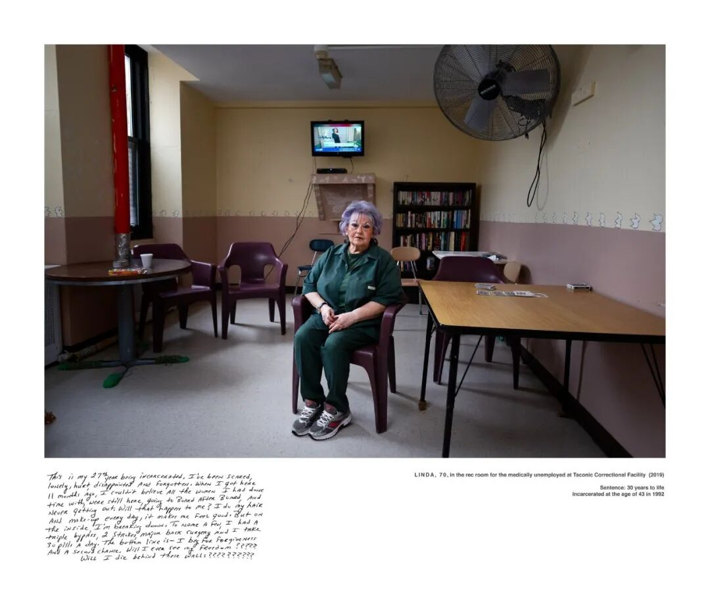

“不要以我的罪行来评判我，一次犯罪经历不能定义一个人。大多数时候，人们会因为犯罪而给囚犯贴上标签。但，罪行并不能定义我们，它们无法定义我们。我们中的一些人选择了错误的生活方式，有些人成长于功能失调的家庭，有些人遭受过家庭暴力，有些人则饱受毒瘾或精神疾病的折磨。大多数时候，我们需要的只是有人介入，帮助我们获得迫切需要的支持。监禁和过长的刑期并非解决之道。我们有值得救赎的品质，值得拥有第二次机会。”--泰勒，36岁

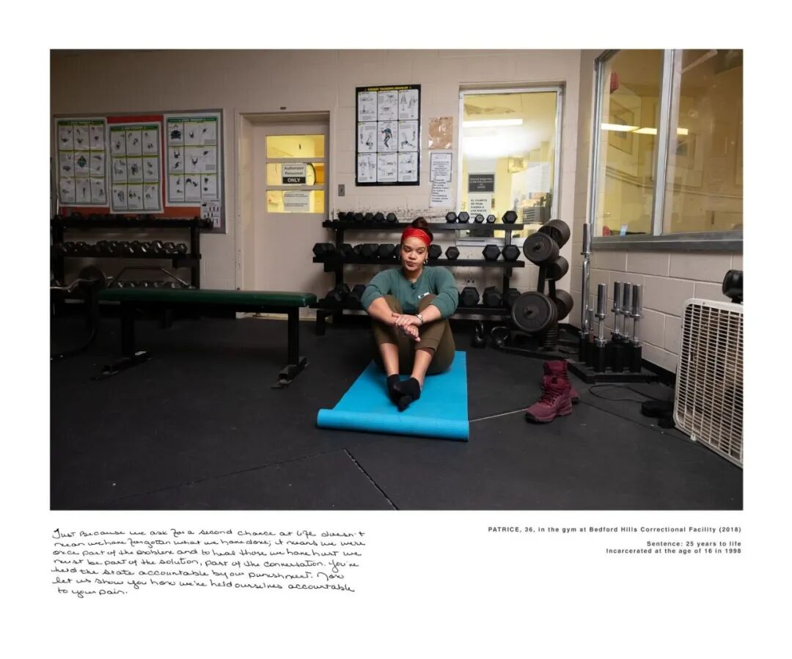

“这么年轻就被监禁，一开始我觉得我的人生完了。但随着时间的流逝，我知道上帝另有安排。隧道尽头终有光明。我终将获得自由。”--萨希亚，23岁

“这是我被监禁的第27年。我一直感到恐惧、孤独、痛苦、失望和被遗忘。11个月前我来到这里时，我简直不敢相信所有和我一起服刑的女囚们仍然在这里，一次又一次地审查，却始终无法出狱。难道我也会落得如此下场吗？我每天都精心打扮，这让我感觉好点。但实际上，我的内心正在崩溃。比如，我做过三次心脏搭桥手术，中风两次，做过一次大型背部手术，我每天要吃30片药。总之——我恳求宽恕，恳求再给我一次机会。我还能重获自由吗？我会死在这高墙之内吗？？？？？？？？”--琳达，70岁

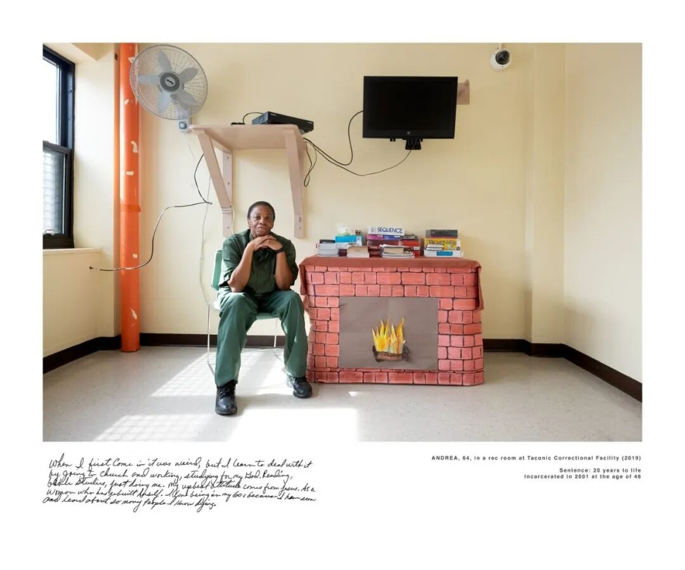

“我们请求获得第二次生命的机会，并不意味着我们忘记了自己做过的事；而是意味着我们曾经是问题的一部分，为了治愈那些被我们伤害的人，我们必须成为解决方案的一部分，参与到对话中来。你们通过我们的惩罚让国家承担了责任。现在，让我们向你们展示，我们是如何为你们的痛苦承担责任的。”--帕特里斯，36岁

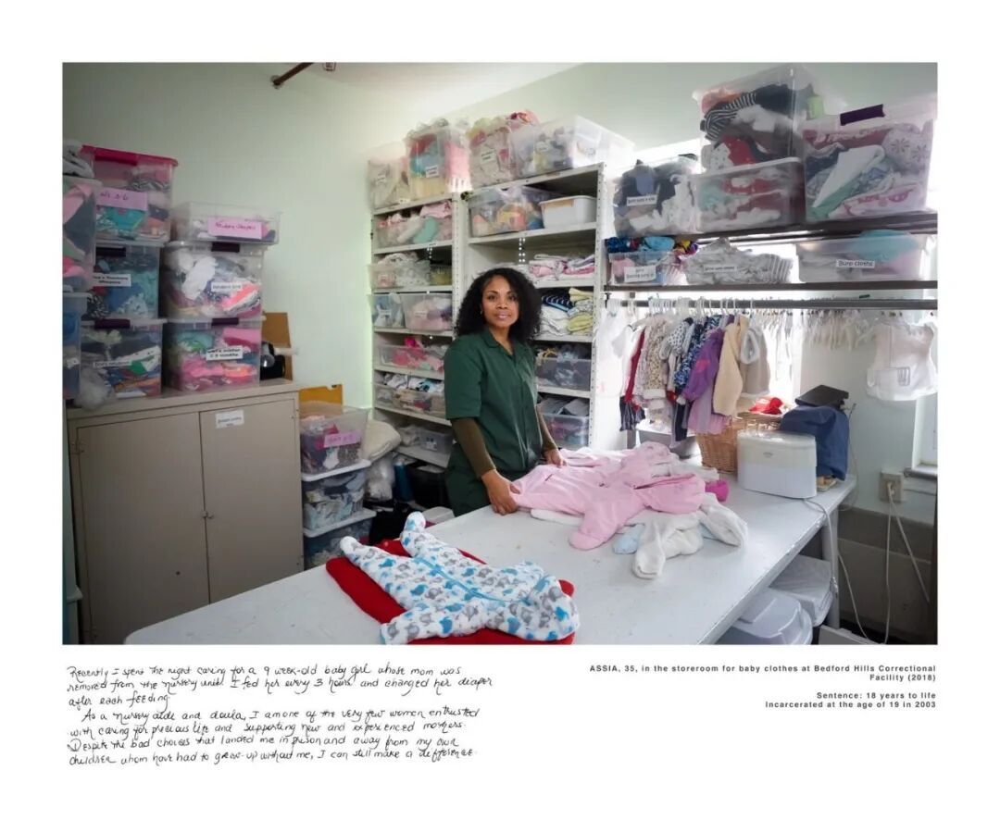

“刚来的时候感觉很奇怪，但我通过去教堂、工作、为上帝学习来适应。读书、研读圣经，做我自己。我乐观的态度来自耶稣。作为一个重塑自我的女人，我喜欢我的六十多岁，因为我亲眼目睹、亲耳听到太多我认识的人去世。”--安德莉亚，64岁

“最近我照顾了一个9周大的女婴，她的母亲被从婴儿室带走了。我每隔3个小时喂她一次奶，喂完奶后给她换尿布。作为一名婴儿室助理和陪产员，我是极少数被委以重任，负责照料珍贵生命并支持新手妈妈和经验丰富的妈妈的女性之一。尽管我过去的错误选择让我身陷囹圄，远离了我的孩子们，他们不得不独自长大，但我仍然可以有所作为。”--阿西亚，35岁

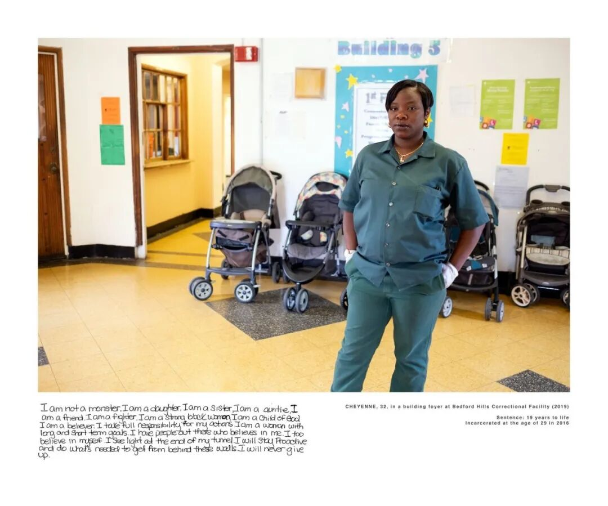

“我不是怪物，我是女儿，我是姐妹，我是阿姨，我是朋友，我是斗士，我是坚强的黑人女性，我是上帝的孩子，我是信徒，我为自己的行为承担全部责任，我信仰上帝，我是一个有长远和短期目标的女性。有人相信我，我相信我自己。我看到了隧道尽头的曙光，我会积极主动，尽一切努力走出这堵高墙。我永不放弃。”--Cheyenne，32岁

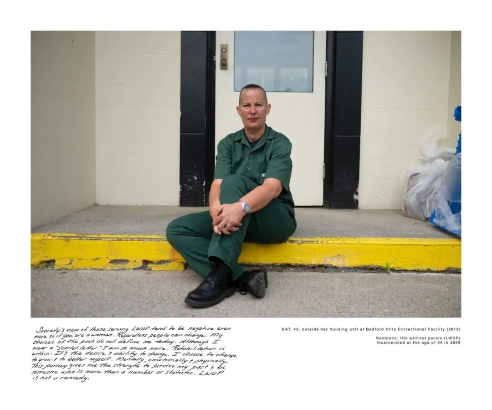

“社会对终身监禁不得假释的服刑人员的看法往往是负面的，尤其是对女性。但无论如何，人是可以改变的。我过去的所作所为并不能定义今天的我。虽然我身上带着‘耻辱的印记’，但我远不止于此。改造源于内心，它是一种改变的渴望和能力。我选择改变，成长，让自己变得更好。在精神、情感和身体上。这段经历赋予我力量，让我能够战胜过去，成为一个不仅仅是数字或统计数据的人。终身监禁不得假释并非万能的。”--凯特（KAT），43岁

“十五岁那年，我被控谋杀，并以成年人身份受审。因此，我的整个青少年时期都在少年管教所度过，之后又被转移到贝德福德山惩教所。过去十年，我一直在进行自我反省，并取得了巨大的进步。我深感懊悔。

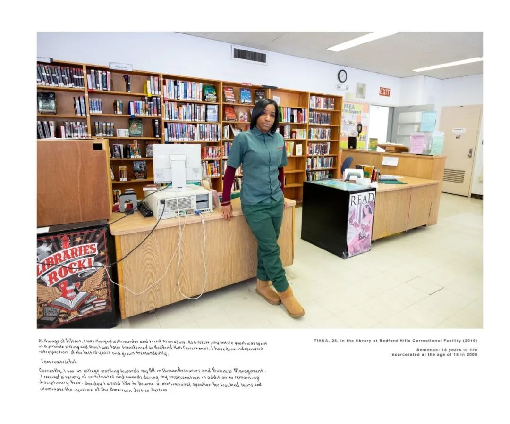

目前，我正在大学攻读人力资源和商业管理专业的副学士学位。在服刑期间，我获得了各种证书和奖项，并且一直保持良好行为记录。我希望有一天能成为一名青少年励志演讲者，帮助那些身处困境的青少年，揭露美国司法系统的不公。”--TIANA, 25

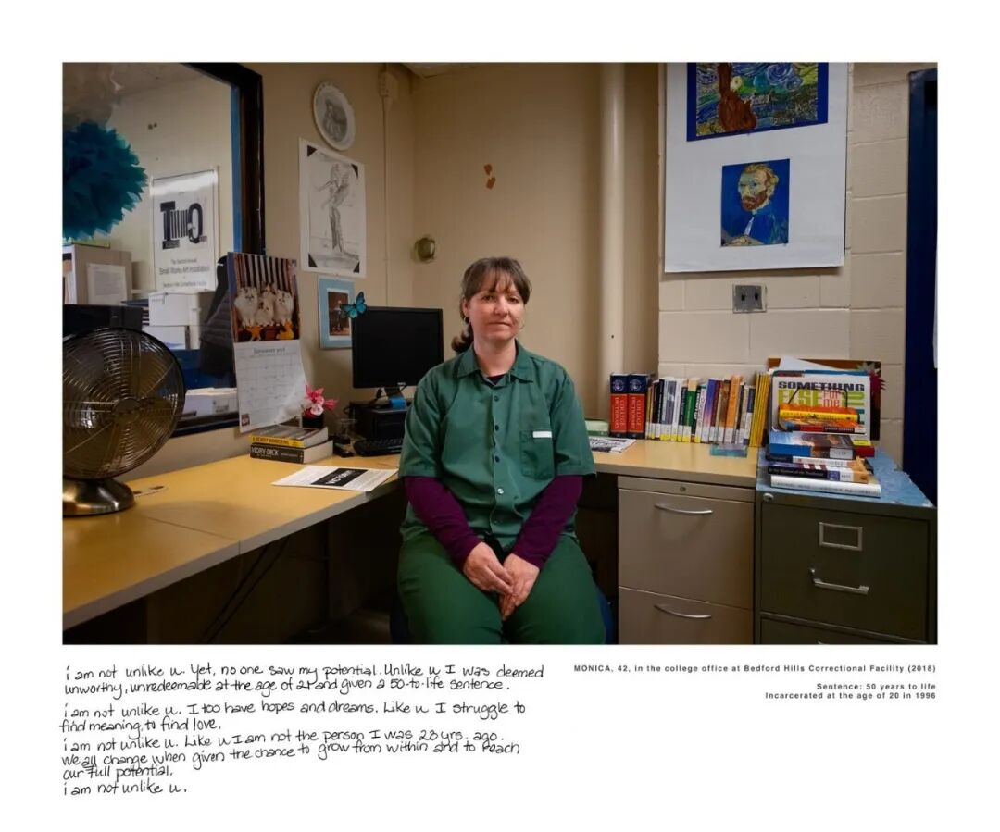

“我和你很像。然而，没有人看到我的潜力。与你不同的是，我在21岁时就被认为不配，无可救药，被判处50年至终身监禁。

我和你很像。我也有希望和梦想。和你一样，我也在努力寻找意义，寻找爱。

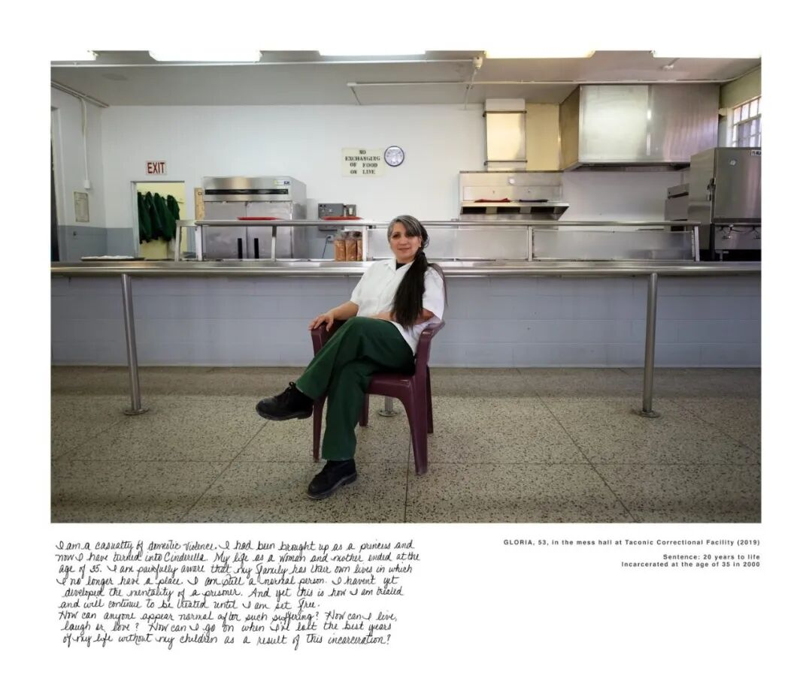

我和你很像。和你一样，我不再是23年前的自己了。

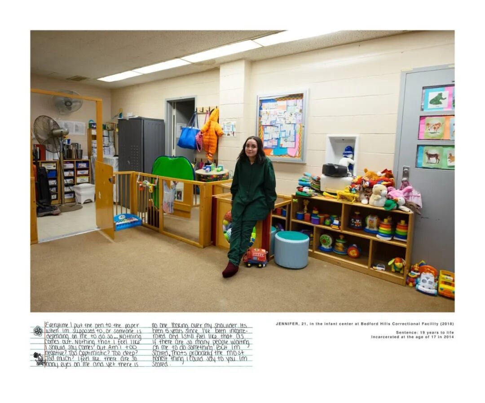

当我们有机会从内心深处成长，并充分发挥自身潜力时，我们都会改变。”--莫妮卡，42岁

“我是家庭暴力的受害者。我从小被当作公主养大，现在却变成了灰姑娘。我作为女人和母亲的人生在35岁就结束了。我痛苦地意识到，我的家人有他们自己的生活，而我已无处容身。我仍然是一个正常人，我还没有形成囚犯的心态。然而，这就是我受到的待遇，而且在我重获自由之前，我将一直遭受这种待遇。

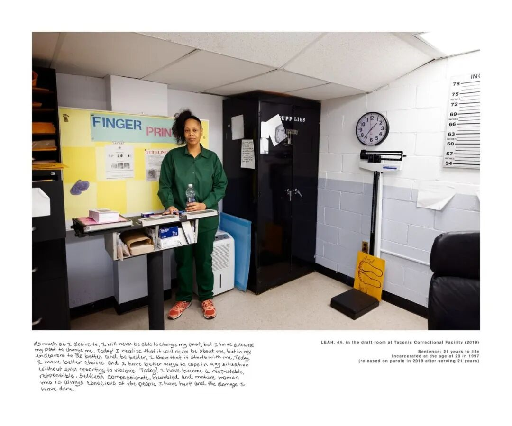

经历了这样的苦难，一个人怎么可能表现得正常？我怎么还能生活、欢笑、去爱？我失去了生命中最美好的时光，失去了我的孩子们，我该如何继续生活下去？”--格洛丽亚，53岁

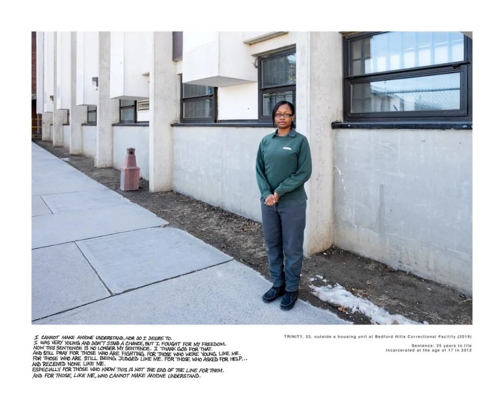

“每次我提笔的时候，或者有人指望我提笔的时候……我什么也写不出来。我感觉自己应该说的话，一个也写不出来。我是不是太消极了？太乐观了？太深沉了？太过了？我感觉好像有无数双眼睛盯着我，却又没有人在我身后指手画脚。我入狱已经五年了，但这种感觉依然存在。仿佛有无数人等着我做点什么。但我很害怕。这大概是我能对你说的最坦诚的话了。我很害怕。”--詹妮弗，21岁

“不管我多么渴望改变过去，我也永远无法做到，但我允许过去改变我。今天我意识到，一切并非只关乎我个人，但在我努力变得更好、成为更好的人的过程中，我知道一切都始于自身。如今，我会做出更好的选择，并找到更好的方法来应对任何情况，无需诉诸暴力。我已经成长为一个受人尊敬、负责任、无私、富有同情心、谦逊成熟的女性，我始终铭记我曾伤害过的人以及我所造成的伤害。”--莉亚，44岁

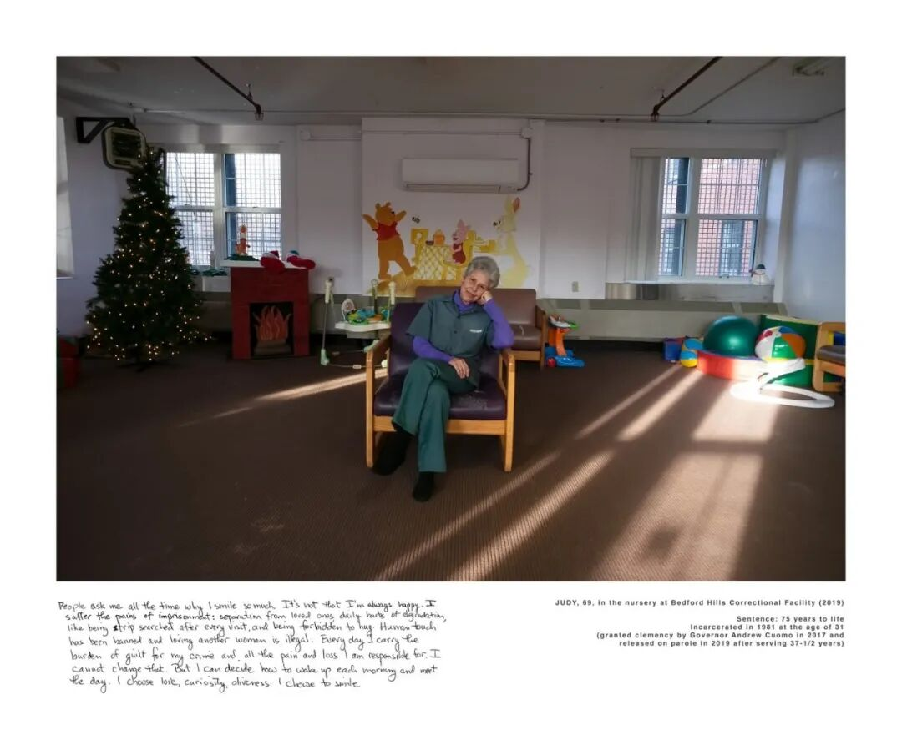

“我无法让任何人理解，也不想。

我当时年纪尚小，毫无胜算，但我为自由而战。

如今，这判决不再是我的刑罚。我为此感谢上帝。

我依然为那些正在抗争的人们祈祷，为那些像我一样年少无知的人们祈祷。

为那些像我一样仍在遭受审判的人们祈祷，为那些像我一样寻求帮助却无人回应的人们祈祷。

尤其为那些知道这并非他们人生终点的人们祈祷。

也为那些像我一样，无法让任何人理解的人们祈祷。”--TRINITY，23 岁

“人们总是问我为什么总是笑个不停，我并不总是很开心。我承受着监狱的痛苦：与亲人分离，每天都遭受羞辱，每次探视后都要被脱光搜身，以及被禁止拥抱。人与人之间的接触是被禁止的，爱上另一个女人是违法的。每天，我都背负着罪责，承受着我所犯下的所有罪行带来的痛苦和损失。我无法改变这一切。但我可以决定每天早上如何醒来，如何迎接新的一天。我选择爱、好奇心和活力。我选择微笑。”--朱迪，69岁

班尼特其他的摄影题材有： 出狱之后（Life After Life in Prison），卧室项目（The Bedroom Project），狱中精神（Spirit on the Inside）。

萨拉·班尼特的作品在多个重要艺术机构与摄影节展出，发表于《纽约时报》等媒体，被众多机构收藏。她也获得2023 国际女性摄影协会 Emerging Laureate Award 提名，及获2024 古根海姆摄影奖学金（Guggenheim Fellowship），表彰她在摄影与社会议题探索上的贡献。

萨拉·班尼特个人网站：https://sarabennett.org
